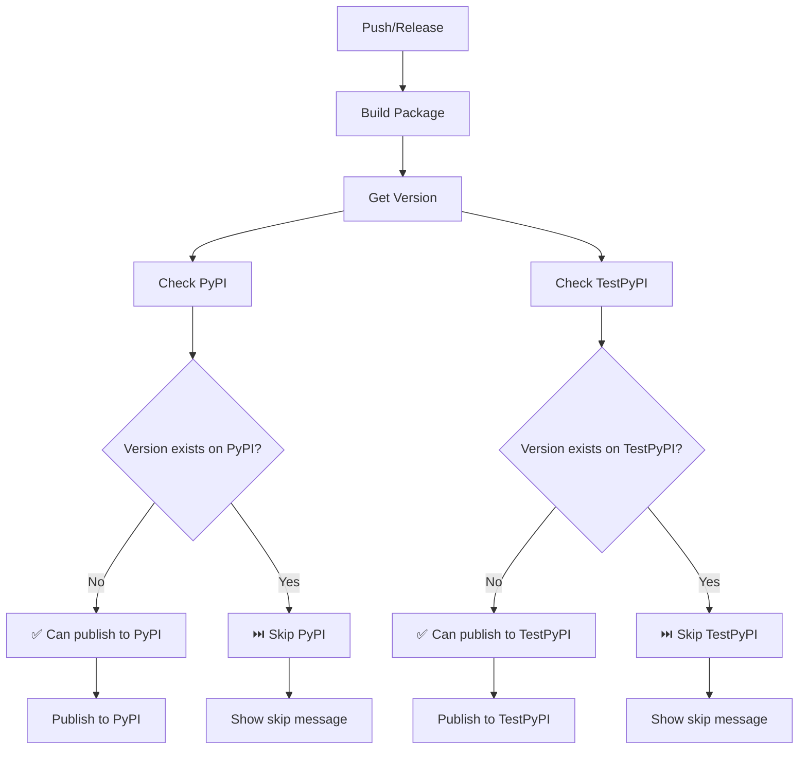

# 🧠 Умный CI/CD для DmDSLab

## 🎯 Основные возможности

Новая система CI/CD автоматически проверяет существование версий и предотвращает дублирование публикаций.

### ✨ Ключевые особенности:

1. **Умная проверка версий** - автоматическая проверка существования на PyPI/TestPyPI
2. **Условная публикация** - публикация только если версия не существует
3. **Информативные сообщения** - подробные отчеты о статусе версий
4. **Удобные утилиты** - скрипты для управления версиями локально

## 🔄 Логика работы



## 🛠️ Локальные инструменты

### 1. Проверка статуса версий

```bash
# Проверить текущую версию
python scripts/check_version.py

# Проверить конкретную версию  
python scripts/check_version.py --version 1.2.3

# Предложить следующую доступную версию
python scripts/check_version.py --suggest-next
```

**Пример вывода:**
```
📦 Package: DmDSLab
🔢 Current version: 1.0.0

============================================================
Repository      Exists     Latest          Status
============================================================
PyPI            False      N/A             ✅ Available
TestPyPI        True       1.0.0           ❌ Exists
============================================================
⚠️  Version exists on TestPyPI, will skip TestPyPI publication
✅ Can publish to PyPI
```

### 2. Управление версиями

```bash
# Увеличить patch версию (1.0.0 -> 1.0.1)
python scripts/bump_version.py patch

# Увеличить minor версию (1.0.0 -> 1.1.0)
python scripts/bump_version.py minor

# Увеличить major версию (1.0.0 -> 2.0.0)  
python scripts/bump_version.py major

# Установить конкретную версию
python scripts/bump_version.py --to 1.2.3

# С автоматическим git commit
python scripts/bump_version.py patch --git-commit

# С созданием git tag для release
python scripts/bump_version.py patch --git-tag
```

### 3. Makefile команды

```bash
# Показать текущую версию
make version

# Проверить статус версии
make check-version

# Предложить следующую версию
make suggest-version

# Быстрое обновление версий
make bump-patch    # patch + commit
make bump-minor    # minor + commit  
make bump-major    # major + commit

# Создание релизов
make release-patch # patch + commit + tag
make release-minor # minor + commit + tag
make release-major # major + commit + tag
```

## 🚀 Workflow публикации

### Разработка (TestPyPI)

1. **Работа в develop branch:**
   ```bash
   git checkout develop
   
   # Проверить статус версии
   make check-version
   
   # Если нужно обновить версию
   make bump-patch
   
   # Push запускает CI
   git push origin develop
   ```

2. **CI автоматически:**
   - Проверяет существование версии на TestPyPI
   - Если версия не существует → публикует
   - Если версия существует → пропускает с информационным сообщением

### Релиз (PyPI)

1. **Подготовка релиза:**
   ```bash
   git checkout main
   git merge develop
   
   # Создать релиз с тегом
   make release-minor  # или release-patch/release-major
   
   # Push тег
   git push origin main
   git push origin v1.1.0
   ```

2. **Создание GitHub Release:**
   - Перейти в GitHub → Releases → Create new release
   - Выбрать созданный тег
   - Заполнить описание
   - Publish release

3. **CI автоматически:**
   - Проверяет существование версии на PyPI
   - Если версии нет → публикует (с manual approval)
   - Если версия есть → прерывает workflow с ошибкой

## 📊 Мониторинг в GitHub Actions

### Build Summary

Каждый запуск создает подробный отчет:

```markdown
## 📊 Build Summary

**Package Version:** 1.0.1

### Status Check Results:
- **TestPyPI exists:** false
- **PyPI exists:** false

✅ **TestPyPI:** Published successfully
❌ **PyPI:** Not applicable for this run
```

### Статусы jobs

- ✅ **publish-test** - успешная публикация на TestPyPI
- ⏭️ **skip-test** - версия уже существует на TestPyPI
- 🚀 **publish-pypi** - успешная публикация на PyPI  
- ⚠️ **skip-pypi** - версия уже существует на PyPI (с ошибкой)

## 🔧 Настройка

### 1. Обновите CI workflow

Замените `.github/workflows/ci.yaml` на умную версию из артефакта выше.

### 2. Создайте scripts директорию

```bash
mkdir -p scripts
# Скопируйте скрипты check_version.py и bump_version.py
```

### 3. Обновите Makefile

Добавьте команды для управления версиями (из артефакта выше).

### 4. Настройте Trusted Publishing

- Следуйте инструкциям по настройке Trusted Publishing
- Создайте environments `testpypi` и `pypi` в GitHub

## 🐛 Устранение проблем

### Версия уже существует

**Проблема:** CI пропускает публикацию
**Решение:** 
```bash
make suggest-version  # Узнать следующую доступную версию  
make bump-patch       # Обновить версию
git push              # Запустить CI снова
```

### Ошибка при создании релиза

**Проблема:** Release не создается на PyPI
**Решение:**
1. Проверить, что версия не существует на PyPI
2. Убедиться в настройке Trusted Publishing
3. Проверить manual approval в environment `pypi`

### Git tag уже существует

**Проблема:** `git tag` выдает ошибку
**Решение:**
```bash
# Удалить локальный тег
git tag -d v1.0.1

# Удалить удаленный тег
git push origin :refs/tags/v1.0.1

# Создать заново
make release-patch
```

## 📈 Преимущества новой системы

1. **Отсутствие дублирования** - нет ошибок "file already exists"
2. **Автоматизация** - минимум ручных действий
3. **Информативность** - подробные отчеты о статусе
4. **Безопасность** - Trusted Publishing без токенов
5. **Удобство** - простые команды через Makefile
6. **Надежность** - проверки перед публикацией

## 🎯 Рекомендуемый workflow

```bash
# Ежедневная разработка
git checkout develop
# ... разработка ...
make check-version     # Проверить нужно ли обновить версию
make bump-patch        # Если нужно
git push origin develop

# Создание релиза (раз в неделю/месяц)
git checkout main
git merge develop
make release-minor     # Создать релиз
git push origin main
git push origin v1.1.0
# Создать GitHub Release через UI
```

Эта система обеспечивает плавный и надежный процесс публикации без конфликтов версий!