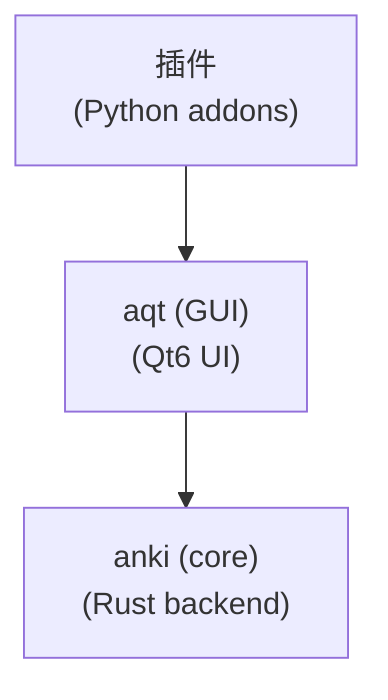

# Anki 25.06+ Addon 完整开发参考手册 - 人类专用

## 📖 文档说明

此文档基于 **anki 25.6+** 和 **aqt 25.6+** 源码实际分析，提供完整的API结构、现代操作模式和集成方案。

---

## 技术栈

- 开发语言： Python 3.13，充分利用静态类型特性。
- UI/GUI 框架： Qt 6.9，通过 aqt.qt.* 导入其 Python 绑定

---

## 🎯 开发决策表

| 用户需求      | 推荐模式             | 新版API                                  | 技术要点               | 避免使用                 |
| ------------- | -------------------- | ---------------------------------------- | ---------------------- | ------------------------ |
| 添加菜单项    | QAction集成          | `mw.form.menuTools`                      | 菜单层次结构           | 状态检查缺失             |
| 处理用户事件  | 钩子系统             | `gui_hooks.*`                            | 类型安全钩子           | legacy anki.hooks        |
| 处理笔记      | CollectionOp模式     | `col.add_note()`, `col.update_note()`    | OpChanges返回值        | 旧版方法名、手动线程     |
| 搜索卡片/笔记 | QueryOp + SearchNode | `col.build_search_string()`              | SearchNode构建         | 字符串搜索、阻塞调用     |
| UI对话框      | aqt 包装的 Qt6 兼容层      | `aqt.qt.*`                               | 强制 aqt.qt 兼容层使用 | 直接PyQt6导入            |
| 网络请求      | 连接池+异步          | `HttpClient`, `TaskManager`              | 限流、重试、缓存       | urllib.request、同步调用 |
| 批量操作      | 分离式批处理         | `CollectionOp` + `uses_collection=False` | 网络批处理+单一撤销点  | 手动循环、混合网络DB操作 |
| 错误处理      | 结构化异常系统       | `AnkiException`, `.failure()`            | 继承链、用户友好信息   | 通用Exception、静默失败  |

---

## 🔄 25.6+ 版本特定变化<!--  -->

### 新功能
1. **增强的操作系统**: 更健壮的CollectionOp/QueryOp，更好的错误处理
2. **类型安全钩子**: 自动生成的钩子，完整的类型注释
3. **改进的搜索API**: 基于SearchNode的查询构建
4. **现代笔记操作**: 所有操作返回类型化的OpChanges变体
5. **更好的集合方法**: 139+方法，完整的类型注释
6. **Qt6纯实现**: 完全移除Qt5兼容代码

### 从早期版本的破坏性变化
1. **Qt5移除**: 对基于 Qt5 的插件无向后兼容
2. **钩子系统迁移**: 遗留 anki.hooks 使用 gui_hooks 替换  
3. **操作返回类型**: 所有操作现在返回 OpChanges 变体
4. **Python版本**: 需要 Python 3.10+（启动时检查）
5. **类型安全**: 整个代码库更严格的类型检查

### 兼容性要求
- **Python**: 3.13+（实际运行时检查：3.13+）
- **Qt**: Qt6.9+（启动时强制）
- **类型提示**: 现代联合语法（`str | None`，不是`Optional[str]`）
- **异步模式**: 必须使用CollectionOp/QueryOp进行后台操作

---

## 📊 核心架构图


## 🏗️ 包架构分析

### 核心包结构
```
anki/                           # 核心后端库（139个公共方法）
├── collection.py               # Collection类，139+方法
├── notes.py                    # 笔记操作API  
├── cards.py                    # 卡片操作
├── models.py                   # 笔记类型管理
├── decks.py                    # 牌组管理
├── config.py                   # 配置处理
├── hooks.py + hooks_gen.py     # 钩子系统（自动生成）
├── errors.py                   # 异常定义
├── types.py                    # 类型定义
├── scheduler/                  # 调度算法
│   ├── base.py
│   ├── legacy.py
│   └── v3.py
├── importing/                  # 导入系统
│   ├── csvfile.py
│   ├── apkg.py
│   └── noteimp.py
└── *_pb2.py files            # 协议缓冲区绑定（Rust后端）

aqt/                            # Qt6 GUI前端
├── __init__.py                 # 主窗口初始化（mw）
├── main.py                     # AnkiQt MainWindow类（1900+行）
├── qt/                         # Qt兼容层
│   ├── __init__.py            # 从qt6.py重新导出
│   └── qt6.py                 # 纯PyQt6导入
├── operations/                 # 现代操作模式
│   ├── __init__.py            # CollectionOp、QueryOp定义
│   ├── card.py                # 卡片操作
│   ├── note.py                # 笔记操作
│   ├── deck.py                # 牌组操作
│   └── scheduling.py          # 调度操作
├── gui_hooks.py               # GUI钩子系统（导入自_aqt）
├── forms/                     # 编译的UI表单（45+文件）
├── browser/                   # 卡片浏览器系统
│   ├── browser.py
│   ├── sidebar/
│   └── table/
├── data/                      # 静态资源
│   ├── qt/icons/
│   └── web/js/
└── [50+其他UI模块]
```

---

## 🚀 import 导入规则

### ✅ 标准导入模式
```python
# 基础插件导入 - 所有插件必须包含
from aqt import mw, gui_hooks
from aqt.qt import *  # Qt6兼容层 - 永远不要直接导入PyQt6
from aqt.utils import showInfo, showWarning, askUser, tooltip
from aqt.operations import CollectionOp, QueryOp
from anki.collection import Collection, OpChanges, SearchNode
from anki.notes import Note, NoteId
from anki.cards import Card, CardId
from anki.decks import DeckId

# 高级功能导入
from anki.collection import (
    OpChangesWithCount, OpChangesWithId, OpChangesAfterUndo,
    AddNoteRequest, ImportLogWithChanges
)
from anki.errors import NotFoundError, InvalidInput
from anki.scheduler import Scheduler
from anki.models import NotetypeDict
```

### ❌ 禁止使用的导入模式
```python
# 以下导入是老版方式，新版开发必须避免
from PyQt6.QtWidgets import QDialog, QPushButton  # ❌ 直接PyQt6导入
from PyQt6.QtCore import pyqtSignal, QTimer       # ❌ 直接PyQt6导入
from anki.hooks import addHook, runHook           # ❌ 旧版钩子系统
import threading                                  # ❌ 手动线程管理
from anki.utils import ids2str                    # ❌ 已弃用工具函数
```

---

## 📋 Collection 数据库

### Collection类概述
**主要访问**: `mw.col` (类型: `anki.collection.Collection`)
**总公共方法**: 139个方法
**⚠️ 注意**: 始终在操作前检查 `mw.col` 的存在性

### 笔记操作API（27个方法）

#### 核心笔记方法（必须掌握）
```python
# 现代笔记操作（全部返回OpChanges）
def add_note(self, note: Note, deck_id: DeckId) -> OpChanges
def add_notes(self, requests: Iterable[AddNoteRequest]) -> OpChanges
def update_note(self, note: Note, skip_undo_entry: bool = False) -> OpChanges
def update_notes(self, notes: Sequence[Note], skip_undo_entry: bool = False) -> OpChanges
def remove_notes(self, note_ids: Sequence[NoteId]) -> OpChangesWithCount
def get_note(self, note_id: NoteId) -> Note
def new_note(self, notetype: NotetypeDict) -> Note

# 专门操作
def add_image_occlusion_note(self, notetype_id: int, image_path: str, 
                           occlusions: str, header: str, back_extra: str, 
                           tags: list[str]) -> OpChanges
def after_note_updates(self, nids: Sequence[NoteId], mark_modified: bool, 
                      generate_cards: bool = True) -> OpChanges
```

#### 模板：创建笔记
```python
def create_note_template(deck_name: str, note_type: str, fields: dict[str, str]) -> None:
    """AI模板：创建单个笔记，包含错误处理"""
    def note_op(col: Collection) -> OpChanges:
        # 获取牌组和笔记类型
        deck_id = col.decks.id(deck_name, create=True)
        notetype = col.models.by_name(note_type)
        if not notetype:
            raise Exception(f"笔记类型 '{note_type}' 未找到")
        
        # 创建笔记
        note = col.new_note(notetype)
        for field_name, field_value in fields.items():
            if field_name in note:
                note[field_name] = field_value
        
        return col.add_note(note, deck_id)
    
    CollectionOp(
        parent=mw,
        op=note_op
    ).success(
        lambda changes: showInfo("笔记创建成功")
    ).failure(
        lambda exc: showWarning(f"创建笔记失败: {exc}")
    ).run_in_background()
```

### 卡片操作API（17个方法）

#### 核心卡片方法
```python
# 卡片管理
def get_card(self, card_id: CardId) -> Card
def update_card(self, card: Card, skip_undo_entry: bool = False) -> OpChanges
def update_cards(self, cards: Sequence[Card], skip_undo_entry: bool = False) -> OpChanges
def remove_cards_and_orphaned_notes(self, card_ids: Sequence[CardId]) -> OpChangesWithCount

# 卡片分析
def card_stats(self, card_id: CardId) -> CardStats
def get_empty_cards(self) -> EmptyCardsReport
def set_user_flag_for_cards(self, flag: int, card_ids: Sequence[CardId]) -> OpChanges
```

#### 模板：卡片调度
```python
def reschedule_cards_template(card_ids: list[int], new_ivl: int) -> None:
    """AI模板：重新调度卡片"""
    def reschedule_op(col: Collection) -> OpChanges:
        pos = col.add_custom_undo_entry("重新调度卡片")
        
        for card_id in card_ids:
            try:
                card = col.get_card(card_id)
                card.ivl = new_ivl
                card.due = col.sched.today + new_ivl
                col.update_card(card, skip_undo_entry=True)
            except Exception as e:
                print(f"调度卡片 {card_id} 失败: {e}")
        
        return col.merge_undo_entries(pos)
    
    CollectionOp(parent=mw, op=reschedule_op).run_in_background()
```

### 搜索API（9个方法）- 现代SearchNode模式

#### 搜索方法签名
```python
# 现代搜索使用SearchNode
def find_notes(self, search: str) -> Sequence[NoteId]
def find_cards(self, search: str, order: SortOrder = SortOrder.NoOrder) -> Sequence[CardId]
def build_search_string(self, *nodes: SearchNode) -> str

# SearchNode构建示例
from anki.collection import SearchNode
search = mw.col.build_search_string(
    SearchNode(deck="我的牌组"),
    SearchNode(tag="重要")
)
```

#### 模板：智能搜索
```python
def advanced_search_template(deck_name: str = None, tags: list[str] = None, 
                           fields: dict[str, str] = None) -> None:
    """AI模板：灵活笔记搜索，支持多种条件"""
    def search_op(col: Collection) -> list[int]:
        search_nodes = []
        
        if deck_name:
            search_nodes.append(SearchNode(deck=deck_name))
        
        if tags:
            for tag in tags:
                search_nodes.append(SearchNode(tag=tag))
        
        if fields:
            for field, value in fields.items():
                search_nodes.append(SearchNode(field_name=field, text=value))
        
        if search_nodes:
            search_string = col.build_search_string(*search_nodes)
        else:
            search_string = ""  # 所有笔记
        
        return list(col.find_notes(search_string))
    
    QueryOp(
        parent=mw,
        op=search_op,
        success=lambda note_ids: process_search_results(note_ids)
    ).with_progress("搜索笔记中...").run_in_background()
```

### 配置API（12个方法）- 类型安全

#### 配置方法
```python
# 类型安全的配置方法
def get_config(self, key: str, default: Any = None) -> Any
def get_config_bool(self, key: str) -> bool
def get_config_string(self, key: str) -> str
def set_config(self, key: str, val: Any, undoable: bool = True) -> OpChanges
def set_config_bool(self, key: str, val: bool, undoable: bool = True) -> OpChanges
def remove_config(self, key: str) -> OpChanges
```

---

## ⚡ CollectionOp/QueryOp 数据库操作

### CollectionOp用于数据库变更
**文件**: `/aqt/operations/__init__.py`（第49-146行）

```python
# 来自源码的实际签名
class CollectionOp(Generic[ResultWithChanges]):
    def __init__(self, parent: QWidget, op: Callable[[Collection], ResultWithChanges])
    
    def success(self, callback: Callable[[ResultWithChanges], Any]) -> CollectionOp
    def failure(self, callback: Callable[[Exception], Any]) -> CollectionOp
    def with_backend_progress(self, callback: Callable) -> CollectionOp
    def run_in_background(self, *, initiator: object | None = None) -> None
```

#### 模板：标准CollectionOp
```python
def collection_operation_template():
    """AI模板：标准数据库修改操作"""
    def my_op(col: Collection) -> OpChanges:
        # 您的数据库更改在这里
        note = col.get_note(note_id)
        note["字段"] = "新值"
        return col.update_note(note)
    
    CollectionOp(
        parent=mw,  # 始终使用mw作为父级
        op=my_op
    ).success(
        lambda changes: showInfo("成功！")
    ).failure(
        lambda exc: showWarning(f"错误: {exc}")
    ).run_in_background()
```

### QueryOp用于只读操作  
**文件**: `/aqt/operations/__init__.py`（第168-285行）

```python
# 来自源码的实际签名
class QueryOp(Generic[T]):
    def __init__(self, *, parent: QWidget, op: Callable[[Collection], T], 
                 success: Callable[[T], Any])
    
    def failure(self, callback: Callable[[Exception], Any]) -> QueryOp[T]
    def without_collection(self) -> QueryOp[T]  # 用于并行执行
    def with_progress(self, label: str | None = None) -> QueryOp[T]
    def run_in_background(self) -> None
```

#### 模板：QueryOp使用
```python
def query_operation_template(search_term: str):
    """AI模板：数据检索与处理"""
    def data_op(col: Collection) -> dict:
        # 只读操作
        note_ids = col.find_notes(search_term)
        notes_data = []
        
        for note_id in note_ids[:100]:  # 性能限制
            note = col.get_note(note_id)
            notes_data.append({
                'id': note_id,
                'fields': dict(note)
            })
        
        return {
            'total_found': len(note_ids),
            'sample_data': notes_data
        }
    
    QueryOp(
        parent=mw,
        op=data_op,
        success=lambda data: display_results(data)
    ).with_progress("分析笔记...").run_in_background()
```


---

## 📊 OpChanges 数据库操作状态

### OpChanges变体
```python
# 来自anki.collection导入（源码验证）
OpChanges                    # 基本操作变化
OpChangesOnly               # 仅变化无数据
OpChangesWithCount          # 带计数信息的变化  
OpChangesWithId             # 带ID信息的变化
OpChangesAfterUndo          # 撤销后变化
ImportLogWithChanges        # 导入操作结果
```

**OpChanges属性**（协议缓冲区）：
```python
changes = OpChanges()
changes.card        # bool: 卡片被修改
changes.note        # bool: 笔记被修改  
changes.deck        # bool: 牌组被修改
changes.tag         # bool: 标签被修改
changes.notetype    # bool: 笔记类型被修改
changes.config      # bool: 配置被修改
changes.deck_config # bool: 牌组配置被修改
```

#### 模板：OpChanges处理
```python
def handle_operation_changes(changes: OpChanges, initiator):
    """AI模板：处理操作结果"""
    
    # 检查发生了什么变化
    if changes.note:
        print("笔记被修改")
        # 刷新笔记相关UI
        refresh_note_displays()
    
    if changes.card:
        print("卡片被修改") 
        # 刷新卡片相关UI
        refresh_card_displays()
    
    if changes.deck:
        print("牌组被修改")
        # 刷新牌组列表
        refresh_deck_browser()
    
    if changes.tag:
        print("标签被修改")
        # 刷新标签显示
        refresh_tag_lists()
    
    if changes.notetype:
        print("笔记类型被修改")
        # 刷新笔记类型相关功能
        refresh_notetype_ui()
    
    if changes.config:
        print("配置被修改")
        # 重新加载配置相关功能
        reload_config_dependent_features()

# 注册处理器
gui_hooks.operation_did_execute.append(handle_operation_changes)
```

## 🖥️ PyQt6 集成

### aqt.qt 兼容层（关键）

应该始终从 aqt.qt 导入以保持兼容性，而不要直接导入PyQt6模块

```python
# 关键：始终从aqt.qt导入以保持兼容性
from aqt.qt import *  # 这从qt6.py导入
# 直接导入类，而不是模块
from aqt.qt import QDialog, QPushButton
```

在 `aqt` 包中，`/aqt/qt/__init__.py` 从 `/aqt/qt/qt6.py` 导入了所有 PyQt6 模块，因此不需要再导入模块

```python
# qt6.py包含纯PyQt6导入，因此不需要再导入模块
from PyQt6.QtCore import *
from PyQt6.QtGui import *
from PyQt6.QtWidgets import *
from PyQt6.QtWebEngineWidgets import *
# ... 所有PyQt6模块
```

### MainWindow类结构（AnkiQt）
**文件**: `/aqt/main.py`（第180-1901行）

```python
class AnkiQt(QMainWindow):
    # 插件开发者需要的核心属性
    col: Collection                    # 数据库连接
    pm: ProfileManagerType            # 配置文件管理 
    web: MainWebView                  # 主内容区域
    bottomWeb: BottomWebView          # 底部工具栏
    toolbarWeb: TopWebView            # 顶部工具栏
    state: MainWindowState            # 当前UI状态
    addonManager: AddonManager        # 插件加载/管理
    taskman: TaskManager              # 后台操作
    
    # 状态管理
    def moveToState(self, state: MainWindowState, *args) -> None:
        # 全面的状态转换与钩子
        oldState = self.state
        cleanup = getattr(self, f"_{oldState}Cleanup", None)
        if cleanup:
            cleanup(state)
        self.clearStateShortcuts()
        self.state = state
        gui_hooks.state_will_change(state, oldState)
        getattr(self, f"_{state}State", lambda *_: None)(oldState, *args)
        gui_hooks.state_did_change(state, oldState)
```

**可用状态**：
```python
MainWindowState = Literal[
    "startup", "deckBrowser", "overview", "review", 
    "resetRequired", "profileManager"
]
```

#### 模板：状态感知插件
```python
class StatefulAddon:
    """AI模板：状态感知的插件类"""
    def __init__(self):
        self.current_state = None
        self.setup_hooks()
    
    def setup_hooks(self):
        gui_hooks.state_did_change.append(self.on_state_change)
        gui_hooks.operation_did_execute.append(self.on_operation)
    
    def on_state_change(self, new_state: str, old_state: str):
        self.current_state = new_state
        if new_state == "review":
            self.setup_review_features()
        elif new_state == "deckBrowser":
            self.setup_browser_features()
    
    def on_operation(self, changes: OpChanges, initiator):
        if changes.note:
            self.refresh_note_cache()
        if changes.card:
            self.update_card_display()
```

### QWebEngine 内置浏览器最佳实践

**基于实际经验总结：在Anki 25.06+环境中集成内置浏览器的完整方案**

#### 🚀 核心实现模式

```python
from aqt.qt import QDialog, QUrl, QWebEngineProfile, QWebEngineView, pyqtSignal
import logging

logger = logging.getLogger("your_addon")

class LoginWebEngineView(QWebEngineView):
    def __init__(self, *args, **kwargs):
        super().__init__(*args, **kwargs)
        
        # 1. 关键：绑定默认Profile和Cookie存储
        self.profile = QWebEngineProfile.defaultProfile()
        self.profile.setHttpUserAgent(USER_AGENT)
        self.cookieStore = self.profile.cookieStore()
        self.cookieStore.cookieAdded.connect(self.onCookieAdd)
        
        # 2. 关键：必须调用show()以确保WebView正确显示
        self.show()
        
        # 3. Cookie收集机制
        self._cookies = {}
    
    def createWindow(self, windowType):
        """
        关键：重写createWindow方法防止外部浏览器重定向
        
        问题根因：target="_blank" 链接会触发createWindow()
        解决方案：返回self让新窗口请求在当前窗口中打开
        说明：这是目前唯一的解决方案，Qt6没有内置参数可以控制此行为
        """
        logger.debug(f"createWindow called with type: {windowType}")
        return self  # 返回self，让新窗口请求在当前窗口中打开
    
    def onCookieAdd(self, cookie):
        """Cookie收集：实时获取浏览器Cookie"""
        name = cookie.name().data().decode("utf-8")
        value = cookie.value().data().decode("utf-8")
        self._cookies[name] = value
    
    @property
    def cookie(self) -> dict:
        return self._cookies

class LoginDialog(QDialog):
    loginSucceed = pyqtSignal(str)
    
    def __init__(self, loginUrl, loginCheckCallbackFn, parent=None):
        super().__init__(parent)
        self.url = QUrl(loginUrl)
        self.loginCheckCallbackFn = loginCheckCallbackFn
        
        # UI设置
        self.setupUi(self)
        self.page = LoginWebEngineView(self)
        self.pageContainer.addWidget(self.page)
        
        # 加载页面和连接信号
        self.page.load(self.url)
        self.makeConnection()

# 正确的对话框显示方式
def show_login_dialog(parent):
    """显示登录对话框的正确方式"""
    try:
        # 创建对话框
        login_dialog = LoginDialog(
            loginUrl="https://example.com/login",
            loginCheckCallbackFn=check_login,
            parent=parent
        )
        
        # 设置模态属性
        login_dialog.setModal(True)
        
        # 使用exec()显示模态对话框（关键！）
        result = login_dialog.exec()
        
        # exec()返回后手动清理
        login_dialog.deleteLater()
        
    except Exception as e:
        logger.error(f"创建登录对话框失败: {e}")
        showCritical(f"无法创建登录对话框: {str(e)}", parent=parent)
```

#### 🔥 关键经验点

1. **显示方法选择**：
   ```python
   # ❌ 错误：对于模态对话框使用show()
   self.loginDialog.show()
   
   # ✅ 正确：模态对话框必须使用exec()
   self.loginDialog.setModal(True)
   self.loginDialog.exec()  # 阻塞执行直到对话框关闭
   ```

2. **生命周期管理**：
   ```python
   # ❌ 错误：使用WA_DeleteOnClose导致"C++ object deleted"错误
   self.loginDialog.setAttribute(Qt.WidgetAttribute.WA_DeleteOnClose)
   
   # ✅ 正确：手动管理对话框生命周期
   # exec()返回后手动清理
   if hasattr(self, 'loginDialog') and self.loginDialog:
       try:
           self.loginDialog.deleteLater()
           self.loginDialog = None
       except RuntimeError:
           self.loginDialog = None
   ```

3. **外部浏览器重定向问题**：
   ```python
   # 问题：target="_blank"链接默认在外部浏览器打开
   # 解决：重写createWindow()方法（这是唯一的解决方案）
   def createWindow(self, windowType):
       return self  # 关键：返回自身而不是None
   
   # 注意：Qt6没有内置参数可以控制此行为，必须重写此方法
   ```

#### ⚠️ 常见陷阱

1. **WebView不显示**：缺少`self.show()`调用（在WebEngineView的`__init__`中）
2. **外部浏览器打开**：未重写`createWindow()`方法（这是必须的，Qt6没有内置配置选项）  
3. **对话框闪退**：错误使用`WA_DeleteOnClose`属性
4. **对象已删除错误**：生命周期管理不当
5. **提示框不居中**：`showCritical`未传递`parent`参数
6. **模态对话框不正确显示**：对于模态对话框必须使用`exec()`而非`show()`

---

## 🪝 Hook 钩子系统

### GUI钩子架构
**文件**: `/aqt/gui_hooks.py` → `/_aqt/hooks.py`（自动生成）

**类型安全钩子模式**（实际实现）：
```python
class _StateDidChangeHook:
    _hooks: list[Callable[[MainWindowState, MainWindowState], None]] = []
    
    def append(self, callback: Callable[[MainWindowState, MainWindowState], None]) -> None:
        self._hooks.append(callback)
    
    def remove(self, callback: Callable[[MainWindowState, MainWindowState], None]) -> None:
        if callback in self._hooks:
            self._hooks.remove(callback)
    
    def __call__(self, new_state: MainWindowState, old_state: MainWindowState) -> None:
        for hook in self._hooks:
            try:
                hook(new_state, old_state)
            except Exception:
                self._hooks.remove(hook)  # 自动清理失败的钩子
                raise

state_did_change = _StateDidChangeHook()
```

### 插件必备钩子
```python
from aqt import gui_hooks

# 状态管理
gui_hooks.state_will_change.append(callback)  # 状态变化前
gui_hooks.state_did_change.append(callback)   # 状态变化后

# 操作
gui_hooks.operation_will_execute.append(callback)  # 操作前
gui_hooks.operation_did_execute.append(callback)   # 操作后

# 集合生命周期  
gui_hooks.collection_did_load.append(callback)     # 集合打开
gui_hooks.profile_did_open.append(callback)        # 配置文件加载

# UI事件
gui_hooks.main_window_did_init.append(callback)    # MainWindow就绪
gui_hooks.focus_did_change.append(callback)        # 窗口焦点变化
```

#### 模板：完整钩子管理
```python
def setup_addon_hooks():
    """AI模板：插件钩子设置"""
    gui_hooks.main_window_did_init.append(on_main_window_ready)
    gui_hooks.collection_did_load.append(on_collection_loaded)
    gui_hooks.state_did_change.append(on_state_change)
    gui_hooks.operation_did_execute.append(on_operation_complete)

def cleanup_addon_hooks():
    """AI模板：插件钩子清理"""
    gui_hooks.main_window_did_init.remove(on_main_window_ready)
    gui_hooks.collection_did_load.remove(on_collection_loaded)
    gui_hooks.state_did_change.remove(on_state_change)
    gui_hooks.operation_did_execute.remove(on_operation_complete)

def on_main_window_ready():
    """主窗口初始化完成"""
    # 设置菜单、工具栏
    pass

def on_collection_loaded(col: Collection):
    """集合加载完成"""
    # 初始化依赖集合的功能
    pass

def on_state_change(new_state: str, old_state: str):
    """UI状态变化"""
    if new_state == "review":
        # 设置复习模式功能
        pass
    elif old_state == "review":
        # 清理复习模式
        pass

def on_operation_complete(changes: OpChanges, initiator):
    """操作完成后"""
    if changes.note:
        # 笔记被修改
        pass
    if changes.card:
        # 卡片被修改
        pass
```

---

## 🌐 Network 网络请求

### Anki 原生网络工具（强制使用）

#### HttpClient - Anki 官方HTTP客户端

**核心特性**：
- **进度跟踪**：支持上传/下载进度回调
- **流式处理**：支持大文件的流式下载
- **连接池**：内置基于 `requests.Session()` 的连接复用
- **安全性**：默认验证 SSL 证书，自动设置 Anki User-Agent

**基本用法模板**：
```python
from anki.httpclient import HttpClient
from aqt import mw
import json

def make_api_request(api_url: str, data: dict) -> None:
    """标准API请求模板"""
    
    def network_task() -> dict:
        # 网络操作在后台线程执行
        with HttpClient() as client:
            client.timeout = 30  # 设置超时
            
            headers = {
                "Content-Type": "application/json",
                "Authorization": "Bearer YOUR_TOKEN"
            }
            
            # POST请求
            json_data = json.dumps(data).encode('utf-8')
            response = client.post(api_url, json_data, headers)
            
            # 检查状态码
            if response.status_code != 200:
                raise Exception(f"HTTP {response.status_code}: {response.reason}")
            
            # 流式读取响应内容
            content = client.stream_content(response)
            return json.loads(content.decode('utf-8'))
    
    def on_success(fut: Future) -> None:
        try:
            result = fut.result()
            showInfo("请求成功")
            # 处理结果
        except Exception as e:
            showWarning(f"请求失败：{e}")
    
    # 使用TaskManager异步执行
    mw.taskman.with_progress(
        task=network_task,
        on_done=on_success,
        label="正在请求API...",
        uses_collection=False  # 网络请求不需要数据库访问
    )
```

#### 带进度跟踪的网络请求
```python
def download_with_progress(url: str) -> None:
    """带进度跟踪的下载"""
    
    def download_task() -> bytes:
        def progress_hook(upload: int, download: int) -> None:
            # 进度回调，在后台线程执行
            if download > 0:
                mw.taskman.run_on_main(
                    lambda: print(f"已下载: {download} 字节")
                )
        
        with HttpClient(progress_hook=progress_hook) as client:
            response = client.get(url)
            return client.stream_content(response)
    
    mw.taskman.with_progress(
        task=download_task,
        on_done=lambda fut: handle_download_complete(fut.result()),
        label="下载中...",
        uses_collection=False
    )
```

### TaskManager 异步模式

#### 核心方法 API
```python
from aqt import mw
from concurrent.futures import Future

# 基本后台任务执行
mw.taskman.run_in_background(
    task=callable,                    # 后台执行的函数
    on_done=callback,                # 完成后回调(接收Future对象)
    uses_collection=False            # 网络请求设为False以允许并行
)

# 带进度条的任务执行
mw.taskman.with_progress(
    task=callable,                   # 后台任务
    on_done=callback,               # 完成回调
    label="任务描述",                # 进度条显示文本
    uses_collection=False           # 网络请求不需要数据库访问
)

# 主线程执行（用于UI更新）
mw.taskman.run_on_main(callable)    # 在主线程执行函数
```

#### 网络请求与数据库分离模式（核心原则）

**关键原则**：网络请求阶段使用 `uses_collection=False`，数据库更新使用 `CollectionOp`

```python
def ai_content_workflow(note_id: int, prompt: str) -> None:
    """标准AI工作流：网络 + 数据库分离"""
    
    # 阶段1：纯网络请求（uses_collection=False）
    def fetch_ai_content() -> str:
        with HttpClient() as client:
            headers = {"Authorization": "Bearer API_KEY"}
            data = {"prompt": prompt, "max_tokens": 1000}
            
            response = client.post(
                "https://api.openai.com/v1/chat/completions",
                json.dumps(data).encode('utf-8'),
                headers
            )
            
            if response.status_code != 200:
                raise Exception(f"API错误: {response.status_code}")
            
            result = json.loads(client.stream_content(response))
            return result['choices'][0]['message']['content']
    
    # 阶段2：数据库更新回调
    def on_ai_response(fut: Future) -> None:
        try:
            ai_content = fut.result()
            # 使用CollectionOp更新数据库
            update_note_with_ai_content(note_id, ai_content)
        except Exception as e:
            showWarning(f"AI请求失败：{e}")
    
    # 执行网络请求（并行执行）
    mw.taskman.with_progress(
        task=fetch_ai_content,
        on_done=on_ai_response,
        label="正在生成AI内容...",
        uses_collection=False  # 关键：允许并行网络请求
    )

def update_note_with_ai_content(note_id: int, content: str) -> None:
    """阶段2：数据库更新操作"""
    
    def note_update_op(col: Collection) -> OpChanges:
        note = col.get_note(note_id)
        note["AI_Content"] = content
        return col.update_note(note)
    
    CollectionOp(
        parent=mw,
        op=note_update_op
    ).success(
        lambda changes: showInfo("✅ AI内容已添加")
    ).failure(
        lambda exc: showWarning(f"❌ 更新失败：{exc}")
    ).run_in_background()
```

### 批量网络请求最佳实践

#### 核心原则：网络与数据库完全分离

**✅ 推荐的批量处理模式**：
1. **阶段1**：批量网络请求（`uses_collection=False`）
2. **阶段2**：批量数据库更新（`CollectionOp` + 单一撤销点）

```python
def batch_ai_processing(note_ids: list[NoteId]) -> None:
    """标准批量AI处理：网络批处理 + 数据库批更新"""
    
    # 阶段1：批量网络请求（纯网络操作）
    def batch_network_requests() -> dict[NoteId, str]:
        """批量AI请求 - 不访问Collection"""
        results = {}
        
        with HttpClient() as client:
            for i, note_id in enumerate(note_ids):
                try:
                    # 构建API请求
                    data = {"prompt": f"处理笔记 {note_id}", "max_tokens": 500}
                    headers = {"Authorization": "Bearer API_KEY"}
                    
                    response = client.post(
                        "https://api.openai.com/v1/chat/completions",
                        json.dumps(data).encode('utf-8'),
                        headers
                    )
                    
                    if response.status_code == 200:
                        result = json.loads(client.stream_content(response))
                        content = result["choices"][0]["message"]["content"]
                        results[note_id] = content
                        
                        # 进度反馈到主线程
                        mw.taskman.run_on_main(
                            lambda: print(f"已完成 {len(results)}/{len(note_ids)} 个请求")
                        )
                    
                except Exception as e:
                    print(f"请求失败 {note_id}: {e}")
                    continue
        
        return results
    
    # 阶段2：批量数据库更新
    def on_network_complete(fut: Future) -> None:
        try:
            ai_results = fut.result()
            if ai_results:
                batch_update_notes(ai_results)
            else:
                showWarning("所有网络请求都失败了")
        except Exception as e:
            showWarning(f"网络请求阶段失败：{e}")
    
    # 执行批量网络请求
    mw.taskman.with_progress(
        task=batch_network_requests,
        on_done=on_network_complete,
        label=f"正在处理 {len(note_ids)} 个笔记...",
        uses_collection=False  # 关键：网络阶段不使用Collection
    )

def batch_update_notes(ai_results: dict[NoteId, str]) -> None:
    """阶段2：批量数据库更新 - 单一撤销点"""
    
    def batch_update_op(col: Collection) -> OpChangesWithCount:
        # 创建单一撤销点
        pos = col.add_custom_undo_entry("批量AI处理")
        updated_count = 0
        
        for note_id, content in ai_results.items():
            try:
                note = col.get_note(note_id)
                note["AI_Content"] = content
                col.update_note(note, skip_undo_entry=True)  # 跳过单独撤销
                updated_count += 1
            except Exception as e:
                print(f"更新笔记失败 {note_id}: {e}")
                continue
        
        # 合并为单一撤销点
        changes = col.merge_undo_entries(pos)
        changes.count = updated_count
        return changes
    
    CollectionOp(
        parent=mw,
        op=batch_update_op
    ).success(
        lambda result: showInfo(f"✅ 成功更新 {result.count} 个笔记")
    ).failure(
        lambda exc: showWarning(f"❌ 批量更新失败：{exc}")
    ).run_in_background()
```

#### 错误处理和重试机制
```python
def robust_api_request(url: str, data: dict, max_retries: int = 3) -> dict:
    """健壮的API请求，带重试机制"""
    
    for attempt in range(max_retries):
        try:
            with HttpClient() as client:
                client.timeout = 30
                
                json_data = json.dumps(data).encode('utf-8')
                headers = {"Content-Type": "application/json"}
                
                response = client.post(url, json_data, headers)
                
                if response.status_code == 200:
                    content = client.stream_content(response)
                    return json.loads(content.decode('utf-8'))
                elif response.status_code in [429, 502, 503, 504]:
                    # 可重试的错误
                    if attempt < max_retries - 1:
                        time.sleep(2 ** attempt)  # 指数退避
                        continue
                    else:
                        raise Exception(f"HTTP {response.status_code}: {response.reason}")
                else:
                    # 不可重试的错误
                    raise Exception(f"HTTP {response.status_code}: {response.reason}")
                    
        except Exception as e:
            if attempt < max_retries - 1:
                time.sleep(2 ** attempt)
                continue
            else:
                raise e
```

#### 网络请求最佳实践总结

**核心原则**：
1. **使用 Anki 原生 HttpClient**：充分利用内置的连接池和安全特性
2. **网络与数据库完全分离**：`uses_collection=False` + `CollectionOp`
3. **适当的错误处理和重试**：区分可重试和永久性错误
4. **单一撤销点**：批量操作使用 `add_custom_undo_entry()` 管理

**简化的网络请求工具类**：
```python
import time
from collections import deque
from threading import Lock

class RateLimiter:
    """独立的速率限制器"""
    
    def __init__(self, max_requests: int = 60, window_seconds: int = 60):
        self.max_requests = max_requests
        self.window_seconds = window_seconds
        self.requests: deque[float] = deque()
        self.lock = Lock()
    
    def check_or_raise(self) -> None:
        """检查速率限制，超过时抛出异常"""
        with self.lock:
            now = time.time()
            # 清除过期记录
            while self.requests and now - self.requests[0] > self.window_seconds:
                self.requests.popleft()
            
            if len(self.requests) >= self.max_requests:
                wait_time = self.window_seconds - (now - self.requests[0])
                raise Exception(f"API rate limit exceeded. Wait {wait_time:.1f}s")
            
            self.requests.append(now)

def simple_api_request(url: str, data: dict, headers: dict = None) -> dict:
    """简化的API请求函数"""
    rate_limiter = RateLimiter(60, 60)  # 每分钟60请求
    rate_limiter.check_or_raise()
    
    with HttpClient() as client:
        client.timeout = 30
        json_data = json.dumps(data).encode('utf-8')
        response = client.post(url, json_data, headers or {})
        
        if response.status_code != 200:
            raise Exception(f"HTTP {response.status_code}: {response.reason}")
        
        content = client.stream_content(response)
        return json.loads(content.decode('utf-8'))
```

## 🛡️ Error 错误处理和异常管理

### Anki原生异常系统

```python
from anki.errors import (
    AnkiException,      # 所有Anki异常的基类
    NetworkError,       # 网络相关错误
    NotFoundError,      # 资源未找到
    InvalidInput,       # 输入验证错误
    SearchError,        # 搜索错误
)
```

### 网络请求错误示例

```python
def safe_api_request_with_retry(url: str, data: dict, max_retries: int = 3) -> dict:
    """带重试的API请求"""
    
    for attempt in range(max_retries):
        try:
            with HttpClient() as client:
                client.timeout = 30
                
                json_data = json.dumps(data).encode('utf-8')
                headers = {"Content-Type": "application/json"}
                
                response = client.post(url, json_data, headers)
                
                # 检查状态码
                if response.status_code == 200:
                    content = client.stream_content(response)
                    return json.loads(content.decode('utf-8'))
                elif response.status_code in [429, 502, 503, 504]:
                    # 可重试的错误
                    if attempt < max_retries - 1:
                        time.sleep(2 ** attempt)  # 指数退避
                        continue
                    else:
                        raise Exception(f"HTTP {response.status_code}: 重试后仍失败")
                else:
                    # 不可重试的错误
                    raise Exception(f"HTTP {response.status_code}: {response.reason}")
                    
        except Exception as e:
            if attempt < max_retries - 1:
                time.sleep(2 ** attempt)
                continue
            else:
                raise e

def handle_network_errors(func):
    """网络错误处理装饰器"""
    def wrapper(*args, **kwargs):
        try:
            return func(*args, **kwargs)
        except Exception as e:
            if "timeout" in str(e).lower():
                showWarning("⏰ 网络请求超时，请检查网络连接")
            elif "connection" in str(e).lower():
                showWarning("🌐 网络连接失败，请检查网络状态")
            else:
                showWarning(f"❌ 请求失败：{str(e)}")
            raise
    return wrapper
```

### 错误检测规则
```python
# 导入错误
if "ImportError: No module named 'PyQt6'" in error:
    solution = "改用 'from aqt.qt import *'"

# 集合不可用
if "AttributeError: 'NoneType' object has no attribute" in error:
    solution = "添加集合安全检查: if not mw.col: return"

# 遗留方法错误
if "AttributeError: 'Collection' object has no attribute 'addNote'" in error:
    solution = "使用 col.add_note(note, deck_id)  # 注意：额外参数！"

# 线程错误
if "RuntimeError: wrapped C/C++ object has been deleted" in error:
    solution = "使用CollectionOp而不是手动线程"

# 钩子不工作
if "Hook not being called" in problem:
    solution = "检查是否使用gui_hooks而不是anki.hooks"

# 批量处理反模式检测
if ("for" in code and "网络请求" in code and "col.update_note" in code):
    solution = "分离网络请求（uses_collection=False）和数据库操作（CollectionOp）"
if ("note.flush()" in code and "for" in code):
    solution = "使用add_custom_undo_entry+skip_undo_entry=True+merge_undo_entries"
```

---

## 📝 Logging 日志系统

### Anki 25.06+ 标准日志系统

**核心原则**：使用 Anki 内置的日志管理，避免自定义 Qt 信号连接导致的崩溃问题。

#### 推荐的日志使用模式

```python
from aqt import mw
from aqt.utils import showInfo, showWarning, tooltip

# 插件标准日志初始化
logger = mw.addonManager.get_logger(__name__)

def setup_addon_logging():
    """正确的插件日志设置"""
    # Anki 会自动处理：
    # 1. 日志文件轮转
    # 2. 调试控制台集成  
    # 3. 线程安全的日志写入
    # 4. 适当的日志级别管理
    
    logger.info("插件初始化完成")
    logger.debug("调试信息")
    logger.warning("警告信息")
    logger.error("错误信息")
```

#### 用户交互消息

```python
# 使用 Anki 的标准消息函数而不是自定义日志窗口
from aqt.utils import showInfo, showWarning, showCritical, tooltip

def user_feedback_examples():
    """标准用户反馈模式"""
    
    # 成功操作
    showInfo("✅ 操作成功完成")
    tooltip("快速状态提示", 2000)  # 2秒后自动消失
    
    # 警告信息
    showWarning("⚠️ 操作可能影响现有数据")
    
    # 错误信息
    showCritical("❌ 严重错误，请检查输入")
    
    # 调试信息（仅开发时可见）
    logger.debug(f"处理了 {count} 个项目")
```

#### 插件状态显示

```python
def setup_status_display():
    """使用简单的状态显示而不是复杂的日志窗口"""
    
    # 方法1：简单文本显示
    status_label = QLabel("使用Anki 25.06+标准日志系统\n可通过 工具→调试控制台 查看详细日志")
    status_label.setReadOnly(True)
    
    # 方法2：进度条 + 状态更新
    progress_bar = QProgressBar()
    progress_bar.setRange(0, 100)
    
    def update_progress(value: int, message: str):
        progress_bar.setValue(value)
        tooltip(message, 1000)
        logger.info(f"进度: {value}% - {message}")
```

### ❌ 避免的日志模式

**自定义 Qt 日志处理器会导致段错误**：

```python
# ❌ 危险模式：自定义 Qt 信号连接
class CustomLogHandler(QObject):  # 会导致崩溃
    log_signal = pyqtSignal(str)
    
    def emit(self, record):
        self.log_signal.emit(record.getMessage())

# ❌ 避免：手动线程 + Qt 信号
class ThreadedLogger:  # 会导致段错误
    def __init__(self):
        self.emitter = LogEventEmitter()
        self.emitter.newRecord.connect(self.on_log)  # 崩溃源头
```

**问题原因**：
- Qt 对象在析构时，Python 回调可能已失效
- 跨线程 Qt 信号连接在插件卸载时容易崩溃
- 手动管理 Qt 对象生命周期复杂且易错

### ✅ 推荐的错误处理和日志模式

```python
def safe_operation_with_logging():
    """安全的操作 + 日志模式"""
    
    def operation_task() -> dict:
        try:
            # 执行操作
            logger.info("开始执行操作")
            result = perform_complex_operation()
            logger.info(f"操作成功，结果：{len(result)} 项")
            return result
            
        except Exception as e:
            logger.exception("操作失败", exc_info=True)
            raise
    
    def on_success(result: dict):
        logger.info("操作完成回调")
        showInfo(f"✅ 成功处理 {len(result)} 项")
    
    def on_failure(exc: Exception):
        logger.error(f"操作失败：{exc}")
        showWarning(f"❌ 操作失败：{str(exc)}")
    
    # 使用 Anki 的异步操作系统
    mw.taskman.with_progress(
        task=operation_task,
        on_done=lambda fut: (
            on_success(fut.result()) if not fut.exception() 
            else on_failure(fut.exception())
        ),
        label="正在处理...",
        uses_collection=False
    )
```

### 日志最佳实践总结

1. **使用 Anki 标准日志**：`mw.addonManager.get_logger(__name__)`
2. **避免自定义 Qt 日志窗口**：使用 Anki 调试控制台
3. **分离日志和用户交互**：`logger.*()` 用于调试，`showInfo()` 用于用户反馈
4. **安全的异常处理**：使用 `logger.exception()` 记录详细错误信息
5. **简单的状态显示**：避免复杂的实时日志窗口，使用简单文本或进度条

### 调试控制台使用

用户可以通过以下方式查看插件日志：
- **菜单路径**：工具 → 调试控制台
- **快捷键**：Ctrl+Shift+; (Windows/Linux) 或 Cmd+Shift+; (macOS)
- **日志文件**：Anki 自动管理日志文件轮转和存储

---

## 🔧 Package 第三方依赖

Addon 中应该优先使用 Anki/aqt 中封装好的功能和接口，如果无法实现预期的效果，可以根据需求选择第三方依赖。

### 可用内置包

在必须使用第三方插件的场景下，插件可以使用这些保证在Anki 25.06b7中可用的包：

#### Web/HTTP操作

```python
import httpx          # v0.28.1 - 现代异步HTTP客户端
import requests[socks]  # v2.32.4 - 传统HTTP客户端
```

#### 数据处理
```python
import orjson         # v3.10.18 - 高性能JSON
import json           # 标准库JSON
import bs4            # v4.13.4 - HTML解析（BeautifulSoup）
import markdown       # v3.8.2 - Markdown处理
```

#### 数据验证
```python
import pydantic       # v2.11.7 - 数据验证
import jsonschema     # v4.24.0 - JSON模式验证
```

#### 文本处理
```python
import rich           # 控制台输出、进度条
import nh3            # v0.2.21 - HTML清理
import wcmatch        # v10.1 - 高级模式匹配
```

#### 系统集成
```python
import send2trash     # 安全文件删除
import keyring        # 凭据存储
import packaging      # 版本比较
import more_itertools # 增强迭代
```

---

## 🔄 Migration 代码迁移

从老版本迁移到新版本时，需要遵循以下规则：

```python
# 旧版 → 新版 API映射
migration_rules = {
    # 导入迁移
    "from PyQt6": "from aqt.qt",
    "from anki.hooks": "from aqt import gui_hooks",
    
    # 方法迁移
    "col.addNote(": "col.add_note(note, deck_id",  # 需要额外参数！
    "col.findNotes(": "col.find_notes(",
    "col.remNotes(": "col.remove_notes(",
    "note.flush()": "col.update_note(note)",
    
    # 模式迁移
    "mw.checkpoint(": "CollectionOp模式",
    "mw.reset()": "使用操作系统自动更新",
    "addHook(": "gui_hooks.event.append(",
    
    # 线程迁移
    "threading.Thread(": "CollectionOp或QueryOp",
    
    # 批量处理迁移
    "for.*note.flush()": "使用CollectionOp+add_custom_undo_entry",
    "网络请求.*col.update_note": "分离网络请求和数据库操作"
}
```

## 隐藏测试应用提示框

在启动 Anki 测试应用时，会自动弹出提示框，可以在依赖库的 `aqt/main.py` 中的 1346 行注释掉 `showInfo` 相关代码。

```python
    def handleImport(self, path: str) -> None:
        "Importing triggered via file double-click, or dragging file onto Anki icon."
        import aqt.importing

        if not os.path.exists(path):
            # there were instances in the distant past where the received filename was not
            # valid (encoding issues?), so this was added to direct users to try
            # file>import instead.
            # showInfo(f"{tr.qt_misc_please_use_fileimport_to_import_this()} ({path})")
            return NoneType
```
