# 🔄 Workflows del Módulo API

## Flujos Principales

### Flujo: Procesamiento de Chat Completo

```mermaid
sequenceDiagram
    participant Client
    participant API
    participant ChatService
    participant Semantic
    participant RAG
    participant Ollama
    participant ConvService
    participant IndexService

    Client->>API: POST /v1/chat/completions
    API->>API: Genera session_id único
    API->>ChatService: process_message()
    ChatService->>ChatService: Detecta nuevo chat
    ChatService->>ConvService: Carga contexto previo
    ChatService->>Semantic: Construye System Prompt
    ChatService->>RAG: Busca código relevante
    ChatService->>Ollama: Genera respuesta
    ChatService->>Semantic: Genera resumen
    ChatService->>ConvService: Guarda resumen
    ChatService->>IndexService: Indexa código validado
    ChatService-->>API: Respuesta completa
    API-->>Client: Formato OpenAI
```



### Flujo: Indexación con Progreso WebSocket


### Flujo: Sistema Dream (Optimización)


## Ejemplos de Código

### Ejemplo: Chat Básico con Cursor

```python
# Configuración en Cursor
{
    "api_endpoint": "http://localhost:8000/v1",
    "apiKey": "not-needed",
    "model": "gpt-3.5-turbo"
}

# Request automático de Cursor
POST http://localhost:8000/v1/chat/completions
{
    "model": "gpt-3.5-turbo",
    "messages": [
        {"role": "user", "content": "Explica el patrón Repository"}
    ],
    "stream": false
}

# Response
{
    "id": "chatcmpl-abc123",
    "object": "chat.completion",
    "created": 1677858242,
    "model": "gpt-3.5-turbo",
    "choices": [{
        "message": {
            "role": "assistant",
            "content": "El patrón Repository es..."
        },
        "finish_reason": "stop"
    }]
}
```

### Ejemplo: Chat con Debug

```python
# Request con campos ACOLYTE
POST http://localhost:8000/v1/chat/completions
{
    "model": "gpt-3.5-turbo",
    "messages": [
        {"role": "user", "content": "¿Cómo optimizar esta query SQL?"}
    ],
    "debug": true,
    "explain_rag": true
}

# Response extendida
{
    ...respuesta_estandar...,
    "debug_info": {
        "processing_steps": [
            {"step": "session_creation", "time_ms": 2},
            {"step": "context_loading", "time_ms": 45},
            {"step": "rag_search", "time_ms": 123},
            {"step": "ollama_generation", "time_ms": 1832}
        ],
        "session_id": "sess_a3f4b2c1d5e6f7a8b9c0d1e2f3a4b5c6",
        "tokens_breakdown": {
            "system": 2950,
            "rag": 17694,
            "history": 8847,
            "response": 3277
        }
    },
    "rag_explanation": {
        "query_analyzed": "optimizar query SQL",
        "search_strategy": "hybrid_70_30",
        "top_sources": [
            {
                "file": "src/core/database.py",
                "relevance": 0.89,
                "chunk_type": "FUNCTION"
            }
        ]
    }
}
```

### Ejemplo: Generar Embeddings

```python
# Request simple
POST http://localhost:8000/v1/embeddings
{
    "input": "async def process_message(self, text: str):",
    "model": "text-embedding-ada-002"
}

# Response
{
    "object": "list",
    "data": [{
        "object": "embedding",
        "embedding": [0.0023, -0.0157, ...],  # 768 dimensiones
        "index": 0
    }],
    "model": "text-embedding-ada-002",
    "usage": {
        "prompt_tokens": 8,
        "total_tokens": 8
    }
}

# Request batch
POST http://localhost:8000/v1/embeddings
{
    "input": [
        "def calculate_total(items):",
        "class UserRepository:",
        "// Calculate tax rate"
    ]
}
```

### Ejemplo: Indexación Manual

```python
# Indexar proyecto completo
POST http://localhost:8000/api/index/project
{
    "path": ".",
    "force": false,
    "include_hidden": false
}

# Response
{
    "task_id": "idx_5f72a91293efb3790a86ef63d37b32b8",
    "status": "started",
    "message": "Indexing started",
    "estimated_files": 127
}

# Conectar WebSocket para progreso
const ws = new WebSocket('ws://localhost:8000/api/ws/progress/idx_5f72a91293efb3790a86ef63d37b32b8');

ws.onmessage = (event) => {
    const data = JSON.parse(event.data);
    console.log(`Progress: ${data.percentage}% - ${data.message}`);
    console.log(`Files: ${data.current}/${data.total}`);
    console.log(`Chunks created: ${data.chunks_created}`);
};
```

### Ejemplo: Git Hook Integration

```python
# Git hook llama a API tras commit
POST http://localhost:8000/api/index/git-changes
{
    "trigger": "commit",
    "files": [
        "src/api/openai.py",
        "src/services/chat_service.py"
    ],
    "metadata": {
        "event": "post-commit",
        "commit_message": "feat: add debug fields to chat response",
        "current_branch": "main"
    }
}

# Response
{
    "status": "success",
    "message": "2 files queued for indexing",
    "task_id": null  # Git hooks no usan WebSocket
}
```

### Ejemplo: Health Check Completo

```python
# Check salud del sistema
GET http://localhost:8000/api/health

# Response
{
    "status": "healthy",
    "version": "0.1.0",
    "services": {
        "ollama": {
            "status": "healthy",
            "message": "Ollama is responsive"
        },
        "weaviate": {
            "status": "healthy",
            "details": {
                "collections": {
                    "CodeChunk": {"vectors": 1523},
                    "Document": {"vectors": 127},
                    "Conversation": {"vectors": 45}
                },
                "total_vectors": 1695
            }
        },
        "sqlite": {
            "status": "healthy",
            "message": "Database connection successful"
        }
    },
    "timestamp": "2025-01-13T15:23:45Z"
}
```

### Ejemplo: Sistema Dream

```python
# Verificar estado
GET http://localhost:8000/api/dream/status

# Response cuando necesita optimizar
{
    "state": "awake",
    "fatigue_level": 8.2,
    "recommendation": "Should optimize soon",
    "can_work": true,
    "optimal_duration_minutes": 25,
    "last_optimization": "2025-01-13T10:00:00Z",
    "insights_available": 3
}

# Iniciar optimización
POST http://localhost:8000/api/dream/optimize
{
    "confirm": true,
    "duration_minutes": 25
}

# Response
{
    "status": "started",
    "message": "Optimization started. Will analyze code patterns for 25 minutes.",
    "estimated_completion": "2025-01-13T15:48:00Z"
}
```

## Casos de Uso Comunes

### Caso: Primera Instalación

1. Script de instalación importa `IndexingService` directamente
2. Llama a `index_project()` sin HTTP (Python puro)
3. Muestra progreso en terminal
4. Configura git hooks para futuros cambios

### Caso: Desarrollo Diario con Cursor

1. Abres Cursor con proyecto ACOLYTE
2. Escribes pregunta sobre el código
3. Cursor envía a `/v1/chat/completions`
4. ACOLYTE busca contexto relevante
5. Responde con código y explicaciones
6. Si generas código nuevo, se indexa automáticamente

### Caso: Debugging con Información RAG

1. Activas debug en Cursor: `"debug": true`
2. Haces pregunta compleja
3. ACOLYTE muestra:
   - Qué archivos consultó
   - Por qué los eligió
   - Tiempo de cada paso
   - Tokens usados
4. Puedes optimizar tu pregunta basándote en esto

### Caso: Proyecto Grande (>1000 archivos)

1. Dashboard llama `/api/index/project`
2. Obtiene `task_id` y conecta WebSocket
3. Muestra barra de progreso actualizada
4. Usuario ve:
   - Archivos procesados
   - Chunks creados
   - Tiempo estimado
   - Errores si los hay
5. Al terminar, proyecto listo para consultas

### Caso: Cambio de Branch

1. Git hook `post-checkout` detecta cambio
2. Llama a `/api/index/git-changes` con trigger="checkout"
3. ACOLYTE:
   - Invalida cache de archivos modificados
   - Re-indexa diferencias entre branches
   - Actualiza contexto para próximas consultas
4. Usuario no nota nada, todo es transparente

## Performance Tips

### Optimizar Respuestas Rápidas

```python
# Para respuestas cortas, limita tokens
{
    "messages": [...],
    "max_tokens": 500,  # Respuesta concisa
    "temperature": 0.3  # Más determinista
}
```

### Debug Selectivo

```python
# Solo activa debug cuando lo necesites
{
    "debug": true,      # Ver proceso completo
    "explain_rag": false  # No necesitas RAG details
}
```

### Indexación Eficiente

```python
# Para re-indexar solo cambios recientes
{
    "trigger": "pull",
    "files": git_diff_files,  # Solo archivos cambiados
    "metadata": {
        "invalidate_cache": true  # Limpia cache viejo
    }
}
```

### WebSocket Resiliente

```javascript
// Reconexión automática
let ws;
function connect(taskId) {
    ws = new WebSocket(`ws://localhost:8000/api/ws/progress/${taskId}`);
    
    ws.onclose = () => {
        // Reconectar tras 1 segundo
        setTimeout(() => connect(taskId), 1000);
    };
    
    ws.onerror = (error) => {
        console.error('WebSocket error:', error);
    };
}
```

## Troubleshooting

### "Connection refused" en localhost:8000

```bash
# Verificar que ACOLYTE está corriendo
curl http://localhost:8000/api/health

# Si falla, iniciar servicios
docker-compose up -d
poetry run python -m acolyte.main
```

### WebSocket se desconecta frecuentemente

```yaml
# Ajustar en .acolyte
websockets:
  heartbeat_interval: 60  # Aumentar intervalo
  connection_timeout: 300  # Timeout más largo
```

### Respuestas lentas en chat

```python
# Verificar estado de optimización
GET /api/dream/status

# Si fatigue_level > 8, optimizar:
POST /api/dream/optimize {"confirm": true}
```

### Embeddings no funcionan

```bash
# Verificar que UniXcoder está instalado
poetry show | grep unixcoder

# Si no está, reinstalar
poetry install
```
