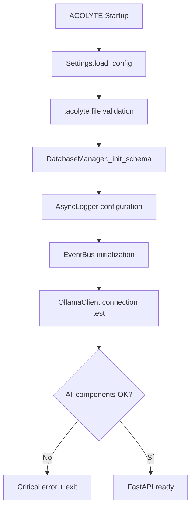
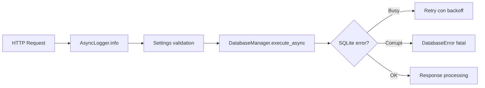
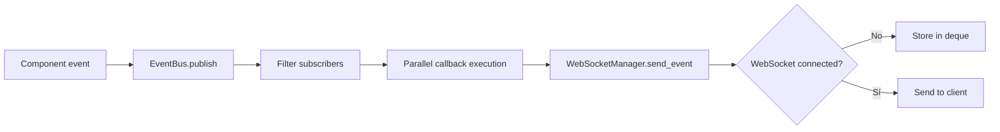

# 🏗️ Arquitectura del Módulo Core

## Principios de Diseño

1. **Infraestructura centralizada**: Core provee servicios base que otros módulos extienden
2. **Sin duplicación**: Cada módulo USA la infraestructura de Core, no la reimplementa
3. **Localhost only**: Binding estricto a 127.0.0.1
4. **Paths seguros**: Validación con pathlib
5. **IDs centralizados**: Sistema unificado de generación de identificadores
6. **Sin autenticación**: Sistema mono-usuario
7. **Sin rate limiting**: Uso ilimitado local

## Flujo de Coordinación

Core proporciona **servicios centralizados** que todos los módulos usan y extienden:

```
                    Core (Infraestructura Base)
                            │
         ┌───────────────┬───────────────┬───────────────┐
         │               │               │               │
    Compression      Retrieval      Embeddings      Services
    usa y extiende   usa y extiende  usa y extiende  usa y extiende
```

**Core NO conoce los detalles de los módulos superiores**, solo provee infraestructura.

## Servicios Centralizados

### 1. MetricsCollector (tracing.py)
- Sistema BASE de métricas compartido
- Cada módulo lo USA (no duplica)
- Extiende con métricas específicas del dominio

### 2. SecureConfig (secure_config.py)
- Lee `.acolyte` CENTRALIZADO
- Validación de configuración global
- Cada módulo lee SU sección

### 3. SmartTokenCounter (token_counter.py)
- Conteo unificado de tokens
- Cache LRU compartido
- Estrategias de truncado consistentes

### 4. AsyncLogger (logging.py)
- Sistema de logging UNIFICADO
- Formato consistente para todos
- Sin duplicación de infraestructura

### 5. Sistema de Errores Completo (exceptions.py)
- ÚNICA fuente de excepciones Y respuestas HTTP
- Jerarquía coherente de excepciones
- Modelos Pydantic para respuestas API
- Funciones helper para crear errores
- Todos importan de aquí

## ¿Por qué cada módulo tiene "su propio" cache/métricas?

**NO es duplicación**, es **especialización**:

```python
# INCORRECTO - Duplicación real
class CompressionModule:
    def __init__(self):
        self.metrics = CompressionMetricsSystem()  # Sistema completo propio
        self.cache = CompressionCacheSystem()      # Reimplementación completa

# CORRECTO - Extensión del Core
class CompressionModule:
    def __init__(self):
        self.metrics = MetricsCollector()  # USA Core
        self.cache = LRUCache()            # Cache ESPECÍFICO para queries
        # Cache de embeddings ≠ cache de queries ≠ cache de git blame
```

## Decisiones Arquitectónicas

### Decisión #1: Sistema de Resúmenes (Database)
**ACOLYTE guarda RESÚMENES de sesión, NO mensajes individuales**.

#### Diseño del Esquema
```sql
-- Cada sesión = UNA fila en conversations
CREATE TABLE conversations (
    session_id TEXT PRIMARY KEY,   -- ID único de la sesión
    role TEXT = 'system',         -- Siempre 'system' para resúmenes
    content TEXT,                 -- Resúmenes acumulados "R1 | R2 | R3..."
    total_tokens INTEGER,         -- Tokens ORIGINALES procesados (no resumidos)
    ...
);
```

#### Beneficios
- **Memoria infinita**: Resúmenes de ~80 tokens vs 1800 tokens originales
- **Eficiencia**: Una fila por sesión, no miles de mensajes
- **Búsqueda rápida**: Resúmenes son searchables semánticamente
- **Simplicidad**: No hay que gestionar mensajes individuales

### Decisión #2: IDs Centralizados (Cambio de Paradigma)
**Problema Resuelto**: Inconsistencia crítica entre formatos de ID.

**ANTES**:
- Cada módulo generaba IDs con métodos diferentes
- Incompatibilidad entre formatos UUID4 (Python) y hex32 (SQLite)
- Duplicación de lógica en múltiples archivos

**AHORA**:
- Un solo lugar para generar IDs (`core/id_generator.py`)
- Formato único hex32 compatible con SQLite
- Funciones helper: `generate_id()`, `is_valid_id()`
- Conversión automática entre formatos cuando es necesario

### Decisión #3: Sistema de Errores Consolidado
**TODO el manejo de errores está en `core/exceptions.py`**:

1. **Excepciones Python** (para lógica interna)
2. **Modelos de Respuesta HTTP** (para API)
3. **Función de Conversión Automática**: `from_exception()`

### Decisión #4: Solo Configuración de Chunking en Core
- **Solo configuración de chunking en Core**: La implementación está en `/rag/chunking/`
- **Razón**: Core es infraestructura, la lógica de chunking pertenece a RAG
- **Core solo define**: Configuraciones y validaciones, no lógica de dominio
- **Beneficio**: Separación clara entre infraestructura y lógica de negocio

### Decisión #5: InsightStore en Core (No en Services)
**InsightStore es INFRAESTRUCTURA especializada, no lógica de negocio**.

1. **Naturaleza del componente**: Maneja compresión zlib, almacenamiento directo, índices
2. **Patrón arquitectónico**: Core proporciona infraestructura + Componentes especializados
3. **Analogía con otros componentes**:
   - `MetricsCollector` en Core → Usado por todos los módulos
   - `TokenBudgetManager` en Core → Usado por ChatService, Dream, etc.
   - `InsightStore` en Core → Usado por Dream Service

### Decisión #6: Sin Migraciones de BD
- **No necesarias**: Sistema mono-usuario con esquema estable
- **Esquema fijo** es suficiente para MVP

### Decisión #7: Sin Keywords en Conversaciones
- **No implementar**: Búsqueda semántica con embeddings es superior
- Evita redundancia y complejidad innecesaria

### Decisión #8: Duplicados en Insights Aceptados
- **Normal para MVP**: Dream puede generar insights similares en diferentes ciclos
- No es un problema crítico para sistema mono-usuario

### Decisión #9: Modelo Fijo acolyte:latest
- **SIEMPRE usa `acolyte:latest`** independiente del modelo solicitado
- Creado desde qwen2.5-coder con Modelfile personalizado

### Decisión #10: Thread-Safety con asyncio.Lock
- **Serializa accesos** a SQLite para evitar problemas de concurrencia
- Crítico para múltiples requests simultáneos en FastAPI

### Decisión #11: Logging Asíncrono Obligatorio
- **loguru con `enqueue=True`** para latencia cero
- Garantiza que el logging nunca bloquee operaciones críticas

### Decisión #12: Cache LRU con Límites Estrictos
- **maxsize=10000** en SmartTokenCounter
- Previene crecimiento ilimitado de memoria

### Decisión #13: Logger Global Singleton
- **SIEMPRE usar**: `from acolyte.core.logging import logger`
- **NUNCA crear**: `AsyncLogger("module")` - NO hacer esto
- Un solo logger global para todo el sistema
- Configurado automáticamente al inicio

### Decisión #14: EventBus Global Singleton
- **EventBus es singleton**: Instancia global única `event_bus`
- Importar siempre: `from acolyte.core.events import event_bus`
- Coordinación entre módulos sin acoplamiento

### Decisión #15: Datetime Centralization
- **Usar helpers centralizados**: `from acolyte.core.utils.datetime_utils import utc_now, utc_now_iso`
- **NO usar**: `datetime.utcnow()` - deprecated pattern
- Consistencia en timestamps para SQLite/Weaviate

## Flujos Arquitectónicos Principales

### Flujo de Inicialización


### Flujo de Request Processing


### Flujo de Token Management
```mermaid
graph TD
    A[Query received] --> B[SmartTokenCounter.count]
    B --> C[@lru_cache lookup]
    C --> D{Cache hit?}
    D -->|Sí| E[Return cached]
    D -->|No| F[Calculate tokens]
    F --> G[Store in cache]
    G --> E
```

### Flujo de Event System


## Garantías de Core

- **Thread Safety**: asyncio.Lock serializa accesos críticos
- **Error Recovery**: Retry automático con backoff exponencial  
- **Resource Management**: Cleanup automático, rotación logs
- **Observability**: Métricas completas, eventos tiempo real
- **Security**: Localhost only, path validation, data masking
- **Performance**: Cache optimizado, conexión reutilizada

## Patrón Strategy para IDs - Infraestructura Centralizada

Core proporciona la infraestructura completa para el patrón Strategy de identificación unificada implementado en el módulo Models.

### Infraestructura de Core para Strategy

1. **Generación Centralizada de IDs** (`id_generator.py`)
   ```python
   from acolyte.core.id_generator import generate_id
   id = generate_id()  # Hex32 compatible con SQLite
   ```

2. **Validación Unificada**
   ```python
   from acolyte.core.id_generator import is_valid_id
   if is_valid_id(model.primary_key):
       # ID válido según estándares de Core
   ```

3. **Conversión de Formatos**
   ```python
   from acolyte.core.id_generator import IDGenerator
   db_id = IDGenerator.to_db_format(any_id_format)
   display_id = IDGenerator.to_display_format(hex32_id)
   ```

### Seguridad y Validación

Core garantiza que todos los IDs del sistema:
- Son únicos (probabilidad de colisión < 1 en 10^77)
- Son compatibles con SQLite (hex32)
- Son validables (`is_valid_id()`)
- Son convertibles entre formatos cuando es necesario
- Siguen estándares seguros (`secrets.token_hex()`)

## FAQ - Preguntas Frecuentes sobre Arquitectura

### ¿Por qué InsightStore está en Core y no en Services?

**Respuesta corta**: Porque InsightStore es INFRAESTRUCTURA especializada, no lógica de negocio.

**Respuesta detallada**:

1. **Naturaleza del componente**:
   - InsightStore maneja compresión zlib, almacenamiento directo, índices invertidos
   - Esto es infraestructura de almacenamiento, NO lógica de negocio
   - Similar a cómo DatabaseManager está en Core

2. **Patrón arquitectónico**:
   - **Core proporciona**: Infraestructura + Componentes especializados
   - **Services implementa**: Lógica de negocio + Orquestación
   - **Dream usará**: InsightStore de Core (cuando se implemente)

3. **Analogía con otros componentes**:
   - `MetricsCollector` en Core → Usado por todos los módulos
   - `TokenBudgetManager` en Core → Usado por ChatService, Dream, etc.
   - `InsightStore` en Core → Usado por Dream Service

4. **Separación de responsabilidades**:
   ```
   Core/InsightStore: "Cómo almacenar insights con compresión y deduplicación"
   Dream Service: "Qué insights generar y cuándo optimizar"
   ```

### ¿Qué va en Core vs qué va en Services?

**En Core**:
- Infraestructura base (logging, DB, eventos)
- Componentes reutilizables (metrics, tokens)
- Stores especializados con lógica de infraestructura (InsightStore)
- Utilidades de bajo nivel (ID generator, config)

**En Services**:
- Lógica de negocio (cómo funciona el chat)
- Orquestación de flujos (chat flow, indexación)
- Reglas de negocio (cuándo crear tareas)
- Integración con usuarios (notificaciones Git)