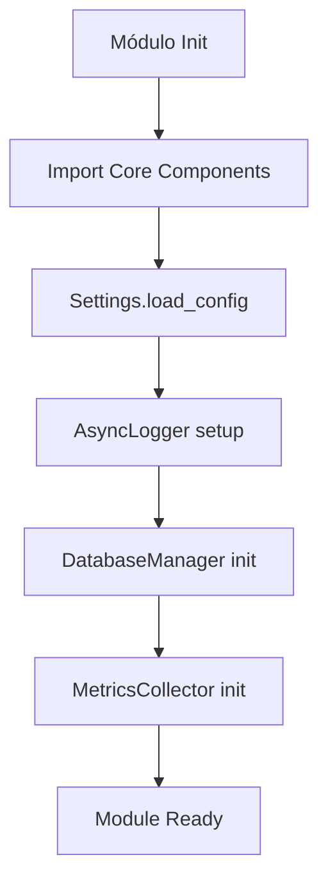
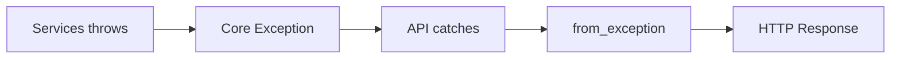
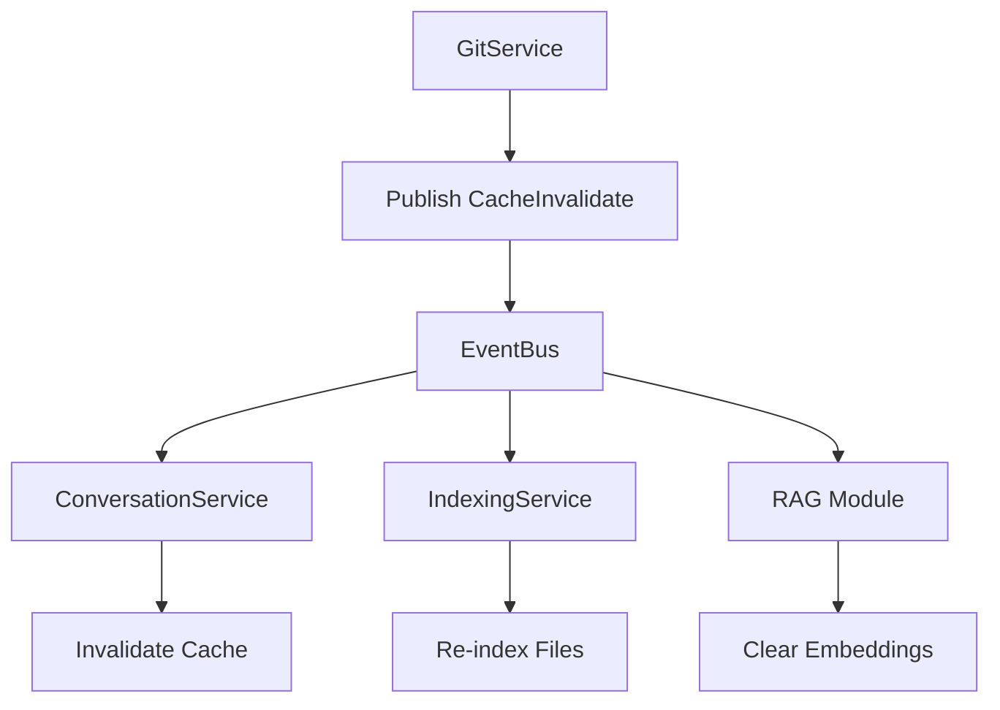

# 🔗 Integración del Módulo Core

## Visión General

Core es la base de ACOLYTE. Todos los módulos dependen de él para infraestructura fundamental.

## Dependencias de Core

### Módulos que Dependen de Core

```
┌─────────────────────────────────────────────────────────────┐
│                         Core                                │
└─────────────────────────────────────────────────────────────┘
                             ↑
     ┌───────────┬───────────┼───────────┬───────────┐
     │           │           │           │           │
  Models       API      Services      RAG      Embeddings
     │                       │           │           │
  (usa         (usa      (usa todos  (usa token  (usa
  exceptions)  events)   los comp.)   counter)   metrics)
```

### Componentes Más Utilizados

1. **`exceptions.py`** - TODOS los módulos importan de aquí
2. **`id_generator.py`** - Sistema de IDs unificado
3. **`token_counter.py`** - Crítico para gestión de contexto
4. **`logging.py`** - Sistema de logging unificado
5. **`database.py`** - Persistencia centralizada
6. **`tracing.py`** - Base para métricas

## Integración por Módulo

### Models

**Componentes de Core que usa**:
- `exceptions.py` - Re-exporta ErrorResponse y helpers
- `id_generator.py` - Para StandardIdMixin y SessionIdMixin

**Cómo se integra**:
```python
# models/base.py
from acolyte.core.id_generator import generate_id
from acolyte.core.exceptions import ErrorResponse  # Re-exporta

class StandardIdMixin(BaseModel):
    id: str = Field(default_factory=generate_id)
```

### API

**Componentes de Core que usa**:
- `events.py` - WebSocketManager para notificaciones
- `logging.py` - AsyncLogger para tracking
- `exceptions.py` - from_exception() para respuestas
- `secure_config.py` - Configuración de puertos

**Cómo se integra**:
```python
# api/websockets/progress.py
from acolyte.core.events import EventBus, EventType, WebSocketManager

# Suscribirse a eventos de progreso
event_bus.subscribe(
    EventType.PROGRESS,
    self._handle_progress_event,
    filter=lambda e: e.task_id == task_id
)
```

### Services

**Componentes de Core que usa**:
- `database.py` - DatabaseManager para persistencia
- `logging.py` - AsyncLogger para debugging
- `exceptions.py` - Toda la jerarquía de errores
- `id_generator.py` - generate_id() para nuevas entidades
- `events.py` - EventBus para coordinación

**Cómo se integra**:
```python
# services/conversation_service.py
from acolyte.core.database import DatabaseManager
from acolyte.core.id_generator import generate_id
from acolyte.core.exceptions import DatabaseError

class ConversationService:
    def __init__(self):
        self.db = DatabaseManager()
        self.session_id = generate_id()
```

### RAG

**Componentes de Core que usa**:
- `token_counter.py` - SmartTokenCounter para límites
- `chunking_config.py` - Configuración de estrategias
- `logging.py` - Para debugging de chunking

**Cómo se integra**:
```python
# rag/compression/contextual.py
from acolyte.core.token_counter import SmartTokenCounter

class ContextualCompressor:
    def __init__(self):
        self.counter = SmartTokenCounter()
        
    def should_compress(self, chunk: str) -> bool:
        return self.counter.count_tokens(chunk) > 100
```

### Embeddings

**Componentes de Core que usa**:
- `tracing.py` - MetricsCollector base
- `logging.py` - AsyncLogger
- `exceptions.py` - ExternalServiceError

**Cómo se integra**:
```python
# embeddings/metrics.py
from acolyte.core.tracing import MetricsCollector

class EmbeddingsMetrics:
    def __init__(self):
        self.collector = MetricsCollector(namespace="embeddings")
```

### Dream

**Componentes de Core que usa**:
- `database.py` - InsightStore para persistencia
- `token_counter.py` - TokenBudgetManager para ventana deslizante
- `events.py` - Para notificar necesidad de optimización

**Cómo se integra**:
```python
# dream/optimizer.py (futuro)
from acolyte.core.database import InsightStore
from acolyte.core.token_counter import TokenBudgetManager

class DreamOptimizer:
    def __init__(self):
        self.insights = InsightStore()
        self.token_manager = TokenBudgetManager(32768)
```

### Semantic

**Componentes de Core que usa**:
- `token_counter.py` - Para gestión de resúmenes
- `logging.py` - Para debugging

**Cómo se integra**:
```python
# semantic/summarizer.py
from acolyte.core.token_counter import SmartTokenCounter

class Summarizer:
    def __init__(self):
        self.counter = SmartTokenCounter()
```

## Contratos de Interfaz

### Sistema de Errores

**Contrato**: Todos los módulos deben usar excepciones de Core

```python
# ✅ CORRECTO
from acolyte.core.exceptions import ValidationError
raise ValidationError("Invalid input")

# ❌ INCORRECTO
raise ValueError("Invalid input")  # No uses excepciones built-in
```

### Generación de IDs

**Contrato**: Todos los IDs deben generarse con Core

```python
# ✅ CORRECTO
from acolyte.core.id_generator import generate_id
new_id = generate_id()

# ❌ INCORRECTO
import uuid
new_id = str(uuid.uuid4())  # No generes IDs por tu cuenta
```

### Métricas

**Contrato**: Usar MetricsCollector por composición, no herencia

```python
# ✅ CORRECTO
from acolyte.core.tracing import MetricsCollector

class MyMetrics:
    def __init__(self):
        self.collector = MetricsCollector()

# ❌ INCORRECTO
class MyMetrics(MetricsCollector):  # No heredes
    pass
```

### Configuración

**Contrato**: Leer configuración solo de secure_config

```python
# ✅ CORRECTO
from acolyte.core.secure_config import Settings
settings = Settings()
port = settings.get("ports.backend")

# ❌ INCORRECTO
import os
port = os.getenv("BACKEND_PORT")  # No uses env vars directamente
```

## Flujos de Integración

### Flujo: Inicialización de Módulo



### Flujo: Manejo de Errores Cross-Módulo



### Flujo: Coordinación via EventBus



## Puntos de Extensión

### 1. Nuevos Tipos de Eventos

Para añadir un nuevo tipo de evento:

```python
# 1. Añadir a EventType enum en events.py
class EventType(str, Enum):
    # ... existing types
    MY_NEW_EVENT = "my_new_event"

# 2. Crear clase de evento
class MyNewEvent(BaseEvent):
    def __init__(self, source: str, data: Dict):
        super().__init__(EventType.MY_NEW_EVENT, source)
        self.data = data

# 3. Publicar desde tu módulo
await event_bus.publish(MyNewEvent("my_module", {"info": "data"}))
```

### 2. Nuevas Excepciones

Para añadir una excepción específica:

```python
# En core/exceptions.py
class MySpecificError(AcolyteError):
    """Error específico para mi caso de uso"""
    
    def __init__(self, message: str, field: str):
        super().__init__(message, code="MY_SPECIFIC_ERROR")
        self.field = field
    
    def is_retryable(self) -> bool:
        return False  # Define si es reintentable
```

### 3. Nuevas Métricas

Para añadir métricas específicas:

```python
# En tu módulo
from acolyte.core.tracing import MetricsCollector

class MyModuleMetrics:
    def __init__(self):
        self.collector = MetricsCollector(namespace="my_module")
        
    def record_my_metric(self, value: float):
        self.collector.record_metric("my_custom_metric", value)
```

## Mejores Prácticas de Integración

### 1. Importar Solo lo Necesario

```python
# ✅ BUENO - Import específico
from acolyte.core.exceptions import ValidationError
from acolyte.core.id_generator import generate_id

# ❌ EVITAR - Import wildcard
from acolyte.core import *
```

### 2. Usar Type Hints de Core

```python
# ✅ BUENO - Usar tipos de Core
from acolyte.core.exceptions import AcolyteError

def process_data(data: str) -> None:
    """Procesa datos con manejo de errores tipado"""
    if not data:
        raise ValidationError("Data required")
```

### 3. Respetar Thread-Safety

```python
# ✅ BUENO - Usar métodos async de DatabaseManager
async def get_data():
    db = DatabaseManager()
    return await db.execute_async("SELECT ...", fetch="all")

# ❌ EVITAR - Acceso directo a conexión sin locks
def get_data():
    conn = sqlite3.connect("acolyte.db")  # NO!
```

### 4. Eventos con Contexto

```python
# ✅ BUENO - Evento con información completa
event = ProgressEvent(
    source="my_module",
    operation="processing",
    current=10,
    total=100,
    task_id="task_123",
    message="Processing item 10 of 100"
)

# ❌ EVITAR - Evento sin contexto
event = ProgressEvent("my_module", "processing", 10, 100)
```

## Troubleshooting Común

### Problema: ImportError al importar de Core

**Causa**: Path de import incorrecto
**Solución**: Usar imports absolutos desde `acolyte.core`

```python
# ✅ CORRECTO
from acolyte.core.exceptions import ValidationError

# ❌ INCORRECTO
from core.exceptions import ValidationError
from ..core.exceptions import ValidationError
```

### Problema: IDs incompatibles con BD

**Causa**: Generar IDs sin usar Core
**Solución**: Siempre usar `generate_id()`

```python
# El problema
id = str(uuid.uuid4())  # "550e8400-e29b-41d4-a716-446655440000"
# SQLite espera hex32 sin guiones

# La solución
from acolyte.core.id_generator import generate_id
id = generate_id()  # "550e8400e29b41d4a716446655440000"
```

### Problema: Métricas no se registran

**Causa**: No usar MetricsCollector correctamente
**Solución**: Crear instancia y usar métodos

```python
# El problema
MetricsCollector.record_metric("my_metric", 1.0)  # Método no estático!

# La solución
collector = MetricsCollector(namespace="my_module")
collector.record_metric("my_metric", 1.0)
```

### Problema: Eventos no llegan a suscriptores

**Causa**: Filtro muy restrictivo o tipo incorrecto
**Solución**: Verificar filtro y tipo de evento

```python
# El problema
event_bus.subscribe(
    EventType.PROGRESS,  # Tipo correcto?
    handler,
    filter=lambda e: e.task_id == "exact_id"  # Muy específico?
)

# La solución - filtro más flexible
event_bus.subscribe(
    EventType.PROGRESS,
    handler,
    filter=lambda e: e.source == "indexing"  # Más general
)
```

## Migración y Compatibilidad

### Migración de IDs Legacy

Si tienes IDs en formato UUID4 antiguo:

```python
from acolyte.core.id_generator import IDGenerator

# Convertir IDs legacy a nuevo formato
legacy_id = "550e8400-e29b-41d4-a716-446655440000"
new_id = IDGenerator.to_db_format(legacy_id)
# Resultado: "550e8400e29b41d4a716446655440000"
```

### Compatibilidad con Módulos Futuros

Core está diseñado para ser extensible:

1. **Nuevos stores**: Heredar de patrón InsightStore
2. **Nuevos eventos**: Extender BaseEvent
3. **Nuevas métricas**: Usar MetricsCollector
4. **Nuevas excepciones**: Heredar de AcolyteError

## Estado de Integración por Módulo

| Módulo | Nivel de Integración | Componentes Core Usados |
|--------|---------------------|------------------------|
| Models | ⭐⭐⭐⭐⭐ Completa | exceptions, id_generator |
| API | ⭐⭐⭐⭐⭐ Completa | events, logging, exceptions, config |
| Services | ⭐⭐⭐⭐⭐ Completa | TODOS los componentes |
| RAG | ⭐⭐⭐⭐ Alta | token_counter, chunking_config |
| Embeddings | ⭐⭐⭐⭐ Alta | tracing, logging, exceptions |
| Dream | ⭐⭐⭐ Media (futuro) | database (InsightStore), tokens |
| Semantic | ⭐⭐⭐ Media | token_counter, logging |
