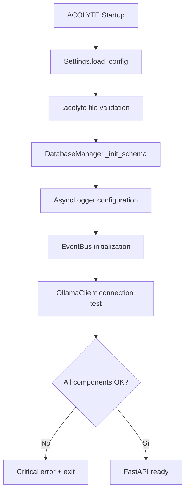
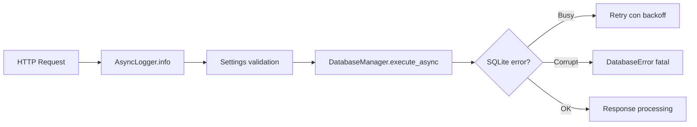
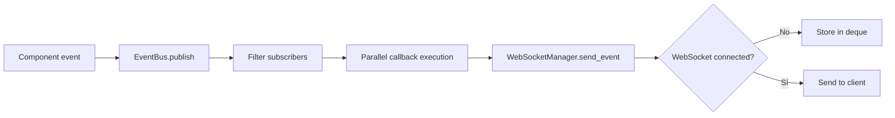

# 🔄 Workflows del Módulo Core

## Flujos Principales

### Flujo de Inicialización


### Flujo de Request Processing


### Flujo de Token Management
```mermaid
graph TD
    A[Query received] --> B[SmartTokenCounter.count]
    B --> C[@lru_cache lookup]
    C --> D{Cache hit?}
    D -->|Sí| E[Return cached]
    D -->|No| F[Calculate tokens]
    F --> G[Store in cache]
    G --> E
```

### Flujo de Event System


## Ejemplos de Código

### Uso del Sistema de Errores Consolidado

```python
# Para lógica interna
from acolyte.core.exceptions import DatabaseError, SQLiteBusyError

try:
    await db.execute_async("SELECT * FROM conversations")
except SQLiteBusyError as e:
    # Reintentable - BD ocupada temporalmente
    await asyncio.sleep(0.1)
    retry()
except DatabaseError as e:
    # Error fatal - log y propagate
    logger.error(f"Database error: {e}")
    raise

# Para respuestas API
from acolyte.core.exceptions import validation_error, from_exception

# Opción 1: Helper directo para errores comunes
if not session_id:
    return validation_error("session_id", None, "required")

# Opción 2: Conversión automática de excepciones
try:
    result = await process_request(data)
except AcolyteError as e:
    return from_exception(e)  # Convierte a ErrorResponse automáticamente
```

### Gestión de Tokens con TokenBudgetManager

```python
# Configurar presupuesto según tipo de query
manager = TokenBudgetManager(32768)  # Context size del modelo

# Para generación de código (necesita mucho espacio de respuesta)
dist = manager.allocate_for_query_type("generation")
# dist = {'system': 2950, 'context': 6372, 'response': 24576, 'total_available': 29491}

# Para preguntas simples
dist = manager.allocate_for_query_type("simple")
# dist = {'system': 2950, 'context': 23593, 'response': 6553, 'total_available': 29491}

# Para exploración/debugging (default)
dist = manager.allocate_for_query_type("default")
# dist = {'system': 2950, 'context': 26541, 'response': 3276, 'total_available': 29491}
```

### Sistema de Eventos para Progreso

```python
# Publicar progreso desde IndexingService
event = ProgressEvent(
    source="indexing",
    operation="processing_files",
    current=50,
    total=100,
    message="Processing file 50 of 100",
    task_id="task_abc123",
    files_skipped=5,
    chunks_created=150,
    embeddings_generated=150,
    current_file="/src/module.py"
)
await event_bus.publish(event)

# WebSocket escucha automáticamente via suscripción
# No necesitas llamar notify_progress() - es automático!
```

### Transacciones con Retry Automático

```python
from acolyte.core.database import DatabaseManager

db = DatabaseManager()

# Transacción con retry automático para locks temporales
async with db.transaction() as conn:
    # Todas las operaciones en la transacción
    await conn.execute("INSERT INTO tasks ...")
    await conn.execute("UPDATE conversations ...")
    # Commit automático al salir del context manager
    # Rollback automático si hay excepción
```

### Logging Asíncrono con Control de Stack Trace

```python
from acolyte.core.logging import AsyncLogger

logger = AsyncLogger("my_module", debug_mode=True)

try:
    risky_operation()
except Exception as e:
    # Stack trace automático en debug mode
    logger.error("Operation failed", error=str(e))
    
    # Override explícito del comportamiento
    logger.error("Critical error", include_trace=True)  # Siempre incluye trace
    logger.error("Known issue", include_trace=False)    # Nunca incluye trace
```

### Conteo y Truncado de Tokens

```python
from acolyte.core.token_counter import SmartTokenCounter, TruncateStrategy

counter = SmartTokenCounter()

# Conteo simple
tokens = counter.count_tokens("Este es un texto de ejemplo")

# Truncado inteligente
long_text = "..." * 1000  # Texto muy largo

# Estrategia SMART: preserva inicio y fin
truncated = counter.truncate_to_limit(
    long_text, 
    limit=100,
    strategy=TruncateStrategy.SMART
)

# Otras estrategias disponibles
truncated_end = counter.truncate_to_limit(long_text, 100, TruncateStrategy.END)
truncated_start = counter.truncate_to_limit(long_text, 100, TruncateStrategy.START)
truncated_middle = counter.truncate_to_limit(long_text, 100, TruncateStrategy.MIDDLE)
```

### Sistema de Ventana Deslizante para Dream

```python
# Configuración automática para ciclos Dream
manager = TokenBudgetManager(32768)

# Ciclo 1: Todo el espacio para código nuevo
allocation_1 = manager.allocate_for_dream_cycle(1)
# {'new_code': 28000, 'previous_context': 0, 'system': 1500}

# Ciclo 2: Preserva contexto crítico del ciclo anterior
allocation_2 = manager.allocate_for_dream_cycle(2)
# {'new_code': 28000, 'previous_context': 1500, 'system': 1500}

# El contexto preservado incluye:
# 1. Bugs y vulnerabilidades críticas encontradas
# 2. Patrones arquitectónicos problemáticos
# 3. Relaciones críticas entre archivos
```

### Generación y Validación de IDs

```python
from acolyte.core.id_generator import generate_id, is_valid_id, IDGenerator

# Generación estándar (hex32)
session_id = generate_id()  # "a3f4b2c1d5e6f7a8b9c0d1e2f3a4b5c6"

# Validación
if is_valid_id(user_provided_id):
    # ID válido - procesar
    pass
else:
    raise ValidationError("Invalid ID format")

# Conversión entre formatos (casos especiales)
# UUID con guiones → hex32 para BD
db_id = IDGenerator.to_db_format("550e8400-e29b-41d4-a716-446655440000")

# hex32 → UUID con guiones para display
display_id = IDGenerator.to_display_format("550e8400e29b41d4a716446655440000")

# Detección automática de formato
format_type = IDGenerator.detect_format(some_id)  # "uuid4" o "hex32"
```

### Configuración Segura desde .acolyte

```python
from acolyte.core.secure_config import Settings

settings = Settings()

# Leer valores simples
model_name = settings.get("model.name")  # "qwen2.5-coder:3b"
backend_port = settings.get("ports.backend", default=8000)

# Leer estructura compleja
model_config = settings.get("model")
# {'name': 'qwen2.5-coder:3b', 'context_size': 32768}

# Validación de seguridad
if not settings.validate_localhost_binding(host):
    raise ConfigurationError("Only localhost binding allowed")

# Validación de paths
safe_path = settings.validate_path_safety(user_provided_path)
```

## Patrones de Uso Recomendados

### Patrón: Composición con MetricsCollector

```python
from acolyte.core.tracing import MetricsCollector

class MyModuleMetrics:
    def __init__(self):
        # USA la infraestructura de Core
        self.collector = MetricsCollector(namespace="my_module")
        
    def record_custom_metric(self, name: str, value: float):
        # Extiende con lógica específica
        self.collector.record_metric(f"custom.{name}", value)
        
    @contextmanager
    def measure_operation(self, operation: str):
        # Usa el timer de Core
        with self.collector.timer(f"operation.{operation}"):
            yield
```

### Patrón: Manejo Robusto de SQLite

```python
from acolyte.core.database import DatabaseManager
from acolyte.core.exceptions import SQLiteBusyError, SQLiteCorruptError

async def robust_query(db: DatabaseManager, query: str, max_retries: int = 3):
    """Ejecuta query con manejo robusto de errores SQLite"""
    
    for attempt in range(max_retries):
        try:
            return await db.execute_async(query, fetch="all")
            
        except SQLiteBusyError:
            # BD ocupada - reintentable
            if attempt < max_retries - 1:
                await asyncio.sleep(0.1 * (2 ** attempt))  # Backoff exponencial
                continue
            raise
            
        except SQLiteCorruptError:
            # BD corrupta - no reintentable
            logger.critical("Database corruption detected!")
            raise
            
        except Exception as e:
            # Otros errores
            logger.error(f"Unexpected database error: {e}")
            raise
```

### Patrón: Eventos con Filtrado

```python
from acolyte.core.events import EventBus, EventType, ProgressEvent

# Suscribirse solo a eventos de un task específico
def handle_task_progress(event: ProgressEvent):
    print(f"Task {event.task_id}: {event.percentage}%")

subscription_id = event_bus.subscribe(
    EventType.PROGRESS,
    handle_task_progress,
    filter=lambda e: e.task_id == "specific_task_id"
)

# Cancelar suscripción cuando no se necesita
event_bus.unsubscribe(subscription_id)
```

## Performance Tips

### 1. Cache de Tokens
```python
# El cache LRU es automático, pero puedes precalentar
counter = SmartTokenCounter()

# Precalentar cache con textos comunes
common_texts = ["Error:", "Success:", "Processing..."]
for text in common_texts:
    counter.count_tokens(text)
```

### 2. Transacciones Batch
```python
# Múltiples operaciones en una transacción
async with db.transaction() as conn:
    # Batch insert es más eficiente
    await conn.executemany(
        "INSERT INTO insights (id, content) VALUES (?, ?)",
        [(generate_id(), content) for content in insights]
    )
```

### 3. Eventos Asíncronos
```python
# Los callbacks de eventos deben ser rápidos
async def quick_handler(event):
    # NO hagas operaciones pesadas aquí
    await task_queue.put(event)  # Delega a worker
    
# Worker procesa en background
async def worker():
    while True:
        event = await task_queue.get()
        await heavy_processing(event)
```

## Debugging Tips

### Replay de Eventos
```python
# Recuperar eventos de los últimos 5 minutos
from datetime import datetime, timedelta

recent_events = event_bus.replay(
    from_timestamp=datetime.utcnow() - timedelta(minutes=5),
    event_types=[EventType.ERROR, EventType.PROGRESS]
)

for event in recent_events:
    print(f"{event.timestamp}: {event.type} - {event.data}")
```

### Métricas en Tiempo Real
```python
# Ver métricas actuales
metrics = MetricsCollector().get_metrics()
print(json.dumps(metrics, indent=2))

# Exportar a SQLite para análisis
async with aiosqlite.connect("metrics.db") as conn:
    await collector.export_to_sqlite(conn)
```

### Validación de Configuración
```python
# Verificar qué configuración está activa
settings = Settings()
config = {
    "model": settings.get("model"),
    "ports": settings.get("ports"),
    "features": settings.get("features")
}
print(json.dumps(config, indent=2))
```
