# 🔄 Workflows y Ejemplos - Módulo Embeddings

## Flujo Principal de Generación de Embeddings


## Ejemplos de Uso

### 1. Embedding Simple

```python
from acolyte.embeddings import get_embeddings

# Obtener singleton
embeddings = get_embeddings()

# String simple
vector = embeddings.encode("def authenticate(user, password):")
print(f"Dimensiones: {vector.dimension}")  # 768

# Con Chunk (detecta automáticamente)
from acolyte.models.chunk import Chunk, ChunkType

chunk = Chunk(
    content="class UserAuth:\n    def login(self, user, pwd):",
    chunk_type=ChunkType.CLASS,
    metadata={"file": "auth.py", "line": 10}
)
vector = embeddings.encode(chunk)
```

### 2. Embeddings con Contexto Rico

```python
from acolyte.embeddings.context import RichCodeContext

# Contexto mejora la relevancia
context = RichCodeContext(
    language="python",
    file_path="auth/login.py",
    imports=["jwt", "bcrypt"],
    dependencies=["User", "Session"],
    semantic_tags=["authentication", "security"],
    test_coverage=0.85,
    complexity=7
)

# El mismo código con diferente contexto = embedding diferente
vector1 = embeddings.encode("login(user)", context)

context2 = RichCodeContext(
    language="python",
    file_path="admin/login.py",
    imports=["django.admin"],
    semantic_tags=["admin", "backend"]
)
vector2 = embeddings.encode("login(user)", context2)

# Embeddings diferentes por contexto
similarity = vector1.cosine_similarity(vector2)
print(f"Similitud: {similarity:.3f}")  # ~0.7-0.8
```

### 3. Procesamiento en Batch

```python
# Lista de chunks para indexar
chunks = [
    Chunk(content="def process_payment(amount):", ...),
    Chunk(content="class OrderManager:", ...),
    Chunk(content="async def fetch_user(id):", ...),
    # ... cientos más
]

# Batch eficiente con control de memoria
vectors = embeddings.encode_batch(
    texts=chunks,
    max_tokens_per_batch=10000  # Previene OOM
)

# Con contextos individuales
contexts = [
    RichCodeContext(language="python", file_path=f"file{i}.py")
    for i in range(len(chunks))
]

vectors = embeddings.encode_batch(
    texts=chunks,
    contexts=contexts,
    batch_size=50  # Items por batch
)
```

### 4. Búsqueda con Re-ranking

```python
from acolyte.embeddings import get_embeddings, get_reranker

embeddings = get_embeddings()
reranker = get_reranker()

# Query del usuario
query = "validate JWT token expiration"

# Candidatos de búsqueda inicial
candidates = [
    "def check_token(token): ...",
    "def validate_jwt(jwt_token): ...",
    "def is_expired(token): ...",
    # ... 100 candidatos
]

# Opción 1: Re-ranking manual
query_vec = embeddings.encode(query)
candidate_vecs = embeddings.encode_batch(candidates)

# Calcular similitudes
similarities = [
    query_vec.cosine_similarity(vec) 
    for vec in candidate_vecs
]

# Top 30 por embeddings
top_indices = sorted(
    range(len(similarities)), 
    key=lambda i: similarities[i], 
    reverse=True
)[:30]
top_candidates = [candidates[i] for i in top_indices]

# Re-rankear top 30 para precisión
reranked = reranker.rerank(query, top_candidates, top_k=10)

# Opción 2: Método combinado (recomendado)
results = embeddings.encode_with_rerank(
    query=query,
    candidates=candidates,
    top_k=10,
    initial_retrieval_factor=3  # Recuperar 30 para top 10
)

for text, score in results:
    print(f"Score: {score:.3f} - {text[:50]}...")
```

## Flujo de Batch Processing con Control de Memoria


### 5. Cache Persistente

```python
from acolyte.embeddings.persistent_cache import SmartPersistentCache

# Opción 1: Uso automático (recomendado)
embeddings = get_embeddings()  # Ya usa SmartPersistentCache

# El cache se guarda automáticamente cada 5 minutos
# Al reiniciar, se recupera el estado previo

# Opción 2: Control manual
with SmartPersistentCache(
    max_size=20000,
    ttl_seconds=7200,  # 2 horas
    save_interval=600  # 10 minutos
) as cache:
    # Operaciones con cache
    embedding = cache.get("code", context)
    if embedding is None:
        embedding = generate_embedding("code")
        cache.set("code", context, embedding)
    
    # Estadísticas
    stats = cache.get_persistent_stats()
    print(f"Entradas: {stats['size']}")
    print(f"Hit rate: {stats['hit_rate']:.2%}")
    print(f"Último guardado: {stats['last_save']}")
```

## Flujo de Re-ranking de Dos Etapas


### 6. Monitoreo y Métricas

```python
# Habilitar métricas en .acolyte
# embeddings:
#   enable_metrics: true

embeddings = get_embeddings()

# Generar algunos embeddings
for i in range(100):
    embeddings.encode(f"function_{i}")

# Obtener resumen
metrics = embeddings.get_metrics_summary()

print(f"Latencia p95: {metrics['performance']['p95_latency_ms']:.1f}ms")
print(f"Cache hit rate: {metrics['cache']['hit_rate']:.2%}")
print(f"Total operaciones: {metrics['operations']['total']}")
print(f"Cumple SLA: {metrics['health']['meets_sla']}")

# Para debugging detallado
if metrics['performance']['p95_latency_ms'] > 500:
    # Revisar operaciones lentas
    stats = metrics['performance']['by_operation']
    for op, data in stats.items():
        if data['p95'] > 500:
            print(f"Operación lenta: {op} - p95: {data['p95']}ms")
```

## Device Handling con Fallback Persistido

```mermaid
graph TD
    A[_load_model] --> B{CUDA available?}
    B -->|No| C[Use CPU]
    B -->|Sí| D[Try CUDA]
    
    D --> E{Success?}
    E -->|No| F[Fallback CPU]
    F --> G[Save to SQLite]
    E -->|Sí| H[Continue CUDA]
    
    I[Next startup] --> J[Load device state]
    J --> K{Previous failure?}
    K -->|Sí| C
    K -->|No| B
```



### 7. Manejo de Errores

```python
from acolyte.core.exceptions import ConfigurationError, ExternalServiceError

try:
    embeddings = get_embeddings()
    vector = embeddings.encode("code")
except ConfigurationError as e:
    # Problema con .acolyte
    print(f"Config error: {e}")
    for suggestion in e.suggestions:
        print(f"  - {suggestion}")
except ExternalServiceError as e:
    # Fallo al cargar modelo
    print(f"Service error: {e}")
    # Modo degradado sin embeddings
```

## Tips de Performance

### 1. Batch Size Óptimo
```python
# GPU con mucha VRAM
vectors = embeddings.encode_batch(texts, batch_size=100)

# GPU limitada o CPU
vectors = embeddings.encode_batch(texts, batch_size=20)

# Control por memoria (recomendado)
vectors = embeddings.encode_batch(
    texts, 
    max_tokens_per_batch=10000  # ~7.7k palabras
)
```

### 2. Pre-calentamiento del Cache
```python
# Al iniciar, pre-cargar embeddings comunes
common_terms = ["login", "auth", "user", "password", "token"]
for term in common_terms:
    embeddings.encode(term)  # Cachea para uso futuro
```

### 3. Limpieza Manual del Cache
```python
# Si el cache crece mucho
cache = embeddings.cache
expired = cache.cleanup_expired()
print(f"Limpiadas {expired} entradas expiradas")

# Reset completo si necesario
cache.clear()
```

## Integración con IndexingService

```python
# IndexingService típicamente hace:
async def index_files(self, files: List[Path]):
    embeddings = get_embeddings()
    
    for file in files:
        chunks = self.chunk_file(file)
        
        # Contextos por chunk
        contexts = [
            RichCodeContext(
                language=detect_language(file),
                file_path=str(file),
                imports=extract_imports(chunk)
            )
            for chunk in chunks
        ]
        
        # Batch processing eficiente
        vectors = embeddings.encode_batch(
            chunks,
            contexts,
            max_tokens_per_batch=10000
        )
        
        # Guardar en Weaviate
        for chunk, vector in zip(chunks, vectors):
            weaviate_data = {
                "content": chunk.content,
                "vector": vector.to_weaviate(),  # float64
                "metadata": chunk.metadata
            }
            self.weaviate.add(weaviate_data)
```
