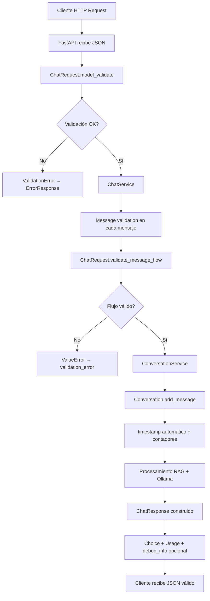
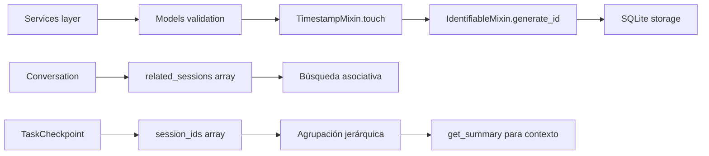
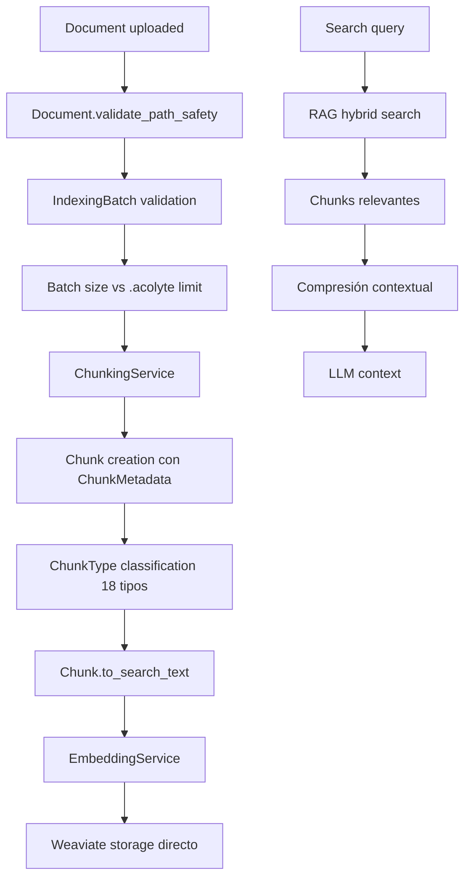
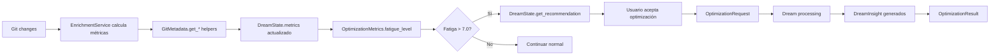
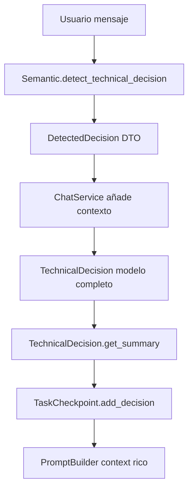

# 🔄 Workflows del Módulo Models

## Flujo Principal de Validación y Chat



## Flujo de Persistencia y Memoria



## Flujo de RAG y Fragmentación



## Flujo de Sistema Dream



## Flujo de Decisiones Técnicas



## Ejemplos de Uso

### Crear y Validar un Chat Request

```python
from acolyte.models.chat import ChatRequest, Message, Role

# Crear mensajes
system_msg = Message(
    role=Role.SYSTEM,
    content="Eres ACOLYTE, asistente de programación local."
)

user_msg = Message(
    role=Role.USER,
    content="¿Cómo implemento autenticación JWT?"
)

# Crear request con validación automática
try:
    request = ChatRequest(
        model="acolyte:latest",
        messages=[system_msg, user_msg],
        temperature=0.7,
        max_tokens=1000,
        debug=True  # Incluir info de debug
    )
except ValidationError as e:
    print(f"Error de validación: {e}")
```

### Gestionar una Conversación con Resúmenes

```python
from acolyte.models.conversation import Conversation, ConversationStatus
from acolyte.models.chat import Message, Role

# Crear conversación (session_id se genera automáticamente)
conv = Conversation(
    summary="Usuario pregunta sobre JWT auth",
    keywords=["jwt", "authentication", "security"]
)

# Añadir mensajes
user_msg = Message(role=Role.USER, content="¿Cómo implemento JWT?")
conv.add_message(user_msg)  # Actualiza contadores

asst_msg = Message(
    role=Role.ASSISTANT, 
    content="Para implementar JWT necesitas..."
)
conv.add_message(asst_msg)

# Obtener contexto para LLM
recent_context = conv.get_context_window(max_messages=5)

# Marcar como completada
conv.complete()
print(f"Estado: {conv.status}")  # COMPLETED
```

### Crear Chunks para RAG

```python
from acolyte.models.chunk import Chunk, ChunkMetadata, ChunkType
from acolyte.embeddings.unixcoder import RichCodeContext
from datetime import datetime

# Crear metadata del chunk
metadata = ChunkMetadata(
    file_path="auth/jwt_handler.py",
    language="python",
    chunk_type=ChunkType.FUNCTION,
    name="verify_jwt_token",
    start_line=45,
    end_line=78,
    last_modified=datetime.now()
)

# Crear chunk
chunk = Chunk(
    content='''def verify_jwt_token(token: str) -> Dict[str, Any]:
    """Verifica y decodifica un JWT token."""
    try:
        payload = jwt.decode(
            token, 
            settings.JWT_SECRET, 
            algorithms=["HS256"]
        )
        return payload
    except jwt.ExpiredSignatureError:
        raise AuthError("Token expirado")
    except jwt.InvalidTokenError:
        raise AuthError("Token inválido")''',
    metadata=metadata
)

# Generar texto para embeddings con contexto rico
rich_context = RichCodeContext(
    language="python",
    file_path="auth/jwt_handler.py",
    imports=["jwt", "settings"],
    semantic_tags=["authentication", "security", "jwt"],
    dependencies=["PyJWT==2.8.0"]
)

search_text = chunk.to_search_text(rich_context)
```

### Gestionar Tareas y Decisiones

```python
from acolyte.models.task_checkpoint import TaskCheckpoint, TaskType, TaskStatus
from acolyte.models.technical_decision import TechnicalDecision, DecisionType

# Crear tarea
task = TaskCheckpoint(
    title="Implementar autenticación JWT",
    task_type=TaskType.IMPLEMENTATION,
    status=TaskStatus.IN_PROGRESS,
    initial_context="Necesitamos auth segura para la API"
)

# Añadir sesiones relacionadas
task.add_session("sess_a3f4b2c1d5e6f7a8b9c0d1e2f3a4b5c6")
task.add_session("sess_b4c5d6e7f8a9b0c1d2e3f4a5b6c7d8e9")

# Registrar decisión técnica
decision = TechnicalDecision(
    title="Usar PyJWT para tokens",
    description="Librería para manejar JWT en Python",
    decision_type=DecisionType.LIBRARY,
    rationale="Librería madura, bien mantenida, compatible con estándares",
    alternatives_considered=["python-jose", "authlib", "manual implementation"],
    impact_level=3,
    task_id=task.id,
    session_id="sess_a3f4b2c1d5e6f7a8b9c0d1e2f3a4b5c6"
)

# Añadir decisión a la tarea
task.add_decision(decision.get_summary())

# Obtener resumen para contexto
print(task.get_summary())
# "Implementar autenticación JWT (implementation) - 2 sesiones - Estado: in_progress"
```

### Validar Documentos para Indexación

```python
from acolyte.models.document import Document, DocumentType, IndexingBatch

# Crear documento con validación de path
try:
    doc = Document(
        file_path="src/auth/jwt_handler.py",  # Path relativo OK
        content=open("src/auth/jwt_handler.py").read(),
        document_type=DocumentType.CODE,
        size_bytes=2048,
        language="python"
    )
except ValueError as e:
    print(f"Path inválido: {e}")

# Crear batch para procesamiento
batch = IndexingBatch(
    documents=[doc],
    total_size_bytes=doc.size_bytes
)

# La validación del tamaño es automática contra .acolyte
# Si excede el límite, lanza ValidationError
```

### Monitorear Optimización Dream

```python
from acolyte.models.dream import DreamState, OptimizationRequest

# Obtener estado actual (singleton)
dream_state = DreamState()

# Verificar si necesita optimización
if dream_state.metrics.needs_optimization:
    print(dream_state.get_recommendation())
    # "Optimización recomendada pronto (fatiga: 7.5)"
    
    # Crear request de optimización
    opt_request = OptimizationRequest(
        trigger="high_fatigue",
        requested_duration_minutes=5,
        focus_areas=["embeddings", "patterns"]
    )
    
    # DreamService procesaría este request
```

### Búsqueda Semántica de Conversaciones

```python
from acolyte.models.conversation import ConversationSearchRequest

# Crear búsqueda
search_req = ConversationSearchRequest(
    query="donde hablamos sobre autenticación JWT",
    limit=5,
    threshold=0.8
)

# ConversationService.search_conversations() usaría este modelo
# para buscar en embeddings y retornar ConversationSearchResult
```

## Flujo de Datos Crítico para Chat

```
HTTP Request → ChatRequest → Validation → ChatService
                                               ↓
Models (Conversation) ← ConversationService ← Processing
        ↓
TimestampMixin.touch() + contador updates
        ↓
SQLite persistence ← Serialización Pydantic
        ↓
ChatResponse construction → JSON → Cliente HTTP
```

## Integración con Base de Datos

```
Models (Pydantic) → Enum.value.upper() → SQLite CHECK constraints
                 → generate_id() → hex32 format storage
                 → Optional fields → NULL safety con helpers
                 → Foreign Keys → session_id/task_id relationships
```

## Consideraciones de Performance

1. **Validación temprana**: Pydantic valida en construcción, evita errores tardíos
2. **IDs pregenerados**: hex32 más eficiente que UUID4 con guiones
3. **Campos calculados**: Properties como `line_count` se calculan on-demand
4. **Helpers seguros**: GitMetadata.get_* evita múltiples checks de NULL
5. **Resúmenes vs mensajes**: 90% reducción en almacenamiento
