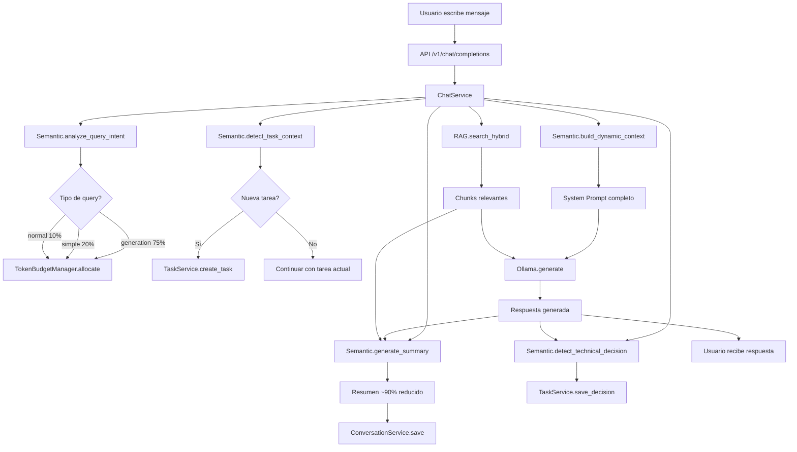
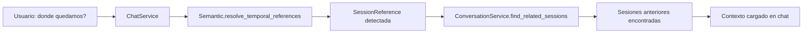

# 🔄 Workflows del Módulo Semantic

## Flujo Principal de Chat



## Flujo de Referencias Temporales



## Ejemplos de Uso

### 1. Análisis de Query para Distribución de Tokens

```python
from acolyte.semantic import QueryAnalyzer

analyzer = QueryAnalyzer()

# Query de generación
result = analyzer.analyze_query_intent("crea un archivo completo de login")
# result.query_type = "generation"
# result.response_allocation = 0.75
# result.context_allocation = 0.25

# Query simple
result = analyzer.analyze_query_intent("qué es FastAPI?")
# result.query_type = "simple"
# result.response_allocation = 0.20
# result.context_allocation = 0.80

# Query normal
result = analyzer.analyze_query_intent("analiza el rendimiento del sistema de auth")
# result.query_type = "normal"
# result.response_allocation = 0.10
# result.context_allocation = 0.90
```

### 2. Detección de Nueva Tarea vs Continuación

```python
from acolyte.semantic import TaskDetector
from acolyte.models import TaskCheckpoint

detector = TaskDetector()

# Nueva tarea detectada
detection = detector.detect_task_context(
    message="vamos a implementar el sistema de notificaciones",
    current_task=None,
    recent_messages=[]
)
# detection.detection_type = "new_task"
# detection.task_title = "sistema de notificaciones"
# detection.confidence = 0.95

# Continuación explícita
current_task = TaskCheckpoint(
    title="refactorizar auth",
    task_type="refactoring"
)
detection = detector.detect_task_context(
    message="sigamos con el refactoring donde quedamos",
    current_task=current_task,
    recent_messages=["modificamos JWT", "actualizamos middleware"]
)
# detection.detection_type = "continuation"
# detection.confidence = 0.90

# Continuación por similitud
detection = detector.detect_task_context(
    message="el middleware de auth sigue fallando con tokens expirados",
    current_task=current_task,
    recent_messages=["arreglamos validación", "JWT timeout"]
)
# detection.detection_type = "similar_context"
# detection.confidence = 0.75
```

### 3. Construcción de System Prompt Dinámico

```python
from acolyte.semantic import PromptBuilder
from acolyte.models import Conversation, TaskCheckpoint

builder = PromptBuilder()

# Contexto completo
project_info = {
    "name": "mi-proyecto",
    "stack": ["Python", "FastAPI", "PostgreSQL"],
    "branch": "feature/auth-refactor"
}

session = Conversation(session_id="sess_123", messages=[...])
task = TaskCheckpoint(title="refactorizar auth", task_type="refactoring")

prompt = builder.build_dynamic_context(
    project=project_info,
    session=session,
    task=task,
    recent_files=["auth.py", "middleware.py"],
    recent_decisions=[decision1, decision2],
    available_tokens=2000
)

# El prompt incluirá:
# - Info del proyecto y stack
# - Contexto de la sesión actual
# - Tarea activa con resumen
# - Archivos recientes modificados
# - Decisiones técnicas tomadas
# - Todo optimizado para 2000 tokens
```

### 4. Generación de Resúmenes

```python
from acolyte.semantic import Summarizer
from acolyte.models import Chunk

summarizer = Summarizer()

# Resumen con contexto de chunks
chunks = [
    Chunk(content="def validate_jwt(token):...", file_path="auth.py"),
    Chunk(content="class AuthMiddleware:...", file_path="middleware.py")
]

result = summarizer.generate_summary(
    user_msg="hay un bug en la validación de JWT que causa logout inesperado",
    assistant_msg="He identificado el problema: el middleware no maneja correctamente tokens cerca de expiración. Sugiero implementar un grace period de 5 minutos antes de rechazar tokens.",
    context_chunks=chunks
)

# result.summary = "[DEBUGGING] Usuario: bug JWT logout | Contexto: auth.py, middleware.py | ACOLYTE: grace period 5min [código, sugerencia]"
# result.compression_ratio = 0.78
# result.entities = ["auth.py", "middleware.py", "validate_jwt", "AuthMiddleware"]
```

### 5. Detección de Decisiones Técnicas

```python
from acolyte.semantic import DecisionDetector

detector = DecisionDetector()

# Decisión explícita con marcador
decision = detector.detect_technical_decision(
    message="@decision: Vamos a usar Redis para cache de sesiones en lugar de memoria local porque necesitamos compartir estado entre workers"
)
# decision.decision_type = DecisionType.ARCHITECTURE
# decision.title = "Redis para cache de sesiones"
# decision.rationale = "necesitamos compartir estado entre workers"
# decision.alternatives_considered = ["memoria local"]
# decision.impact_level = 4

# Decisión automática detectada
decision = detector.detect_technical_decision(
    message="decidí implementar rate limiting con sliding window usando Redis"
)
# decision.decision_type = DecisionType.PATTERN
# decision.title = "rate limiting con sliding window"
# decision.impact_level = 3
```

### 6. Resolución de Referencias Temporales

```python
from acolyte.semantic import ReferenceResolver

resolver = ReferenceResolver()

# Referencias temporales
refs = resolver.resolve_temporal_references(
    "recuerdas donde quedamos con el bug de autenticación?"
)
# refs[0].reference_type = "temporal"
# refs[0].context = "bug de autenticación"

# Referencias específicas
refs = resolver.resolve_temporal_references(
    "en el archivo auth.py que modificamos ayer había una función validate_token"
)
# refs[0].reference_type = "specific"
# refs[0].file_reference = "auth.py"
# refs[0].temporal_reference = "ayer"
# refs[1].reference_type = "specific"
# refs[1].function_reference = "validate_token"
```

## Flujo de Datos Crítico

```
Entrada Usuario → ChatService → Semantic (análisis) → RAG (búsqueda)
                                     ↓
                              TokenBudget (distribución)
                                     ↓
                              PromptBuilder (contexto)
                                     ↓
Chunks + Prompt → Ollama → Respuesta → Semantic (resumen)
                                            ↓
                                    ConversationService (guardar)
```

## Casos de Uso Comunes

### Caso 1: Usuario Genera Código Completo
1. QueryAnalyzer detecta "generation" → 75% tokens para respuesta
2. TaskDetector puede detectar nueva tarea si es componente nuevo
3. PromptBuilder incluye contexto mínimo para maximizar respuesta
4. Summarizer genera: "[IMPLEMENTATION] Usuario: crear LoginForm | ACOLYTE: componente React [código]"
5. DecisionDetector busca decisiones arquitectónicas en la implementación

### Caso 2: Usuario Continúa Tarea Anterior
1. QueryAnalyzer detecta query normal → 90% contexto
2. TaskDetector detecta continuación por similitud o pattern
3. PromptBuilder carga contexto completo de la tarea
4. ReferenceResolver puede detectar referencias a trabajo previo
5. Summarizer incluye contexto de continuidad

### Caso 3: Debugging con Referencias
1. Usuario menciona "el error de ayer"
2. ReferenceResolver detecta referencia temporal
3. ConversationService busca sesiones con errores
4. PromptBuilder incluye contexto de sesiones encontradas
5. Summarizer genera: "[DEBUGGING] Usuario: error de ayer | Contexto: auth.py línea 45 | ACOLYTE: fix aplicado"

## Performance Tips

1. **Cachear análisis repetidos**: QueryAnalyzer y TaskDetector son deterministas
2. **Limitar recent_messages**: 5-10 mensajes son suficientes para contexto
3. **Priorizar tokens**: PromptBuilder trunca inteligentemente si excede límite
4. **Patterns personalizados**: Configurar patterns específicos del proyecto en .acolyte
