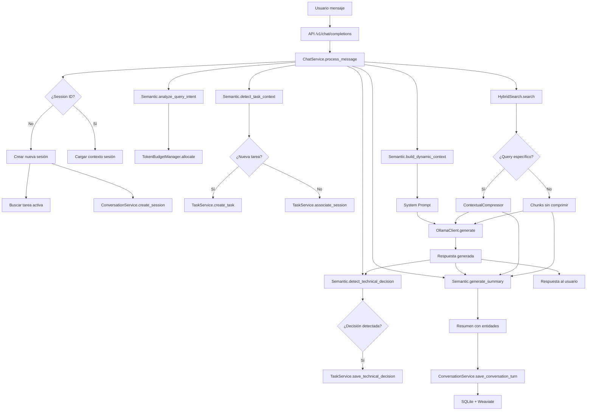
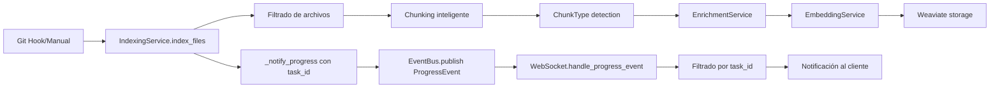
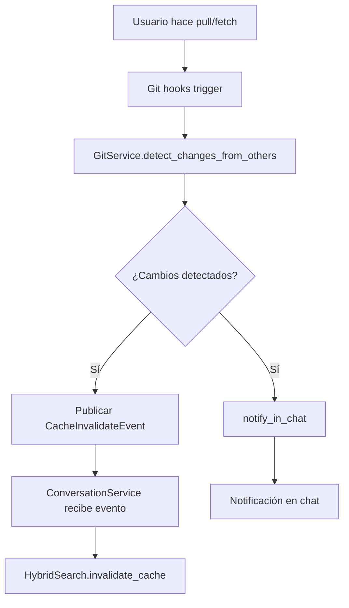
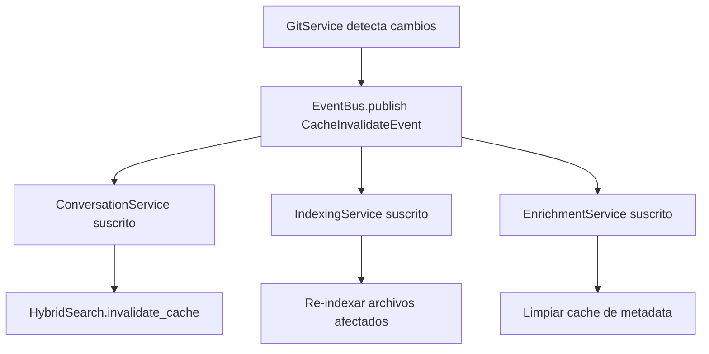

# 🔄 Workflows del Módulo Services

## Flujo Principal de Chat Completo (13 pasos)

```
Usuario → API → ConversationService → Semantic → RAG → Ollama → Respuesta
                        ↓                                ↑
                 SQLite + Weaviate ←─────────────────────┘
```

### Detalles del flujo actualizado:

1. **API** recibe request → **ChatService.process_message()**
2. **ChatService._handle_new_chat()** carga contexto previo automáticamente (Decisión #7)
3. **ChatService** integra Semantic para construir System Prompt Dinámico
4. **TaskService** detecta si es nueva tarea/continuación y gestiona jerarquía Task>Session>Message
5. **ChatService** usa HybridSearch desde RAG (70/30) + compresión contextual para queries específicos
6. **ChatService._generate_with_retry()** con Ollama usando retry logic robusto
7. **ChatService** usa Semantic para generar resumen CON chunks de contexto
8. **ConversationService.save_conversation_turn()** guarda resúmenes (NO mensajes completos)
9. **ConversationService** actualiza total_tokens acumulativo para estadísticas (Decisión #12)
10. **IndexingService** indexa código validado en Weaviate con pipeline completo
11. **TaskService.save_technical_decision()** registra decisiones detectadas por Semantic
12. **GitService** reacciona a cambios y publica CacheInvalidateEvent (NO fetch automático)
13. **ConversationService** recibe eventos y propaga invalidación a HybridSearch

### Coordinación de tokens con TokenBudgetManager:

```python
# El context_size es el LÍMITE TOTAL del modelo
# Todo debe caber en este límite: sistema + RAG + historial + pregunta + respuesta

Ejemplo con context_size = 32,768:
├── Respuesta reservada: 10% (3,277 tokens)
└── Disponible: 90% (29,491 tokens)
    ├── RAG chunks: 54% del total (17,694)
    ├── Historial: 27% del total (8,847)
    └── Sistema: 9% del total (2,950)

# Si el historial excede su presupuesto:
# - Se comprimen mensajes antiguos en resúmenes
# - Se priorizan mensajes recientes y relevantes
# - SQLite guarda TODO, pero solo lo esencial va al LLM
```

### Ejemplo: Gestión de conversación larga con resúmenes

```
Pregunta 50 después de muchas interacciones:

SQLite tiene:           5,000 tokens en resúmenes (50 interacciones x 100 tokens promedio)
                              ↓
TokenBudgetManager selecciona 8,847 tokens:
  - Últimos 5 resúmenes: 500 tokens
  - Resúmenes de la tarea actual: 2,000 tokens
  - Resúmenes relacionados por búsqueda: 1,347 tokens
  - Mensajes recientes completos: 5,000 tokens
                              ↓
Enviado a Ollama:       sistema (2,950) + RAG (17,694) + historial (8,847) = 29,491 ✓

*Nota: Los resúmenes permiten mantener contexto de miles de interacciones en solo unos pocos tokens*
```

## Flujo Completo del Sistema



## Flujo de Indexación con EventBus



### Ejemplo de código - Indexación inicial:

```python
# Script de instalación inicial
async def index_project():
    indexing_service = IndexingService()
    
    # Obtener todos los archivos del proyecto
    project_files = get_all_project_files()
    
    # Filtrar archivos soportados
    supported_files = indexing_service._filter_files(project_files)
    
    # Indexar con progreso
    result = await indexing_service.index_files(
        files=supported_files,
        trigger="installation",
        task_id="initial-indexing"
    )
    
    print(f"Indexados: {len(result['indexed'])} archivos")
    print(f"Chunks creados: {result['chunks_created']}")
    print(f"Embeddings generados: {result['embeddings_generated']}")
```

## Flujo de Git Reactivo



### Ejemplo - Detección de cambios y notificación:

```python
# En ChatService cuando se crea nueva sesión
async def _handle_new_chat(self):
    # ... código de inicialización ...
    
    # Verificar cambios de otros desarrolladores
    if self.git_service:
        changes = await self.git_service.detect_changes_from_others()
        if changes:
            # Generar notificación amigable
            notification = self.git_service.notify_in_chat(
                "others_changes",
                {"changes": changes}
            )
            
            # Añadir al contexto inicial
            self.initial_context += f"\n\n{notification}"
            
            # Los eventos de invalidación se publican automáticamente
```

## Sistema de Invalidación de Cache Coordinado



### Implementación completa del flujo:

```python
# 1. GitService detecta cambios y publica evento
async def _publish_cache_invalidation(self, reason: str, files: List[str]):
    event = CacheInvalidateEvent(
        source="git_service",
        target_service="all",  # o ["conversation", "indexing"]
        key_pattern="|".join(f"*{file}*" for file in files),
        reason=reason
    )
    await self.event_bus.publish(event)

# 2. ConversationService está suscrito
def __init__(self):
    self._cache_subscription = event_bus.subscribe(
        EventType.CACHE_INVALIDATE,
        self._handle_cache_invalidation,
        filter=lambda e: e.target_service in ["conversation", "all"]
    )

# 3. ConversationService propaga a HybridSearch
async def _handle_cache_invalidation(self, event: CacheInvalidateEvent):
    logger.info(f"Invalidating cache: {event.reason}")
    
    if self.hybrid_search and hasattr(self.hybrid_search, 'invalidate_cache'):
        if event.key_pattern == "*":
            self.hybrid_search.invalidate_cache()
        else:
            self.hybrid_search.invalidate_cache(pattern=event.key_pattern)

# 4. HybridSearch invalida entradas específicas
def invalidate_cache(self, pattern: Optional[str] = None):
    if not pattern or pattern == "*":
        self.cache.clear()
    else:
        # Invalidar solo entradas que coincidan
        keys_to_remove = [
            key for key in self.cache.keys() 
            if self._matches_pattern(key, pattern)
        ]
        for key in keys_to_remove:
            del self.cache[key]
```

## Casos de Uso Comunes

### 1. Inicio de Nueva Conversación

```python
# Usuario inicia chat sin session_id
response = await chat_service.process_message(
    message="Quiero implementar autenticación JWT",
    session_id=None
)

# ChatService automáticamente:
# 1. Busca tarea activa
# 2. Si no hay, busca última sesión
# 3. Crea nueva sesión con contexto previo
# 4. Detecta que es nueva tarea (IMPLEMENTATION)
# 5. Crea TaskCheckpoint asociado
```

### 2. Continuación de Tarea Existente

```python
# Usuario continúa trabajando (con session_id)
response = await chat_service.process_message(
    message="¿Cómo quedó el middleware de auth?",
    session_id="abc123"
)

# ChatService:
# 1. Carga contexto de la sesión
# 2. Encuentra la tarea asociada
# 3. Carga todas las sesiones de la tarea
# 4. Busca chunks relacionados con auth
# 5. Genera respuesta con contexto completo
```

### 3. Búsqueda Semántica de Conversaciones

```python
# Buscar conversaciones sobre un tema
request = ConversationSearchRequest(
    query="implementación de cache redis",
    limit=5,
    include_completed=True,
    date_from=datetime(2025, 1, 1)
)

results = await conversation_service.search_conversations(request)

# Retorna ConversationSearchResult con:
# - session_id
# - content (resumen)
# - similarity_score
# - metadata (fecha, tokens, etc.)
```

### 4. Detección y Guardado de Decisión Técnica

```python
# En el flujo de chat
message = "@decision Vamos a usar Redis para cache en lugar de Memcached"

# ChatService detecta el marcador @decision
# Semantic analiza y extrae:
decision = DetectedDecision(
    decision_type="ARCHITECTURE",
    title="Redis para sistema de cache",
    description="Cambiar de Memcached a Redis",
    rationale="Redis ofrece persistencia y estructuras de datos",
    alternatives_considered=["Memcached", "Hazelcast"],
    impact_level=4
)

# ChatService completa con IDs y guarda
await task_service.save_technical_decision(
    TechnicalDecision(**decision.dict(), 
                     session_id=session_id,
                     task_id=task_id)
)
```

### 5. Análisis de Conflictos Potenciales

```python
# Antes de modificar archivos
files_to_modify = ["auth/middleware.py", "auth/jwt_handler.py"]

conflicts = await git_service.analyze_potential_conflicts(files_to_modify)

if conflicts["severity"] > 7:
    # Alta probabilidad de conflictos
    warning = git_service.notify_in_chat("potential_conflicts", conflicts)
    # Mostrar warning al usuario
```

## Performance Tips

### 1. Optimización de Búsquedas

```python
# Usar compresión para queries específicos
if query_type == "specific_file_question":
    # La compresión reduce chunks 60-80%
    compressed_chunks = await compressor.compress(chunks, query)
```

### 2. Batch Processing en Indexación

```python
# Configurar workers según CPU disponible
indexing_service = IndexingService(
    batch_size=50,  # Más archivos por batch
    concurrent_workers=8  # Más workers paralelos
)
```

### 3. Cache con TTL Apropiado

```python
# GitService usa 5 minutos por defecto
# Ajustar según frecuencia de cambios
GIT_CACHE_TTL = 300  # segundos

# Para proyectos muy activos, reducir
GIT_CACHE_TTL = 60  # 1 minuto
```

### 4. Límites de Sesiones Relacionadas

```python
# En .acolyte
limits:
  max_related_sessions: 5  # Reducir para menos contexto
  related_sessions_chain: 3  # Profundidad de búsqueda
  max_summary_turns: 4  # Turnos en resumen
```

### 5. Gestión de Memoria en Embeddings

```python
# Para proyectos grandes
embeddings:
  batch_size: 10  # Procesar menos archivos simultáneamente
  max_tokens_per_batch: 50000  # Límite estricto de memoria
```

## Flujo de Datos Crítico

```
Usuario → API → ChatService → Semantic (análisis)
                    ↓
              ConversationService ← HybridSearch (búsqueda)
                    ↓
              TaskService (contexto)
                    ↓
              Ollama (generación) → Semantic (resumen)
                    ↓
              ConversationService (persistir)
                    ↓
              Usuario (respuesta)

Paralelo:
Git changes → GitService → EventBus → Cache invalidation → Fresh searches
```

## Secuencias de Llamadas Típicas

### Crear Nueva Tarea

```python
1. ChatService.process_message()
2. ├── Semantic.detect_task_context()
3. ├── TaskService.create_task()
4. ├── ConversationService.create_session()
5. └── TaskService.associate_session_to_task()
```

### Búsqueda con Compresión

```python
1. ChatService.process_message()
2. ├── Semantic.analyze_query_intent()
3. ├── HybridSearch.search()
4. ├── ContextualCompressor.compress()
5. └── OllamaClient.generate()
```

### Invalidación por Git

```python
1. Git hook ejecutado
2. ├── GitService.detect_changes_from_others()
3. ├── EventBus.publish(CacheInvalidateEvent)
4. ├── ConversationService._handle_cache_invalidation()
5. └── HybridSearch.invalidate_cache()
```
