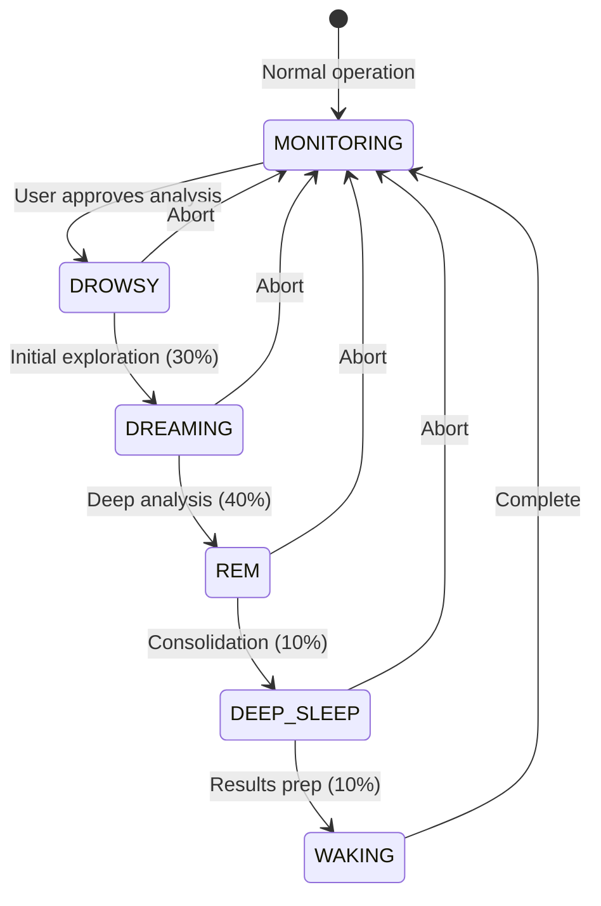

<p align="center">
  
</p>

# 🤖 ACOLYTE - Your Local AI Programming Assistant

### 🟠 ALPHA SOFTWARE - v0.1.20 - 95% COMPLETE

[]()
[](https://www.python.org/downloads/)
[](LICENSE)
[]()
[]()
[]()

> 🎆 **BREAKING: Current Project Status - ALPHA v0.1.20**
>
> ACOLYTE is now in **ALPHA** stage! The core system is FULLY OPERATIONAL:
>
> - ✅ `acolyte init` - **100% WORKING**
> - ✅ `acolyte install` - **100% WORKING**
> - ✅ `acolyte start` - **100% WORKING**
> - 🔧 `acolyte index` - In final testing (95% complete)
>
> **WE'RE ALMOST THERE!** Once indexing is validated (v0.2.0), you can start chatting with your AI assistant!
>
> 📄 **See full status in [STATUS.md](STATUS.md)**

---

## 📑 Table of Contents

- [🧠 Why ACOLYTE?](#-why-acolyte)
- [🌟 Features](#-features)
- [🚀 Quick Start](#-quick-start)
  - [Installation](#installation)
  - [Usage](#usage-per-project)
- [📁 Architecture](#-architecture)
- [🚀 Weaviate Schema Architecture](#-weaviate-schema-architecture)
- [🌙 Dream Analysis System](#-dream-analysis-system-architecture)
  - [Core Concept](#-core-concept)
  - [Technical Implementation](#-technical-implementation)
  - [Neural Graph Integration](#-neural-graph-integration)
  - [User-Directed Deep Analysis](#-user-directed-deep-analysis)
- [🛠️ Requirements](#️-requirements)
- [💬 Commands](#-commands)
- [🔧 Configuration](#-configuration)
- [⚡ Parallel Indexing](#-parallel-indexing-v018)
- [🔌 API Endpoints](#-api-endpoints)
- [🐛 Troubleshooting](#-troubleshooting)
- [🧑‍💻 Development](#-development)
- [📄 License](#-license)
- [🤝 Contributing](#-contributing)
- [🚀 What's Next?](#-whats-next)

---

**ACOLYTE** is not just another coding assistant. It's your personal, local **AI engineer** — with infinite memory, full project awareness, and deep technical reasoning.

### 🧠 Why ACOLYTE?

- 🔁 **Remembers everything** – forever. Across files, sessions, and tasks.
- 🌌 **Understands your entire codebase** – not just opened files.
- 💭 **Dreams while you rest** – detects bugs, bottlenecks, and refactors on its own.
- 🧩 **Auto-indexes 31 languages** using real ASTs (Tree-sitter, not regex).
- 🛠️ **Fixes and suggests** based on Git fatigue, patterns, and historical changes.
- ⚡ **Optimized for 3B–7B models** – runs locally, even on laptops.
- 🔒 **100% Private** – never connects to external APIs or cloud services.
- 🧪 **OpenAI-compatible API** – plug it into your tools right now.

**ACOLYTE is like having a full-stack co-developer who never forgets, rarely sleeps (but dreams when it does), and only works for you.**

> You're not using a chatbot. You're deploying an AI engineer in your machine.

---

### 🌐 Next-Gen AI Models – Power at Your Fingertips

ACOLYTE comes preconfigured with **5 state-of-the-art coding AIs**, ready to deploy locally on any machine. From ultra-lean quantized models for laptops to full-precision beasts for workstations, you get the perfect balance of speed, privacy, and raw power.

🚀 **Supported Models:**

| Level       | Codename               | Type           | Context    | Optimized for                | Maintainer |
| ----------- | ---------------------- | -------------- | ---------- | ---------------------------- | ---------- |
| 🪶 Lightest | **Quantum Feather 7B** | Quantized Q4   | 32K tokens | Ultra-light, CPU‑only        | ticlazau   |
| ⚡ Light    | **Storm Titan 14B**    | Quantized Q3   | 32K tokens | Lightweight GPU systems      | dagbs      |
| 🔥 Medium   | **Inferno Forge 14B**  | Quantized Q4   | 32K tokens | Mid-tier GPUs (8–10 GB VRAM) | Qwen Team  |
| 💪 Heavy    | **Acolyte Prime 14B**  | Quantized Q4   | 32K tokens | Powerful GPUs (10 GB+ VRAM)  | Qwen Team  |
| 🏆 Full     | **Overlord 7B**        | Full Precision | 32K tokens | Workstations (12 GB+ VRAM)   | Qwen Team  |

🌟 **Why it matters?**  
Each AI is battle‑tested and fine‑tuned for coding mastery: code generation, refactoring, debugging, and large context reasoning. ACOLYTE auto‑detects your hardware and unleashes the most powerful model it can run.

💎 **Result:** Blazing fast, **fully local AI coding** that rivals cloud giants like GPT‑4 — but with **zero compromise on privacy**.

> "_It’s not just a chatbot. It’s five elite AI engineers, each forged for your machine._"

---

## 🌟 Features

- **100% Local & Private** - All data stays on your machine
- **Infinite Memory** - Remembers everything across sessions
- **Project Context** - Understands your entire codebase
- **Git Integration** - Knows file history and changes
- **Dream Analysis** - Deep code analysis during "sleep" cycles
- **Multi-Language** - Supports 31+ programming languages
- **Clean Projects** - Only adds a single `.acolyte.project` file to your repos

## 🚀 Quick Start

> 🎆 **Note:** ACOLYTE is in ALPHA stage. Core features (init, install, start) are fully tested and working. Indexing is in final validation.

### Installation

ACOLYTE can be installed as a Python package. For detailed installation instructions, see the **[📦 Installation Guide](INSTALL.md)**.

```bash
# Instala el paquete (nombre: 'acolytes')
pip install acolytes

# Usa el comando 'acolyte' (sin 's')
acolyte init
acolyte install
acolyte start
```

> ⏱️ **Nota**: La instalación y preparación descargan ~4-5GB (PyTorch, modelos, dependencias). Se recomienda tener al menos 10GB libres y una conexión estable. El proceso es idempotente y puede reanudarse si se interrumpe.

### Recuperación automática de instalación

Si la instalación se interrumpe (por error, corte de luz, etc.), simplemente ejecuta de nuevo:

```bash
acolyte install
```

El sistema detectará el estado anterior y continuará desde donde se quedó. Si hay problemas, puedes usar:

```bash
acolyte install --repair
```

para intentar reparar la instalación sin perder el progreso.

### Detección de primera vez y feedback inteligente

- ACOLYTE detecta si es la primera vez que se ejecuta en un proyecto y realiza todas las comprobaciones necesarias (modelos, colecciones, configuración).
- Si falta algo, te avisará y realizará la preparación completa automáticamente.
- Los mensajes de progreso y advertencia están adaptados a tu hardware y situación.

### Timeouts adaptativos

- Los tiempos de espera para descargas y health checks se ajustan automáticamente según tu hardware (RAM, CPU, tipo de disco).
- Si tu máquina es lenta o tiene poca RAM, los timeouts serán más generosos para evitar falsos errores.

### Why the large size?

ACOLYTE includes state-of-the-art AI models for code understanding.
This is a one-time download - all projects share the same models.

### Usage (Per Project)

```bash
cd /path/to/your/project
acolyte init      # Configure ACOLYTE for this project
acolyte install   # Download models and setup services
acolyte start     # Start ACOLYTE services
```

## 📁 Architecture

ACOLYTE installs globally to `~/.acolyte/` and keeps your projects clean:

```
Your Project/
├── src/                    # Your code
├── package.json           # Your config
├── .git/                  # Your git
└── .acolyte.project       # Only ACOLYTE file (12 bytes)

~/.acolyte/
├── src/                   # ACOLYTE source code
├── projects/
│   └── {project-id}/      # All ACOLYTE data for your project
│       ├── config.yaml    # Configuration
│       ├── data/          # SQLite database
│       ├── infra/         # Docker services
│       └── dreams/        # Analysis results
└── global/
    └── models/            # Shared Ollama models
```

## 🚀 Weaviate Schema Architecture

### Technical Excellence Assessment

ACOLYTE's vector database schema represents a **research-grade architecture** that surpasses most commercial code assistants in granularity and capability.

### 📊 Schema Overview

The system uses 5 specialized collections:

1. **CodeChunk** - Code fragments with 18 distinct types (FUNCTION, METHOD, CLASS, etc.)
2. **Conversation** - Indexed chat sessions with semantic relationships
3. **Document** - Complete documents (README, docs, configs)
4. **DreamInsight** - AI-discovered patterns and optimizations
5. **Task** - High-level task grouping and tracking

### 🎯 Clarity: 10/10

- **Crystal clear separation** of concepts (code vs conversations vs documents)
- **Descriptive naming** throughout - no magic strings or ambiguous fields
- **Well-defined enumerations** for all types (18 chunk types, 6 task types, etc.)
- **Self-documenting structure** - purpose is evident from schema alone

### 🛡️ Robustness: 9/10

**Strengths:**

- **HNSW + BM25** hybrid search - best of vector and keyword search
- **Git metadata as nested objects** - properly structured, not flattened
- **Field-specific tokenization** - whitespace for IDs, word for content
- **Production-ready sharding** - configured for horizontal scaling
- **Proper date fields** for temporal queries

**Design Decision:**

- `vectorizer: "none"` - Vectors generated by UniXcoder externally
- This is intentional: **"UniXcoder or nothing"** - no compromise on quality

### 🚀 Power: 9.5/10

**Unique Capabilities:**

- **18 granular chunk types** - more specific than GitHub Copilot
- **Automatic insight tracking** - patterns, connections, optimizations
- **Cross-collection relationships** - link conversations ↔ code ↔ tasks
- **Rich Git integration** - author, commit, message per chunk
- **Temporal search** - "What changed last week?"

**Killer Queries This Enables:**

- "Show all functions modified by [author] related to [bug]"
- "Find conversations that discussed this architectural pattern"
- "What code was written during debugging session X?"
- "Identify recurring optimization opportunities across the codebase"

## 🧠 Intelligent Code INDEXING Architecture

### Next-Generation Code Understanding

ACOLYTE's indexing system represents a **quantum leap in code comprehension** - not just parsing text, but truly understanding your code's structure, purpose, and relationships.

### 🎯 18 Distinct Code Types

Unlike traditional indexers that treat all code as text, ACOLYTE recognizes **18 specialized chunk types**:

- **Structural**: NAMESPACE, INTERFACE, CLASS
- **Executable**: CONSTRUCTOR, FUNCTION, METHOD, PROPERTY
- **Components**: IMPORTS, MODULE, CONSTANTS, TYPES
- **Quality**: TESTS, README, DOCSTRING, COMMENT
- **Meta**: SUMMARY, UNKNOWN

This granularity enables queries like:

- "Show all methods that handle authentication"
- "Find interfaces modified in the last sprint"
- "What functions are affected by this constant change?"

### 🔥 The Indexing Pipeline

```
1. ADAPTIVE CHUNKING → Smart code splitting with AST awareness
2. GIT ENRICHMENT → Who, when, why for every chunk
3. BATCH EMBEDDINGS → Vector representations for semantic search
4. NEURAL STORAGE → Weaviate graph with relationships
```

### 💎 What Makes It Revolutionary

**Git-Aware Context**: Every chunk knows:

- Last author and modification time
- Stability score (how often it changes)
- Related commits and messages
- Pattern metadata (is_test, has_todo, complexity)

**Semantic Understanding**: When you search for "payment processing", ACOLYTE finds:

- Functions named differently but semantically related
- Code that processes financial data
- Tests covering payment scenarios
- Documentation about billing

**Performance at Scale**:

- Parallel processing with 2-4x speedup on large codebases
- Batch operations reducing indexing time by 80%
- Smart caching preventing redundant work
- Handles 100k+ file projects effortlessly

### 🏆 Real-World Impact

This isn't just technical excellence - it transforms how you work:

- **"How does authentication work?"** → ACOLYTE shows the complete flow across files
- **"What changed in the last refactor?"** → Git-enriched chunks reveal the story
- **"Find security vulnerabilities"** → Type-aware search finds actual issues, not false positives
- **"Show me similar implementations"** → Vector search finds conceptually related code

**Bottom line**: ACOLYTE doesn't just index your code - it builds a living, breathing neural map of your entire project that understands code the way developers do.

### 🔥 Competitive Analysis - Code Indexing & Understanding

| Feature                 | **ACOLYTE**     | **Cursor** | **Windsurf** | **GitHub Copilot** | **Sourcegraph Cody** | **Claude Code** | **Probe AI**   |
| ----------------------- | --------------- | ---------- | ------------ | ------------------ | -------------------- | --------------- | -------------- |
| **Code Granularity**    | 18 types        | File-level | File-level   | Context-aware      | AST-based            | Context-aware   | AST-based      |
| **Codebase Context**    | ✅ Full         | ✅ Full    | ✅ Full      | ✅ Partial         | ✅ Full              | ✅ Full         | ✅ Full        |
| **Conversation Memory** | ✅ Persistent   | ❌ Session | ❌ Session   | ❌ Session         | ❌ Session           | ❌ Session      | ❌ Session     |
| **Pattern Detection**   | ✅ Automatic    | ❌ Manual  | ❌ Manual    | ❌ Manual          | ✅ Automatic         | ❌ Manual       | ✅ Automatic   |
| **Git Integration**     | ✅ Reactive     | ✅ Basic   | ✅ Basic     | ✅ Advanced        | ✅ Basic             | ✅ Basic        | ❌ None        |
| **Cross-file Analysis** | ✅ Full         | ✅ Full    | ✅ Full      | ✅ Limited         | ✅ Full              | ✅ Full         | ✅ Full        |
| **Local & Private**     | ✅ Yes          | ❌ Cloud   | ❌ Cloud     | ❌ Cloud           | ✅ Optional          | ❌ Cloud        | ✅ Yes         |
| **Context Window**      | ✅ 32k a 128k\* | ✅ Large   | ✅ Large     | ✅ Medium          | ✅ 100K+ tokens      | ✅ 200K tokens  | ✅ Token-aware |
| **Real-time Updates**   | ✅ Yes          | ✅ Yes     | ✅ Yes       | ✅ Yes             | ✅ Yes               | ✅ Yes          | ✅ Yes         |
| **Deployment**          | Self-hosted     | Cloud      | Cloud        | Cloud              | Self-hosted/Cloud    | Cloud           | Self-hosted    |
| **Pricing**             | Free            | $10-39/mo  | $15-60/mo    | $10-39/mo          | $9-19/mo             | Usage-based     | Free           |
| **Enterprise Features** | ✅ Full         | ✅ Full    | ✅ Full      | ✅ Full            | ✅ Full              | ✅ Limited      | ✅ Basic       |
| **Offline Capability**  | ✅ Full         | ❌ No      | ❌ No        | ❌ No              | ✅ Optional          | ❌ No           | ✅ Yes         |

_\* Context Window is irrelevant for ACOLYTE due to persistent memory - when a conversation window ends, the next session continues with a complete summary, creating effectively **♾️ INFINITE CONTEXT**._

### 🎯 Key Differentiators

**ACOLYTE's Unique Advantages:**

- **18 specialized code types** (vs competitors' basic chunking)
- **Persistent conversation memory** across sessions
- **100% local & private** by default
- **Git-enriched understanding** with commit context
- **Dream analysis system** for autonomous pattern detection
- **Zero-cost deployment** and usage

**Competitor Strengths:**

- **Cursor/Windsurf**: Multi-modal input, agent workflows
- **GitHub Copilot**: Tight GitHub integration, PR reviews
- **Sourcegraph Cody**: Enterprise-grade scalability
- **Claude Code**: Terminal-native with 200K context
- **Probe AI**: Local AST-based search without indexing

### 🏆 Verdict

This schema is **enterprise/research-grade**, not a toy project. The combination of:

- Fine-grained code understanding
- Persistent conversation context
- Automatic pattern detection
- Cross-domain linking

...creates a system that's **years ahead** of most local AI coding assistants.

**Philosophy**: No fallbacks, no compromises. When using the best embeddings model for code (UniXcoder), why accept anything less? If it fails, fix it and continue - don't degrade to inferior alternatives.

This is **pure technical integrity** - the schema of a system designed to be the best, not just "good enough".

## 🌙 Dream Analysis System Architecture

### Revolutionary Deep Analysis Engine

ACOLYTE's Dream system represents a **breakthrough in autonomous code analysis** - like having ChatGPT's "Deep Search" or Claude's "Deep Research" but specifically for YOUR codebase.

### 💡 Core Concept

While you work, ACOLYTE accumulates "fatigue" - a sophisticated metric based on:

- Code churn and instability (30%)
- Recent commit activity (30%)
- Code volatility index (20%)
- Architectural changes (10%)
- Time since optimization (10%)

When fatigue is high AND you ask a complex question, ACOLYTE can suggest: "_May I take 5 minutes for a Deep Search-style analysis?_"

### 🎯 Clarity: 10/10

- **Crystal clear states**: MONITORING → DROWSY → DREAMING → REM → DEEP_SLEEP → WAKING
- **GitMetadata-driven**: Every calculation based on real metrics, not magic numbers
- **Explicit permission model**: NEVER activates without user consent
- **Transparent process**: User sees exactly what's happening during analysis

### 🛡️ Robustness: 9.5/10

**Strengths:**

- **Dual-mode operation**: Full mode with Weaviate, degraded mode without
- **Thread-safe state management**: Asyncio locks prevent race conditions
- **Batch-optimized queries**: From N+1 problems to single batch calls
- **Configurable everything**: Window sizes, durations, thresholds, priorities
- **Error resilience**: Each component fails gracefully with sensible defaults

**Design Philosophy:**

- **"Always ask permission"** - No autonomous actions ever
- **"Real value over theater"** - Actual insights, not simulated activity
- **"5 minutes max"** - Respects user time

### 🚀 Power: 10/10

**Unique Capabilities:**

- **5 specialized analysis types**: Bugs, Security, Performance, Architecture, Patterns
- **Context-aware windowing**: 32k models use sliding window, 128k+ single-pass
- **Git-integrated triggers**: Detects merge conflicts, rapid changes, instability
- **Persistent insights**: Database + markdown documentation
- **Cross-session learning**: Insights available to future conversations

**Analysis Types with Custom Prompts:**

```
bug_detection.md       → Find bugs, edge cases, error handling
security_analysis.md   → Vulnerabilities, input validation, auth issues
performance_analysis.md → N+1 queries, bottlenecks, optimization
architecture_analysis.md → Design flaws, coupling, tech debt
pattern_detection.md   → Anti-patterns, repeated code, improvements
```

### 🔬 Technical Implementation

| Component             | Purpose              | Key Features                                            |
| --------------------- | -------------------- | ------------------------------------------------------- |
| **DreamOrchestrator** | Main coordinator     | Permission management, state machine, background tasks  |
| **FatigueMonitor**    | Real-time metrics    | GitMetadata analysis, batch queries, trigger detection  |
| **DreamAnalyzer**     | Deep analysis engine | Multi-phase analysis, context windowing, prompt loading |
| **DreamStateManager** | State transitions    | Thread-safe, persistent state, duration management      |
| **InsightWriter**     | Results storage      | Database + markdown, categorization, deduplication      |

### 📊 State Machine Flow



### 🏆 Competitive Edge

| Feature                | ACOLYTE Dream      | CodeRabbit         | GitHub Copilot | Cursor/Windsurf | ChatGPT/Claude  |
| ---------------------- | ------------------ | ------------------ | -------------- | --------------- | --------------- |
| Deep code analysis     | ✅ 5 types         | ✅ PR-focused      | ❌             | ❌              | ❌ Code unaware |
| Analysis scope         | ✅ Entire codebase | ❌ PR changes only | ❌             | ❌ Current file | ❌              |
| Neural graph mapping   | ✅ Full dependency | ❌                 | ❌             | ❌              | ❌              |
| User-directed analysis | ✅ "Investigate X" | ❌ Auto only       | N/A            | N/A             | ❌              |
| Fatigue tracking       | ✅ Git-based       | ❌                 | ❌             | ❌              | ❌              |
| Permission model       | ✅ Always asks     | ❌ Auto-reviews    | N/A            | N/A             | ✅ For search   |
| When it runs           | ✅ On demand       | ⚠️ Every commit    | N/A            | N/A             | On demand       |
| Local execution        | ✅                 | ❌ Cloud           | ❌             | ❌              | ❌              |
| Persistent insights    | ✅ DB + files      | ✅ PR comments     | ❌             | ❌              | ❌ Session only |
| Custom prompts         | ✅ File-based      | ❌                 | ❌             | ❌              | ❌              |
| Impact prediction      | ✅ Via graph       | ❌                 | ❌             | ❌              | ❌              |

### 🎭 Example Scenarios

**Security Analysis Request:**

```
User: "Review the authentication system for vulnerabilities"
ACOLYTE: "To perform a complete security analysis I need to enter
         DeepDream mode. May I take 5 minutes to investigate thoroughly?"
User: "Yes"
[5 minutes of REM-level analysis]
ACOLYTE: "Found 3 critical issues. Details saved to:
         .acolyte-dreams/2024-01-15_security_analysis.md"
```

**High Fatigue Suggestion:**

```
User: "Why is the API so slow lately?"
ACOLYTE: "I've noticed significant code activity (fatigue: 8.5/10).
         To properly investigate the performance issues, I should
         perform a deep analysis. May I take 5 minutes?"
User: "Go ahead"
[Deep performance analysis across entire codebase]
ACOLYTE: "Found the issue: N+1 queries in 3 services. Here's how to fix it..."
```

### 🤯 The Context Window Advantage

**The genius of Dream**: Instead of fighting context window limitations, Dream **exploits them as a feature**:

- **Multiple thinking sessions**: Uses 1, 2, or more context windows to reorganize understanding
- **Fresh perspective each cycle**: Each window analyzes from different angles without pollution
- **Progressive refinement**: Early cycles identify patterns, later cycles deep-dive into specifics
- **No context contamination**: Each phase starts with optimized, relevant context
- **Intelligent chunking**: For 32k models, processes ~28k tokens of new code per cycle while preserving critical findings

It's literally giving the AI the ability to "sleep on the problem" - what can't be understood in one constrained window can be progressively understood across multiple focused analysis sessions.

This is why Dream can find issues that single-pass analysis misses - it's not limited by what fits in one context window.

### 📝 Analysis Reports

Dream generates comprehensive markdown reports saved to `.acolyte-dreams/`:

```
.acolyte-dreams/
├── 2024-01-15_security_analysis.md
├── 2024-01-16_performance_insights.md
└── summaries/
    └── latest.json
```

Each report includes:

- Executive summary with critical findings
- Detailed analysis by category (bugs, security, performance)
- Code references with file:line citations
- Actionable recommendations
- Confidence scores for each finding

### 🔄 Dual-Mode Operation

Dream operates in two modes for maximum resilience:

- **FULL MODE** (with Weaviate): Complete search capabilities, finds recently changed files, tracks activity patterns
- **DEGRADED MODE** (without Weaviate): Limited but functional, analyzes default project files, returns conservative fatigue estimates

This ensures Dream works even if some services are unavailable, though with reduced capabilities.

### 🧠 Neural Graph Integration

**The hidden power of Dream**: It leverages ACOLYTE's Neural Graph - a living map of your codebase that tracks:

- **Structural relationships**: Who imports whom, who calls whom, who extends whom
- **Co-modification patterns**: Files that change together, detected through Git history
- **Connection strength**: Relationships strengthen with use, like neural synapses (0.0-1.0)
- **Impact prediction**: "If I change login.py, what breaks?" → Instant dependency analysis

When you request a Dream analysis, it doesn't just search files - it traverses the neural graph to understand the deep connections in your code.

### 🎯 User-Directed Deep Analysis

**You can force a Dream session** when your intuition tells you something's wrong:

```
User: "I think there's something wrong with the payment module.
       Can you take a deep dive and investigate?"
ACOLYTE: "I'll perform a focused Dream analysis on the payment system.
         May I take 5 minutes to trace all connections and patterns?"
User: "Go ahead"
[Uses neural graph to map ALL payment dependencies]
ACOLYTE: "Found the issue: The payment module has a circular dependency
         with the notification system causing intermittent failures..."
```

This turns ACOLYTE from a reactive assistant into a **proactive investigator** that follows your hunches.

## 🛠️ Requirements

- Python 3.11+
- Docker & Docker Compose
- Git
- 8GB RAM minimum (16GB recommended)
- 20GB free disk space

For detailed system requirements and installation options, see the **[📦 Installation Guide](INSTALL.md)**.

## 💬 Commands

ACOLYTE provides a comprehensive CLI. Here are the main commands:

- `acolyte init` - Initialize ACOLYTE in current project
- `acolyte install` - Install services and models
- `acolyte start` - Start all services
- `acolyte stop` - Stop all services
- `acolyte status` - Check service status
- `acolyte index` - Index project files
- `acolyte logs` - View service logs
- `acolyte projects` - List all projects
- `acolyte clean` - Clean cache and logs

For complete CLI documentation, see **[📖 CLI Reference](bin/README.md)**.

## 🔧 Configuration

ACOLYTE stores configuration in `~/.acolyte/projects/{id}/config.yaml`:

```yaml
model:
  name: "qwen2.5-coder:3b" # 0.5b, 1.5b, 3b, 7b, 14b, 32b
  context_size: 32768

ports: # Auto-assigned to avoid conflicts
  weaviate: 42080 # Vector database
  ollama: 42434 # LLM server
  backend: 42000 # ACOLYTE API

dream:
  fatigue_threshold: 7.5 # When to suggest rest
  cycle_duration_minutes: 5
```

> **🔄 Multi-Project Support**: ACOLYTE automatically assigns different ports for each project. See [Multi-Project Ports](docs/MULTI_PROJECT_PORTS.md) for details.

## ⚡ Parallel Indexing (v0.1.8+)

ACOLYTE now supports **parallel indexing** for faster processing of large projects:

```yaml
# Enable in your .acolyte configuration
indexing:
  enable_parallel: true # Activate parallel processing
  concurrent_workers: 4 # Number of workers (based on CPU cores)
```

- **2-4x faster** indexing for projects with >100 files
- Automatic activation when `enable_parallel: true` and >20 files
- Each worker has its own Weaviate client (thread-safe)
- GPU operations limited by semaphore to prevent OOM

For detailed configuration, see [Parallel Indexing Guide](PARALLEL_INDEXING_GUIDE.md).

## 🔌 API Endpoints

ACOLYTE provides an OpenAI-compatible API:

- `POST /v1/chat/completions` - Chat with ACOLYTE
- `POST /v1/embeddings` - Generate embeddings
- `GET /v1/models` - List available models
- `GET /api/health` - Health check
- `WS /api/ws/chat` - WebSocket chat

## 🐛 Troubleshooting

Here are quick solutions to common issues:

### "acolyte: command not found"

```bash
# Linux/Mac
export PATH="$HOME/.local/bin:$PATH"

# Windows - Add Python Scripts to PATH
```

### "pip install acolyte" falla

> El nombre correcto del paquete es `acolytes` (con 's'). Usa:
>
> ```bash
> pip install acolytes
> ```

### Instalación interrumpida o fallida

> Si la instalación se interrumpe, simplemente ejecuta de nuevo:
>
> ```bash
> acolyte install
> ```
>
> El sistema reanudará desde el último paso completado. Si hay problemas, usa:
>
> ```bash
> acolyte install --repair
> ```

### Port conflicts

Edit `~/.acolyte/projects/{id}/.acolyte` and change port numbers.

### Docker issues

```bash
docker ps  # Check if Docker is running
acolyte logs  # View service logs
```

For more troubleshooting help, see:

- **[📦 Installation Guide](INSTALL.md#troubleshooting)**
- **[🔧 Troubleshooting Guide](docs/TROUBLESHOOTING.md)** - Common issues and solutions

## 🧑‍💻 Development

### Setup Development Environment

```bash
git clone https://github.com/unmasSk/acolyte.git
cd acolyte
poetry install
./scripts/dev/dev.sh test    # Run tests
./scripts/dev/dev.sh lint    # Run linters
```

### Project Structure

```
acolyte/
├── src/acolyte/         # Source code
│   ├── api/            # FastAPI endpoints
│   ├── core/           # Core infrastructure
│   ├── services/       # Business logic
│   ├── rag/            # Search & retrieval
│   ├── semantic/       # NLP processing
│   └── dream/          # Deep analysis
├── scripts/            # Installation & utilities
├── tests/              # Test suite (93% coverage)
└── docs/               # Documentation
```

## 📄 License

This project is licensed under the Business Source License (BSL). See [LICENSE](LICENSE) for details.

## 🤝 Contributing

Contributions are welcome! Please read our [Contributing Guide](CONTRIBUTING.md) first.

## 🙏 Acknowledgments

- Built with [Ollama](https://ollama.ai) and [Qwen2.5-Coder](https://github.com/QwenLM/Qwen2.5-Coder)
- Vector search powered by [Weaviate](https://weaviate.io)
- Syntax analysis using [Tree-sitter](https://tree-sitter.github.io)

---

**Remember**: ACOLYTE is 100% local and private. Your code never leaves your machine.

**🎉 CURRENT STATUS**: ALPHA - Core system working! We're validating the final piece (indexing) before beta release.

## 🚀 What's Next?

Once `acolyte index` is validated (v0.2.0 - days away!), the roadmap is:

### v0.2.0 - Indexing Complete 🎯

- Full code indexing validated
- Chat interface enabled
- First conversations with ACOLYTE

### v0.3.0 - IDE Integrations 🤝

- Continue.dev adapter
- Cline compatibility
- Native VSCode extension
- Cursor integration

### v0.4.0 - Enhanced Features 📊

- Web dashboard UI
- Dream analysis visualization
- Neural graph explorer

### v1.0.0 - Public Beta 🌐

- Production stability
- Complete documentation
- Community launch

**We're literally WEEKS away from revolutionizing local AI coding assistants!**
