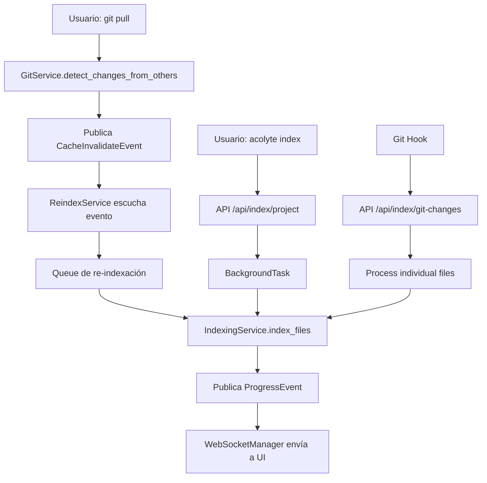

# 📊 MAPA DE DEPENDENCIAS DEL SISTEMA DE INDEXACIÓN

## Resumen Ejecutivo

El sistema de indexación tiene múltiples puntos de entrada y dependencias. La función `index_files()` es llamada desde 3 lugares principales y afecta a varios servicios mediante eventos.

## 🔗 Quién Llama a `index_files()`

### 1. **API Endpoint** `/api/index/project` (Indexación Manual)
```
Usuario ejecuta: acolyte index
    ↓
CLI (cli.py:615) → POST /api/index/project
    ↓
api/index.py:index_project()
    ↓
BackgroundTask → _run_project_indexing()
    ↓
IndexingService.index_files(trigger="manual")
```

### 2. **ReindexService** (Indexación Automática)
```
GitService detecta cambios
    ↓
Publica CacheInvalidateEvent
    ↓
ReindexService._handle_cache_invalidation()
    ↓
Queue → _process_reindex_event()
    ↓
_reindex_in_batches()
    ↓
IndexingService.index_files(trigger="cache_invalidation")
```

### 3. **API Endpoint** `/api/index/git-changes` (Git Hooks)
```
Git Hook (post-commit, post-merge)
    ↓
POST /api/index/git-changes
    ↓
api/index.py:index_git_changes()
    ↓
_process_file_change()
    ↓
IndexingService.index_files(trigger="commit|pull|checkout|fetch")
```

## 📤 Eventos Publicados Durante Indexación

### ProgressEvent
- **Publicado por**: `IndexingService._notify_progress()`
- **Contiene**:
  ```python
  {
      "source": "indexing_service",
      "operation": "indexing_files", 
      "current": 50,
      "total": 100,
      "message": "Processing: main.py",
      "task_id": "idx_123_abc",
      "files_skipped": 5,
      "chunks_created": 150,
      "embeddings_generated": 150,
      "errors": 2
  }
  ```
- **Escuchado por**: WebSocketManager (para UI en tiempo real)

### CacheInvalidateEvent
- **NO publicado directamente por IndexingService**
- **Publicado por**: GitService cuando detecta cambios
- **Escuchado por**: ReindexService

## 🔄 Flujo de Eventos Completo



## 🔍 Servicios que Dependen de Indexación

### 1. **ChatService**
- **Dependencia**: Espera que los índices en Weaviate estén actualizados
- **Cómo**: Busca chunks mediante HybridSearch
- **Impacto si falla indexación**: No encuentra código actualizado

### 2. **Dream (Sistema de Optimización)**
- **Dependencia**: Usa métricas de cambios en archivos
- **Cómo**: FatigueMonitor analiza frecuencia de cambios
- **Impacto si falla indexación**: Métricas de fatiga incorrectas

### 3. **RAG/HybridSearch**
- **Dependencia**: Busca en chunks indexados en Weaviate
- **Cómo**: Queries semánticas y léxicas
- **Impacto si falla indexación**: Resultados de búsqueda obsoletos

### 4. **ConversationService**
- **Dependencia**: Indirecta - guarda referencias a archivos discutidos
- **Cómo**: Almacena file_paths en metadata
- **Impacto si falla indexación**: Referencias a archivos inexistentes

## ⚠️ Puntos Críticos de Sincronización

### 1. **Lock de Indexación**
```python
# IndexingService previene indexación concurrente
async with self._indexing_lock:
    if self._is_indexing:
        raise Exception("Indexing already in progress")
```

### 2. **Queue de ReindexService**
- Procesa eventos secuencialmente
- Si IndexingService está ocupado, re-encola el evento
- Deduplicación por patrón con cooldown de 5 segundos

### 3. **WebSocket Progress**
- Filtra eventos por `task_id`
- Si no hay `task_id`, muestra todos los eventos de indexación

## 🚨 Impactos de Cambiar el Sistema de Indexación

### Si se modifica el triple escaneo:
1. **API Response**: `estimated_files` puede ser menos preciso
2. **Progress Events**: El conteo `total` debe ser consistente
3. **ReindexService**: Espera lista de archivos válidos

### Si se modifica el formato de eventos:
1. **WebSocket**: Debe actualizar el parser en frontend
2. **Métricas**: MetricsCollector espera ciertos campos
3. **Logs**: Formato de logging estructurado debe mantenerse

### Si se paraleliza:
1. **Weaviate**: Verificar límites de conexiones concurrentes
2. **Embeddings**: UniXcoder puede no ser thread-safe
3. **Progress**: Orden de eventos puede ser no-determinístico
4. **Lock**: El _indexing_lock debe cubrir todo el proceso

## 📌 Recomendaciones

1. **NO cambiar** el formato de ProgressEvent sin actualizar WebSocket
2. **Mantener** el trigger type para estadísticas
3. **Respetar** el lock de indexación para evitar condiciones de carrera
4. **Considerar** que ReindexService ya maneja batching y deduplicación
5. **Verificar** que los tests E2E cubren todos los flujos

## Conclusión

El sistema de indexación es central en ACOLYTE. Cualquier cambio debe considerar:
- 3 puntos de entrada diferentes
- Múltiples servicios dependientes
- Sistema de eventos asíncrono
- Sincronización entre servicios
