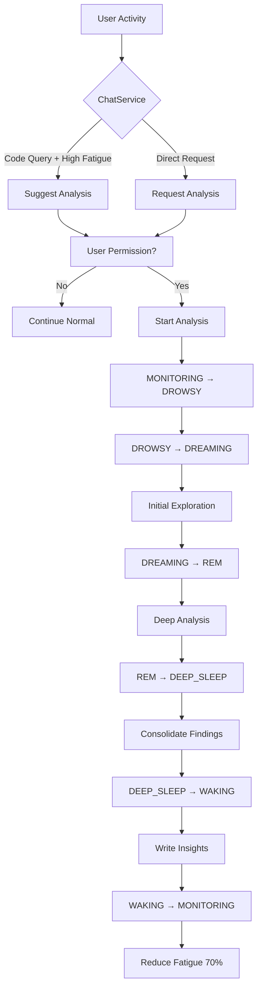
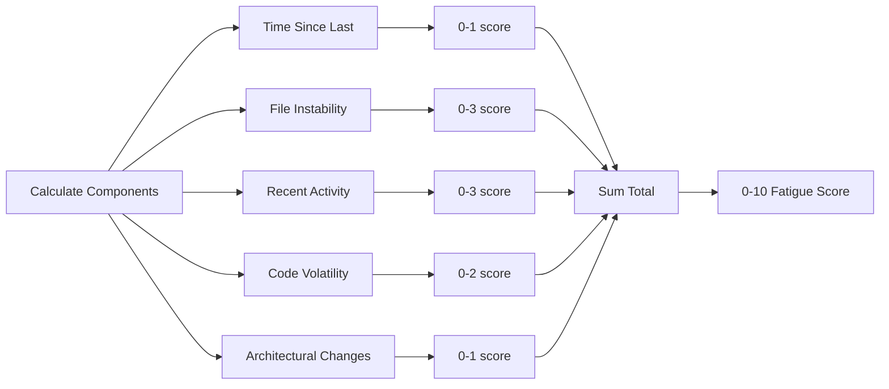
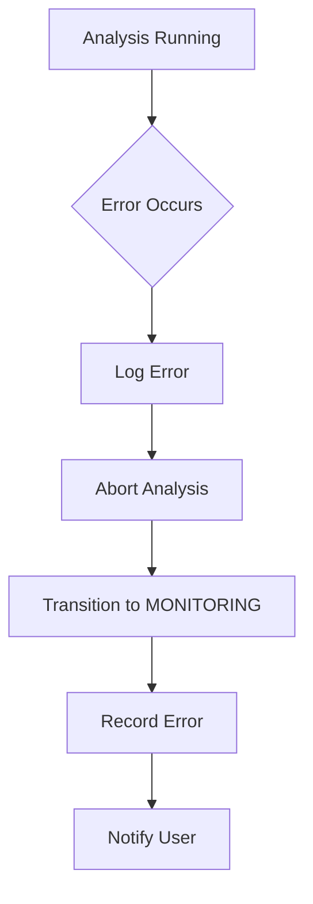

# 🔄 Dream Module Workflows

## Complete Analysis Lifecycle



## Fatigue Calculation Flow



## User Request Flow

```python
# 1. User explicitly requests analysis
user: "Analyze security vulnerabilities in authentication"

# 2. ChatService detects request
if is_analysis_request(message):
    request = await dream_orchestrator.request_analysis(
        trigger=DreamTrigger.USER_REQUEST,
        focus_areas=["security", "authentication"],
        user_query=message
    )
    
# 3. Present permission request
"""
To perform a complete analysis of 'security vulnerabilities in 
authentication' I need to enter DeepDream mode. It's like 
activating 'Deep Search' but for your code. May I have 5 
minutes to investigate thoroughly?
"""

# 4. User approves
if user_approved:
    result = await dream_orchestrator.start_analysis(
        request_id=request["request_id"],
        approved=True,
        focus_areas=["security", "authentication"]
    )
```

## Fatigue Suggestion Flow

```python
# 1. User asks about code
user: "Why is the login endpoint slow?"

# 2. ChatService checks fatigue during response
fatigue = await dream_orchestrator.check_fatigue_level()

# 3. If high fatigue AND code-related query
if fatigue["is_high"] and is_code_query(message):
    # Generate contextual suggestion
    suggestion = dream_orchestrator.generate_suggestion_message(
        fatigue["fatigue_level"],
        fatigue["is_emergency"]
    )
    
    # Add to response
    response += f"\n\n{suggestion}"
```

## Analysis Phase Details

### DROWSY Phase (10% of cycle)
```python
# Prepare for analysis
- Load configuration
- Initialize window manager
- Set session ID
- Prepare prompt templates
```

### DREAMING Phase (30% of cycle)
```python
# Initial exploration
files = await analyzer._get_analysis_candidates()
initial_analysis = await analyzer._analyze_with_window(
    files[:30],  # First batch
    "initial_exploration_prompt"
)
```

### REM Phase (40% of cycle)
```python
# Deep analysis with sliding window
for cycle in range(max_cycles):
    new_files = files[cycle*batch_size:(cycle+1)*batch_size]
    preserved_context = _extract_critical_findings(previous_results)
    
    deep_results = await analyzer._analyze_with_window(
        new_files + preserved_context,
        analysis_prompts[cycle % len(prompts)]
    )
```

### DEEP_SLEEP Phase (10% of cycle)
```python
# Consolidate all findings
all_findings = _consolidate_findings(initial, deep)
deduplicated = _deduplicate_findings(all_findings)
prioritized = _prioritize_findings(deduplicated)
```

### WAKING Phase (10% of cycle)
```python
# Persist insights
db_count = await insight_writer.write_to_database(session_id, insights)
md_path = await insight_writer.write_to_markdown(session_id, insights)
await fatigue_monitor.reduce_fatigue(0.3)
```

## Error Recovery Flow



## Capability Detection Flow

```python
analyzer = DreamAnalyzer(weaviate_client=client)
capability = analyzer.get_capability_info()

if capability["level"] == AnalysisCapability.FULL:
    # All features available
    files = await search.get_recent_files()
elif capability["level"] == AnalysisCapability.LIMITED:
    # Degraded mode
    files = _get_default_project_files()
    logger.warning("Using fallback file selection")
```

## Insight Processing Flow

```python
# 1. Categorize findings
for finding in raw_findings:
    if "bug" in finding:
        insights["bugs"].append(finding)
    elif "security" in finding:
        insights["security_issues"].append(finding)
    # ... etc

# 2. Deduplicate
seen = set()
for item in insights["bugs"]:
    key = json.dumps(item, sort_keys=True)
    if key not in seen:
        unique.append(item)
        seen.add(key)

# 3. Prioritize by severity
insights["bugs"].sort(key=lambda x: severity_order[x.get("severity", "MEDIUM")])

# 4. Store in database
await db.execute_async(
    "INSERT INTO dream_insights ...",
    (id, session_id, type, title, ...)
)
```

## Configuration Override Flow

```yaml
# .acolyte configuration
dream:
  prompts_directory: "custom/prompts/"
  prompts:
    security_analysis: "my_security_prompt.md"
```

```python
# Analyzer loads custom prompts
if custom_dir := config.get("dream.prompts_directory"):
    prompt_path = Path(custom_dir) / "security_analysis.md"
else:
    prompt_path = default_prompts / "security_analysis.md"
```

## API Integration Flow

```python
# GET /api/dream/status
{
    "state": "MONITORING",
    "fatigue": {
        "level": 7.8,
        "is_high": true
    },
    "last_analysis": "2024-01-15T08:00:00Z"
}

# POST /api/dream/analyze
{
    "focus_areas": ["security"],
    "trigger": "USER_REQUEST"
}
# Returns request needing approval

# POST /api/dream/approve/{request_id}
{
    "approved": true
}
# Starts analysis
```

## Performance Optimization Patterns

### Batch Enrichment
```python
# Instead of N individual queries
for file in files:
    metadata = await enrichment.enrich_file(file)  # Bad

# Use batch processing
all_metadata = await enrichment.enrich_files_batch(files)  # Good
```

### Single Search Pattern
```python
# Get all files in one search
results = await search.search(
    query="*",
    filters={"date_from": last_30_days},
    max_chunks=100
)
# Filter in memory
arch_files = [r for r in results if r.file_path in ARCHITECTURAL_FILES]
```

## Usage Examples

### Security Analysis Request
```
User: "Do a deep security analysis of the authentication system"
ACOLYTE: "To perform a complete analysis of 'security analysis of 
         the authentication system' I need to enter DeepDream mode. 
         It's like activating 'Deep Search' but for your code. May 
         I have 5 minutes to investigate thoroughly?"
User: "Yes"
[5 minutes later]
ACOLYTE: "Analysis complete. Found 3 critical issues. Details in 
         .acolyte-dreams/2024-01-15_security_analysis.md"
```

### High Fatigue Suggestion
```
User: "Why is the API returning 500 errors?"
ACOLYTE: "The error is in middleware.py line 45... [answers question]

         I've noticed significant code activity (fatigue: 8.2/10). 
         Would you mind if I take 5 minutes to optimize my memory 
         and search for patterns or potential issues?"
```
