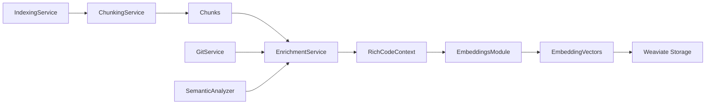
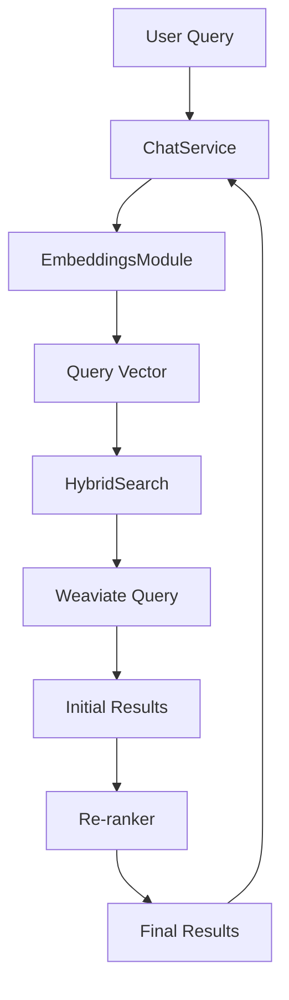
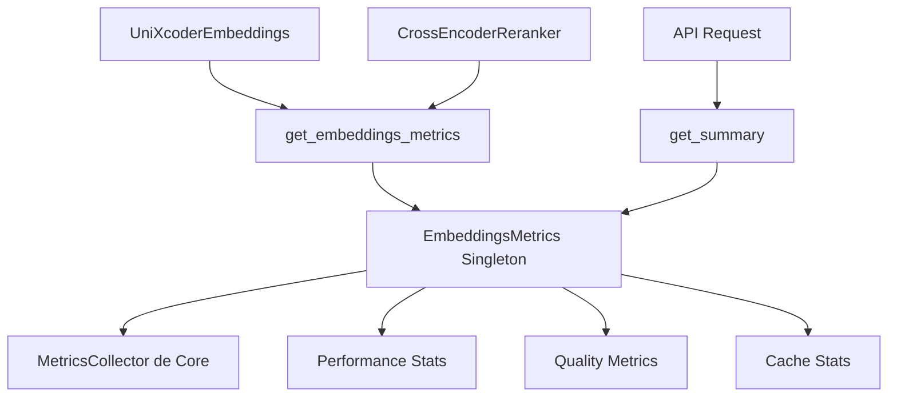

# 🔗 Integración - Módulo Embeddings

## Quién Usa Este Módulo

### RAG/HybridSearch
**Uso principal**: Generación de embeddings para búsqueda semántica.

```python
# En hybrid_search.py
from acolyte.embeddings import get_embeddings

class HybridSearch:
    def __init__(self):
        self.embeddings = get_embeddings()
    
    def search(self, query: str):
        # Genera embedding del query
        query_vector = self.embeddings.encode(query)
        
        # Búsqueda en Weaviate
        results = self.weaviate.query.near_vector(
            query_vector.to_weaviate()
        )
```

### RAG/NeuralGraph
**Uso**: Almacena representaciones vectoriales de patrones de código.

```python
# En neural_graph.py
from acolyte.embeddings.types import EmbeddingVector

class CodePattern:
    embedding: EmbeddingVector  # Representación del patrón
    pattern_type: str
    frequency: int
```

### Services/IndexingService
**Uso principal**: Procesa chunks masivamente durante indexación.

```python
# En indexing_service.py
vectors = self.embeddings.encode_batch(
    chunks,
    contexts,
    max_tokens_per_batch=10000  # Control de memoria
)
```

### Services/ChatService
**Uso**: Obtiene singleton para contexto de búsqueda.

```python
# En chat_service.py
embeddings = get_embeddings()  # Para búsquedas contextuales
```

### RAG/CompressionService
**Uso**: Calcula relevancia para compresión contextual.

```python
# En compression.py
similarity = chunk_vector.cosine_similarity(query_vector)
if similarity > threshold:
    # Incluir chunk completo
else:
    # Comprimir chunk
```

### RAG/EnrichmentService
**Uso**: Provee metadata para mejorar embeddings.

```python
# En enrichment.py
context = RichCodeContext(
    language=detected_language,
    imports=extracted_imports,
    dependencies=found_dependencies,
    semantic_tags=generated_tags
)
```

## Qué Módulos Usa

### Core/Tracing
**Para**: Sistema base de métricas mediante composición.

```python
from acolyte.core.tracing import MetricsCollector

class EmbeddingsMetrics:
    def __init__(self):
        self.collector = MetricsCollector()  # Composición
```

### Core/Logging
**Para**: Logging asíncrono estructurado.

```python
from acolyte.core.logging import logger  # Singleton global

logger.info(
    "Model loaded successfully",
    device=str(self.device),
    load_time_ms=load_time
)
# NUNCA hacer: logger = AsyncLogger("embeddings")
```

### Core/SecureConfig
**Para**: Configuración validada del módulo.

```python
from acolyte.core.secure_config import Settings

settings = Settings.from_file(".acolyte")
self.config = settings.embeddings
```

### Core/Database
**Para**: Persistir device state cuando CUDA falla.

```python
from acolyte.core.database import DatabaseManager

async def save_device_state(device: str):
    db = DatabaseManager()
    await db.save_runtime_state("embeddings.device", device)
```

### Core/Exceptions
**Para**: Manejo estructurado de errores.

```python
from acolyte.core.exceptions import (
    ConfigurationError,
    ExternalServiceError
)

if not self.config.validate():
    raise ConfigurationError("Invalid embeddings config")
```

### Models/Chunk
**Para**: Input principal con interfaz to_search_text().

```python
from acolyte.models.chunk import Chunk

# Detecta automáticamente si es Chunk
if hasattr(text, 'to_search_text'):
    prepared_text = text.to_search_text()
```

## Diagramas de Integración

### Flujo de Indexación Completo



### Flujo de Búsqueda



### Sistema de Métricas Compartido



## Contratos de Interfaz

### Input Format
```python
# El módulo acepta:
Union[str, Chunk]  # Para encode()
List[Union[str, Chunk]]  # Para encode_batch()
Optional[RichCodeContext]  # Para contexto
```

### Output Format
```python
# Siempre retorna:
EmbeddingVector  # 768 dims, float32, L2 normalized
List[EmbeddingVector]  # Para batch
List[Tuple[str, float]]  # Para re-ranking
```

### Configuración Esperada
```yaml
embeddings:
  cache_size: int          # Default: 10000
  device: str              # auto|cuda|cpu
  batch_size: int          # Default: 20
  max_tokens_per_batch: int # Default: 10000
  enable_metrics: bool     # Default: true
```

## Puntos de Extensión

### 1. Nuevos Modelos de Embeddings
Para añadir soporte para CodeBERT o CodeT5:

```python
# Crear nueva clase en embeddings/
class CodeBERTEmbeddings:
    def encode(self, text, context):
        # Implementación específica
        return EmbeddingVector(vector)

# Modificar factory en __init__.py
def get_embeddings(model="unixcoder"):
    if model == "codebert":
        return CodeBERTEmbeddings()
```

### 2. Estrategias de Cache Personalizadas
```python
# Extender ContextAwareCache
class DistributedCache(ContextAwareCache):
    def __init__(self, redis_url):
        super().__init__()
        self.redis = Redis(redis_url)
```

### 3. Métricas Adicionales
```python
# Implementar MetricsProvider
class CustomMetrics:
    def record_operation(self, op, latency, success):
        # Enviar a sistema externo
        prometheus.record(op, latency)
```

## Consideraciones de Performance

### Memoria
- UniXcoder: ~1GB RAM cuando cargado
- CrossEncoder: ~400MB RAM adicional
- Cache: ~1GB con 10k entradas
- Batch processing: ~2GB peak con GPU

### Latencia
- Primera carga: 20-30 segundos
- Encode simple: 50-100ms
- Batch de 50: 200-300ms
- Re-ranking: +100-200ms

### Concurrencia
- Thread-safe mediante singleton DCL
- Cache con RLock para operaciones
- Persistencia en thread separado
- GPU operations son secuenciales

## Manejo de Errores Cross-Module

### Fallback sin Embeddings
```python
# En IndexingService
try:
    from acolyte.embeddings import get_embeddings
    embeddings = get_embeddings()
except ImportError:
    embeddings = None  # Continuar sin embeddings

if embeddings:
    vectors = embeddings.encode_batch(chunks)
else:
    # Indexar sin vectores
    logger.warning("Indexing without embeddings")
```

### Propagación de Errores
```python
# ExternalServiceError se propaga
try:
    vector = embeddings.encode(text)
except ExternalServiceError as e:
    # ChatService puede decidir continuar
    logger.error(f"Embeddings failed: {e}")
    # Usar búsqueda léxica solamente
```

## Estado de Integración

### APIs Estables
- `get_embeddings()` - No cambiará
- `EmbeddingVector` - Formato fijo
- `encode/encode_batch` - Interfaces estables

### En Evolución
- Modelos adicionales (v2)
- Cache distribuido (v2)
- Fine-tuning API (v2)

### Deprecado
- Ninguna API deprecada actualmente
