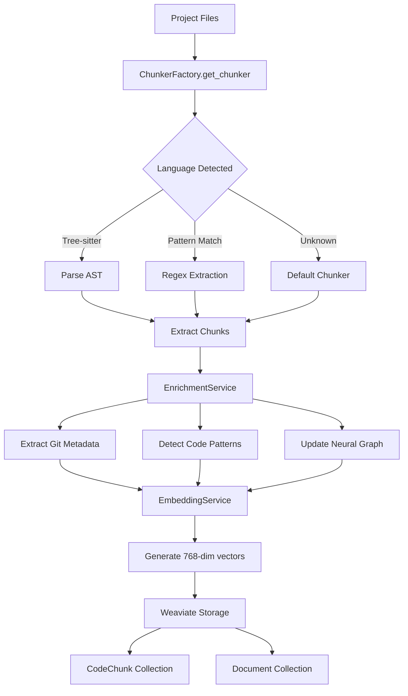
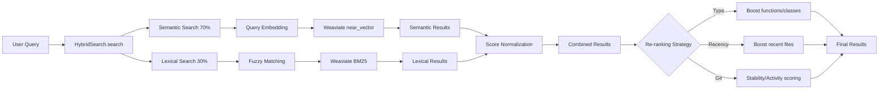
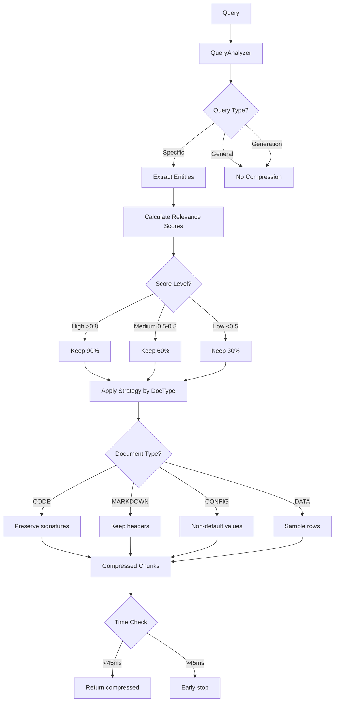
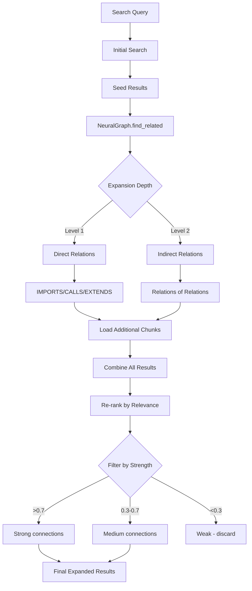
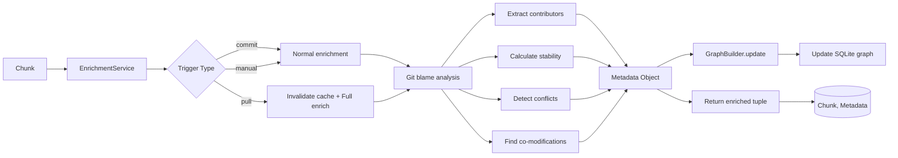
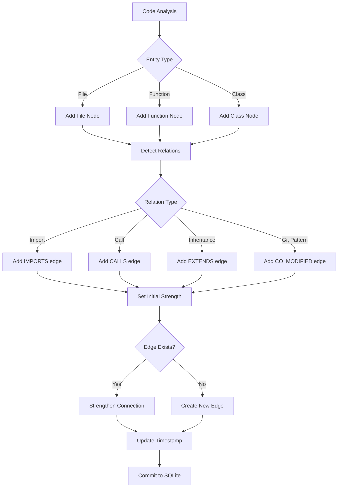
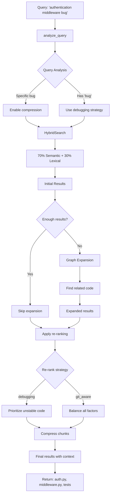
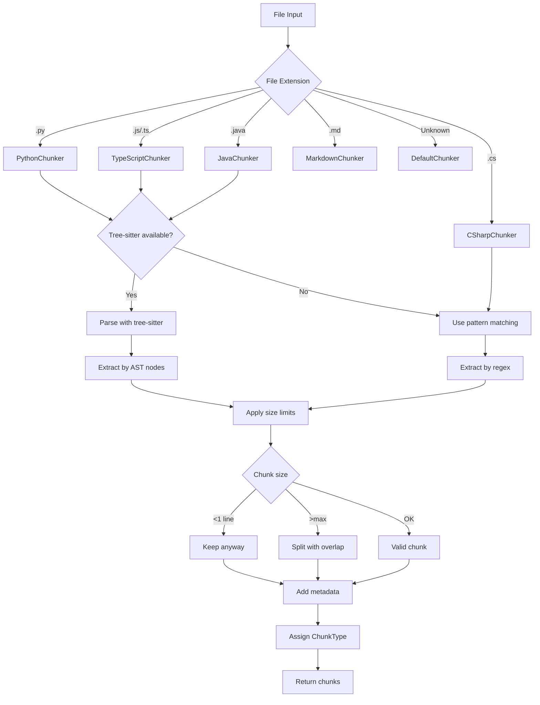
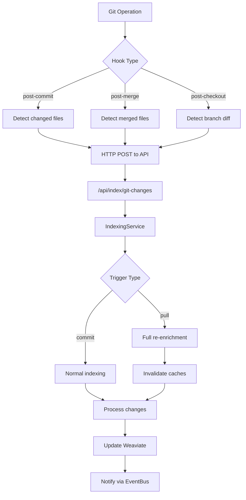

# 🔄 RAG Module Workflows

## Complete Indexing Pipeline Flow



## Hybrid Search Flow (70/30)



## Search with Compression Flow



## Graph Expansion Search Flow



## Enrichment with Git Metadata Flow



## Neural Graph Update Flow



## Complete Search Example Flow



## Chunking Decision Tree



## Performance Optimization Workflows

### Batch Processing Flow

```python
from acolyte.core.logging import logger
from acolyte.core.metrics import MetricsCollector

# Process files in optimized batches
async def batch_index_files(files: List[Path]):
    metrics = MetricsCollector()
    metrics.increment("rag.batch_indexing.started")
    # Group by language for better cache usage
    files_by_lang = group_by_language(files)
    
    for language, lang_files in files_by_lang.items():
        # Process in batches of 10-100
        for batch in batched(lang_files, size=50):
            tasks = []
            
            # Parallel chunking
            for file in batch:
                chunker = ChunkerFactory.get_chunker(file)
                tasks.append(chunker.chunk_file(file))
            
            chunks = await asyncio.gather(*tasks)
            
            # Batch enrichment
            all_chunks = list(chain.from_iterable(chunks))
            enriched = await enrichment.enrich_chunks(all_chunks)
            
            # Batch embedding generation
            contents = [c.content for c, _ in enriched]
            embeddings = await embedding_service.encode_batch(contents)
            
            # Batch insert to Weaviate
            await weaviate_batch_insert(enriched, embeddings)
```

### Cache Warming Flow

```python
from acolyte.core.logging import logger

# Pre-compute common searches
async def warm_search_cache():
    logger.info("Warming search cache")
    common_queries = [
        "authentication",
        "database connection",
        "error handling",
        "api endpoints"
    ]
    
    for query in common_queries:
        # Search without compression to cache full results
        results = await hybrid_search.search(
            query=query,
            limit=20
        )
        
        # Also cache compressed versions
        compressed = await hybrid_search.search_with_compression(
            query=query,
            compression_ratio=0.7
        )
```

### Git Hook Integration Flow



## Complete RAG Query Lifecycle

```python
from acolyte.core.logging import logger
from acolyte.core.metrics import MetricsCollector

async def complete_rag_lifecycle(query: str) -> List[Dict]:
    """Shows the complete flow from query to results."""
    metrics = MetricsCollector()
    
    # 1. Initialize services
    logger.info("Starting RAG lifecycle", query=query)
    search = HybridSearch(weaviate_client, embedding_service)
    compressor = ContextualCompressor()
    graph = NeuralGraph(db_path)
    
    # 2. Analyze query intent
    query_analysis = compressor.analyze_query(query)
    
    # 3. Determine search strategy
    if "bug" in query.lower() or "error" in query.lower():
        strategy = "debugging"
        use_compression = True
        expand_graph = True
    elif query_analysis.is_specific:
        strategy = "specific"
        use_compression = True
        expand_graph = False
    else:
        strategy = "exploratory"
        use_compression = False
        expand_graph = True
    
    # 4. Execute search
    if expand_graph:
        results = await search.search_with_graph_expansion(
            query=query,
            expansion_depth=2
        )
    else:
        results = await search.search(query=query)
    
    # 5. Apply compression if needed
    if use_compression:
        results = compressor.compress_chunks(
            chunks=results,
            query=query,
            target_ratio=0.5
        )
    
    # 6. Re-rank based on strategy
    if strategy == "debugging":
        results = SimpleReranker.rerank_for_debugging(results)
    else:
        results = SimpleReranker.rerank_git_aware(results)
    
    # 7. Format results
    return format_results_for_response(results)
```

## Performance Tips Summary

1. **Batch Operations**: Process 10-100 files at once
2. **Language Grouping**: Process similar files together  
3. **Parallel Processing**: Use asyncio.gather for I/O operations
4. **Cache Warming**: Pre-compute common queries
5. **Smart Compression**: Only for specific queries
6. **Graph Pruning**: Remove edges with strength < 0.1
7. **Incremental Updates**: Only re-index changed files
