# 🔗 Integración del Módulo Semantic

## Consumidores del Módulo (Quién usa Semantic)

### ChatService (Principal Consumidor)

ChatService orquesta todo el flujo de procesamiento y usa prácticamente todas las funciones de Semantic:

```python
# En chat_service.py
from acolyte.semantic import (
    QueryAnalyzer,
    TaskDetector, 
    PromptBuilder,
    Summarizer,
    DecisionDetector
)

# 1. Analiza tipo de query para distribución de tokens
token_dist = self.query_analyzer.analyze_query_intent(user_message)
token_budget = self.token_manager.allocate_for_query_type(token_dist.query_type)

# 2. Detecta si es nueva tarea o continuación
task_detection = self.task_detector.detect_task_context(
    message=user_message,
    current_task=current_task,
    recent_messages=recent_messages
)

# 3. Construye System Prompt dinámico
system_prompt = self.prompt_builder.build_dynamic_context(
    project=project_info,
    session=session,
    task=task,
    recent_files=git_service.get_recent_files(),
    recent_decisions=task_service.get_recent_decisions(),
    available_tokens=token_budget.system_tokens
)

# 4. Después de generar respuesta, crea resumen
summary_result = self.summarizer.generate_summary(
    user_msg=user_message,
    assistant_msg=response,
    context_chunks=retrieved_chunks
)

# 5. Detecta decisiones técnicas
decision = self.decision_detector.detect_technical_decision(
    message=response,
    context=user_message
)
```

### ConversationService

Solo usa resolución de referencias para encontrar sesiones relacionadas:

```python
# En conversation_service.py
from acolyte.semantic import ReferenceResolver

# Detecta referencias temporales
references = self.reference_resolver.resolve_temporal_references(message)

# Busca sesiones basadas en referencias detectadas
for ref in references:
    if ref.reference_type == "temporal":
        sessions = self._search_by_temporal_context(ref.context)
    elif ref.reference_type == "specific":
        sessions = self._search_by_specific_reference(ref)
```

## Dependencias del Módulo (Qué usa Semantic)

### Core Components

```python
# Token Management
from acolyte.core.token_counter import SmartTokenCounter
from acolyte.core.token_budget import TokenBudgetManager

# Logging y Métricas
from acolyte.core.logging import logger
from acolyte.core.tracing import MetricsCollector

# Configuración
from acolyte.core.secure_config import ConfigManager
```

### Models

```python
# Estructuras de datos
from acolyte.models.conversation import Conversation
from acolyte.models.task_checkpoint import TaskCheckpoint
from acolyte.models.technical_decision import TechnicalDecision, DecisionType
from acolyte.models.chunk import Chunk

# Tipos semánticos
from acolyte.models.semantic_types import (
    TokenDistribution,
    TaskDetection,
    SummaryResult,
    DetectedDecision,
    SessionReference
)
```

## Contratos de Interfaz

### Para ChatService

```python
# QueryAnalyzer debe retornar siempre TokenDistribution válido
@dataclass
class TokenDistribution:
    query_type: str  # "generation", "simple", "normal"
    response_allocation: float  # 0.0 - 1.0
    context_allocation: float   # 0.0 - 1.0
    
# TaskDetector debe retornar siempre TaskDetection
@dataclass  
class TaskDetection:
    detection_type: str  # "new_task", "continuation", "similar_context"
    task_title: Optional[str]
    confidence: float  # 0.0 - 1.0

# DecisionDetector retorna Optional[DetectedDecision]
# ChatService DEBE completar con session_id y task_id
```

### Para ConversationService

```python
# ReferenceResolver retorna lista de referencias
@dataclass
class SessionReference:
    reference_type: str  # "temporal", "specific", "topic"
    context: Optional[str]
    file_reference: Optional[str]
    function_reference: Optional[str]
    temporal_reference: Optional[str]
```

## Flujos de Integración

### Flujo 1: Inicio de Nueva Conversación


### Flujo 2: Continuación con Referencias


### Flujo 3: Post-Procesamiento

```mermaid
graph LR
    A[Respuesta generada] --> B[Summarizer]
    B -->|resumen| C[ConversationService.save]
    A --> D[DecisionDetector]  
    D -->|decisión| E[TaskService.save_decision]
```



## Configuración Compartida

Semantic lee su configuración de `.acolyte` pero también respeta configuración global:

```yaml
# Configuración global que afecta a Semantic
core:
  language: "es"  # Idioma por defecto del sistema
  
token_management:
  model_context_size: 32768  # Afecta a PromptBuilder
  
# Configuración específica de Semantic  
semantic:
  language: "es"  # Override del idioma si es diferente
  summary:
    max_length: 100
  # ... resto de config
```

## Puntos de Extensión

### 1. Patterns Personalizados

Los consumidores pueden extender patterns vía configuración:

```yaml
semantic:
  task_detection:
    patterns:
      es:
        new_task: ["mi-pattern-custom", "otro-pattern"]
      en:
        new_task: ["my-custom-pattern"]
```

### 2. Análisis Custom

QueryAnalyzer permite keywords adicionales:

```yaml
semantic:
  query_analysis:
    generation_keywords:
      es: ["genérame", "créame", "hazme"]
      en: ["generate for me", "create me"]
```

### 3. Decisiones Custom

Marcador configurable para decisiones:

```yaml
semantic:
  decision_detection:
    explicit_marker: "@arquitectura"  # En vez de @decision
```

## Consideraciones de Performance

### Para ChatService

1. **Reusar instancias**: Crear una vez, usar muchas (son stateless)
2. **Limitar contexto**: No pasar >10 mensajes recientes a TaskDetector
3. **Cache opcional**: Resultados de QueryAnalyzer son deterministas

### Para ConversationService  

1. **Batch processing**: Resolver todas las referencias de una vez
2. **Limitar búsquedas**: Max 5 sesiones relacionadas por referencia

## Errores Comunes de Integración

### ❌ NO hacer:

```python
# MAL: Crear instancia por request
def process_message(msg):
    analyzer = QueryAnalyzer()  # Costoso e innecesario
    
# MAL: Ignorar límite de tokens
prompt = prompt_builder.build_dynamic_context(
    available_tokens=999999  # No respetar límites reales
)

# MAL: Asumir idioma
detector = TaskDetector()
detector.language = "es"  # NO - se detecta automáticamente
```

### ✅ SÍ hacer:

```python
# BIEN: Instancia única reusada
class ChatService:
    def __init__(self):
        self.query_analyzer = QueryAnalyzer()
        
# BIEN: Respetar límites de tokens
available = token_budget.system_tokens
prompt = prompt_builder.build_dynamic_context(
    available_tokens=available
)

# BIEN: Dejar detección automática
detection = detector.detect_task_context(message)  # Detecta idioma
```

## Métricas de Integración

Semantic expone métricas que los consumidores pueden monitorear:

```python
# En ChatService
metrics = self.metrics_collector.get_metrics()

# Métricas útiles para monitorear
semantic_metrics = metrics["semantic"]
if semantic_metrics["summary"]["compression_ratio"] < 0.5:
    logger.warning("Compresión baja, revisar resúmenes")
    
if semantic_metrics["query"]["analysis_time_ms"]["p95"] > 100:
    logger.warning("Latencia alta en análisis de queries")
```

## Testing de Integración

Para probar integración con Semantic:

```python
# Mock de Semantic para tests
class MockQueryAnalyzer:
    def analyze_query_intent(self, query: str) -> TokenDistribution:
        return TokenDistribution(
            query_type="normal",
            response_allocation=0.1,
            context_allocation=0.9
        )

# Inyectar en tests
chat_service = ChatService(
    query_analyzer=MockQueryAnalyzer()
)
```
