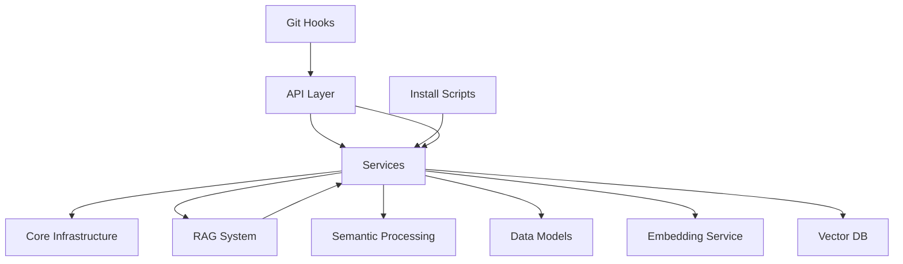
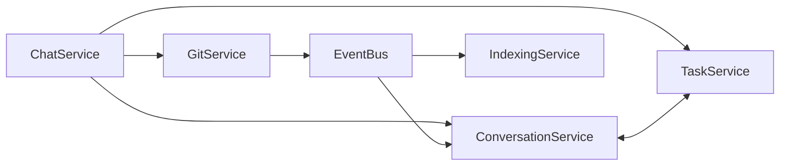

# 🔗 Integración del Módulo Services

## Quién Usa Services

### API Layer
El módulo API es el principal consumidor de Services:

#### `/v1/chat/completions` → ChatService
```python
# En api/openai.py
async def chat_completions(request: ChatCompletionRequest):
    # Procesa el mensaje usando ChatService
    result = await chat_service.process_message(
        message=request.messages[-1].content,
        session_id=session_id,
        debug=request.debug
    )
```

#### `/api/index/*` → IndexingService  
```python
# En api/index.py (futuro)
async def index_git_changes(request: GitChangeRequest):
    # Indexa archivos modificados
    result = await indexing_service.index_files(
        files=request.files,
        trigger=request.trigger,
        task_id=request.task_id
    )
```

#### `/api/dream/*` → Múltiples Services
```python
# Dream usa servicios para obtener contexto
context = await conversation_service.get_session_context(session_id)
task_info = await task_service.get_task_full_context(task_id)
recent_changes = await git_service.detect_changes_from_others()
```

### Scripts de Instalación
Los scripts de instalación usan Services directamente:

```python
# scripts/install.py
async def initial_indexing():
    indexing_service = IndexingService()
    
    # Indexación inicial del proyecto
    all_files = find_project_files()
    await indexing_service.index_files(
        files=all_files,
        trigger="installation"
    )
```

### Git Hooks
Los git hooks notifican a Services sobre cambios:

```bash
#!/bin/bash
# .git/hooks/post-commit
curl -X POST http://localhost:8000/api/index/git-changes \
  -H "Content-Type: application/json" \
  -d '{"files": ["file1.py", "file2.py"], "trigger": "commit"}'
```

### RAG Components
HybridSearch se comunica con ConversationService para invalidación:

```python
# rag/retrieval/hybrid_search.py
# Cuando ConversationService invalida cache
conversation_service._handle_cache_invalidation()
# Propaga a HybridSearch
hybrid_search.invalidate_cache(pattern="*auth.py*")
```

## Qué Módulos Usa Services

### Core - Infraestructura Base

#### DatabaseManager
```python
from acolyte.core.database import DatabaseManager

# Todos los servicios usan para persistencia
self.db = DatabaseManager()
await self.db.execute("INSERT INTO conversations...")
```

#### OllamaClient
```python
from acolyte.core.ollama import OllamaClient

# ChatService para generación
response = await self.ollama.generate(
    system_prompt=system_prompt,
    user_message=message
)
```

#### EventBus y Eventos
```python
from acolyte.core.events import EventBus, CacheInvalidateEvent, ProgressEvent

# GitService publica eventos
await event_bus.publish(CacheInvalidateEvent(...))

# ConversationService se suscribe
event_bus.subscribe(EventType.CACHE_INVALIDATE, self._handle_cache_invalidation)
```

#### MetricsCollector
```python
from acolyte.core.tracing import MetricsCollector

# IMPORTANTE: MetricsCollector NO acepta namespace (Decisión #38)
# ✅ CORRECTO - namespace en el nombre de la métrica
self.metrics = MetricsCollector()
self.metrics.increment("services.conversation.sessions_created")
self.metrics.record("services.conversation.summary_time_ms", elapsed_ms)

# ❌ INCORRECTO - NO usar namespace en constructor
# self.metrics = MetricsCollector(namespace="conversation")
```

#### IDGenerator
```python
from acolyte.core.id_generator import generate_id

# Generación consistente de IDs
session_id = generate_id()  # hex32 format
```

#### Exceptions
```python
from acolyte.core.exceptions import (
    DatabaseError, NotFoundError, ValidationError,
    ExternalServiceError, is_retryable
)

# Manejo consistente de errores
if is_retryable(error):
    # retry logic
```

### RAG - Sistema de Conocimiento

#### HybridSearch
```python
from acolyte.rag.retrieval import HybridSearch

# ConversationService para búsquedas
results = await self.hybrid_search.search(
    query=query,
    filters={"session_id": {"$ne": current_session_id}}
)
```

#### ContextualCompressor
```python
from acolyte.rag.compression import ContextualCompressor

# ChatService para queries específicos
# Nota: Se inicializa con SmartTokenCounter para conteo preciso
self.compressor = ContextualCompressor(self.token_counter)

# Uso en proceso de mensajes
if distribution.type in ["simple", "generation"] and self.compressor:
    chunks = await self.hybrid_search.search_with_compression(
        query=message, limit=10, token_budget=available_tokens
    )
```

#### AdaptiveChunker
```python
from acolyte.rag.chunking.adaptive import AdaptiveChunker

# IndexingService cuando disponible
if self.adaptive_chunker:
    chunks = await self.adaptive_chunker.chunk_file(file_path)
else:
    chunks = self._simple_chunking(content)
```

### Semantic - Procesamiento NLP

#### Todos los componentes
```python
from acolyte.semantic import (
    Summarizer, PromptBuilder, TaskDetector,
    QueryAnalyzer, DecisionDetector, ReferenceResolver
)

# ChatService usa todo el módulo
summary = await self.summarizer.generate_summary(...)
prompt = await self.prompt_builder.build_dynamic_context(...)
task_detection = await self.task_detector.detect_task_context(...)
```

### Models - Estructuras de Datos

#### Modelos de dominio
```python
from acolyte.models import (
    Conversation, TaskCheckpoint, TechnicalDecision,
    Chunk, ChunkType, ConversationSearchRequest
)

# Todos los servicios usan modelos tipados
conversation = Conversation(
    session_id=session_id,
    content=initial_summary
)
```

### Embeddings - Vectorización

#### EmbeddingService
```python
from acolyte.embeddings import EmbeddingService

# IndexingService para generar vectores
embedding = await self.embedding_service.encode(chunk.content)
```

### Weaviate - Base Vectorial

```python
import weaviate

# ConversationService e IndexingService
self.weaviate_client = weaviate.Client(url=weaviate_url)
self.weaviate_client.data_object.create(
    class_name="CodeChunk",
    data_object=data,
    vector=embedding
)
```

## Diagramas de Integración

### Flujo de Dependencias



### Comunicación Entre Services



## Contratos de Interfaz

### ChatService acepta dependencias externas

```python
class ChatService:
    def __init__(self,
        conversation_service: Optional[ConversationService] = None,
        task_service: Optional[TaskService] = None,
        semantic_analyzer: Optional[Any] = None,
        rag_service: Optional[Any] = None,
        git_service: Optional[GitService] = None):
        # Permite inyección para evitar imports circulares
```

### Eventos publicados por GitService

```python
CacheInvalidateEvent:
    source: str = "git_service"
    target_service: Union[str, List[str]] = ["conversation", "indexing"]
    key_pattern: str = "*modified_file.py*"
    reason: str = "Changes detected after pull"
```

### Progress events de IndexingService

```python
ProgressEvent:
    source: str = "indexing_service"
    operation: str = "indexing_files"
    current: int = 10
    total: int = 100
    message: str = "Processing file.py"
    task_id: Optional[str] = "task-123"
```

## Puntos de Extensión

### Añadir nuevo servicio

1. Crear archivo en `services/`
2. Heredar patrones existentes (métricas, config, errores)
3. Exportar en `__init__.py`
4. Integrar con EventBus si necesita coordinación

### Extender servicio existente

1. Añadir método siguiendo convenciones
2. Registrar métricas nuevas
3. Documentar en MODULE_DOC.md
4. Añadir tests correspondientes

### Integrar con nuevo módulo externo

1. Añadir import opcional con fallback
2. Verificar disponibilidad antes de usar
3. Degradación graceful si no disponible
4. Documentar en dependencias

## Configuración Compartida

Todos los servicios leen de `.acolyte`:

```yaml
# Límites operacionales
limits:
  max_related_sessions: 10
  batch_size: 20
  concurrent_workers: 4

# Configuración de servicios
services:
  conversation:
    max_summary_turns: 4
  indexing:
    max_file_size_mb: 10
  git:
    cache_ttl_seconds: 300
```

## Testing de Integración

```python
# tests/integration/test_services_integration.py
async def test_full_chat_flow():
    # Configurar servicios
    conv_service = ConversationService()
    task_service = TaskService()
    chat_service = ChatService(
        conversation_service=conv_service,
        task_service=task_service
    )
    
    # Ejecutar flujo completo
    response = await chat_service.process_message(
        "Implementar autenticación JWT"
    )
    
    # Verificar integración
    assert response["session_id"]
    assert await task_service.find_active_task()
    assert await conv_service.get_last_session()
```

## Mejores Prácticas de Integración

1. **Inyección de dependencias**: Usar para evitar imports circulares
2. **Eventos para coordinación**: No acoplar servicios directamente
3. **Fallback graceful**: Continuar si falla componente opcional
4. **Métricas en fronteras**: Medir en puntos de integración
5. **Logging contextual**: Incluir IDs de sesión/tarea en logs
6. **Validación en entrada**: Verificar datos en límites del módulo
