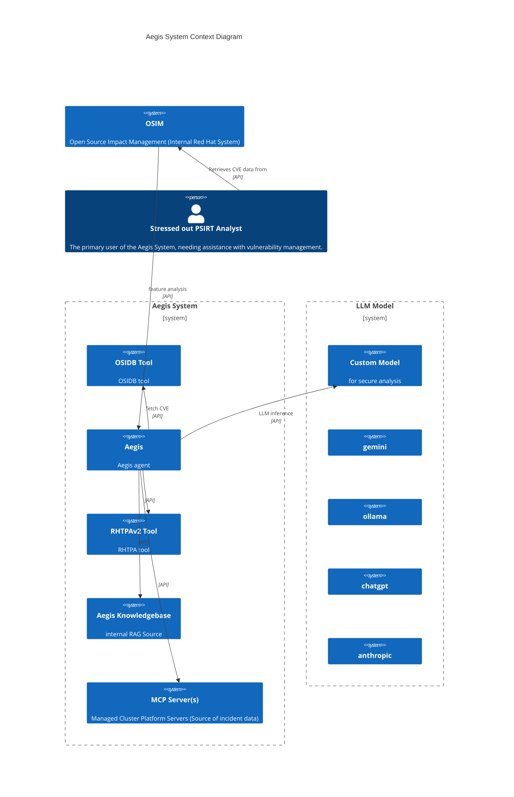

#  Aegis-AI - Red Hat Product Security Agent

[](https://github.com/RedHatProductSecurity/aegis/actions/workflows/tests.yml)

**Note: As Aegis is an agent - be careful of which LLM model you use ... if you want to integrate with OSIDB/RHTPA, you MUST use a secure model**

## Overview

**Aegis enables security teams to leverage the latest Generative AI models for enhanced security analysis.** Integrate your preferred LLM (ChatGPT, Anthropic, Gemini, or even a local model) to quickly perform deep security analysis on critical artifacts like **CVEs, advisories, and more**.

Aegis helps by:

* **Accelerate Analysis:** Insights into complex security data.
* **Improve Accuracy:** Augment LLM capabilities with in-context security information.
* **Enhance Efficiency:** Automate repetitive analysis tasks, working on security entities (ex. CVE) to focus on higher-value work.

---

## Features
Aegis features address common product security needs:

### CVE Analysis
* **Suggest Impact:** Get an in context LLM-driven suggestion for a CVE's overall impact.
* **Suggest CWE:** Get an in context LLM-driven Common Weakness Enumeration (CWE) mappings for CVE.
* **Suggest CVSS:** Get an in context LLM-driven Common Vulnerability Scoring System (CVSS) score.
* **Identify PII:** Automatically detect and flag Personally Identifiable Information within security texts.
* **Rewrite Security Text:** Rephrase or refine security advisories and descriptions for clarity or specific audiences.
* **CVSS Diff Explainer:** Understand  differences between Red Hat and NVD CVSS scores with AI-generated explanations.

### Component Intelligence
* **Component Intelligence:** Generate a component information 'card'.

## Context
Feature analysis requires 'context' beyond that contained by any specific LLM model. 

We provide 'out of the box' integrations providing security context with the following:

* [OSIDB](https://github.com/RedHatProductSecurity/osidb) 
* [RHTPAv2](https://github.com/trustification/trustify)

which perform lookups on security entities (ex. CVE).

Aegis can also be an [MCP](https://modelcontextprotocol.io/introduction) client to integrate (providing further tooling/context)
with any compliant MCP servers.

---

## Quick Start
**Note**: Eventually we will have a proper package on pypi.

First ensure `Aegis` can use any required ca certs:
```commandline
REQUESTS_CA_BUNDLE="/etc/pki/tls/certs/ca-bundle.crt"
```

### Connecting to LLMs

Aegis allows you to connect to various LLM providers, from your own custom LLM models to cloud LLM services and MaaS.

**Using Aegis with Gemini:**
Connect to Gemini (replace `YOUR_GEMINI_API_KEY` with your actual key):

```bash
AEGIS_LLM_HOST="https://generativelanguage.googleapis.com"
AEGIS_LLM_MODEL="gemini-2.5-pro"
GEMINI_API_KEY="YOUR_GEMINI_API_KEY"
````

**Using Aegis with Anthropic:**
Connect to Anthropic's powerful Claude models (replace `YOUR_ANTHROPIC_API_KEY` with your actual key):

```bash
export AEGIS_LLM_HOST="https://api.anthropic.com"
export AEGIS_LLM_MODEL="anthropic:claude-3-5-sonnet-latest"
export ANTHROPIC_API_KEY="YOUR_ANTHROPIC_API_KEY"
```

**Using Aegis with Local Ollama:**
Configure Aegis to use a locally running Ollama instance:

```bash
export AEGIS_LLM_HOST=http://localhost:11434
export AEGIS_LLM_MODEL=llama3.2:3b
# Ensure Ollama is running and 'llama3.2:3b' model is pulled
```

**Note:** For other LLM providers (e.g., OpenAI), similar environment variables will have to set. Refer to the `DEVELOP.md` for environment var information.

Be aware that `Aegis` is an agent (which autonomously invokes tools) so any LLM model you use must be secure/trusted.

### Setting up Aegis Tools

Aegis provides a few 'out of the box' tools that the agent can use to enhance LLM query context.

#### Tavily Search engine
Integration with Tavily is achieved via built in pydantic-ai support
```bash
export TAVILY_API_KEY="tvly-dev-XXXXXX"
```

#### OSIDB
Integration with OSIDB is achieved via [osidb-bindings](https://github.com/RedHatProductSecurity/osidb-bindings), set
OSIDB server url for Aegis with:
```bash
export AEGIS_OSIDB_SERVER_URL="https://osidb.prodsec.redhat.com"
```

Uses kerberos built in auth with `osidb-bindings`.

#### RHTPA
TBA

### Setting up the RAG knowledgebase
To run a local postgres with pgvector - which is used for additional RAG context.
```commandline
cd etc/deploy && podman-compose up --build
```

Once this is running it will be consulted by the Agent for additional context.

---

## Using Aegis Features
`Aegis` features can be invoked programmatically via Python, through its built-in Command-Line Interface (CLI), or exposed via a REST API.

### Command-Line Interface (CLI)
Run features directly from your terminal using the CLI:

```bash
uv run aegis suggest-impact "CVE-2025-5399"
```

### Programmatic Usage (Python)
First install required dependencies:

```commandline
uv sync 
```

The following programmatically invokes the `SuggestImpact` feature:

```python
import asyncio
from aegis_ai.agents import rh_feature_agent
from aegis_ai.features import cve


async def main():
    feature = cve.SuggestImpact(rh_feature_agent)
    result = await feature.exec("CVE-2025-0725")
    print(result.output.model_dump_json(indent=2))


if __name__ == "__main__":
    asyncio.run(main())
```

Which produces JSON output:

```
{
  "confidence": 0.95,
  "completeness": 1.0,
  "consistency": 0.95,
  "tools_used": [
    "osidb_tool"
  ],
  "cve_id": "CVE-2025-0725",
  "title": "Buffer Overflow in libcurl via zlib Integer Overflow",
  "components": [
    "libcurl",
    "zlib"
  ],
  "affected_products": [
    "Ansible Services",
    "Hosted OpenShift",
    "cloud.redhat.com"
  ],
  "explanation": "The vulnerability is a buffer overflow in libcurl, contingent on the use of a very old version of 
zlib (1.2.0.3 or older) for gzip decompression. The official Red Hat statement clarifies that this issue is not 
applicable to any supported version of Red Hat Enterprise Linux (RHEL), as the vulnerable code is not present. The Red 
Hat assigned CVSS vector indicates a localized attack vector with a low impact on availability, further reducing the 
risk.\n\nWhile some components within 'Ansible Services', 'Hosted OpenShift', and 'cloud.redhat.com' are technically 
affected, the core enterprise products are secure. Given that the vulnerability is absent from RHEL and its 
exploitation depends on an outdated library, the overall impact on the Red Hat ecosystem is minimal.",
  "impact": "LOW",
  "cvss3_score": "3.3",
  "cvss3_vector": "CVSS:3.1/AV:L/AC:L/PR:N/UI:N/S:U/C:N/I:N/A:L",
  "cvss4_score": "4.5",
  "cvss4_vector": "CVSS:4.0/AV:L/AC:L/AT:N/PR:N/UI:N/VC:N/VI:N/VA:L/SC:N/SI:N/SA:N"
}
```

Note - Many features, like `SuggestImpact`, access OSIDB server so you will need to be kinited in with appropriate access rights.

### REST API Server
You can also accesss the example `fastapi` based REST API server:

```bash
uv run uvicorn src.aegis_restapi.main:app --port 9000
```
Once running - interact with the API via HTTP - for example: `http://localhost:9000/api/v1/cve/suggest/impact/CVE-2025-0725`). 

---
## System Overview
System context diagram for Aegis.



## Features

### Rewrite Description

```commandline
aegis rewrite-description cve-2025-0725
```
or 

```
GET api/v2/cve/rewrite/description/CVE-2025-0725
```

```
{
  "cve_id": "CVE-2025-0725",
  "original_title": "Buffer Overflow in libcurl via zlib Integer Overflow",
  "original_description": [
    "A flaw was found in libcurl. This vulnerability allows an attacker to trigger a buffer overflow via an integer
overflow in zlib 1.2.0.3 or older when libcurl performs automatic gzip decompression."
  ],
  "components": [
    "libcurl"
  ],
  "explanation": "The original description needed improvement in several areas:\n\n1. Clarity: While it mentioned the
core issue, it could be more precise about the attack vector\n2. Technical accuracy: The description combines multiple
vulnerability types (integer overflow leading to buffer overflow) which could be clearer\n3. Impact: The security
impact could be more explicitly stated\n4. Attack vector: The trigger condition (CURLOPT_ACCEPT_ENCODING) was missing
from the description\n\nThe rewritten description:\n- Clearly states the vulnerable component\n- Specifies the exact
trigger condition\n- Maintains professional tone\n- Follows the required format\n- Removes version-specific
information\n- More precisely describes the attack vector\n\nThe rewritten title is more concise while maintaining
clarity about the vulnerability type.",
  "confidence": 0.95,
  "rewritten_description": "A flaw was found in libcurl's HTTP response decompression handling. This vulnerability
allows remote attackers to trigger a buffer overflow via specially crafted HTTP responses when automatic gzip
decompression is enabled.",
  "rewritten_title": "libcurl HTTP Decompression Buffer Overflow"
}
```

### Rewrite Statement

```commandline
aegis rewrite-description cve-2025-0725
```
or
```
GET api/v2/cve/rewrite/statement/CVE-2025-0725
```

```
{
  "cve_id": "CVE-2025-0725",
  "title": "Buffer Overflow in libcurl via zlib Integer Overflow",
  "components": [
    "libcurl"
  ],
  "original_statement": [
    "This CVE is not applicable to any supported version of Red Hat Enterprise Linux since RHEL-4."
  ],
  "explanation": "The original statement only indicates non-applicability without providing any context about the
vulnerability. The rewritten statement improves upon this by:\n\n1. Clearly stating the vulnerability type (buffer
overflow)\n2. Identifying the specific trigger condition (gzip decompression)\n3. Specifying the affected component
(libcurl) and its interaction with zlib\n4. Including version information for context\n5. Maintaining Red Hat's
perspective while providing more technical detail\n6. Adding the attack vector information (HTTP responses)",
  "confidence": 0.95,
  "statement": "A buffer overflow vulnerability was identified in libcurl when processing HTTP responses with
automatic gzip decompression enabled via CURLOPT_ACCEPT_ENCODING. The flaw occurs due to an integer overflow in zlib
versions 1.2.0.3 and older, which could be exploited by an attacker through specially crafted HTTP responses. This
vulnerability is not applicable to supported versions of Red Hat Enterprise Linux as they use newer versions of zlib."
}
```

### Suggest Impact

```commandline
aegis suggest-impact CVE-2025-0725
```
or 
```
GET api/v2/cve/suggest/impact/CVE-2025-0725
```
```
{
  "cve_id": "CVE-2025-0725",
  "title": "Buffer Overflow in libcurl via zlib Integer Overflow",
  "components": [
    "libcurl",
    "curl",
    "davix",
    "netshoot",
    "mingw-curl",
    "s390utils"
  ],
  "products": [
    "Red Hat Enterprise Linux",
    "OpenShift Container Platform",
    "Red Hat JBoss Core Services",
    "Red Hat In-Vehicle OS",
    "Confidential Compute Attestation",
    "Ansible Services",
    "Hosted OpenShift"
  ],
  "explanation": "Based on careful analysis of the CVE:\n\n1. The vulnerability requires specific conditions:\n   - 
Affects libcurl when using automatic gzip decompression\n   - Only impacts zlib 1.2.0.3 or older\n   - Red Hat 
statement indicates not applicable to RHEL-4 and later versions\n\n2. Attack Vector Analysis:\n   - Local access 
required per Red Hat CVSS (AV:L)\n   - Limited impact on availability only (no integrity/confidentiality impact)\n   -
No privilege escalation or arbitrary code execution indicated\n\n3. Product Impact:\n   - While many products are 
listed as affected, the core vulnerability is not exploitable in supported Red Hat Enterprise Linux versions\n   - 
Community projects (Fedora, EPEL) may be affected but are not officially supported products\n   - Container-based 
products inherit the base RHEL security\n\n4. Mitigating Factors:\n   - Requires local access\n   - Limited to 
availability impact\n   - Modern zlib versions are not affected\n   - Core RHEL platforms are protected\n\nGiven these
factors, particularly the local access requirement and limited availability impact, combined with the statement about 
RHEL version applicability, a LOW impact rating is appropriate.",
  "confidence": 0.85,
  "impact": "LOW",
  "cvss3_score": "3.3",
  "cvss3_vector": "CVSS:3.1/AV:L/AC:L/PR:N/UI:N/S:U/C:N/I:N/A:L",
  "cvss4_score": "3.1",
  "cvss4_vector": "CVSS:4.0/AV:L/AC:L/AT:N/PR:N/UI:N/VC:N/VI:N/VA:L/SC:N/SI:N/SA:N"
}
```

### Suggest CWE

```commandline
aegis suggest-cwe cve-2025-0725
```
or
```commandline
GET api/v2/cve/suggest/cwe/CVE-2025-0725

```

```
{
  "cve_id": "CVE-2025-0725",
  "title": "Buffer Overflow in libcurl via zlib Integer Overflow",
  "components": [
    "libcurl"
  ],
  "explanation": "Based on the CVE description and title, this vulnerability involves multiple related 
weaknesses:\n\n1. CWE-190 (Integer Overflow): The primary trigger is an integer overflow condition in zlib when 
processing gzip-compressed HTTP responses.\n\n2. CWE-119 (Buffer Overflow): The integer overflow leads to a buffer 
overflow condition in libcurl during decompression.\n\nThe vulnerability chain is clear: an attacker can trigger an 
integer overflow in older versions of zlib (1.2.0.3 or earlier) when libcurl performs automatic gzip decompression, 
which then results in a buffer overflow. The integer overflow serves as the initial weakness that leads to the buffer 
overflow condition.\n\nThe high confidence score (0.95) is based on the explicit description of both the integer 
overflow and buffer overflow conditions in the CVE details, along with the clear explanation of the vulnerability 
chain.",
  "confidence": 0.95,
  "cwe": [
    "CWE-190",
    "CWE-119"
  ]
}
```

### Identify PII

```commandline
aegis identify-pii cve-2025-0725
```
or
```
GET api/v2/cve/identify/pii/CVE-2025-0725
```

```
{
  "cve_id": "CVE-2025-0725",
  "title": "Buffer Overflow in libcurl via zlib Integer Overflow",
  "components": [
    "libcurl"
  ],
  "explanation": "",
  "confidence": 1.0,
  "contains_PII": false
}
```

### Explain CVSS diff

```commandline
aegis cvss-diff cve-2025-0725
```
or
```
GET api/v2/cve/explain_cvss_diff/CVE-2025-0725
```

```
{
  "cve_id": "CVE-2025-0725",
  "title": "Buffer Overflow in libcurl via zlib Integer Overflow",
  "redhat_cvss_score": "0.0",
  "nvd_cvss_score": "7.5",
  "components": [
    "libcurl"
  ],
  "explanation": "The significant difference between Red Hat's CVSS score (0.0) and NVD's score (7.5) is due to Red
Hat's determination that this vulnerability is not applicable to any supported versions of Red Hat Enterprise Linux
since RHEL-4. The vulnerability only affects systems using zlib 1.2.0.3 or older, which is not present in supported
Red Hat products. NVD's higher score reflects the potential impact of the vulnerability in general, without
considering specific vendor implementations or version constraints. Red Hat's score accurately reflects the actual
risk to their supported products, which is effectively zero since the vulnerable component versions are not present in
their ecosystem.",
  "confidence": 0.95,
  "redhat_statement": "This CVE is not applicable to any supported version of Red Hat Enterprise Linux since RHEL-4."
}
```

### Component Intelligence

```commandline
aegis component-intelligence "libcap"
```
or
```
GET api/v2/component/intelligence/libcap
```

```
{
  "component_name": "libcap",
  "component_latest_version": "2.69",
  "component_purl": "pkg:rpm/redhat/libcap@2.69?arch=x86_64",
  "website_url": "https://sites.google.com/site/fullycapable/",
  "repo_url": "https://git.kernel.org/pub/scm/libs/libcap/libcap.git",
  "popularity_score": 2,
  "stability_score": 2,
  "recent_news": "- January 2024: libcap 2.69 released with minor improvements and bug fixes\n- October 2023: 
Integration with newer kernel capabilities\n- Security patches addressing potential privilege escalation issues in 
2023",
  "active_contributors": "- Andrew G. Morgan (Google) - Primary maintainer\n- Serge Hallyn (Cisco) - Major 
contributor\n- Christian Kastner (Debian) - Regular contributor\n- James Morris (Red Hat) - Kernel capabilities 
maintainer",
  "security_information": "- Total CVEs: 4 historically reported\n- Known exploits: 1 (privilege escalation, 
patched)\n- Critical security focus on capability handling and privilege management\n- Regular security audits due to 
its role in Linux security\n- Included in Red Hat Enterprise Linux security framework\n- No PII data exposure in CVE 
records",
  "further_learning": "- Official documentation: https://sites.google.com/site/fullycapable/\n- Linux capabilities 
manual: https://man7.org/linux/man-pages/man7/capabilities.7.html\n- Red Hat Enterprise Linux Security Guide: 
https://access.redhat.com/documentation/en-us/red_hat_enterprise_linux/9/html/security_hardening/index\n- Kernel.org 
documentation: https://www.kernel.org/doc/html/latest/admin-guide/capabilities.html",
  "explanation": "Libcap is a fundamental Linux library that implements POSIX capabilities, crucial for fine-grained 
privilege control in Linux systems. As a core security component in Red Hat Enterprise Linux and other major 
distributions, it maintains high stability and popularity scores. The project shows consistent maintenance, regular 
updates, and strong security practices. The analysis confidence is high due to the project's public nature, 
well-documented history, and clear maintenance patterns.",
  "confidence": 0.95
}
```
