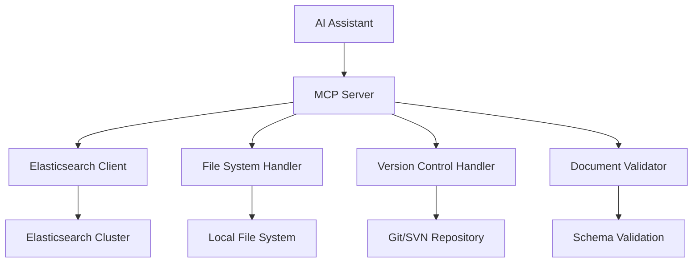

# Agent Knowledge MCP 🔍

**The complete knowledge management solution**  
Powerful Model Context Protocol server for Elasticsearch integration with comprehensive file management and version control.

[](https://python.org)
[](https://modelcontextprotocol.io)
[](https://opensource.org/licenses/MIT)
[](https://coff.ee/itshare4u)
[](https://github.com/sponsors/itshare4u)

## 🚀 What is Agent Knowledge MCP?

The most comprehensive MCP server that transforms your AI assistant into a powerful knowledge management system. **The key advantage? It combines everything you need**—Elasticsearch search, file operations, document validation, and version control in one unified solution.

**🔑 Complete Knowledge Management:**
- ✅ **Elasticsearch Integration**: Full-featured search, indexing, and document management
- ✅ **File System Control**: Comprehensive file operations with cross-platform support
- ✅ **Document Validation**: Schema-enforced document structure with strict validation modes
- ✅ **Configuration Management**: Complete config control with validation and reloading
- ✅ **Version Control**: Git and SVN support with intelligent file tracking
- ✅ **Security First**: Sandboxed operations with configurable restrictions
- ✅ **Production Ready**: Battle-tested with comprehensive error handling

**✨ Key Benefits:**
- 🎯 **34 Powerful Tools**: Everything from search to version control and config management with strict schema validation
- 🔄 **Universal AI Support**: Works with Claude, ChatGPT, Cursor, and any MCP-compatible AI
- 📊 **Smart Document Management**: Auto-validation, templates, and structured data with configurable strict schema control
- 🛡️ **Enterprise Security**: Path validation, access controls, and audit trails
- ⚡ **Zero Dependencies**: Optional Elasticsearch - works standalone for file operations

## 🌐 AI Assistant Support

Works with **any MCP-compatible AI assistant**:
- ✅ **Claude Desktop**
- ✅ **ChatGPT Plus** (with MCP support)
- ✅ **Cursor IDE**
- ✅ **Windsurf**
- ✅ **VS Code** (with MCP extension)
- ✅ **Any MCP client**

Perfect for **developers** who want to automate knowledge management and **teams** who need structured document workflows!

## 🎬 What You Can Do

**Real workflows you can try today:**

### 📚 Knowledge Management
- **"Search all documents for information about API authentication and create a comprehensive guide"**
- **"Index this technical document with proper categorization and tags"**
- **"Find all documents related to deployment and generate a deployment checklist"**
- **"Create a new document template for API documentation with required fields"**

### 📁 File Operations & Organization
- **"Organize all markdown files by category and move them to appropriate directories"**
- **"Read all configuration files and create a settings summary document"**
- **"Find duplicate files in the project and list them for cleanup"**
- **"Create a project structure document listing all important files"**

### 🔄 Version Control & History
- **"Setup Git repository for this knowledge base and commit all current documents"**
- **"Check what changes were made to the user manual in the last version"**
- **"Commit these updated API docs with a descriptive message"**
- **"Show me the previous version of this configuration file"**

### 🤖 Development & Documentation
- **"Index all code documentation and make it searchable"**
- **"Create a changelog from Git commit history"**
- **"Validate all documents follow our schema requirements"**
- **"Generate project documentation from README files"**

### 🔍 Configuration & Schema Management
- **"Update configuration to enable strict schema validation for all documents"**
- **"Show me the current configuration settings and validation rules"**
- **"Validate this configuration before applying it to prevent errors"**
- **"Disable extra fields in documents to enforce strict schema compliance"**
### 🔍 Advanced Search & Analysis
- **"Search across all documents and files for security-related information"**
- **"Find all TODO comments in code files and create a task list"**
- **"Analyze document metadata and generate a content report"**
- **"Search for outdated information and flag it for review"**

## ☕ Support This Project

If you find this MCP server useful, consider supporting its development:

[](https://coff.ee/itshare4u)
[](https://github.com/sponsors/itshare4u)
[](https://paypal.me/itshare4u)
[](https://ko-fi.com/itshare4u)

### 💝 Why Support?
- 🚀 **Faster development** of new features and improvements
- 🐛 **Priority bug fixes** and technical support
- 📚 **Better documentation** and comprehensive tutorials
- 🎯 **Community-requested features** implementation
- 🛡️ **Enhanced security** and stability updates
- 🌟 **Long-term project sustainability**

### 🎁 Sponsor Benefits
| Tier | Amount | Benefits |
|------|--------|----------|
| ☕ **Coffee** | $5 | Thank you mention in README + priority issue responses |
| 🚀 **Supporter** | $15 | Feature request consideration + early access to updates |
| 💎 **Sponsor** | $30 | Logo in README + special recognition in releases |
| 🌟 **Gold Sponsor** | $50+ | Custom benefits discussion + direct communication channel |

**Every contribution helps maintain and improve this open-source project! 🙏**

## ⚡ Quick Start

### 1. Installation
```bash
# Install with uvx (recommended)
uvx agent-knowledge-mcp
```

### 2. Configuration
```bash
# Copy and edit configuration
cp src/config.json.example src/config.json
nano src/config.json
```

### 3. Connect to Your AI Assistant

**Claude Desktop** - Add to `claude_desktop_config.json`:
```json
{
  "mcpServers": {
    "agent-knowledge": {
      "command": "uvx",
      "args": ["agent-knowledge-mcp"]
    }
  }
}
```

**VS Code** - Quick install buttons:

[](https://insiders.vscode.dev/redirect/mcp/install?name=agent-knowledge&inputs=%5B%5D&config=%7B%22command%22%3A%22uvx%22%2C%22args%22%3A%5B%22agent-knowledge-mcp%22%5D%7D) [](https://insiders.vscode.dev/redirect/mcp/install?name=agent-knowledge&inputs=%5B%5D&config=%7B%22command%22%3A%22uvx%22%2C%22args%22%3A%5B%22agent-knowledge-mcp%22%5D%7D&quality=insiders)

**Other AI Assistants** - Add similar configuration:
```json
{
  "mcp.servers": {
    "agent-knowledge": {
      "command": "uvx",
      "args": ["agent-knowledge-mcp"]
    }
  }
}
```

*Note: The server has built-in update mechanisms accessible through admin tools.*

## ️ Capabilities

Agent Knowledge MCP provides **34 powerful tools** across 4 categories:

### 🔍 Elasticsearch Operations (9 tools)
- **Smart Search** - Multi-field queries with boosting and relevance scoring
- **Document Management** - Index, retrieve, update, delete with validation
- **Index Administration** - Create, configure, manage Elasticsearch indices
- **Schema Validation** - Enforce document structure and data types
- **Template Generation** - Auto-create document templates with required fields

### 📁 File System Management (11 tools)  
- **File Operations** - Read, write, append, delete, move, copy with safety checks
- **Directory Management** - Create, list, navigate directory structures
- **Path Intelligence** - Relative/absolute path conversion and validation
- **File Discovery** - Search files by name, content, or metadata
- **Cross-Platform** - Windows, macOS, Linux compatibility

### 🎛️ System Administration (11 tools)
- **Configuration Management** - Complete config viewing, modification, and validation with strict schema controls
- **Security Controls** - Access restrictions and path validation
- **Health Monitoring** - System status and Elasticsearch connectivity
- **Auto-Setup** - Intelligent Elasticsearch configuration
- **Environment Management** - Directory permissions and structure
- **Strict Schema Control** - Configurable document validation to prevent unauthorized field additions
- **Server Management** - Check status, upgrade MCP server

### 🔄 Version Control (3 tools)
- **Repository Setup** - Git/SVN initialization with best practices
- **File Tracking** - Intelligent commit with change detection
- **History Access** - Retrieve any previous version of files
- **Multi-VCS** - Support for both Git and SVN workflows

## 💬 Example Prompts to Try

Once everything is set up, try asking your AI:

**Knowledge Discovery:**
> *"Search all indexed documents for information about user authentication and summarize the key points"*

**Document Creation:**
> *"Create a new API documentation template and index it with proper categorization"*

**File Management:**
> *"Find all configuration files in the project and create a backup in the configs directory"*

**Version Control:**
> *"Setup version control for this knowledge base and commit all current documents with proper organization"*

**Content Analysis:**
> *"Analyze all markdown files for outdated information and create a list of files that need updates"*

**Project Documentation:**
> *"Read all README files in subdirectories and create a comprehensive project overview document"*



**Modern, Modular Design:**
1. **MCP Protocol** - Standard communication with AI assistants
2. **Elasticsearch Integration** - Full-featured search and indexing
3. **File System Safety** - Sandboxed operations with validation
4. **Version Control** - Git/SVN support with intelligent workflows
5. **Document Validation** - Schema enforcement and template generation

## 🔒 Security & Privacy

**Enterprise-grade security**:
- ✅ **Sandboxed Operations** - All file operations restricted to configured directories
- ✅ **Path Validation** - Prevent directory traversal and unauthorized access
- ✅ **Access Controls** - Configurable permissions and restrictions
- ✅ **Audit Trails** - Full logging of operations and changes
- ✅ **No Cloud Dependencies** - Everything runs locally

**Configuration Example:**
```json
{
  "security": {
    "allowed_base_directory": "/your/safe/directory",
    "restrict_file_operations": true,
    "log_all_operations": true
  }
}
```

## 🛡️ Strict Schema Validation

**NEW: Configurable strict schema validation to prevent unwanted data corruption:**

```json
{
  "document_validation": {
    "strict_schema_validation": true,
    "allow_extra_fields": false,
    "required_fields_only": false,
    "auto_correct_paths": true
  }
}
```

**Features:**
- ✅ **Strict Mode** - Reject documents with extra fields beyond the schema
- ✅ **Flexible Control** - Enable/disable validation per use case
- ✅ **Schema Compliance** - Ensure all documents follow defined structure
- ✅ **Clear Error Messages** - Detailed validation feedback with examples
- ✅ **Backward Compatibility** - Works with existing documents

**Benefits:**
- 🛡️ **Data Integrity** - Prevent agents from adding arbitrary fields
- 📊 **Consistent Structure** - Maintain clean, predictable document schemas
- 🔧 **Easy Management** - Toggle validation modes through configuration
- 🚀 **Production Ready** - Ideal for enterprise knowledge management

**Example validation error:**
```
❌ Document validation failed!
Extra fields not allowed in strict mode: custom_field, extra_data
Allowed fields: id, title, summary, file_path, priority, tags, source_type
```

## 📊 Tool Reference

| Category | Count | Tools |
|----------|-------|-------|
| **Elasticsearch** | 9 | search, index_document, create_index, get_document, delete_document, list_indices, delete_index, validate_document_schema, create_document_template |
| **File System** | 11 | read_file, write_file, append_file, delete_file, move_file, copy_file, list_directory, create_directory, delete_directory, file_info, search_files |
| **Administration** | 11 | get_config, update_config, validate_config, get_allowed_directory, set_allowed_directory, reload_config, setup_elasticsearch, elasticsearch_status, server_status, server_upgrade, server_uninstall |
| **Version Control** | 3 | setup_version_control, commit_file, get_previous_file_version |

**Total: 34 tools** for comprehensive knowledge management!

**Quality Assurance:**
- ✅ **Unit Tests** - All core functionality tested
- ✅ **Integration Tests** - End-to-end workflow validation
- ✅ **Error Handling** - Comprehensive error scenarios covered
- ✅ **Cross-Platform** - Tested on Windows, macOS, Linux

## 🤝 Contributing

Love to have your help making Agent Knowledge MCP even better!

### Quick Development Setup
```bash
git clone https://github.com/yourusername/AgentKnowledgeMCP.git
cd AgentKnowledgeMCP

# Install dependencies
pip install -r requirements.txt

# Run tests
python3 test_file_paths.py

# Start development server
python3 src/server.py
```

### Ways to Contribute
- 🐛 **Report bugs** via [GitHub Issues](https://github.com/yourusername/AgentKnowledgeMCP/issues)
- 💡 **Suggest features** for new tools or capabilities
- 🔧 **Add new tools** or improve existing ones
- 📖 **Improve documentation** and examples
- 🧪 **Test with different AI assistants** and share results

### Development Guidelines
- **Modular Design** - Each tool category in separate handlers
- **Comprehensive Testing** - Test all new functionality
- **Security First** - Validate all inputs and file operations
- **Cross-Platform** - Ensure compatibility across operating systems


## 📝 License

MIT License - see [LICENSE](LICENSE) for details.

## 💖 Contributing & Support

### 🤝 How to Contribute
- 🐛 **Report bugs** via [GitHub Issues](https://github.com/itshare4u/AgentKnowledgeMCP/issues)
- 💡 **Suggest features** for new tools or capabilities
- 🔧 **Submit pull requests** for improvements
- 📖 **Improve documentation** and examples
- 🧪 **Test with different AI assistants** and share feedback

### ☕ Financial Support
If this project saves you time or helps your workflow:

[](https://coff.ee/itshare4u)
[](https://github.com/sponsors/itshare4u)

### 🌟 Special Thanks
- All our amazing contributors and supporters
- The Model Context Protocol community
- Elasticsearch team for their excellent search engine
- Python ecosystem for powerful development tools

---

**Ready to supercharge your AI assistant with comprehensive knowledge management? Get started today! 🚀**

*Transform your AI into a powerful knowledge management system with Elasticsearch search, intelligent file operations, and version control - all in one unified MCP server.*
