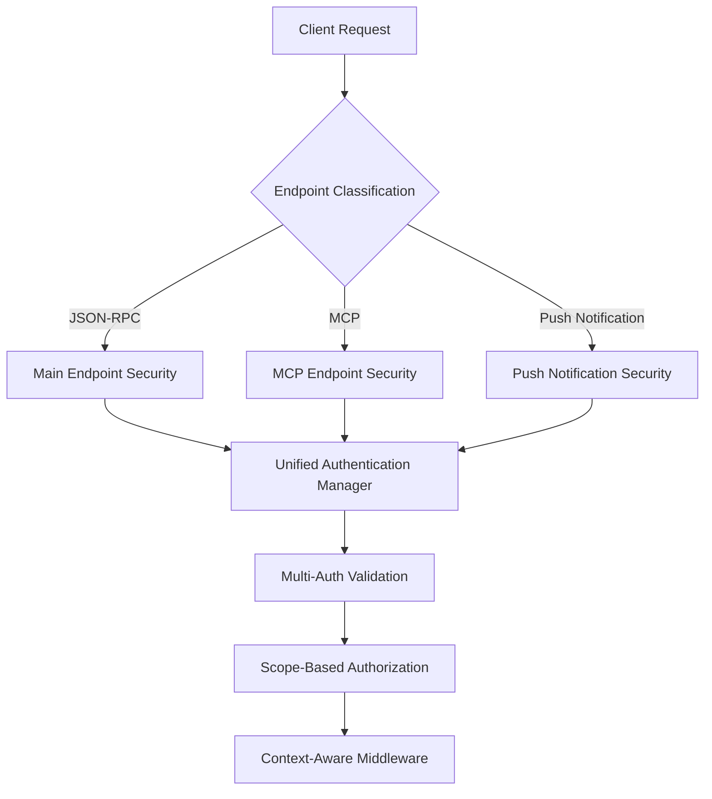

# Authentication Overview

**Enterprise-grade security for your AgentUp agents**

AgentUp provides a comprehensive authentication system that combines ease of use with enterprise-grade security. Whether you're building a simple development agent or a production system serving thousands of requests, our authentication framework has you covered.

## AgentUp Security Architecture (ASF)

AgentUp's authentication system operates within the AgentUp Security Framework model that applies security measures based on context and operational characteristics. The system automatically classifies plugins and endpoints, applying appropriate middleware and authentication requirements based on their operational needs.

The architecture supports multiple authentication methods simultaneously, with automatic fallback logic and scope-based authorization that flows through the entire system. This ensures that security decisions are made consistently across all components while maintaining optimal performance through context-aware middleware selection.

## Authentication Methods

### [API Key Authentication](api-keys.md)
**Perfect for**: Development, internal APIs, service-to-service authentication

API key authentication provides straightforward security with robust validation and flexible deployment options. The system now protects all endpoints including MCP and push notification systems, with automatic middleware integration and scope-based authorization support.

```yaml
security:
  enabled: true
  type: "api_key"
  api_key: "sk-your-strong-api-key-here"
```

The enhanced API key system supports multiple keys for different environments,  middleware
selection based on endpoint characteristics, and comprehensive audit logging for security monitoring.

**When to use**: Development environments, internal microservices, simple integrations, service-to-service
authentication.

---

### [Bearer Token Authentication](bearer-tokens.md)
**Perfect for**: Custom JWT tokens, stateless authentication

Bearer token authentication provides stateless security with full JWT validationand flexible claims
extraction. The system with the ASF scope-based authorization model, automatically passing authentication
context to all handlers and middleware.

```yaml
security:
  enabled: true
  type: "bearer"
  bearer_token: "your-jwt-token-here"
```

The enhanced bearer token system supports automatic scope validation, context-aware middleware application,
and seamless integration with plugin classification systems.

**When to use**: Custom authentication systems, JWT-based workflows, stateless applications, microservices
architectures.

---

### [JWT Authentication](jwt-authentication.md)
**Perfect for**: Production JWT with scope-based authorization

JWT authentication provides cryptographic security with comprehensive scope-based authorization that
flows through the entire system. The implementation includes automatic context propagation,
plugin-aware security decisions, and middleware selection.

```yaml
security:
  enabled: true
  type: "bearer"
  bearer:
    jwt_secret: "${JWT_SECRET}"
    algorithm: "HS256"
    issuer: "${JWT_ISSUER}"
    audience: "${JWT_AUDIENCE}"
```

The  JWT approach supports hierarchical scope inheritance, plugin classification integration, and
context-aware middleware that optimizes security and performance based on operational characteristics.

**When to use**: Production systems, scope-based access control, enterprise applications, multi-tenant environments

---

### [OAuth2 Authentication](oauth2.md)
**Perfect for**: Enterprise integration, third-party access, production systems

OAuth2 authentication provides enterprise-grade security with support for major providers and comprehensive scope management.
The system integrates with the ASF authentication manager, providing consistent behavior across all authentication methods.

```yaml
security:
  enabled: true
  type: "oauth2"
  oauth2:
    validation_strategy: "jwt"
    jwks_url: "https://provider.com/.well-known/jwks.json"
    jwt_issuer: "https://provider.com"
    jwt_audience: "your-agent-id"
```

The OAuth2 approach supports automatic provider integration, scope hierarchy validation, and context-aware
security decisions that adapt to different plugin types and operational requirements.

**When to use**: Enterprise environments, third-party integrations, complex authorization needs, SSO requirements

## Quick Start Guides

### [5-Minute Setup](quick-start.md)
Get your agent secured with API key authentication in just 5 minutes. Perfect for getting started quickly with the new AgentUp Security Framework model.

### [Unified Security Setup](unified-security.md)
Comprehensive guide to configuring the unified authentication system with context-aware middleware selection and scope-based authorization.

### [Scope-Based Authorization](scope-based-authorization.md)
Detailed guide to implementing hierarchical permission systems with plugin integration and context-aware security decisions.

### [Provider Integration](providers.md)
Step-by-step setup guides for popular OAuth2 providers including Google, Auth0, Microsoft Azure AD, and more, updated for the unified authentication system.

## Security Features

### Enterprise-Grade Security
The unified authentication system provides comprehensive security across all endpoint types with  middleware selection
and context-aware protection. Security measures are automatically applied based on operational characteristics, ensuring optimal
protection without unnecessary overhead.

The system includes constant-time comparisons for protection against timing attacks, secure credential handling that never logs or
exposes secrets, comprehensive input validation across all endpoints, and complete authentication event tracking for security
monitoring.

### A2A Specification Compliance
The authentication system maintains full A2A protocol compliance with proper agent capability advertisement via the Agents AgentCard,
using the correct security scheme declarations, and standard OpenAPI security specification adherence.

### Performance Optimized
The context-aware middleware selection ensures efficient validation optimized for high-throughput scenarios. The system includes
caching support for JWKS and configuration data, non-blocking authentication flows, and plugin classification that minimizes
security overhead while maintaining comprehensive protection.

### Scope-Based Authorization
The unified system introduces comprehensive scope-based authorization with hierarchical permission inheritance. Scopes flow
through the entire system, from initial authentication through plugin execution, ensuring consistent permission
checking across all components.

### Plugin Integration
The authentication system  integrates with the plugin classification system, automatically applying appropriate security
measures based on plugin characteristics. Local plugins receive optimized security configurations while network-dependent plugins
get comprehensive protection including retry logic and enhanced validation.

## Architecture

### Unified Authentication Flow
The ASF authentication system provides comprehensive security across all endpoint types with  middleware selection
and context-aware protection. The system automatically classifies incoming requests and applies appropriate security measures based
on endpoint characteristics and operational requirements.




## Configuration Philosophy

AgentUp follows a **unified, configuration-driven** approach to security that adapts to operational contexts:

### ASF  Model
The system provides consistent security behavior across all endpoint types while automatically optimizing for different operational
characteristics. All security behavior is controlled through configuration rather than hardcoded policies, enabling flexible
deployment across different environments.

### Context-Aware Configuration
Configuration adapts to plugin characteristics and operational requirements, ensuring that security measures are appropriate for
each component's specific needs. The system supports environment-specific settings with runtime flexibility that allows changing
authentication methods without code changes.

## Best Practices

### Security Best Practices
Always use HTTPS in production environments as credentials should never be transmitted over unencrypted connections. Implement
regular credential rotation procedures to maintain security over time, and use environment variables to keep secrets out of
configuration files.

Monitor authentication attempts across all endpoints to detect potential security issues early. The ASF system provides comprehensive
logging that makes this monitoring more effective. Follow the principle of least privilege by granting only the minimum necessary
permissions through the scope-based authorization system.

### Scope-Based Authorization Best Practices
Design scope hierarchies that reflect your application's security model, with clear inheritance relationships between permission
levels. Use the plugin classification system to automatically assign appropriate scope requirements based on operational
characteristics.

Implement scopes that are neither too broad nor too narrow, finding the right balance for your security needs. The system supports
hierarchical scopes that simplify permission management while maintaining security granularity.

### Plugin Security Best Practices
Use the plugin classification system to automatically apply appropriate security measures. Local plugins should be classified as `LOCAL`
to receive optimized security configurations, while network-dependent plugins should use `NETWORK` classification for comprehensive protection.

Implement custom authorization logic in plugins when needed, using the `EnhancedCapabilityContext` to access authentication information
and make security decisions. The system provides all necessary context for authorization logic while maintaining consistent behavior across all plugins.

## Common Configuration Patterns

Each environment receives optimized security configurations that balance protection with operational requirements.

```yaml
# Local development - secure but convenient
security:
  enabled: true
  type: "api_key"
  api_key: "${DEV_API_KEY:sk-dev-default-key}"

# CI/CD testing - consistent with production
security:
  enabled: true
  type: "bearer"
  bearer:
    jwt_secret: "${CI_JWT_SECRET}"
    algorithm: "HS256"
    issuer: "ci-system"
    audience: "test-agent"

# Staging - production-like OAuth2
security:
  enabled: true
  type: "oauth2"
  oauth2:
    validation_strategy: "jwt"
    jwks_url: "${STAGING_JWKS_URL}"
    jwt_issuer: "${STAGING_ISSUER}"
    jwt_audience: "${STAGING_AUDIENCE}"
    scope_hierarchy:
      admin: ["*"]
      api:write: ["api:read"]
```

### Microservices Architecture
The unified system supports complex microservices architectures with multiple authentication methods and service-specific security
configurations. Each service can use different authentication methods while maintaining consistent security behavior.

```yaml
# Service-to-service authentication with multiple methods
security:
  enabled: true
  type: "api_key"
  api_key:
    keys:
      - "${USER_SERVICE_KEY}"
      - "${ORDER_SERVICE_KEY}"
      - "${PAYMENT_SERVICE_KEY}"

# Plugin classification for service-specific security
plugins:
  - plugin_id: "user_service"
    plugin_type: "network"
    required_scopes: ["user:read", "user:write"]
  - plugin_id: "payment_service"
    plugin_type: "network"
    required_scopes: ["payment:process", "user:read"]
```

### Enterprise Integration
Enterprise deployments benefit from the system's comprehensive OAuth2 support with scope management and plugin classification. 
The system provides integration with most popular enterprise identity providers (hopefully I don't upset anyone by not including all of them here,
if you need a specific one, please let me know and I will add it!, or PR's are always welcome).

```yaml
# Enterprise OAuth2 with Azure AD
security:
  enabled: true
  type: "oauth2"
  oauth2:
    validation_strategy: "jwt"
    jwks_url: "https://login.microsoftonline.com/tenant/discovery/v2.0/keys"
    jwt_issuer: "https://login.microsoftonline.com/tenant/v2.0"
    jwt_audience: "your-app-id"
    scope_hierarchy:
      admin: ["*"]
      api:admin: ["api:write", "api:read"]
      api:write: ["api:read"]
      api:read: []
```

---

**Quick Links:**
- [Documentation Home](../index.md)
- [5-Minute Quick Start](quick-start.md)
- [Unified Security Architecture](unified-security.md)
- [Scope-Based Authorization](scope-based-authorization.md)
- [Troubleshooting Guide](../troubleshooting/authentication.md)
- [Configuration Reference](../reference/config-schema.md)