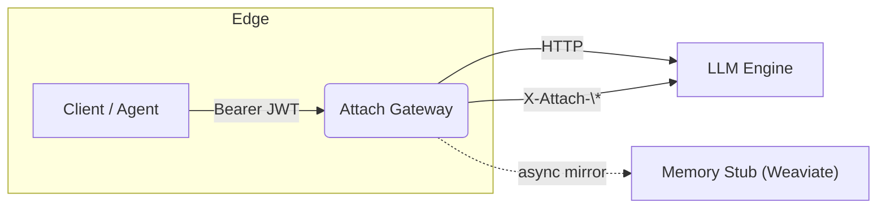

# Attach‑Gateway

**Version 0.1**\
Author: Hammad Tariq

***

## 1  Problem statement

> _Multi‑agent apps need a single way to verify **who** the end‑user is and safely pass that identity (plus limited scopes) between very different LLM engines and orchestration frameworks._
>
> – Google A2A Issue #19

Today:

* **Local engines** (Ollama / vLLM) ship **no auth** → devs hide them behind random ports.
* **Cross‑agent hand‑off** (A2A, MCP) lacks a portable identity token & memory handle.

Goal: one drop‑in side‑car that gives **OIDC‑backed SSO** _and_ a **session header** that all agents can share – with a stubbed memory mirror for recall/eval demos.

***

## 2  MVP success criteria

| KPI                                                            | Target |
| -------------------------------------------------------------- | ------ |
| End‑to‑end request (curl → gateway → Ollama) with **JWT** auth | ✅      |
| LangChain notebook works via gateway                           | ✅      |
| `/tasks/send` A2A endpoint proxies to same engine              | ✅      |
| Prompt/response mirrored to **Weaviate**                       | ✅      |
| Docker‑compose demo + README                                   | ✅      |

***

## 3  High‑level architecture



### Gateway pipeline

1. **Auth** – verify JWT (OIDC) / HMAC.
2. **Session** – `session_id = sha256(user.sub + user‑agent)`
3. **Headers out** – `X-Attach-User`, `X-Attach-Session`, `X-Attach-Agent?`.
4. **Mirror** – non‑blocking stream → memory stub (also accepts `/v1/logs`).
5. **Proxy** – reverse‑proxy to target engine.

***

## 4  Component breakdown

| Dir           | Responsibility                                   | Key libs               |
| ------------- | ------------------------------------------------ | ---------------------- |
| `auth/`       | OIDC JWT validation, JWKS cache                  | `python‑jose`, `httpx` |
| `middleware/` | session header injection & mirror trigger        | `fastapi`, `asyncio`   |
| `proxy/`      | streaming reverse‑proxy to engine                | `httpx.AsyncClient`    |
| `a2a/`        | Minimal `/tasks/send` & `/tasks/status` handlers | `fastapi`              |
| `mem/`        | Async writer to Weaviate REST                    | `weaviate‑client`      |

## 4.1 Default engine target (Ollama)

* **Local dev:** `ENGINE_URL=http://ollama:11434` — locks down a laptop's Ollama instance with OIDC JWT SSO in under a minute.
* **Prod swap:** repoint `ENGINE_URL` to `http://vllm:8000`, `https://api.openai.com`, etc.; no code change required.

## 4.2 Auth works independently

* Auth can be used without enabling memory through `MEM_BACKEND=none`

***

## 5  API surface (v0)

### 5.1 Ingress

| Route          | Method   | Auth required           | Behaviour                             |
| -------------- | -------- | ----------------------- | ------------------------------------- |
| `/tasks/send`  | POST     | Bearer JWT (`chat:run`) | Body ⇒ proxy to `/api/chat` on engine |
| `/{path:path}` | GET/POST | Bearer JWT (`chat:run`) | Raw proxy                             |

### 5.2 Headers added

````
X-Attach-User:    <sub>
X-Attach-Session: <uuid>

### 5.3 Example curl against Ollama through gateway
```bash
# Fetch a short‑lived user JWT via device‑flow helper
export OLLAMA_TOKEN=$(./scripts/dev_login.sh)

# Make a protected request via the gateway (8080)
curl -H "Authorization: Bearer $OLLAMA_TOKEN" \
     -d '{"prompt":"Hello"}' \
    http://localhost:8080/api/chat
# Gateway ➜ validates JWT ➜ stamps X‑Attach‑User/Session ➜ proxies to Ollama :11434
````

### 5.4 Task queue schemes

```
http://<service>         # default HTTP call
temporal://<Workflow>    # execute Temporal workflow
```

***

## 6  Security notes

* JWT signature (RS256) verified offline via JWKS.
* `aud` claim matched against env `OIDC_AUD`.
* Session ID not guessable (`sha256` → hex).
* Mirror process redacts secrets before storage.

***

## 7  Future work

1. Swap Weaviate for **Attach Store v1** (Git‑like, policy guards).
2. Add **DID‑JWT** verifier module.
3. Rate‑limit & billing hooks.
4. Helm chart & K8s side‑car injector.

***

## 8  Open questions

1. Use separate header for **Agent‑token** or nested JWT?
2. Include streaming metrics in mirror payload now or later?
3. Naming: `attach-gateway` vs `a2a-auth-gw`?

***

### Note on A2A‑only mode

_The same JWT validator powers **both** direct Ollama calls **and** A2A `/tasks/send` requests. If you skip JWT wiring at Ollama, the A2A call cannot propagate a verifiable user identity downstream, defeating delegated auth._
