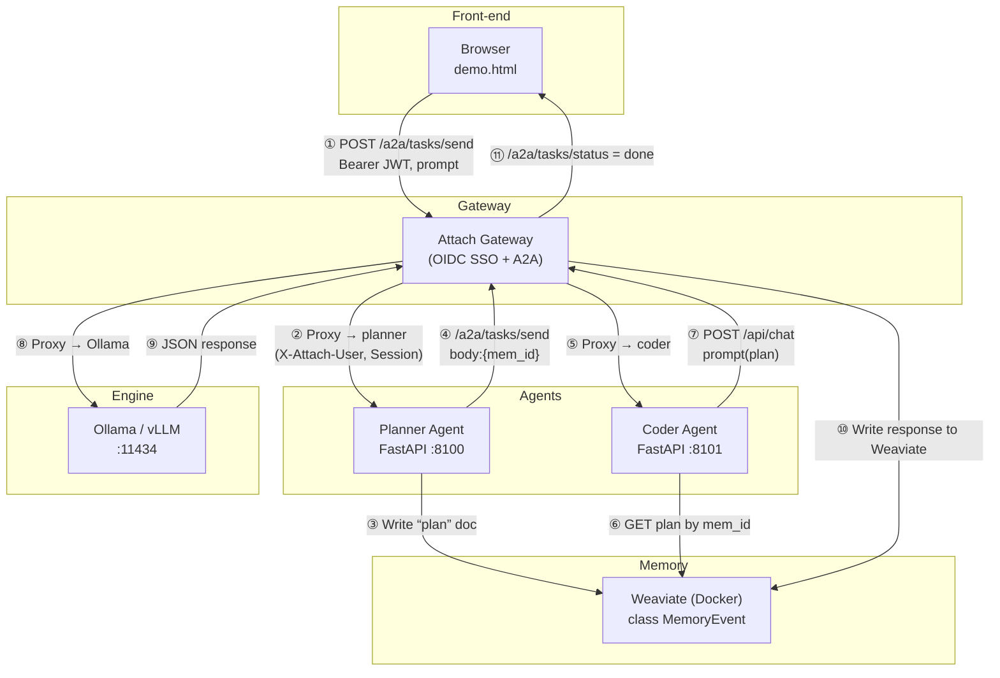

# Attach Gateway

> **Identity & Memory side‑car** for every LLM engine and multi‑agent framework. Add OIDC / DID SSO, A2A hand‑off, and a pluggable memory bus (Weaviate today) – all with one process.

***

## Why it exists

LLM engines such as **Ollama** or **vLLM** ship with **zero auth**. Agent‑to‑agent protocols (Google **A2A**, MCP, OpenHands) assume a _Bearer token_ is already present but don’t tell you how to issue or validate it. Teams end up wiring ad‑hoc reverse proxies, leaking ports, and copy‑pasting JWT code.

**Attach Gateway** is that missing resource‑server:

* ✅ Verifies **OIDC / JWT** or **DID‑JWT**
* ✅ Stamps `X‑Attach‑User` + `X‑Attach‑Session` headers so every downstream agent/tool sees the same identity
* ✅ Implements `/a2a/tasks/send` + `/tasks/status` for Google A2A & OpenHands hand‑off
* ✅ Mirrors prompts & responses to a memory backend (Weaviate Docker container by default)
* ✅ Workflow traces (Temporal)

Run it next to any model server and get secure, shareable context in under 1 minute.

***

## 60‑second Quick‑start (local laptop)

```bash
# 0) prerequisites: Python 3.12, Ollama installed, Auth0 account or DID token

git clone https://github.com/attach-dev/attach-gateway.git && cd attach-gateway
python -m venv .venv && source .venv/bin/activate
pip install -r requirements.txt

# 1) start memory in Docker (background tab)
python script/start_weaviate.py &

# 2) export your short‑lived token
export JWT="<paste Auth0 or DID token>"
export OIDC_ISSUER=https://YOUR_DOMAIN.auth0.com
export OIDC_AUD=ollama-local
export MEM_BACKEND=weaviate
export WEAVIATE_URL=http://127.0.0.1:6666

# 3) run gateway
uvicorn main:app --port 8080 &

# The gateway exposes your Auth0 credentials for the demo UI at
# `/auth/config`. The values are read from `AUTH0_DOMAIN`,
# `AUTH0_CLIENT` and `OIDC_AUD`.

# 4) make a protected Ollama call via the gateway
curl -H "Authorization: Bearer $JWT" \
     -d '{"model":"tinyllama","prompt":"hello"}' \
    http://localhost:8080/api/chat | jq .
```

In another terminal, try the Temporal demo:

```bash
pip install temporalio  # optional workflow engine
python examples/temporal_adapter/worker.py &
python examples/temporal_adapter/client.py
```

You should see a JSON response plus `X‑ATTACH‑Session‑Id` header – proof the pipeline works.

***

## Architecture (planner → coder hand‑off)



**Key headers**

| Header                        | Meaning                                          |
| ----------------------------- | ------------------------------------------------ |
| `Authorization: Bearer <JWT>` | OIDC or DID token proved by gateway              |
| `X‑Attach‑User`               | stable user ID (\`auth0                          |
| `X‑Attach‑Session`            | deterministic hash (user + UA) for request trace |

***

## Live two‑agent demo

```bash
# pane 1 – memory (Docker)
python script/start_weaviate.py

# pane 2 – gateway
uvicorn main:app --port 8080

# pane 3 – planner agent
uvicorn agents.planner:app --port 8100

# pane 4 – coder agent
uvicorn agents.coder:app   --port 8101

# pane 5 – static chat UI
cd examples/static && python -m http.server 9000
open http://localhost:9000/demo.html
```

Type a request like _“Write Python to sort a list.”_ The browser shows:

1. Planner message   → logged in gateway, plan row appears in memory.
2. Coder reply       → code response, second memory row, status `done`.

***

## Directory map

| Path               | Purpose                                             |
| ------------------ | --------------------------------------------------- |
| `auth/`            | OIDC & DID‑JWT verifiers                            |
| `middleware/`      | JWT middleware, session header, mirror trigger      |
| `a2a/`             | `/tasks/send` & `/tasks/status` routes              |
| `mem/`             | pluggable memory writers (`weaviate.py`, `null.py`) |
| `agents/`          | _examples_ – Planner & Coder FastAPI services       |
| `examples/static/` | `demo.html` chat page                               |

***

### Auth core

`auth.verify_jwt()` accepts three token formats and routes them automatically:

1. Standard OIDC JWTs
2. `did:key` tokens
3. `did:pkh` tokens

Example DID-JWT request:

```bash
curl -X POST /v1/resource \
     -H "Authorization: Bearer did:key:z6Mki...<sig>.<payload>.<sig>"
```

## 💾 Memory: logs

Send Sakana-formatted logs to the gateway and they will be stored as`MemoryEvent` objects in Weaviate.

```bash
curl -X POST /v1/logs \
     -H "Authorization: Bearer $JWT" \
     -d '{"run_id":"abc","level":"info","message":"hi"}'
# => HTTP/1.1 202 Accepted
```

## Roadmap

* **v0.2** — DID‑JWT resolver, protected‑resource metadata endpoint (OAuth 2.1).
* **v0.3** — Token‑exchange (RFC 8693) for on‑behalf‑of delegation.
* **v0.4** — Attach Store v1 (Git‑style, policy guards).

***

## License

MIT
