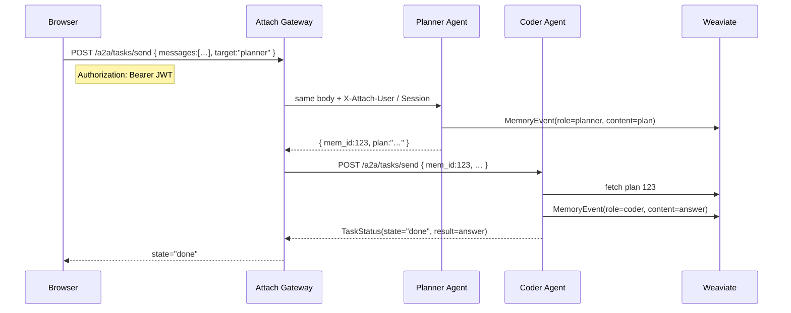

# Worked example: memory‑based hand‑off with Google A2A

This walkthrough shows how to pass a **plan** from a *Planner* agent to a *Coder* agent via **Attach Gateway**, using:

* Google’s **A2A** task protocol (`/a2a/tasks/send` + `/status/{id}`)
* Attach Gateway’s `X‑Attach‑*` headers
* Weaviate as the shared memory store

The same pattern applies to any engine (vLLM, llama.cpp, commercial APIs).

---

## 0 · What A2A expects

| Endpoint | Purpose | Typical caller |
|----------|---------|----------------|
| `POST /a2a/tasks/send` | Submit a task & choose target agent | UI → Gateway |
| `GET  /a2a/tasks/status/{task_id}` | Poll until `state:"done"` | UI → Gateway |

Attach Gateway forwards both calls to the chosen agent, adds the Attach headers, and records every hop in Weaviate.

---

## 1 · Planner → Coder flow (with memory)



---

## 2 · Skeleton agents

### Planner – saves a plan, returns `mem_id`

```python
from fastapi import FastAPI, Request, HTTPException
from mem.utils import write_plan          # provided by attach‑gateway
import httpx, os

app = FastAPI()
OLLAMA = os.getenv("OLLAMA_URL", "http://localhost:8080/api/chat")

@app.post("/api/chat")                   # called via Gateway
async def plan(body: dict, request: Request):
    user_prompt = body["messages"][-1]["content"]

    # 1) ask the LLM for a plan
    llm_payload = {
        "model": "tinyllama",
        "messages": [
            {"role": "system", "content": "Return a numbered implementation plan."},
            {"role": "user",   "content": user_prompt},
        ],
        "stream": False,
    }
    async with httpx.AsyncClient() as cli:
        res = await cli.post(OLLAMA, json=llm_payload)
        if not res.ok:
            raise HTTPException(res.status_code, res.text)

    plan_text = res.json()["choices"][0]["message"]["content"]

    # 2) store in memory
    mem_id = await write_plan(request.state.sub, plan_text)

    # 3) reply with mem_id (Gateway passes it to Coder)
    return {"mem_id": mem_id, "plan": plan_text}
```

### Coder – receives `mem_id`, fetches plan, prepends it

```python
from fastapi import FastAPI, HTTPException
from mem.utils import fetch_doc
import httpx, os

app = FastAPI()
OLLAMA = os.getenv("OLLAMA_URL", "http://localhost:8080/api/chat")

@app.post("/api/chat")
async def code(body: dict):
    mem_id = body.get("mem_id")
    plan   = await fetch_doc(mem_id) if mem_id else None

    messages = []
    if plan:
        messages.append({
            "role": "system",
            "content": f"### PLAN\n{plan}\n\n### IMPLEMENTATION\n"
        })
    messages += body["messages"]

    async with httpx.AsyncClient() as cli:
        res = await cli.post(OLLAMA, json={"model": "tinyllama",
                                           "messages": messages,
                                           "stream": False})
        if not res.ok:
            raise HTTPException(res.status_code, res.text)
        return res.json()                 # Gateway relays to UI
```

---

## 3 · Smoke‑test locally

```bash
# pane 1 – memory
python script/start_weaviate.py

# pane 2 – gateway   (expects $JWT)
uvicorn main:app --port 8080

# pane 3 – planner
uvicorn examples.agents.planner:app --port 8100

# pane 4 – coder
uvicorn examples.agents.coder:app   --port 8101

# pane 5 – static UI
cd examples/static && python -m http.server 9000
open http://localhost:9000/demo2.html
```

* Ask **Planner** → JSON contains a `mem_id`.
* Ask **Coder** → its prompt now includes the plan.
* Inspect memory: <http://localhost:8080/mem/events?limit=10>

---

## 4 · cURL only

```bash
JWT=$(node util/get_dev_token.js)   # or paste any short‑lived token

# create planner task
SEND=$(curl -s -H "Authorization: Bearer $JWT" \
  -d '{"messages":[{"role":"user","content":"Build a REST API"}],"target":"planner"}' \
  http://localhost:8080/a2a/tasks/send)

ID=$(jq -r .task_id <<<"$SEND")

# poll until done
watch -n1 curl -s -H "Authorization: Bearer $JWT" \
  http://localhost:8080/a2a/tasks/status/$ID | jq .
```

---

## 5 · What Attach handles vs. what you write

| Layer | Provided by attach‑gateway | You supply |
|-------|---------------------------|------------|
| JWT verification & `/a2a` routing | ✔︎ | – |
| Memory utils (`write_plan`, `fetch_doc`) | ✔︎ | – |
| Agent FastAPI skeletons | Examples | Prompts / business logic |
| Demo UI | [`demo2.html`](../static/demo2.html) | Optional |

Swap in any engine (vLLM, llama.cpp, OpenAI, etc.) and you still get **SSO + memory + hand‑off** out‑of‑the‑box.