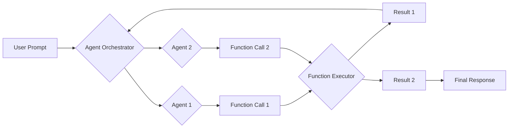

# Calute

Calute is a framework for building AI agents that can orchestrate function calls and switch between agents. It is designed for researchers experimenting with agent orchestration and function calling.

## Key Features

* **Agent Orchestration:** Calute helps manage multiple agents and their interactions, allowing you to create complex AI systems.
* **Function Calling:** Calute simplifies the process of calling functions from AI agents, enabling them to interact with external tools and data sources.
* **Agent Switching:** Calute provides agent switching capabilities, allowing you to create more dynamic and intelligent systems that can adapt to different situations.
* **Workflow Engine:** Calute includes a workflow engine for defining and executing complex workflows involving LLMs and function execution.
* **LLM Client Abstraction:** Calute supports OpenAI and Gemini models through a unified client interface, making it easy to switch between different LLMs.

## Installation

To install Calute, use the following command:

```bash
poetry install
```

## Usage

Here are some examples of how to use Calute:

### Registering an Agent

```python
from calute import Agent, AgentFunction, Calute

def my_function(input_data: str, context_variables: dict = None):
    """My function description (LLM will read the docs!)"""
    return f"Function executed with input: {input_data}"

agent = Agent(
    id="my_agent",
    name="My Agent",
    functions=[AgentFunction(func=my_function)],
    instructions="Follow these instructions."
)

# Assuming you have an initialized OpenAI or Gemini client
# client = OpenAI(...) or client = Gemini(...)
# calute = Calute(client)
# calute.register_agent(agent)
```

### Defining a Workflow

```python
from calute import Workflow, WorkflowStep, WorkflowEngine, WorkflowStepType

# Assuming you have a Calute instance
# calute = Calute(...)
# workflow_engine = WorkflowEngine(calute)

# workflow = workflow_engine.create_function_workflow(
#     id="my_workflow",
#     name="My Workflow",
#     functions=[my_function]
# )
```

### Running a Workflow

```python
# Assuming you have a workflow defined
# result = await workflow_engine.execute_workflow(
#     workflow_id="my_workflow",
#     context_variables={"input_data": "Hello, world!"}
# )
# print(result)
```

## Modules

* [`calute.py`](calute/calute.py): Core Calute class with orchestration capabilities.
* [`chain_module.py`](calute/chain_module.py): Function chaining and execution.
* [`client.py`](calute/client.py): LLM client abstraction for OpenAI and Gemini.
* [`executors.py`](calute/executors.py): Function and agent execution logic.
* [`workflow.py`](calute/workflow.py): Workflow engine for defining and executing complex workflows.
* [`types/`](calute/types/): Data types and structures used in Calute.
* [`utils.py`](calute/utils.py): Utility functions.
* [`basics.py`](calute/basics.py): Basic registries.

## Types

* [`Agent`](calute/types/agent_types.py): Represents an AI agent with capabilities and functions.
* [`PromptTemplate`](calute/calute.py): Configurable template for structuring agent prompts.
* [`FunctionCall`](calute/types/function_execution_types.py): Represents a function call to be executed.
* [`Workflow`](calute/workflow.py): Defines a workflow with steps and transitions.

## Example Mermaid Diagram



## License

This project is licensed under the Apache License 2.0 - see the [LICENSE](LICENSE) file for details.

## Contributing

Contributions are welcome! Please see the [contributing guidelines](CONTRIBUTING.md) for more information.

## Contact

If you have any questions or issues, please contact [erfanzar](https://github.com/erfanzar).
