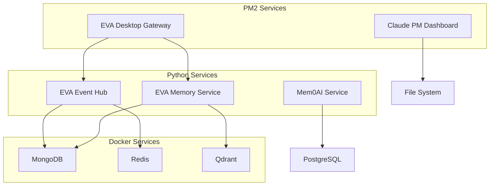

# Claude PM Local Services Deployment Standards

This document defines comprehensive standards for local service deployment, port management, and service orchestration within the Claude PM framework ecosystem.

## 🏗️ DEPLOYMENT ARCHITECTURE

### Directory Structure
```
~/
├── Projects/
│   ├── Claude-PM/                    # Framework management (git repo)
│   └── managed/                      # Managed projects
├── Services/                         # Service deployment artifacts (NEW)
│   ├── configs/                      # PM2 ecosystem configurations
│   ├── logs/                         # Centralized logging
│   ├── scripts/                      # Deployment automation
│   └── monitoring/                   # Health monitoring tools
└── .pm2/                            # PM2 runtime data
```

### Service Categories
1. **Core Framework Services** - Essential Claude PM infrastructure
2. **Project Services** - Individual project dashboards and APIs
3. **Supporting Services** - Databases, message queues, utilities
4. **Development Services** - Development servers and tools

## 🔢 PORT ALLOCATION STANDARDS

### Port Range Allocation
```
Port Range  | Purpose                    | Examples
------------|----------------------------|---------------------------
3000-3999   | Development servers        | Vite dev servers
4000-4999   | Production web services    | Static sites, SPAs
5000-5999   | System/Infrastructure      | Control Center (5000)
6000-6999   | Databases                  | Redis (6379), Qdrant (6333)
7000-7999   | Claude PM Framework        | Dashboard (7001), APIs
8000-8999   | Application services       | APIs, microservices
9000-9999   | Reserved/Custom            | Special purpose
```

### Assigned Ports (Current State)
```
PORT  | SERVICE                    | TYPE      | STATUS  | PROJECT
------|----------------------------|-----------|---------|---------------------------
3000  | Vite Development           | Dev       | Dynamic | Various projects
4173  | Portfolio Dashboard        | Prod      | Online  | portfolio-dashboard
5000  | Control Center             | System    | Online  | macOS Control Center
6333  | Qdrant Vector DB           | Database  | Online  | eva-monorepo (Docker)
6379  | Redis Cache                | Database  | Online  | eva-monorepo (Docker)
7000  | Control Center             | System    | Online  | macOS Control Center
7001  | Claude PM Dashboard        | Framework | Online  | claude-pm-portfolio-manager
8000  | App Server                 | App       | Online  | Unknown Python service
8001  | EVA Event Hub              | App       | Online  | eva-monorepo
8080  | Memory Service (Simple)    | App       | Online  | eva-monorepo
8100  | App Server                 | App       | Online  | Unknown Python service
8102  | App Server                 | App       | Online  | Unknown Python service
8765  | Mem0AI Service             | App       | Online  | mem0ai
8889  | Jupyter/App Server         | Dev       | Online  | Unknown Python service
27017 | MongoDB                    | Database  | Online  | eva-monorepo (Docker)
```

## 🚀 SERVICE DEFINITIONS

### 1. Claude PM Framework Services

#### Claude PM Dashboard (Port 7001)
**Purpose**: Central monitoring dashboard for all Claude PM managed projects
```yaml
# ~/Services/configs/claude-pm-dashboard.yml
name: claude-pm-dashboard
port: 7001
type: framework-core
project: claude-pm-portfolio-manager
health_check: http://localhost:7001
dependencies: ["file-system"]
ecosystem_config: /Users/masa/Projects/managed/claude-pm-portfolio-manager/ecosystem.config.js
```

### 2. EVA Monorepo Services

#### EVA Desktop Gateway (PM2 ID: 18)
**Purpose**: Desktop service bridge for EVA ecosystem
```yaml
name: eva-desktop-gateway
port: N/A (service bridge)
type: service-bridge
project: eva-monorepo
health_check: pm2 show eva-desktop-gateway
dependencies: ["eva-event-hub", "eva-memory-service"]
ecosystem_config: /Users/masa/Projects/managed/eva-monorepo/services/mcp-desktop-gateway/ecosystem.config.js
```

#### EVA Event Hub (Port 8001)
**Purpose**: Event coordination for EVA services
```yaml
name: eva-event-hub
port: 8001
type: microservice
project: eva-monorepo
health_check: http://localhost:8001/health
dependencies: ["mongodb", "redis"]
start_command: "cd ~/Projects/managed/eva-monorepo && make start-event-hub"
```

#### EVA Memory Service (Port 8080)
**Purpose**: Simple memory service for EVA ecosystem
```yaml
name: eva-memory-service
port: 8080
type: microservice
project: eva-monorepo
health_check: http://localhost:8080/health
dependencies: ["mongodb", "qdrant"]
start_command: "cd ~/Projects/managed/eva-monorepo && python simple_memory_service.py"
```

### 3. Mem0AI Service

#### Mem0AI API (Port 8765)
**Purpose**: Advanced memory management service
```yaml
name: mem0ai-service
port: 8765
type: ai-service
project: mem0ai
health_check: http://localhost:8765/health
dependencies: ["postgresql"]
start_command: "cd ~/Projects/Github/mem0ai && uvicorn main:app --host 0.0.0.0 --port 8765 --reload"
```

### 4. Database Services (Docker)

#### MongoDB (Port 27017)
**Purpose**: Primary database for EVA ecosystem
```yaml
name: eva-mongodb
port: 27017
type: database
container: eva_mongodb
health_check: docker exec eva_mongodb mongosh --eval "db.adminCommand('ping')"
data_volume: eva_mongodb_data
```

#### Redis (Port 6379)
**Purpose**: Caching and session storage
```yaml
name: eva-redis
port: 6379
type: cache
container: eva_redis
health_check: docker exec eva_redis redis-cli ping
data_volume: eva_redis_data
```

#### Qdrant (Port 6333-6334)
**Purpose**: Vector database for semantic search
```yaml
name: eva-qdrant
port: 6333
type: vector-database
container: eva_qdrant
health_check: curl -f http://localhost:6333/health
data_volume: eva_qdrant_data
```

## 📋 SERVICE ORCHESTRATION

### PM2 Ecosystem Configuration
**Location**: `~/Services/configs/claude-pm-ecosystem.config.js`

```javascript
module.exports = {
  apps: [
    {
      name: 'claude-pm-dashboard',
      script: 'npm',
      args: 'run preview',
      cwd: '/Users/masa/Projects/managed/claude-pm-portfolio-manager',
      instances: 1,
      autorestart: true,
      watch: false,
      max_memory_restart: '500M',
      env: {
        NODE_ENV: 'production',
        PORT: 7001
      },
      log_file: '~/Services/logs/claude-pm-dashboard.log',
      error_file: '~/Services/logs/claude-pm-dashboard-error.log',
      out_file: '~/Services/logs/claude-pm-dashboard-out.log',
      time: true
    },
    {
      name: 'eva-desktop-gateway',
      script: 'run_mcp_gateway.py',
      cwd: '/Users/masa/Projects/managed/eva-monorepo/services/mcp-desktop-gateway',
      interpreter: './venv/bin/python',
      instances: 1,
      autorestart: true,
      watch: false,
      max_memory_restart: '1G',
      env: {
        LOG_LEVEL: 'INFO',
        PYTHONPATH: '/Users/masa/Projects/managed/eva-monorepo/services/mcp-desktop-gateway/src',
        PYTHONUNBUFFERED: '1'
      },
      log_file: '~/Services/logs/eva-desktop-gateway.log',
      error_file: '~/Services/logs/eva-desktop-gateway-error.log',
      out_file: '~/Services/logs/eva-desktop-gateway-out.log',
      time: true
    }
  ]
}
```

### Docker Compose Services
**Location**: `~/Services/configs/docker-compose.yml`

```yaml
version: '3.8'

services:
  eva-mongodb:
    image: mongo:7
    container_name: eva_mongodb
    restart: unless-stopped
    ports:
      - "27017:27017"
    environment:
      MONGO_INITDB_ROOT_USERNAME: eva
      MONGO_INITDB_ROOT_PASSWORD: ${MONGO_PASSWORD:-eva_password}
    volumes:
      - eva_mongodb_data:/data/db
    healthcheck:
      test: ["CMD", "mongosh", "--eval", "db.adminCommand('ping')"]
      interval: 30s
      timeout: 10s
      retries: 3

  eva-redis:
    image: redis:7-alpine
    container_name: eva_redis
    restart: unless-stopped
    ports:
      - "6379:6379"
    volumes:
      - eva_redis_data:/data
    command: redis-server --appendonly yes
    healthcheck:
      test: ["CMD", "redis-cli", "ping"]
      interval: 30s
      timeout: 10s
      retries: 3

  eva-qdrant:
    image: qdrant/qdrant:latest
    container_name: eva_qdrant
    restart: unless-stopped
    ports:
      - "6333:6333"
      - "6334:6334"
    volumes:
      - eva_qdrant_data:/qdrant/storage
    healthcheck:
      test: ["CMD", "curl", "-f", "http://localhost:6333/health"]
      interval: 30s
      timeout: 10s
      retries: 3

volumes:
  eva_mongodb_data:
  eva_redis_data:
  eva_qdrant_data:
```

## 🔧 DEPLOYMENT SCRIPTS

### Master Deployment Script
**Location**: `~/Services/scripts/deploy-all.sh`

```bash
#!/bin/bash
set -e

echo "🚀 Starting Claude PM Local Services Deployment"

# Create required directories
mkdir -p ~/Services/{configs,logs,scripts,monitoring}

# Start Docker services
echo "📦 Starting Docker services..."
cd ~/Services/configs
docker-compose up -d

# Wait for databases to be ready
echo "⏳ Waiting for databases to be ready..."
sleep 30

# Verify Docker services
docker-compose ps

# Start PM2 services
echo "🔄 Starting PM2 services..."
pm2 start claude-pm-ecosystem.config.js

# Start additional Python services
echo "🐍 Starting Python services..."

# Mem0AI Service
cd /Users/masa/Projects/Github/mem0ai
if [ -f ".venv/bin/activate" ]; then
    source .venv/bin/activate
    nohup uvicorn main:app --host 0.0.0.0 --port 8765 --reload > ~/Services/logs/mem0ai.log 2>&1 &
    echo "✅ Mem0AI service started on port 8765"
fi

# EVA Event Hub
cd /Users/masa/Projects/managed/eva-monorepo
if [ -f "Makefile" ]; then
    make start-event-hub > ~/Services/logs/eva-event-hub.log 2>&1 &
    echo "✅ EVA Event Hub started on port 8001"
fi

# Health check
echo "🏥 Running health checks..."
~/Services/scripts/health-check.sh

echo "🎉 Deployment complete! Check status with: pm2 status && docker ps"
```

### Health Check Script
**Location**: `~/Services/scripts/health-check.sh`

```bash
#!/bin/bash

echo "🏥 Claude PM Services Health Check"
echo "=================================="

# Function to check HTTP service
check_http() {
    local name="$1"
    local url="$2"
    if curl -f -s "$url" > /dev/null; then
        echo "✅ $name - OK"
    else
        echo "❌ $name - FAIL"
    fi
}

# Function to check PM2 service
check_pm2() {
    local name="$1"
    if pm2 show "$name" | grep -q "online"; then
        echo "✅ $name (PM2) - OK"
    else
        echo "❌ $name (PM2) - FAIL"
    fi
}

# Function to check Docker service
check_docker() {
    local name="$1"
    if docker ps | grep -q "$name"; then
        echo "✅ $name (Docker) - OK"
    else
        echo "❌ $name (Docker) - FAIL"
    fi
}

echo "Framework Services:"
check_http "Claude PM Dashboard" "http://localhost:7001"

echo -e "\nEVA Monorepo Services:"
check_pm2 "eva-desktop-gateway"
check_http "EVA Event Hub" "http://localhost:8001/health"
check_http "EVA Memory Service" "http://localhost:8080/health"

echo -e "\nAI Services:"
check_http "Mem0AI Service" "http://localhost:8765/health"

echo -e "\nDatabase Services:"
check_docker "eva_mongodb"
check_docker "eva_redis"
check_docker "eva_qdrant"

echo -e "\nPort Usage:"
lsof -i -P | grep -E "(LISTEN)" | grep -E "(7001|8001|8080|8765|6333|6379|27017)" | sort -k9
```

### Service Monitoring Script
**Location**: `~/Services/scripts/monitor.sh`

```bash
#!/bin/bash

# Continuous monitoring script for Claude PM services
while true; do
    clear
    echo "🔍 Claude PM Services Monitor - $(date)"
    echo "================================================"
    
    echo -e "\n📊 PM2 Services:"
    pm2 status
    
    echo -e "\n🐳 Docker Services:"
    docker ps --format "table {{.Names}}\t{{.Status}}\t{{.Ports}}"
    
    echo -e "\n💾 Resource Usage:"
    echo "Memory: $(free -h | awk 'NR==2{printf "%.1f%%", $3*100/$2 }')"
    echo "Disk: $(df -h | awk '$NF=="/"{printf "%s", $5}')"
    
    echo -e "\n🌐 Network Ports:"
    netstat -tlnp 2>/dev/null | grep -E "(7001|8001|8080|8765|6333|6379|27017)" | head -5
    
    sleep 30
done
```

## 🔄 MANAGEMENT COMMANDS

### Start All Services
```bash
# Full deployment
~/Services/scripts/deploy-all.sh

# Individual service categories
docker-compose -f ~/Services/configs/docker-compose.yml up -d  # Databases
pm2 start ~/Services/configs/claude-pm-ecosystem.config.js     # Framework services
```

### Stop All Services
```bash
# Stop PM2 services
pm2 stop all

# Stop Docker services
docker-compose -f ~/Services/configs/docker-compose.yml down

# Kill remaining Python services
pkill -f "uvicorn main:app"
pkill -f "simple_memory_service.py"
```

### Health Monitoring
```bash
# One-time health check
~/Services/scripts/health-check.sh

# Continuous monitoring
~/Services/scripts/monitor.sh

# PM2 monitoring
pm2 monit
```

### Log Management
```bash
# View all logs
tail -f ~/Services/logs/*.log

# PM2 logs
pm2 logs

# Docker logs
docker-compose -f ~/Services/configs/docker-compose.yml logs -f
```

## 🔧 TROUBLESHOOTING

### Common Issues

#### Port Conflicts
```bash
# Find process using port
lsof -i :7001

# Kill process
kill $(lsof -ti :7001)
```

#### Service Won't Start
```bash
# Check logs
tail -f ~/Services/logs/service-name.log

# Check PM2 status
pm2 describe service-name

# Restart service
pm2 restart service-name
```

#### Database Connection Issues
```bash
# Check Docker status
docker ps

# Check database health
docker exec eva_mongodb mongosh --eval "db.adminCommand('ping')"
docker exec eva_redis redis-cli ping
curl http://localhost:6333/health
```

## 📊 SERVICE DEPENDENCIES



## 🎯 BEST PRACTICES

### Service Design
1. **Single Responsibility**: Each service has one clear purpose
2. **Health Endpoints**: All services expose `/health` endpoints
3. **Graceful Shutdown**: Services handle SIGTERM properly
4. **Resource Limits**: Memory and CPU limits defined in PM2 configs
5. **Logging**: Structured logging to centralized location

### Port Management
1. **Range Allocation**: Stick to defined port ranges
2. **Documentation**: Update port registry when adding services
3. **Conflict Resolution**: Check for conflicts before allocation
4. **Health Checks**: Verify port availability before deployment

### Monitoring
1. **Health Checks**: Regular automated health verification
2. **Resource Monitoring**: Track CPU, memory, and disk usage
3. **Log Aggregation**: Centralized logging for all services
4. **Alerting**: Notification for service failures
5. **Performance Metrics**: Track service response times and throughput