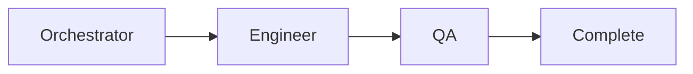
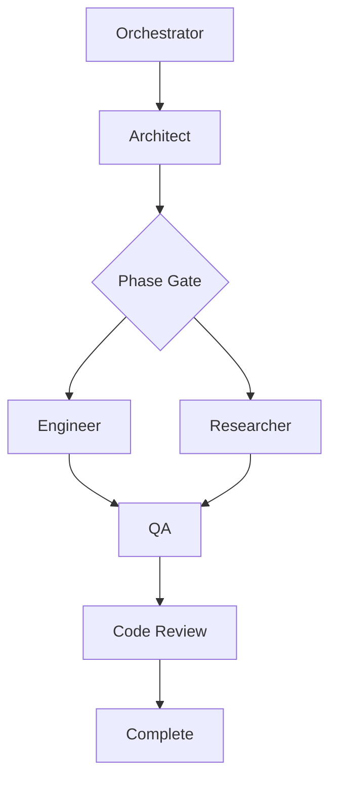
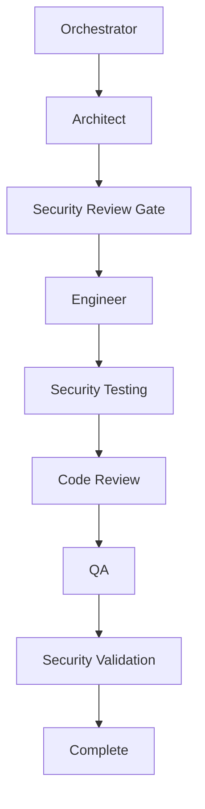

# Multi-Agent Coordination Architecture (FWK-007)

## Overview

This document defines the comprehensive coordination architecture for the Claude PM Framework's 11-agent ecosystem, designed to efficiently manage 42+ concurrent tickets while preventing conflicts and ensuring optimal resource utilization.

## Agent Ecosystem Overview

### Core Agents (5)
1. **Orchestrator** - Framework coordination, delegation, and workflow management
2. **Architect** - System design, technical specifications, and API architecture
3. **Engineer** - Source code implementation, business logic, and TDD workflows
4. **QA** - Testing, validation, quality assurance, and acceptance criteria
5. **Researcher** - Best practices, technology recommendations, and analysis

### Specialist Agents (6)
6. **Security Engineer** - Security analysis, hardening, and vulnerability assessment
7. **Performance Engineer** - Performance optimization, monitoring, and benchmarking
8. **DevOps Engineer** - Deployment, infrastructure, operations, and CI/CD
9. **Data Engineer** - Data systems, analytics architecture, and data pipelines
10. **UI/UX Engineer** - User interface, experience design, and accessibility
11. **Code Review Engineer** - Multi-dimensional code review and quality analysis

## 1. Multi-Agent Coordination Patterns

### 1.1 Agent Assignment Matrix

```yaml
Assignment_Patterns:
  Simple_Tasks:
    agents: [Engineer, QA]
    max_parallel: 2
    coordination_mode: sequential
    
  Standard_Tasks:
    agents: [Architect, Engineer, QA]
    max_parallel: 3
    coordination_mode: pipeline
    
  Complex_Tasks:
    agents: [Architect, Engineer, QA, Researcher]
    max_parallel: 4
    coordination_mode: parallel_phases
    
  Security_Critical:
    agents: [Architect, Engineer, Security, QA, Code_Review]
    max_parallel: 5
    coordination_mode: security_gate
    
  Performance_Critical:
    agents: [Architect, Performance, Engineer, QA]
    max_parallel: 4
    coordination_mode: performance_gate
    
  Infrastructure_Tasks:
    agents: [DevOps, Security, Engineer, QA]
    max_parallel: 4
    coordination_mode: infrastructure_pipeline
```

### 1.2 Coordination Flow Patterns

#### Pattern 1: Sequential Pipeline (Simple Tasks)


#### Pattern 2: Parallel Phases (Complex Tasks)


#### Pattern 3: Security Gate (Security-Critical)


### 1.3 Agent Interaction Protocols

#### Communication Channels
- **Subprocess Coordination**: Task tool subprocess state management
- **Direct Messaging**: Agent-to-agent async communication
- **Broadcast Events**: Framework-wide notifications
- **Memory Sharing**: Shared context through mem0AI

#### Handoff Procedures
```python
class AgentHandoff:
    def __init__(self, from_agent, to_agent, context, dependencies):
        self.from_agent = from_agent
        self.to_agent = to_agent
        self.context = context
        self.dependencies = dependencies
        self.timestamp = datetime.now()
        
    def validate_handoff(self):
        """Validate handoff conditions are met"""
        # Check dependencies completed
        # Validate context completeness
        # Ensure no blocking conditions
        
    def execute_handoff(self):
        """Execute the agent handoff"""
        # Transfer context
        # Update state
        # Notify next agent
        # Log handoff event
```

## 2. Conflict Resolution Framework

### 2.1 Conflict Detection System

#### Automatic Conflict Detection
```python
class ConflictDetector:
    def __init__(self):
        self.conflict_types = [
            "resource_contention",
            "technical_disagreement", 
            "priority_conflict",
            "dependency_deadlock"
        ]
        
    def detect_resource_contention(self, agents):
        """Detect multiple agents accessing same resources"""
        # Monitor file locks, git worktrees, memory usage
        
    def detect_technical_disagreement(self, agents):
        """Detect conflicting technical recommendations"""
        # Compare agent outputs for incompatibilities
        
    def detect_priority_conflict(self, tickets):
        """Detect conflicting priority assignments"""
        # Analyze ticket priorities and agent assignments
```

#### Conflict Categories
1. **Resource Conflicts**
   - Multiple agents modifying same files
   - Git worktree contention
   - Memory/compute resource limits
   
2. **Technical Conflicts**
   - Architect vs Engineer implementation disagreements
   - Security vs Performance trade-off disputes
   - DevOps vs Engineer deployment strategy conflicts
   
3. **Priority Conflicts**
   - Multiple high-priority tickets competing for same agents
   - Dependency conflicts creating deadlocks
   - Timeline conflicts with resource constraints

### 2.2 Conflict Resolution Procedures

#### Level 1: Automatic Resolution (0-30 minutes)
```python
class AutomaticResolution:
    def resolve_resource_conflict(self, conflict):
        """Automatic resource conflict resolution"""
        strategies = [
            "queue_agents",          # Serialize access
            "split_resources",       # Divide resources
            "escalate_priority"      # Boost resource allocation
        ]
        return self.apply_strategy(conflict, strategies)
        
    def resolve_technical_conflict(self, conflict):
        """Automatic technical conflict resolution"""
        strategies = [
            "apply_framework_patterns",  # Use established patterns
            "defer_to_architect",       # Default to architect decision
            "request_research"          # Get additional context
        ]
        return self.apply_strategy(conflict, strategies)
```

#### Level 2: Orchestrator Mediation (30 minutes - 2 hours)
```python
class OrchestratorMediation:
    def mediate_conflict(self, conflict):
        """Orchestrator-mediated conflict resolution"""
        steps = [
            self.analyze_conflict_context,
            self.gather_agent_perspectives,
            self.apply_framework_policies,
            self.make_mediation_decision,
            self.communicate_resolution,
            self.monitor_compliance
        ]
        return self.execute_mediation_steps(conflict, steps)
```

#### Level 3: Human Escalation (2+ hours)
```python
class HumanEscalation:
    def escalate_to_human(self, conflict):
        """Escalate unresolved conflicts to human decision-maker"""
        escalation_package = {
            "conflict_summary": self.generate_summary(conflict),
            "agent_perspectives": self.collect_perspectives(conflict),
            "attempted_resolutions": self.get_resolution_history(conflict),
            "recommended_actions": self.generate_recommendations(conflict),
            "impact_assessment": self.assess_impact(conflict)
        }
        return self.submit_escalation(escalation_package)
```

### 2.3 Resolution Decision Trees

#### Technical Disagreement Resolution
```yaml
Technical_Conflict_Resolution:
  architect_vs_engineer:
    - Check if architect specification exists
    - If yes: Follow architect specification
    - If no: Request architect clarification
    - Escalate after 1 hour if unresolved
    
  security_vs_performance:
    - Assess security risk level (critical, high, medium, low)
    - If critical: Security takes precedence
    - If high: Request performance analysis
    - If medium/low: Performance optimization allowed
    
  devops_vs_engineer:
    - Check deployment requirements
    - Review infrastructure constraints
    - Apply framework deployment patterns
    - Escalate if patterns insufficient
```

## 3. Escalation Protocols

### 3.1 Escalation Triggers

#### Automatic Escalation Conditions
- Agent failure/timeout (>30 minutes)
- Unresolvable technical conflicts (>1 hour)
- Resource exhaustion (immediate)
- Critical security issues (immediate)
- Quality gate failures (>2 failures)

#### Manual Escalation Requests
- Agent requests human guidance
- Complex architectural decisions
- Business impact assessments needed
- Compliance/legal considerations

### 3.2 Escalation Pathways

#### Level 1: Agent-to-Agent (0-30 minutes)
```python
class AgentEscalation:
    def escalate_to_peer(self, issue, target_agent):
        """Escalate issue to peer agent"""
        return {
            "escalation_type": "peer_consultation",
            "requesting_agent": self.agent_id,
            "target_agent": target_agent,
            "issue_context": issue,
            "requested_resolution": "consultation",
            "timeout": 30  # minutes
        }
```

#### Level 2: Orchestrator (30 minutes - 2 hours)
```python
class OrchestratorEscalation:
    def escalate_to_orchestrator(self, issue):
        """Escalate to orchestrator for framework-level decision"""
        return {
            "escalation_type": "framework_decision",
            "issue_category": self.categorize_issue(issue),
            "agents_involved": self.get_involved_agents(issue),
            "attempted_resolutions": self.get_resolution_attempts(issue),
            "business_impact": self.assess_business_impact(issue),
            "recommended_action": self.recommend_action(issue)
        }
```

#### Level 3: Human Intervention (2+ hours)
```python
class HumanEscalation:
    def escalate_to_human(self, issue):
        """Escalate to human for final decision"""
        return {
            "escalation_type": "human_intervention",
            "urgency": self.calculate_urgency(issue),
            "decision_needed": self.extract_decision_points(issue),
            "context_package": self.prepare_context_package(issue),
            "timeline_impact": self.assess_timeline_impact(issue)
        }
```

### 3.3 Emergency Protocols

#### Critical System Failures
```python
class EmergencyProtocols:
    def handle_critical_failure(self, failure_type):
        """Handle critical system failures"""
        if failure_type == "agent_cascade_failure":
            return self.activate_safe_mode()
        elif failure_type == "memory_corruption":
            return self.initiate_memory_recovery()
        elif failure_type == "security_breach":
            return self.activate_security_lockdown()
        elif failure_type == "resource_exhaustion":
            return self.emergency_resource_allocation()
```

## 4. Workload Distribution Strategies

### 4.1 Agent Capability Matching

#### Capability Assessment Matrix
```python
AGENT_CAPABILITIES = {
    "orchestrator": {
        "complexity_analysis": 0.9,
        "resource_allocation": 0.95,
        "conflict_resolution": 0.9,
        "workflow_optimization": 0.85
    },
    "architect": {
        "system_design": 0.95,
        "api_specification": 0.9,
        "integration_planning": 0.85,
        "pattern_application": 0.8
    },
    "engineer": {
        "code_implementation": 0.95,
        "test_driven_development": 0.9,
        "debugging": 0.85,
        "optimization": 0.8
    },
    "security": {
        "vulnerability_assessment": 0.95,
        "security_hardening": 0.9,
        "compliance_validation": 0.85,
        "threat_modeling": 0.8
    }
    # ... continue for all 11 agents
}
```

#### Automatic Agent Assignment
```python
class AgentAssigner:
    def assign_optimal_agents(self, ticket):
        """Assign optimal agents based on ticket requirements"""
        requirements = self.analyze_ticket_requirements(ticket)
        available_agents = self.get_available_agents()
        
        scores = {}
        for agent in available_agents:
            scores[agent] = self.calculate_fit_score(agent, requirements)
            
        return self.select_best_agents(scores, requirements.max_agents)
        
    def calculate_fit_score(self, agent, requirements):
        """Calculate agent fitness score for requirements"""
        capability_score = self.match_capabilities(agent, requirements)
        availability_score = self.get_availability_score(agent)
        workload_score = self.get_workload_score(agent)
        
        return (capability_score * 0.5 + 
                availability_score * 0.3 + 
                workload_score * 0.2)
```

### 4.2 Parallel Execution Framework

#### Execution Groups
```python
EXECUTION_GROUPS = {
    "design_phase": {
        "agents": ["architect", "researcher"],
        "max_parallel": 2,
        "dependencies": [],
        "estimated_duration": "2-4 hours"
    },
    "implementation_phase": {
        "agents": ["engineer"],
        "max_parallel": 1,
        "dependencies": ["design_phase"],
        "estimated_duration": "4-8 hours"
    },
    "validation_phase": {
        "agents": ["qa", "code_review", "security"],
        "max_parallel": 3,
        "dependencies": ["implementation_phase"],
        "estimated_duration": "2-4 hours"
    },
    "deployment_phase": {
        "agents": ["devops", "performance"],
        "max_parallel": 2,
        "dependencies": ["validation_phase"],
        "estimated_duration": "1-2 hours"
    }
}
```

#### Resource Coordination
```python
class ResourceCoordinator:
    def __init__(self):
        self.max_concurrent_agents = 5
        self.resource_pools = {
            "computation": {"total": 100, "available": 100},
            "memory": {"total": 16, "available": 16},  # GB
            "storage": {"total": 1000, "available": 1000},  # GB
            "git_worktrees": {"total": 10, "available": 10}
        }
        
    def allocate_resources(self, agent, requirements):
        """Allocate resources to agent"""
        if self.can_allocate(requirements):
            self.reserve_resources(agent, requirements)
            return True
        else:
            return self.queue_allocation(agent, requirements)
            
    def release_resources(self, agent):
        """Release agent resources"""
        allocated = self.get_allocated_resources(agent)
        for resource_type, amount in allocated.items():
            self.resource_pools[resource_type]["available"] += amount
```

### 4.3 Dynamic Load Balancing

#### Real-time Workload Monitoring
```python
class WorkloadMonitor:
    def __init__(self):
        self.agent_metrics = {}
        self.system_metrics = {}
        
    def collect_agent_metrics(self, agent_id):
        """Collect real-time agent performance metrics"""
        return {
            "cpu_usage": self.get_cpu_usage(agent_id),
            "memory_usage": self.get_memory_usage(agent_id),
            "task_queue_length": self.get_queue_length(agent_id),
            "average_task_duration": self.get_avg_duration(agent_id),
            "success_rate": self.get_success_rate(agent_id),
            "current_workload": self.get_current_workload(agent_id)
        }
        
    def detect_overload(self, agent_id):
        """Detect agent overload conditions"""
        metrics = self.collect_agent_metrics(agent_id)
        return (metrics["cpu_usage"] > 0.8 or 
                metrics["memory_usage"] > 0.9 or
                metrics["task_queue_length"] > 5 or
                metrics["average_task_duration"] > self.get_baseline(agent_id) * 2)
```

#### Dynamic Rebalancing
```python
class DynamicRebalancer:
    def rebalance_workload(self):
        """Dynamically rebalance workload across agents"""
        overloaded_agents = self.identify_overloaded_agents()
        underutilized_agents = self.identify_underutilized_agents()
        
        for overloaded_agent in overloaded_agents:
            tasks_to_move = self.select_moveable_tasks(overloaded_agent)
            for task in tasks_to_move:
                target_agent = self.find_optimal_target(task, underutilized_agents)
                if target_agent:
                    self.migrate_task(task, overloaded_agent, target_agent)
                    
    def migrate_task(self, task, from_agent, to_agent):
        """Migrate task between agents"""
        # Prepare task context
        context = self.prepare_migration_context(task, from_agent)
        
        # Pause task on source agent
        self.pause_task(task, from_agent)
        
        # Transfer context to target agent
        self.transfer_context(context, to_agent)
        
        # Resume task on target agent
        self.resume_task(task, to_agent)
        
        # Update tracking
        self.update_task_assignment(task, to_agent)
```

## 5. Performance Optimization

### 5.1 Coordination Overhead Minimization

#### Lightweight Communication Protocol
```python
class LightweightMessaging:
    def __init__(self):
        self.message_size_limit = 1024  # bytes
        self.compression_enabled = True
        self.batch_messaging = True
        
    def send_message(self, from_agent, to_agent, message):
        """Send optimized message between agents"""
        if len(message) > self.message_size_limit:
            message = self.compress_message(message)
            
        if self.batch_messaging:
            self.queue_message(from_agent, to_agent, message)
        else:
            self.deliver_message(from_agent, to_agent, message)
```

#### State Update Optimization
```python
class StateOptimizer:
    def __init__(self):
        self.differential_updates = True
        self.lazy_loading = True
        self.cache_enabled = True
        
    def update_state(self, agent_id, state_changes):
        """Optimized state update mechanism"""
        if self.differential_updates:
            diff = self.calculate_state_diff(agent_id, state_changes)
            self.apply_differential_update(agent_id, diff)
        else:
            self.apply_full_update(agent_id, state_changes)
            
        if self.cache_enabled:
            self.update_state_cache(agent_id, state_changes)
```

### 5.2 Predictive Resource Allocation

#### Machine Learning-Based Prediction
```python
class ResourcePredictor:
    def __init__(self):
        self.historical_data = []
        self.prediction_model = None
        
    def predict_resource_needs(self, ticket):
        """Predict resource requirements for ticket"""
        features = self.extract_features(ticket)
        if self.prediction_model:
            prediction = self.prediction_model.predict(features)
            return {
                "cpu_hours": prediction[0],
                "memory_gb": prediction[1],
                "storage_gb": prediction[2],
                "duration_hours": prediction[3],
                "agent_count": prediction[4]
            }
        else:
            return self.use_heuristics(features)
            
    def learn_from_execution(self, ticket, actual_usage):
        """Learn from actual resource usage"""
        self.historical_data.append({
            "ticket_features": self.extract_features(ticket),
            "actual_usage": actual_usage
        })
        
        if len(self.historical_data) > 100:
            self.retrain_model()
```

### 5.3 Bottleneck Detection and Resolution

#### Automated Bottleneck Detection
```python
class BottleneckDetector:
    def __init__(self):
        self.monitoring_interval = 30  # seconds
        self.detection_threshold = 0.8
        
    def detect_bottlenecks(self):
        """Detect system bottlenecks"""
        bottlenecks = []
        
        # Agent-level bottlenecks
        for agent in self.get_active_agents():
            utilization = self.get_agent_utilization(agent)
            if utilization > self.detection_threshold:
                bottlenecks.append({
                    "type": "agent_overload",
                    "agent": agent,
                    "utilization": utilization,
                    "queue_length": self.get_queue_length(agent)
                })
                
        # Resource bottlenecks
        for resource in self.resource_pools:
            usage = self.get_resource_usage(resource)
            if usage > self.detection_threshold:
                bottlenecks.append({
                    "type": "resource_contention",
                    "resource": resource,
                    "usage": usage,
                    "waiting_agents": self.get_waiting_agents(resource)
                })
                
        return bottlenecks
        
    def resolve_bottleneck(self, bottleneck):
        """Resolve detected bottleneck"""
        if bottleneck["type"] == "agent_overload":
            return self.resolve_agent_overload(bottleneck)
        elif bottleneck["type"] == "resource_contention":
            return self.resolve_resource_contention(bottleneck)
```

## 6. Quality Assurance and Monitoring

### 6.1 Coordination Quality Metrics

#### Key Performance Indicators
```python
class CoordinationMetrics:
    def __init__(self):
        self.metrics = {
            "agent_utilization": 0.0,
            "coordination_overhead": 0.0,
            "conflict_resolution_time": 0.0,
            "task_completion_rate": 0.0,
            "resource_efficiency": 0.0,
            "escalation_frequency": 0.0
        }
        
    def calculate_agent_utilization(self):
        """Calculate overall agent utilization"""
        total_agents = len(self.get_all_agents())
        active_agents = len(self.get_active_agents())
        return active_agents / total_agents if total_agents > 0 else 0
        
    def calculate_coordination_overhead(self):
        """Calculate coordination overhead percentage"""
        total_time = self.get_total_execution_time()
        coordination_time = self.get_coordination_time()
        return coordination_time / total_time if total_time > 0 else 0
        
    def calculate_conflict_resolution_time(self):
        """Calculate average conflict resolution time"""
        conflicts = self.get_resolved_conflicts()
        if not conflicts:
            return 0
        total_time = sum(c.resolution_time for c in conflicts)
        return total_time / len(conflicts)
```

#### Performance Targets
- **Agent Utilization**: >85%
- **Coordination Overhead**: <5%
- **Conflict Resolution Time**: <30 minutes (average)
- **Task Completion Rate**: >95%
- **Resource Efficiency**: >90%
- **Escalation Frequency**: <10% of conflicts

### 6.2 Real-time Monitoring Dashboard

#### Monitoring Components
```python
class MonitoringDashboard:
    def __init__(self):
        self.dashboard_components = [
            "agent_status_panel",
            "resource_utilization_panel", 
            "active_conflicts_panel",
            "performance_metrics_panel",
            "escalation_queue_panel",
            "system_health_panel"
        ]
        
    def generate_dashboard_data(self):
        """Generate real-time dashboard data"""
        return {
            "agent_status": self.get_agent_status_summary(),
            "resource_utilization": self.get_resource_summary(),
            "active_conflicts": self.get_active_conflicts(),
            "performance_metrics": self.get_performance_summary(),
            "escalation_queue": self.get_escalation_summary(),
            "system_health": self.get_health_summary(),
            "timestamp": datetime.now().isoformat()
        }
        
    def detect_anomalies(self):
        """Detect system anomalies"""
        anomalies = []
        
        # Check for unusual patterns
        if self.get_conflict_rate() > self.get_baseline_conflict_rate() * 2:
            anomalies.append("high_conflict_rate")
            
        if self.get_agent_utilization() < 0.5:
            anomalies.append("low_utilization")
            
        if self.get_escalation_rate() > 0.2:
            anomalies.append("high_escalation_rate")
            
        return anomalies
```

### 6.3 Automated Health Checks

#### System Health Validation
```python
class HealthChecker:
    def __init__(self):
        self.health_checks = [
            self.check_agent_connectivity,
            self.check_memory_integration,
            self.check_resource_availability,
            self.check_workflow_integrity,
            self.check_conflict_resolution,
            self.check_escalation_pathways
        ]
        
    def run_health_checks(self):
        """Run comprehensive health checks"""
        results = {}
        for check in self.health_checks:
            try:
                results[check.__name__] = check()
            except Exception as e:
                results[check.__name__] = {
                    "status": "failed",
                    "error": str(e)
                }
        return results
        
    def check_agent_connectivity(self):
        """Check all agents are reachable"""
        agents = self.get_all_agents()
        reachable = []
        unreachable = []
        
        for agent in agents:
            if self.ping_agent(agent):
                reachable.append(agent)
            else:
                unreachable.append(agent)
                
        return {
            "status": "healthy" if not unreachable else "degraded",
            "reachable_agents": len(reachable),
            "unreachable_agents": len(unreachable),
            "unreachable_list": unreachable
        }
```

## 7. Implementation Integration

### 7.1 Task Tool Subprocess Integration

#### Subprocess State Management
```python
class MultiAgentSubprocessState(TypedDict):
    """State management for multi-agent subprocess coordination"""
    # Core task information
    task: str
    context: str
    
    # Subprocess coordination fields
    active_subprocesses: List[str]
    agent_assignments: Dict[str, str]
    coordination_metadata: Dict[str, Any]
    conflict_history: List[Dict[str, Any]]
    resource_allocations: Dict[str, Dict[str, Any]]
    escalation_status: Optional[Dict[str, Any]]
```

#### Coordination via Task Tool
```python
class SubprocessCoordinator:
    """Base class for Task tool subprocess coordination"""
    
    def __init__(self, agent_type: str):
        self.agent_type = agent_type
        self.coordination_client = CoordinationClient()
        
    def delegate_to_subprocess(self, task_context: str) -> SubprocessResult:
        """Delegate task to subprocess via Task tool"""
        # Check for conflicts before delegation
        conflicts = self.coordination_client.check_conflicts(
            self.agent_type, task_context
        )
        
        if conflicts:
            # Resolve conflicts before proceeding
            resolution = self.coordination_client.resolve_conflicts(conflicts)
            if not resolution.successful:
                # Escalate if needed
                return self.escalate_conflicts(task_context, conflicts)
        
        # Create subprocess via Task tool
        return self.create_task_subprocess(task_context)
```

### 7.2 Memory Integration for Coordination

#### Coordination Memory Categories
```python
COORDINATION_MEMORY_CATEGORIES = {
    "conflict_patterns": "Store successful conflict resolution patterns",
    "agent_performance": "Track agent performance and preferences",
    "resource_usage": "Monitor and predict resource usage patterns",
    "workflow_optimization": "Learn optimal workflow configurations",
    "escalation_decisions": "Record escalation decisions and outcomes"
}
```

#### Memory-Driven Coordination
```python
class MemoryAwareCoordinator:
    def __init__(self):
        self.memory_client = MemoryClient()
        
    def make_coordination_decision(self, context):
        """Make coordination decisions based on memory"""
        # Retrieve relevant patterns
        patterns = self.memory_client.search(
            query=f"coordination context: {context}",
            categories=["conflict_patterns", "delegation_optimization"]
        )
        
        # Apply learned patterns
        if patterns:
            return self.apply_patterns(patterns, context)
        else:
            return self.use_default_strategy(context)
            
    def learn_from_coordination(self, decision, outcome):
        """Learn from coordination decisions"""
        self.memory_client.store_pattern(
            pattern_type="subprocess_delegation_decision",
            context=decision.context,
            action=decision.action,
            outcome=outcome,
            success=outcome.successful
        )
```

### 7.3 Technical Enforcement Integration

#### Enforcement Points
```python
class CoordinationEnforcement:
    """Enforce coordination policies and constraints"""
    
    def __init__(self):
        self.policies = self.load_coordination_policies()
        
    def enforce_agent_limits(self, assignment):
        """Enforce maximum concurrent agent limits"""
        if len(assignment.agents) > MAX_CONCURRENT_AGENTS:
            raise CoordinationViolation(
                f"Assignment exceeds maximum concurrent agents: "
                f"{len(assignment.agents)} > {MAX_CONCURRENT_AGENTS}"
            )
            
    def enforce_resource_constraints(self, allocation):
        """Enforce resource allocation constraints"""
        total_resources = sum(allocation.values())
        if total_resources > RESOURCE_LIMIT:
            raise ResourceViolation(
                f"Resource allocation exceeds limit: "
                f"{total_resources} > {RESOURCE_LIMIT}"
            )
            
    def enforce_dependency_rules(self, workflow):
        """Enforce dependency ordering rules"""
        for dependency in workflow.dependencies:
            if not self.validate_dependency(dependency):
                raise DependencyViolation(
                    f"Invalid dependency: {dependency}"
                )
```

## 8. Success Metrics and KPIs

### 8.1 Coordination Effectiveness
- **Conflict Resolution Rate**: >95% auto-resolved
- **Average Resolution Time**: <30 minutes
- **Escalation Rate**: <10% of conflicts require human intervention
- **Agent Utilization**: >85% average utilization
- **Resource Efficiency**: >90% resource utilization

### 8.2 Performance Metrics
- **Coordination Overhead**: <5% of total execution time
- **Throughput**: Support for 42+ concurrent tickets
- **Response Time**: <100ms for coordination decisions
- **Availability**: >99.9% system availability
- **Scalability**: Linear scaling to 200+ tickets

### 8.3 Quality Metrics
- **Task Success Rate**: >95% successful completion
- **Quality Gate Pass Rate**: >90% first-pass success
- **Rework Rate**: <5% tasks require rework
- **Documentation Accuracy**: >95% documentation synchronization
- **Knowledge Retention**: >80% pattern reuse rate

## 9. Future Enhancements

### 9.1 Advanced Coordination Features
- **Predictive Conflict Prevention**: ML-based conflict prediction
- **Adaptive Load Balancing**: Self-tuning resource allocation
- **Cross-Project Coordination**: Multi-project agent sharing
- **Intelligent Agent Composition**: Dynamic agent team formation

### 9.2 Scalability Improvements
- **Hierarchical Coordination**: Multi-level coordination for large teams
- **Federated Coordination**: Distributed coordination across regions
- **Elastic Agent Scaling**: Auto-scaling agent pools
- **Performance Optimization**: Advanced caching and optimization

### 9.3 Integration Enhancements
- **Third-Party Tool Integration**: External tool coordination
- **Enterprise Integration**: Integration with enterprise systems
- **Compliance Automation**: Automated compliance validation
- **Advanced Analytics**: Comprehensive coordination analytics

---

## Implementation Status

### ✅ Completed
- Multi-agent coordination architecture design
- Conflict resolution framework specification
- Escalation protocol definition
- Workload distribution strategy design
- Task tool subprocess delegation architecture

### 🚧 Next Steps
1. Enhanced subprocess coordination patterns
2. Advanced performance monitoring integration
3. Scalability optimization for enterprise deployment
4. Advanced conflict prevention strategies
5. Documentation and training updates

### 📋 Future Work
- Advanced ML-based optimization
- Cross-project coordination
- Enterprise integration features
- Performance optimization

---

**Architecture Version**: v1.0.0  
**Created**: 2025-07-08  
**Framework Ticket**: FWK-007  
**Author**: Architect Agent  
**Status**: Ready for Implementation Review