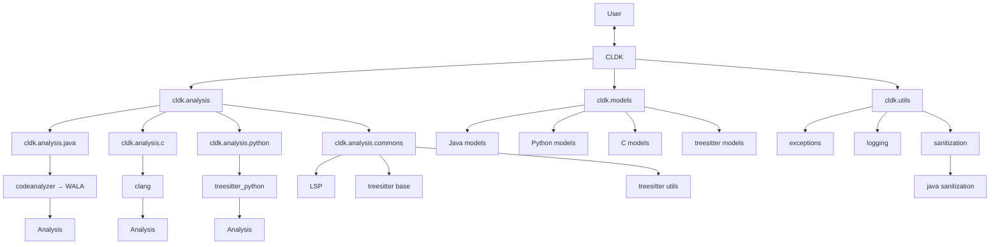

<picture>
  <source media="(prefers-color-scheme: dark)" srcset="https://github.com/codellm-devkit/.github/blob/main/profile/assets/cldk-dark.png">
  <source media="(prefers-color-scheme: light)" srcset="https://github.com/codellm-devkit/.github/blob/main/profile/assets/cldk-light.png">
  
</picture>
<p align='center'></p>
<p align='center'></p>
<p align='center'></p>
<p align='center'></p>
<p align='center'>
  <a href="https://arxiv.org/abs/2410.13007">
    
  </a>
  <a href="https://www.python.org/downloads/release/python-3110/">
    
  </a>
  <a href="https://opensource.org/licenses/Apache-2.0">
    
  </a>
  <a href="https://ibm.github.io/codellm-devkit/">
    
  </a>
  <a href="https://badge.fury.io/py/cldk">
    
  </a>
  <a href="https://discord.gg/zEjz9YrmqN">
    
  </a>
  <a href="https://github.com/YOUR_REPO/actions/workflows/test.yml">
  
</a>
  <a href="https://github.com/codellm-devkit/python-sdk">
  
  </a>
</p>

Codellm-Devkit (CLDK) is a multilingual program analysis framework that bridges the gap between traditional static analysis tools and Large Language Models (LLMs) specialized for code (CodeLLMs). Codellm-Devkit allows developers to streamline the process of transforming raw code into actionable insights by providing a unified interface for integrating outputs from various analysis tools and preparing them for effective use by CodeLLMs.

Codellm-Devkit simplifies the complex process of analyzing codebases that span multiple programming languages, making it easier to extract meaningful insights and drive LLM-based code analysis. `CLDK` achieves this through an open-source Python library that abstracts the intricacies of program analysis and LLM interactions. With this library, developer can streamline the process of transforming raw code into actionable insights by providing a unified interface for integrating outputs from various analysis tools and preparing them for effective use by CodeLLMs.

**The purpose of Codellm-Devkit is to enable the development and experimentation of robust analysis pipelines that harness the power of both traditional program analysis tools and CodeLLMs.**
By providing a consistent and extensible framework, Codellm-Devkit aims to reduce the friction associated with multi-language code analysis and ensure compatibility across different analysis tools and LLM platforms.

Codellm-Devkit is designed to integrate seamlessly with a variety of popular analysis tools, such as WALA, Tree-sitter, LLVM, and CodeQL, each implemented in different languages. Codellm-Devkit acts as a crucial intermediary layer, enabling efficient and consistent communication between these tools and the CodeLLMs.

Codellm-Devkit is constantly evolving to include new tools and frameworks, ensuring it remains a versatile solution for code analysis and LLM integration.

Codellm-Devkit is:

- **Unified**: Provides a single framework for integrating multiple analysis tools and CodeLLMs, regardless of the programming languages involved.
- **Extensible**: Designed to support new analysis tools and LLM platforms, making it adaptable to the evolving landscape of code analysis.
- **Streamlined**: Simplifies the process of transforming raw code into structured, LLM-ready inputs, reducing the overhead typically associated with multi-language analysis.

Codellm-Devkit is an ongoing project, developed at IBM Research.

## Contact

For any questions, feedback, or suggestions, please contact the authors:

| Name          | Email                                               |
| ------------- | --------------------------------------------------- |
| Rahul Krishna | [i.m.ralk@gmail.com](mailto:imralk+oss@gmail.com)   |
| Rangeet Pan   | [rangeet.pan@ibm.com](mailto:rangeet.pan@gmail.com) |
| Saurabh Sihna | [sinhas@us.ibm.com](mailto:sinhas@us.ibm.com)       |
## Table of Contents

- [Contact](#contact)
- [Table of Contents](#table-of-contents)
- [Quick Start](#quick-start)
- [Architectural and Design Overview](#architectural-and-design-overview)
  - [1. **Data Models**](#1-data-models)
  - [2. **Analysis Backends**](#2-analysis-backends)
    - [Java](#java)
    - [Python](#python)
    - [C](#c)
  - [3. **Utilities and Extensions**](#3-utilities-and-extensions)
- [Contributing](#contributing)
  - [Publication (papers and blogs related to CLDK)](#publication-papers-and-blogs-related-to-cldk)


## Quick Start

In this section, we will walk through a simple example to demonstrate how to get started with CLDK.

1. Install the CLDK package using pip:
 
   ```bash
   pip install cldk
   ```


2. To use CLDK, just import the `CLDK` class from the `cldk` module:
  
   ```python
   from cldk import CLDK
   ```

3. Next, to select a language for analysis, create an instance of the `CLDK` class with the desired language:

   ```python
   cldk = CLDK(language="java")  # For Java analysis
   ```

4. Create an analysis object over the Java application by providing the path to the project:

   ```python
   analysis = cldk.analysis(project_path="/path/to/your/java/project")
   ```
   This will initialize the analysis pipeline for the specified project. The analysis engine, in the backend, will parse the java project and build a symbol table representing the program structure and return the artifact to CLDK which will map it to the CLDK data schema (`cldk/models/java/models.py`).

   Depending on the size of the project, this step may take some time as it involves parsing, building, and statically analyzing the codebase.

5. Once the analysis is complete, you can call the various methods provided by the `analysis` object to interact with the analyzed codebase. For  example, you can retrieve method bodies, signatures, and call graphs.

    ```python
    # Iterate over all the files in the project
    from CLDK import cldk

    analysis: JavaAnalysis = CLDK(language="java").analysis(project_path="/path/to/your/java/project")
    
    all_files = [file_path for file_path, class_file in analysis.get_symbol_table().items()]

    # Process each file
    for file_path in all_files:
        # Additional processing can be done here
        pass 
    ```

    Likewise, you can also retrieve method bodies.

    ```python
    from cldk import CLDK

    analysis: JavaAnalysis = CLDK(language="java").analysis(project_path="/path/to/your/java/project")
    for class_file in analysis.get_symbol_table().values():
        for type_name, type_declaration in class_file.type_declarations.items():
            for method in type_declaration.callable_declarations.values():
                method_body = analysis.get_method_body(method.declaration)
                print(f"Method: {method.declaration}\nBody: {method_body}\n")
    ```

## Architectural and Design Overview

Below is a very high-level overview of the architectural of CLDK:




The user interacts with the CLDK API via the top-level `CLDK` interface exposed in `core.py`. This interface is responsible for configuring the analysis session, initializing language-specific pipelines, and exposing a high-level, language-agnostic API for interacting with program structure and semantics.

CLDK is currently implemented with full support for **Java**, **Python**, and **C**. Each language module is structured around two core components: **data models** and **analysis backends**.


### 1. **Data Models**

Each supported language has its own set of Pydantic-based data models, located in the `cldk.models` module (e.g., `cldk.models.java`, `cldk.models.python`, `cldk.models.c`). These models provide:

- **Structured representations** of language elements such as classes, methods, annotations, fields, and statements.
- **Typed access** using dot notation (e.g., `method.return_type` or `klass.methods`), promoting developer productivity.
- **Serialization support** to and from JSON and other formats, enabling easy storage, inspection, and exchange of analysis results.
- **Consistency** across languages via shared modeling conventions and base abstractions, including a common treesitter schema.


### 2. **Analysis Backends**

Each language has a dedicated analysis backend implemented under `cldk.analysis.<language>`, responsible for coordinating concrete analysis steps using language-specific tooling:

#### Java
- **Backend:** `cldk.analysis.java`  
- **Tools:** JavaParser, WALA (via CodeAnalyzer JAR)  
- **Capabilities:** Bytecode-level call graphs, symbol resolution, method declarations, type hierarchies

#### Python
- **Backend:** `cldk.analysis.python`  
- **Tools:** Tree-sitter  
- **Capabilities:** Lightweight structural parsing, method/function boundaries, control/data flow approximation

#### C
- **Backend:** `cldk.analysis.c`  
- **Tools:** Clang frontend  
- **Capabilities:** Structural symbol resolution and method/function layout using Clang AST

All analysis backends share common infrastructure defined in `cldk.analysis.commons`, including:
- **Tree-sitter utilities** (`treesitter_java`, `treesitter_python`)
- **LSP integration hooks**
- **Generic model builders and transformation utilities**

Backends are internally orchestrated such that the user does not interact with them directly. Instead, they simply call high-level SDK methods such as:

```python
get_method_body(...)
get_method_signature(...)
get_call_graph(...)
```

CLDK handles tool coordination, language resolution, parsing, transformation, and data marshalling under the hood.

---

### 3. **Utilities and Extensions**

The `cldk.utils` module provides additional support functionality:
- **Exception handling utilities**
- **Logging configuration**
- **Sanitization logic** (especially for Java, via `sanitization.java.treesitter_sanitizer`)

These modules ensure robustness and clean error management across backend interactions and user API layers.

## Contributing

We invite contributors of all levels of experience! We would love to see you get involved in the project. See the [CONTRIBUTING](./CONTRIBUTING.md) guide to get started.


### Publication (papers and blogs related to CLDK)
1. Krishna, Rahul, Rangeet Pan, Raju Pavuluri, Srikanth Tamilselvam, Maja Vukovic, and Saurabh Sinha. "[Codellm-Devkit: A Framework for Contextualizing Code LLMs with Program Analysis Insights.](https://arxiv.org/pdf/2410.13007)" arXiv preprint arXiv:2410.13007 (2024).
2. Pan, Rangeet, Myeongsoo Kim, Rahul Krishna, Raju Pavuluri, and Saurabh Sinha. "[Multi-language Unit Test Generation using LLMs.](https://arxiv.org/abs/2409.03093)" arXiv preprint arXiv:2409.03093 (2024).
3. Pan, Rangeet, Rahul Krishna, Raju Pavuluri, Saurabh Sinha, and Maja Vukovic., "[Simplify your Code LLM solutions using CodeLLM Dev Kit (CLDK).](https://www.linkedin.com/pulse/simplify-your-code-llm-solutions-using-codellm-dev-kit-rangeet-pan-vnnpe/?trackingId=kZ3U6d8GSDCs8S1oApXZgg%3D%3D)", Blog.

## Star History

<a href="https://www.star-history.com/#codellm-devkit/python-sdk&Timeline">
 <picture>
   <source media="(prefers-color-scheme: dark)" srcset="https://api.star-history.com/svg?repos=codellm-devkit/python-sdk&type=Timeline&theme=dark" />
   <source media="(prefers-color-scheme: light)" srcset="https://api.star-history.com/svg?repos=codellm-devkit/python-sdk&type=Timeline" />
   
 </picture>
</a>
