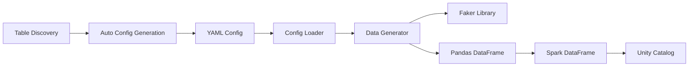

# CLOE Synthetic Data Generator

<div class="grid cards" markdown>

-   :material-database-plus:{ .lg .middle } __Generate Fake Data__

    ---

    Create realistic synthetic data for your Databricks Unity Catalog tables with ease

    [:octicons-arrow-right-24: Getting Started](getting-started.md)

-   :material-file-code:{ .lg .middle } __YAML Configuration__

    ---

    Define data generation rules declaratively using simple YAML configuration files

    [:octicons-arrow-right-24: Configuration Guide](configuration.md)

-   :material-console:{ .lg .middle } __CLI Commands__

    ---

    Powerful command-line interface for data generation, validation, and table discovery

    [:octicons-arrow-right-24: CLI Reference](cli-reference.md)

-   :material-table-search:{ .lg .middle } __Auto-Discovery__

    ---

    Automatically discover existing tables and generate configuration files

    [:octicons-arrow-right-24: Table Discovery](table-discovery.md)

</div>

## What is CLOE Synthetic Data Generator?

CLOE Synthetic Data Generator is a powerful Python library that helps you create realistic synthetic data for your Databricks Unity Catalog tables. It's designed to solve common challenges in data engineering and analytics:

### Problem it Solves

!!! question "Common Data Challenges"
    - **Development & Testing**: Need realistic data for development environments without exposing sensitive production data
    - **Data Privacy**: Generate synthetic data that maintains statistical properties while protecting privacy
    - **Performance Testing**: Create large datasets to test query performance and data pipeline scalability
    - **Demo & Training**: Generate consistent, realistic datasets for demonstrations and training purposes

### Key Features

- **🎭 Faker Integration**: Leverage the powerful [Faker](https://faker.readthedocs.io/) library with 100+ data providers
- **📄 YAML Configuration**: Define data generation rules using simple, declarative YAML files
- **🏗️ Type-Safe Schema**: Pydantic v2 models ensure your configurations are valid
- **🎯 Unity Catalog Support**: Direct integration with Databricks Unity Catalog
- **🔧 Flexible Data Types**: Support for all common Spark SQL data types
- **🚀 CLI Interface**: Easy-to-use command-line tools for common operations
- **🔍 Auto-Discovery**: Automatically discover existing tables and generate configurations

### Architecture Overview



## Quick Example

Here's a simple example to get you started:

1. **Create a configuration file** (`user_data.yaml`):

```yaml
name: "User Data Generation"
target:
  catalog: "main"
  schema: "test_data"
  table: "users"
  write_mode: "overwrite"

num_records: 1000

columns:
  - name: "user_id"
    data_type: "string"
    nullable: false
    faker_function: "uuid4"

  - name: "first_name"
    data_type: "string"
    nullable: false
    faker_function: "first_name"

  - name: "email"
    data_type: "string"
    nullable: false
    faker_function: "email"
```

2. **Generate the data**:

```bash
cloe-synthetic-data-generator generate --config user_data.yaml
```

That's it! Your Unity Catalog table will be populated with 1000 rows of realistic user data.

## What's Next?

<div class="grid cards" markdown>

-   [:material-rocket-launch: **Getting Started**](getting-started.md)

    Install the library and run your first data generation

-   [:material-cog: **Configuration Guide**](configuration.md)

    Learn how to create and customize YAML configuration files

-   [:material-console-line: **CLI Reference**](cli-reference.md)

    Explore all available command-line options and features

</div>
