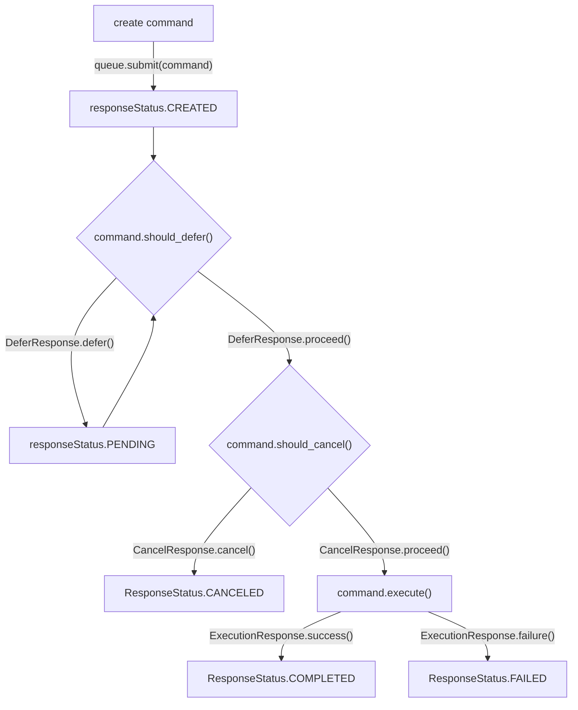

> Parts of this readme do not render correctly on pypi, see the [repository](https://github.com/alec-zaiane/command-system) for a better experience

# Command System
A type-safe implementation of the command pattern in Python, designed to handle command execution with a lifecycle that includes deferral, cancellation, and dependency management.

With this package, you can create commands that can be queued and manage their own lifecycle, allowing for interacting with external systems, or building your own systems with complex interactions in a safe, clean, and maintainable way.


## Example Usage
Simply subclass `Command`, `CommandArgs`, and optionally `CommandResponse` to create a custom command for your use case.

```python
# SayHelloCommand.py
from command_system import (
    Command,
    CommandArgs,
    CommandResponse,
    ExecutionResponse,
)
from dataclasses import dataclass

@dataclass
class SayHelloArgs(CommandArgs):
    name: str

@dataclass
class SayHelloResponse(CommandResponse):
    message: str = ""

class SayHelloCommand(Command[SayHelloArgs, SayHelloResponse]):
    ARGS = SayHelloArgs
    _response_type = SayHelloResponse

    def execute(self) -> ExecutionResponse:
        if not self.args.name:
            return ExecutionResponse.failure("Name cannot be empty.")
        self.response.message = f"Hello, {self.args.name}!"
        return ExecutionResponse.success()
```

You can then use the `CommandQueue` to submit commands, and then `queue.process_once()` or `queue.process_all()` to execute them.

```python
# main.py
from command_system import CommandQueue
from SayHelloCommand import SayHelloCommand, SayHelloArgs

queue = CommandQueue()
response = queue.submit(SayHelloCommand(SayHelloArgs(name="Alice")))
print(response.status) # Pending
queue.process_once()
print(response.status) # Completed
print(response.message) # Hello, Alice!
```

## Command Lifecycle

## Chaining Commands
You can chain commands together using the `CommandChainBuilder`. By doing this, you can create a sequence of commands that will be executed in order, passing the output of one command as the input to the next (with customizable transformations).

```python
from 
from my_command import MyCommand, MyCommandArgs
from my_other_command import MyOtherCommand, MyOtherCommandArgs

queue = CommandQueue()
chain = CommandChainBuilder[str, str].start(
    "my initial input",
    args_factory=lambda x: MyCommandArgs(input_data=x),
    command_class=MyCommand,
    result_extractor=lambda response: response.output_data,
).then(
    args_factory=lambda x: MyOtherCommandArgs(input_data=x, other_data="another value"),
    command_class=MyOtherCommand,
    result_extractor=lambda response: response.output_data,
).build(queue)

queue.submit(chain)
queue.process_all()
```

## Dependency Management
Commands can now define dependencies on other commands. Dependencies are evaluated before each lifecycle check begins, and they can preemptively defer or cancel the command based on their statuses.

Dependencies only have an effect when using the CommandQueue to process commands. If you write your own command processing logic, you will need to handle dependencies manually.

**It is your responsibility to ensure that dependencies do not create circular references that will cause an infinite loop.**

### Adding Dependencies
You can add dependencies to a command by passing them during initialization or using the `add_dependency` method. Dependencies can be other commands or wrapped in `DependencyEntry` for more control.

```python
from command_system import Command, CommandArgs, DependencyEntry
from MyCommand import MyCommand

# Example usage
dependency_command = MyCommand(MyCommand.ARGS())
main_command = MyCommand(MyCommand.ARGS(), dependencies=[dependency_command])
```

### Writing Dependency Rules
When defining dependencies, you can specify actions for different statuses of the dependent command:
- `on_pending`: What to do if the dependency is pending/created (default: "defer").
- `on_canceled`: What to do if the dependency is canceled (default: "cancel").
- `on_failed`: What to do if the dependency fails (default: "cancel").
- `on_completed`: What to do if the dependency is completed (default: "proceed").

### Example
```python
from command_system import CommandQueue, DependencyEntry
from MyCommand import MyCommand

queue = CommandQueue()
dependency_command = MyCommand(MyCommand.ARGS(...))
main_command = MyCommand(MyCommand.ARGS(...), dependencies=[DependencyEntry(dependency_command, on_pending="cancel")])

queue.submit(dependency_command)
queue.submit(main_command)
queue.process_once()
```

In this example, `main_command` will cancel if `dependency_command` is still pending.

## Creating a command
Subclass `CommandArgs` and add any arguments your command needs. This class will be used to pass parameters to your command.

> [!CAUTION]
> Don't add your arguments directly to the `Command` class. The args class is required for command chaining to work in a type-safe manner.

Subclass `Command` and set the `ARGS` class attribute to the subclass of `CommandArgs` you created. Implement the `execute` method to define the command's behavior.
- You can also override `should_defer` and `should_cancel` methods to control the command's lifecycle.

Optionally, you can create a custom response class by subclassing `CommandResponse` so that your command can return specific type-safe data. If you do this, set the `_response_type` class attribute of your `Command` subclass to your custom response class.

### Writing your `execute` method
> [!WARNING]  
> Your `execute` method should not return your custom response class directly. 
> The `self.response` attribute is automatically set to an instance of your custom response class, which you should *modify* instead. Then, return an `ExecutionResponse` instance to indicate the command's success or failure. 

### Writing `should_defer` and `should_cancel` methods
These methods can be overridden to control the command's lifecycle. They must return a `DeferResponse` or `CancelResponse` instance, respectively. You can use them to set conditions for deferring or canceling the command.

### Complex Command example
For an example of deferring and canceling commands, see the [tests/test_defer_cancel.py](tests/test_defer_cancel.py) file.