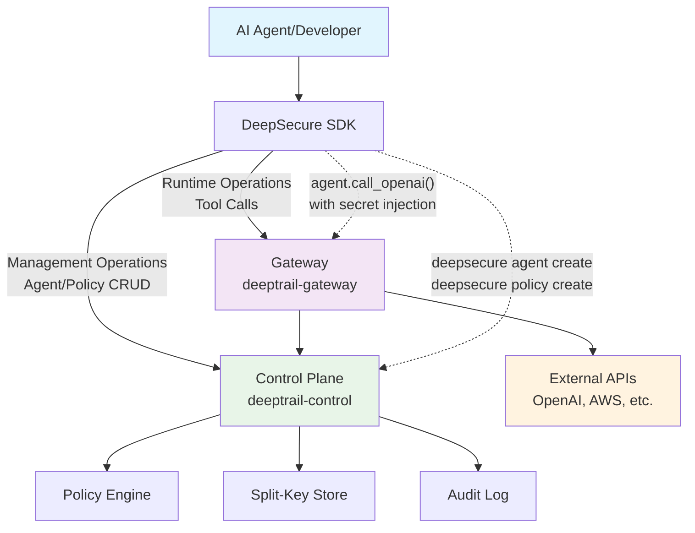

<!-- # DeepSecure: Zero-Trust Security Control Plane for AI Agents -->

<div align="center">
  <h1 style="display: flex; align-items: center;">
    
    <span style="margin-left: 15px;">DeepSecure: Effortless Identity & Auth for AI Agents</span>
  </h1>
  <a href="https://pypi.org/project/deepsecure/">
    
  </a>
  <a href="https://pepy.tech/projects/deepsecure">
    
  </a>
  <a href="https://pypi.org/project/deepsecure/">
    
  </a>
  <a href="https://opensource.org/licenses/Apache-2.0">
    
  </a>
  <a href="https://deepwiki.com/DeepTrail/deepsecure"></a>
  <br/>
  <a href="https://github.com/DeepTrail/deepsecure/stargazers">
    
  </a>
  <a href="https://github.com/DeepTrail/deepsecure/discussions">
    
  </a>
  <a href="https://github.com/DeepTrail/deepsecure/pulls">
    
  </a>
  <a href="https://x.com/imaxxs">
    
  </a>
  <a href="https://x.com/0xdeeptrail">
    
  </a>
  <a href="https://www.linkedin.com/company/deeptrail">
    
  </a>
</div>
<br/>

<div align="center">

  **Give every AI agent a cryptographic identity and authenticated ephemeral credentials.
  Handle auth, delegation, policy enforcement, and secure proxying automatically. Effortlessly add identity and auth to any AI agent -- regardless of any platform, any framework, and any model.**

[**📖 Documentation**](docs/) [**🎯 Examples**](examples/) [**💬 Community**](https://discord.gg/SUbswk8T)

</div>

## 🎯 Why DeepSecure?

### The Problem: AI Agents Are Security Nightmares

```python
# ❌ Current state: Security chaos
# 🔑 API keys scattered everywhere
os.environ["OPENAI_API_KEY"] = "sk-..." # Same key shared across all agents

# 🤖 No agent identity - who did what? which actions?
agent1 = YourFavoriteFramework()  # Anonymous agent
agent2 = AnotherFramework()  # Another anonymous agent

# 🚫 All-or-nothing permissions
agent.call_internal_api()  # Full admin access to everything
agent.call_external_api()  # Full admin access to everything

# No delegation, no policy enforcement, no audit trail
# Result: One breach = Complete system compromise
```

### The Solution: Comprehensive Zero-Trust for AI Agents

```python
# ✅ With DeepSecure: Complete security transformation
# 🔐 Cryptographic identity per agent  
client = deepsecure.Client()
agent = client.agent("financial-analyst", auto_create=True)  # Ed25519 identity

# 📋 Fine-grained policy enforcement happens automatically
# When agent fetches secrets, gateway validates JWT claims and enforces policy
secret = client.get_secret(
    agent_id=agent.id, 
    secret_name="openai-api", 
    path="/v1/chat/completions"
)
# Gateway enforces: Does agent have OpenAI access? Rate limits? Business hours?
# Policy controls which agents can access which APIs, when, and how often

# 🔄 Secure delegation between agents
delegation_token = client.delegate_access(
    delegator_agent_id=agent.id, 
    target_agent_id="data-processor", 
    resource="financial-data", 
    permissions=["read"], 
    ttl_seconds=1800)

# 📊 Complete audit trail + policy enforcement
# Every action logged, every access controlled, every delegation tracked
# Result: Zero-trust security with full visibility and control
```

## 🔥 From Security Nightmare to Zero-Trust Security

| **Without DeepSecure** | **With DeepSecure** |
|---|---|
| 🔑 **Shared API keys** | 🛡️ **AI Agents don't have access to API keys** |
| 🤖 **No Agent Identity** | 🔐 **AI Agents get Ed25519 Cryptographic Identity** |
| 🚫 **No Access Control** | 📋 **AI Agents with Fine-Grained Policies** |
| 📊 **No delegation and tracking** | 📊 **AI Agents with crypotographic delegation and audit trail** |
| 🏭 **Production Blockers** | 🚀 **Enterprise-Ready** |

## ⚙️ Getting Started

Get fully set up with DeepSecure in under 5 minutes—secure your AI agents instantly!

### Prerequisites
- **Python 3.9+**
- **pip** (Python package installer) 
- **Access to an OS keyring** (macOS Keychain, Windows Credential Store, or Linux keyring) for secure agent private key storage
- **Docker and Docker Compose** for running the backend services

### 1. Install DeepSecure
```bash
pip install deepsecure
```

### 2. Backend Services Setup

DeepSecure uses a dual-service architecture:
- **`deeptrail-control`** - Control Plane (manages agents, policies, credentials)  
- **`deeptrail-gateway`** - Data Plane (enforces policies, injects secrets)

#### Quick Start with Docker Compose
```bash
# Clone the repository
git clone https://github.com/DeepTrail/deepsecure.git
cd deepsecure

# Start both services
docker-compose up -d

# Verify services are running
docker-compose ps
```

This will start:
- **Control Plane** at `http://localhost:8000`
- **Gateway** at `http://localhost:8001`
- **PostgreSQL** database for persistent storage

### 3. Configure DeepSecure CLI
```bash
# Set the control plane URL
deepsecure configure set-url http://localhost:8000

# Verify connection
deepsecure health
```

### 4. Verify Installation
```bash
# Check version
deepsecure --version

# Test agent creation
deepsecure agent create --name "test-agent"
```

🎉 **You're all set!** Your secure AI agent infrastructure is now running.

**Next Steps:**
- Try the [30-second quickstart](#-30-second-quickstart) below
- Explore our [examples](#-examples) for real-world use cases
- Read the [Architecture Guide](docs/design/deepsecure-technical-overview.md) to understand the system

---

## ⚡ 30-Second Quickstart

```bash
# 1. Install DeepSecure
pip install deepsecure

# 2. Connect to your security control plane
# For local development:
deepsecure configure set-url http://localhost:8001

# For production (your deployed instance):  
# deepsecure configure set-url https://deepsecure.yourcompany.com

# 3. Create your first AI agent identity
deepsecure agent create --name "my-ai-agent"

# 4. Use in your AI code
import deepsecure

client = deepsecure.Client()
agent = client.agent("my-ai-agent", auto_create=True)
secret = client.get_secret(name="openai-api", agent_name=agent.name)

# That's it! Your agent now has secure, audited access to OpenAI
```

**🎯 What you just achieved:**
- ✅ **Centralized Security**: All your AI agents use one security control plane
- ✅ **Zero Hardcoded Secrets**: Agents get ephemeral credentials automatically  
- ✅ **Unique Identity**: Each agent has cryptographic identity (Ed25519)
- ✅ **Complete Audit Trail**: Every action is logged for compliance and debugging
- 🛡️ **Policy Enforcement Ready**: Fine-grained access control available via `deepsecure policy` commands

## 🏗️ Architecture: Control Plane + Data Plane

DeepSecure implements a **dual-service architecture** designed for production scale:

### 🧠 Control Plane (`deeptrail-control`)
- **Agent Identity Management**: Ed25519 cryptographic identities
- **Policy Engine**: Fine-grained RBAC with delegation support
- **Credential Issuance**: Ephemeral, time-bound access tokens
- **Audit Logging**: Immutable security event tracking

### 🚀 Data Plane (`deeptrail-gateway`)
- **Secret Injection**: Automatic API key insertion at runtime
- **Policy Enforcement**: Real-time access control decisions
- **Split-Key Security**: Client/backend key reassembly for ultimate protection
- **Request Proxying**: Transparent handling of all agent tool calls


## 🔬 Examples

Explore our comprehensive example collection:

| Example | Description | Framework |
|---|---|---|
| [**Basic Agent Creation**](examples/01_create_agent_and_issue_credential.py) | Create your first secure agent | Core SDK |
| [**LangChain Integration**](examples/05_langchain_secure_tools.py) | Secure LangChain agents | LangChain |
| [**CrewAI Team Security**](examples/03_crewai_secure_tools.py) | Multi-agent crew with delegation | CrewAI |
| [**Gateway Injection**](examples/08_gateway_secret_injection_demo.py) | Automatic secret injection | Core SDK |
| [**Advanced Delegation**](examples/11_advanced_delegation_patterns.py) | Complex delegation workflows | Core SDK |
| [**Platform Bootstrap**](examples/12_platform_expansion_bootstrap.py) | Kubernetes/AWS agent bootstrapping | Infrastructure |

## 🚀 What's Next?

You've now seen the core workflow! Ready to dive deeper?

### 📚 Documentation
| Resource | Description |
|---|---|
| [**🚀 Getting Started**](docs/getting-started.md) | Complete setup guide with examples |
| [**🔧 CLI Reference**](docs/cli-reference.md) | All commands and options |
| [**📖 SDK Documentation**](docs/sdk/) | Python SDK with full API reference |
| [**🏗️ Architecture Guide**](docs/design/deepsecure-technical-overview.md) | Deep dive into system design |
| [**🔒 Security Model**](docs/security-model.md) | Cryptographic foundations |
| [**🚀 Deployment Guide**](docs/deployment/) | Production deployment patterns |

For hands-on examples, explore our [`examples/`](examples/) directory with LangChain, CrewAI, and multi-agent patterns.

## 🤝 Contributing

DeepSecure is open source, and your contributions are vital! Help us build the future of AI agent security.

🌟 **Star our GitHub Repository!**  
🐛 **Report Bugs or Feature Requests**: Use [GitHub Issues](https://github.com/yourusername/deepsecure-cli/issues).  
💡 **Suggest Features**: Share ideas on [GitHub Issues](https://github.com/yourusername/deepsecure-cli/issues) or [GitHub Discussions](https://github.com/yourusername/deepsecure-cli/discussions).  
📝 **Improve Documentation**: Help us make our guides clearer.  
💻 **Write Code**: Tackle bugs, add features, improve integrations.

For details on how to set up your development environment and contribute, please see our [Contributing Guide](CONTRIBUTING.md).

## 🫂 Community & Support

**GitHub Discussions**: The primary forum for questions, sharing use cases, brainstorming ideas, and general discussions about DeepSecure and AI agent security. This is where we want to build our community!

**GitHub Issues**: For bug reports and specific, actionable feature requests.

We're committed to fostering an open and welcoming community.

## 📜 License

This project is licensed under the terms of the [Apache 2.0 License](LICENSE).

---

<div align="center">

**⭐ Star us on GitHub if DeepSecure helps secure your AI agents!**

[**🚀 Get Started**](#-30-second-quickstart) • [**📖 Documentation**](docs/) • [**💬 Join Discord**](https://discord.gg/deepsecure)

*Built with ❤️ for the AI agent developer community*

</div>
