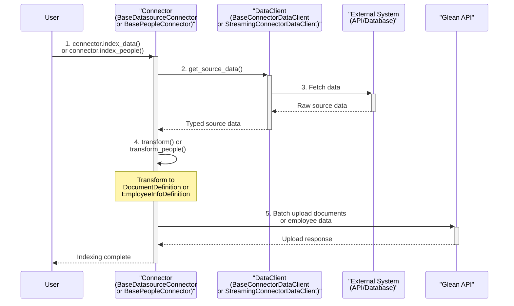

# Glean Indexing SDK

A Python SDK for building custom Glean indexing integrations. This package provides the base classes and utilities to create custom connectors for Glean's indexing APIs.

> [!WARNING]
> This is an experimental repository. APIs, interfaces, and functionality may change significantly without notice.

## Installation

```bash
pip install glean-indexing-sdk
```

## Architecture Overview

The Glean Indexing SDK follows a simple, predictable pattern for all connector types. Understanding this flow will help you implement any connector quickly:



**Key Components:**

1. **DataClient** - Fetches raw data from your external system (API, database, files, etc.)
2. **Connector** - Transforms your data into Glean's format and handles the upload process

---

## Datasource Connectors

Use datasource connectors to index documents, files, and content from external systems into Glean. This is the most common use case.

## Datasource Quickstart

### Environment Setup

1. Set up environment variables for Glean API access:

    ```bash
    # Copy the environment template
    cp env.template .env

    # Set your Glean credentials
    export GLEAN_INSTANCE="acme"
    export GLEAN_INDEXING_API_TOKEN="your-indexing-api-token"
    ```

> [!TIP] Choose the right connector type:
>
> **BaseDatasourceConnector** - For most use cases where all data can fit comfortably in memory and your API can return all data efficiently in one call.
> **BaseStreamingDatasourceConnector** - For very large datasets, memory-constrained environments, or when your API requires incremental/paginated access.
> **Single Document Indexing** - For real-time updates of individual documents

## BaseDatasourceConnector

### When to Use This

#### Perfect for

- Document repositories where all data can fit comfortably in memory
- Wikis, knowledge bases, documentation sites
- File systems with moderate amounts of content
- Systems where you can fetch all data in memory at once
- Documents that cannot be fetched via paginated APIs

#### Avoid when

- You have very large datasets that cannot fit in memory
- Documents are very large (> 10MB each)
- Memory usage is a concern

### Step-by-Step Implementation

#### Step 1: Define Your Data Type

```python snippet=non_streaming/wiki_page_data.py
from typing import List, TypedDict


class WikiPageData(TypedDict):
    """Type definition for your source data structure."""

    id: str
    title: str
    content: str
    author: str
    created_at: str
    updated_at: str
    url: str
    tags: List[str]
```

#### Step 2: Create Your DataClient

```python snippet=non_streaming/wiki_data_client.py
from typing import Sequence

from glean.indexing.connectors.base_data_client import BaseConnectorDataClient

from .wiki_page_data import WikiPageData


class WikiDataClient(BaseConnectorDataClient[WikiPageData]):
    """Fetches data from your external system."""

    def __init__(self, wiki_base_url: str, api_token: str):
        self.wiki_base_url = wiki_base_url
        self.api_token = api_token

    def get_source_data(self, since=None) -> Sequence[WikiPageData]:
        """Fetch all your documents here."""
        # Your implementation here - call APIs, read files, query databases
        pass
```

#### Step 3: Create Your Connector

```python snippet=non_streaming/wiki_connector.py
from typing import List, Sequence

from glean.indexing.connectors import BaseDatasourceConnector
from glean.indexing.models import (
    ContentDefinition,
    CustomDatasourceConfig,
    DocumentDefinition,
    UserReferenceDefinition,
)

from .wiki_page_data import WikiPageData


class CompanyWikiConnector(BaseDatasourceConnector[WikiPageData]):
    """Transform and upload your data to Glean."""

    configuration: CustomDatasourceConfig = CustomDatasourceConfig(
        name="company_wiki",
        display_name="Company Wiki",
        url_regex=r"https://wiki\.company\.com/.*",
        trust_url_regex_for_view_activity=True,
        is_user_referenced_by_email=True,
    )

    def transform(self, data: Sequence[WikiPageData]) -> List[DocumentDefinition]:
        """Transform your data to Glean's format."""
        documents = []
        for page in data:
            document = DocumentDefinition(
                id=page["id"],
                title=page["title"],
                datasource=self.name,
                view_url=page["url"],
                body=ContentDefinition(mime_type="text/plain", text_content=page["content"]),
                author=UserReferenceDefinition(email=page["author"]),
                created_at=self._parse_timestamp(page["created_at"]),
                updated_at=self._parse_timestamp(page["updated_at"]),
                tags=page["tags"],
            )
            documents.append(document)
        return documents

    def _parse_timestamp(self, timestamp_str: str) -> int:
        """Convert ISO timestamp to Unix epoch seconds."""
        from datetime import datetime

        dt = datetime.fromisoformat(timestamp_str.replace("Z", "+00:00"))
        return int(dt.timestamp())
```

#### Step 4: Run the Connector

```python snippet=non_streaming/run_connector.py
from glean.indexing.models import IndexingMode

from .wiki_connector import CompanyWikiConnector
from .wiki_data_client import WikiDataClient

# Initialize
data_client = WikiDataClient(wiki_base_url="https://wiki.company.com", api_token="your-wiki-token")
connector = CompanyWikiConnector(name="company_wiki", data_client=data_client)

# Configure the datasource in Glean
connector.configure_datasource()

# Index all documents
connector.index_data(mode=IndexingMode.FULL)
```

**When to use forced restarts:**
- When you need to abort and restart a failed or interrupted upload
- When you want to ensure a clean upload state by discarding partial uploads  
- When recovering from upload errors or inconsistent states

**How it works:**
- Generates a new `upload_id` to ensure clean separation from previous uploads
- Sets `forceRestartUpload=True` on the **first batch only**
- Continues with normal batch processing for subsequent batches

This feature is available on all connector types: `BaseDatasourceConnector`, `BaseStreamingDatasourceConnector`, and `BasePeopleConnector`.

### Complete Example

```python snippet=non_streaming/complete.py
from typing import List, Sequence, TypedDict

from glean.indexing.connectors import BaseConnectorDataClient, BaseDatasourceConnector
from glean.indexing.models import (
    ContentDefinition,
    CustomDatasourceConfig,
    DocumentDefinition,
    IndexingMode,
    UserReferenceDefinition,
)


class WikiPageData(TypedDict):
    id: str
    title: str
    content: str
    author: str
    created_at: str
    updated_at: str
    url: str
    tags: List[str]


class WikiDataClient(BaseConnectorDataClient[WikiPageData]):
    def __init__(self, wiki_base_url: str, api_token: str):
        self.wiki_base_url = wiki_base_url
        self.api_token = api_token

    def get_source_data(self, since=None) -> Sequence[WikiPageData]:
        # Example static data
        return [
            {
                "id": "page_123",
                "title": "Engineering Onboarding Guide",
                "content": "Welcome to the engineering team...",
                "author": "jane.smith@company.com",
                "created_at": "2024-01-15T10:00:00Z",
                "updated_at": "2024-02-01T14:30:00Z",
                "url": f"{self.wiki_base_url}/pages/123",
                "tags": ["onboarding", "engineering"],
            },
            {
                "id": "page_124",
                "title": "API Documentation Standards",
                "content": "Our standards for API documentation...",
                "author": "john.doe@company.com",
                "created_at": "2024-01-20T09:15:00Z",
                "updated_at": "2024-01-25T16:45:00Z",
                "url": f"{self.wiki_base_url}/pages/124",
                "tags": ["api", "documentation", "standards"],
            },
        ]


class CompanyWikiConnector(BaseDatasourceConnector[WikiPageData]):
    configuration: CustomDatasourceConfig = CustomDatasourceConfig(
        name="company_wiki",
        display_name="Company Wiki",
        url_regex=r"https://wiki\.company\.com/.*",
        trust_url_regex_for_view_activity=True,
        is_user_referenced_by_email=True,
    )

    def transform(self, data: Sequence[WikiPageData]) -> List[DocumentDefinition]:
        documents = []
        for page in data:
            documents.append(
                DocumentDefinition(
                    id=page["id"],
                    title=page["title"],
                    datasource=self.name,
                    view_url=page["url"],
                    body=ContentDefinition(mime_type="text/plain", text_content=page["content"]),
                    author=UserReferenceDefinition(email=page["author"]),
                    created_at=self._parse_timestamp(page["created_at"]),
                    updated_at=self._parse_timestamp(page["updated_at"]),
                    tags=page["tags"],
                )
            )
        return documents

    def _parse_timestamp(self, timestamp_str: str) -> int:
        from datetime import datetime

        dt = datetime.fromisoformat(timestamp_str.replace("Z", "+00:00"))
        return int(dt.timestamp())


data_client = WikiDataClient(wiki_base_url="https://wiki.company.com", api_token="your-wiki-token")
connector = CompanyWikiConnector(name="company_wiki", data_client=data_client)
connector.configure_datasource()
connector.index_data(mode=IndexingMode.FULL)
```

## BaseStreamingDatasourceConnector

### When to Use This

#### Perfect for

- Large document repositories that cannot fit in memory
- Memory-constrained environments
- Documents that are fetched via paginated APIs
- Very large individual documents (> 10MB)
- When you want to process data incrementally

#### Avoid when

- You have a small document set that fits comfortably in memory
- Your API can return all data efficiently in one call
- Memory usage is not a concern

### Step-by-Step Implementation

#### Step 1: Define Your Data Type

```python snippet=streaming/article_data.py
from typing import TypedDict


class ArticleData(TypedDict):
    """Type definition for knowledge base article data."""

    id: str
    title: str
    content: str
    author: str
    updated_at: str
    url: str
```

#### Step 2: Create Your Streaming DataClient

```python snippet=streaming/article_data_client.py
from typing import Generator

import requests

from glean.indexing.connectors.base_streaming_data_client import StreamingConnectorDataClient

from .article_data import ArticleData


class LargeKnowledgeBaseClient(StreamingConnectorDataClient[ArticleData]):
    """Streaming client that yields data incrementally."""

    def __init__(self, kb_api_url: str, api_key: str):
        self.kb_api_url = kb_api_url
        self.api_key = api_key

    def get_source_data(self, since=None) -> Generator[ArticleData, None, None]:
        """Stream documents one page at a time to save memory."""
        page = 1
        page_size = 100

        while True:
            params = {"page": page, "size": page_size}
            if since:
                params["modified_since"] = since

            response = requests.get(
                f"{self.kb_api_url}/articles",
                headers={"Authorization": f"Bearer {self.api_key}"},
                params=params,
            )
            response.raise_for_status()

            data = response.json()
            articles = data.get("articles", [])

            if not articles:
                break

            for article in articles:
                yield ArticleData(article)

            if len(articles) < page_size:
                break

            page += 1
```

#### Step 3: Create Your Streaming Connector

```python snippet=streaming/article_connector.py
from typing import List, Sequence

from glean.api_client.models.userreferencedefinition import UserReferenceDefinition
from glean.indexing.connectors import BaseStreamingDatasourceConnector
from glean.indexing.models import ContentDefinition, CustomDatasourceConfig, DocumentDefinition

from .article_data import ArticleData


class KnowledgeBaseConnector(BaseStreamingDatasourceConnector[ArticleData]):
    configuration: CustomDatasourceConfig = CustomDatasourceConfig(
        name="knowledge_base",
        display_name="Knowledge Base",
        url_regex=r"https://kb\.company\.com/.*",
        trust_url_regex_for_view_activity=True,
    )

    def __init__(self, name: str, data_client):
        super().__init__(name, data_client)
        self.batch_size = 50

    def transform(self, data: Sequence[ArticleData]) -> List[DocumentDefinition]:
        documents = []
        for article in data:
            documents.append(
                DocumentDefinition(
                    id=article["id"],
                    title=article["title"],
                    datasource=self.name,
                    view_url=article["url"],
                    body=ContentDefinition(mime_type="text/html", text_content=article["content"]),
                    author=UserReferenceDefinition(email=article["author"]),
                    updated_at=self._parse_timestamp(article["updated_at"]),
                )
            )
        return documents

    def _parse_timestamp(self, timestamp_str: str) -> int:
        from datetime import datetime

        dt = datetime.fromisoformat(timestamp_str.replace("Z", "+00:00"))
        return int(dt.timestamp())
```

#### Step 4: Run the Connector

```python snippet=streaming/run_connector.py
from glean.indexing.models import IndexingMode

from .article_connector import KnowledgeBaseConnector
from .article_data_client import LargeKnowledgeBaseClient

data_client = LargeKnowledgeBaseClient(
    kb_api_url="https://kb-api.company.com", api_key="your-kb-api-key"
)
connector = KnowledgeBaseConnector(name="knowledge_base", data_client=data_client)

connector.configure_datasource()
connector.index_data(mode=IndexingMode.FULL)
```
