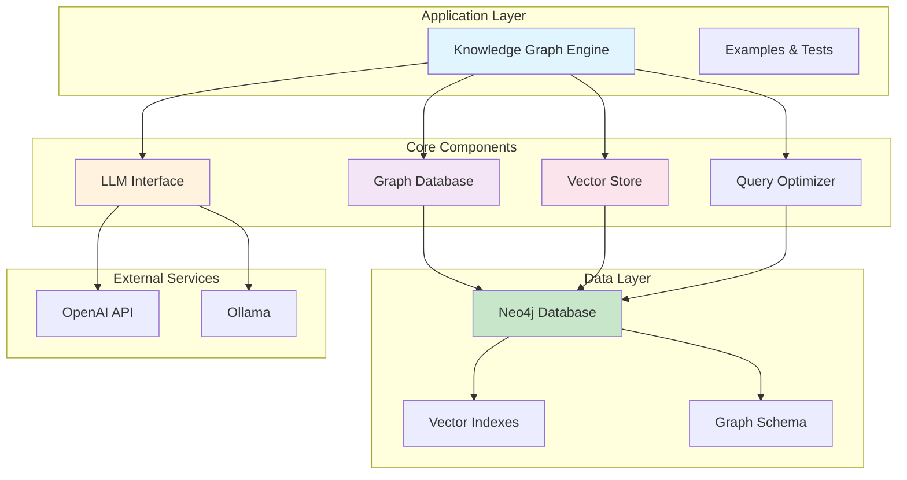
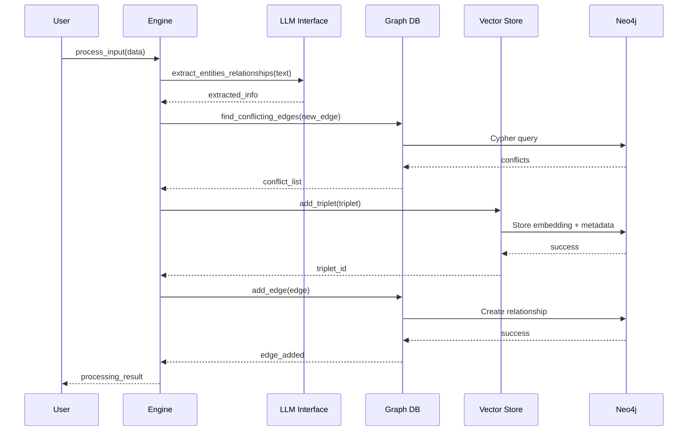
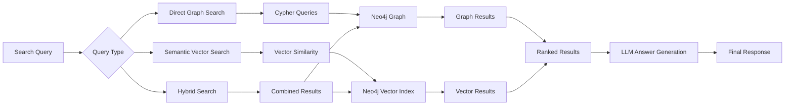

# System Overview

The Knowledge Graph Engine v2 is a modern, Neo4j-based knowledge graph system that combines graph database capabilities with semantic vector search for intelligent information storage and retrieval.

## Version 2.1.0 Enhancements
- **Improved Search Precision**: Dynamic similarity thresholds (0.3 base) with contextual boosting
- **Semantic Category Matching**: Better understanding of conceptual relationships
- **Restructured Architecture**: Organized into logical submodules for better maintainability

## 🏗️ High-Level Architecture

## 🔧 Core Components

### 1. **Knowledge Graph Engine** (`engine.py`)
The main orchestrator that coordinates all components and provides the primary API interface.

**Responsibilities:**
- Process input data and extract relationships
- Coordinate conflict resolution
- Manage temporal relationships
- Provide unified search interface

**Key Methods:**
- `process_input()` - Process new information
- `search()` - Query the knowledge graph
- `clear_all_data()` - Reset the system

### 2. **LLM Interface** (`llm_interface.py`)
Handles all Large Language Model interactions for intelligent text processing.

**Responsibilities:**
- Entity and relationship extraction from natural language
- Query parsing and understanding  
- Answer generation from search results
- Fallback pattern matching when LLM is unavailable

**Supported Models:**
- OpenAI GPT models
- Ollama local models (llama3.2, phi3, etc.)

### 3. **Graph Database** (`graph_db.py`)
Neo4j-based graph storage and operations for relationship management.

**Responsibilities:**
- Store and query graph relationships
- Conflict detection and resolution
- Temporal relationship tracking
- Entity relationship management

**Key Features:**
- ACID compliance through Neo4j
- Efficient Cypher queries
- Relationship validation
- History tracking

### 4. **Vector Store** (`neo4j_vector_store.py`)
Manages vector embeddings and semantic search capabilities.

**Responsibilities:**
- Generate and store embeddings
- Semantic similarity search
- Vector index management
- Precision-optimized search results

**Key Features:**
- Neo4j vector indexes for performance
- Contextual relevance filtering
- Keyword overlap scoring
- Similarity thresholds

### 5. **Query Optimizer** (`graph_query_optimizer.py`)
Optimizes graph queries for performance and accuracy.

**Responsibilities:**
- Query plan optimization
- Index usage recommendations
- Performance monitoring
- Query pattern analysis

## 📊 Data Flow

## 🔍 Search Architecture

## 🎯 Key Design Decisions

### 1. **Neo4j-Only Architecture**
- **Decision**: Use only Neo4j for both graph and vector storage
- **Rationale**: Eliminates complexity of multiple databases, better consistency
- **Benefits**: Simplified deployment, ACID transactions, unified querying

### 2. **Hybrid Vector Store**
- **Decision**: Combine custom Neo4j vector store with LlamaIndex compatibility
- **Rationale**: Modern Neo4j procedures, better deprecation handling
- **Benefits**: No deprecation warnings, optimized performance

### 3. **Contextual Search Filtering**
- **Decision**: Implement intelligent relevance filtering for vector search
- **Rationale**: Pure cosine similarity can return irrelevant results
- **Benefits**: Higher precision, contextually appropriate results

### 4. **Temporal Relationship Management**
- **Decision**: Track relationship history with obsolete flags and date ranges
- **Rationale**: Real-world information changes over time
- **Benefits**: Complete audit trail, temporal queries possible

### 5. **Modular LLM Support**
- **Decision**: Support both OpenAI and Ollama with fallback patterns
- **Rationale**: Flexibility for different deployment scenarios
- **Benefits**: Works offline, cost control, privacy options

## 🚀 Performance Characteristics

### Graph Operations
- **Node Creation**: ~1ms per node
- **Relationship Creation**: ~2ms per relationship  
- **Conflict Detection**: ~5-10ms per check
- **Graph Traversal**: ~10-50ms depending on depth

### Vector Operations
- **Embedding Generation**: ~50-100ms per text
- **Vector Search**: ~20-100ms depending on dataset size
- **Index Updates**: ~10ms per embedding

### End-to-End Processing
- **Single Input Item**: ~200-500ms
- **Batch Processing**: ~100-200ms per item
- **Search Queries**: ~100-300ms including answer generation

## 🔧 Configuration Management

The system uses a hierarchical configuration approach:

1. **Environment Variables** (highest priority)
2. **Configuration Files** (.env, config files)
3. **Default Values** (fallback)

Key configuration areas:
- Neo4j connection settings
- LLM model selection and endpoints
- Vector embedding parameters  
- Performance tuning options
- Logging and monitoring settings

## 🛡️ Error Handling Strategy

### Graceful Degradation
- LLM unavailable → Fall back to pattern matching
- Vector search fails → Use graph-only search
- Neo4j connection issues → Detailed error reporting with retry logic

### Data Consistency
- Transaction-based operations
- Rollback on failures
- Validation at multiple levels
- Comprehensive logging for debugging

## 📈 Scalability Considerations

### Current Limitations
- Single Neo4j instance (can be clustered)
- Python GIL for concurrent processing
- Memory usage for embedding storage

### Scaling Strategies
- **Horizontal**: Neo4j clustering, read replicas
- **Vertical**: Larger instances, more memory
- **Caching**: Query result caching, embedding caching
- **Optimization**: Query optimization, index tuning