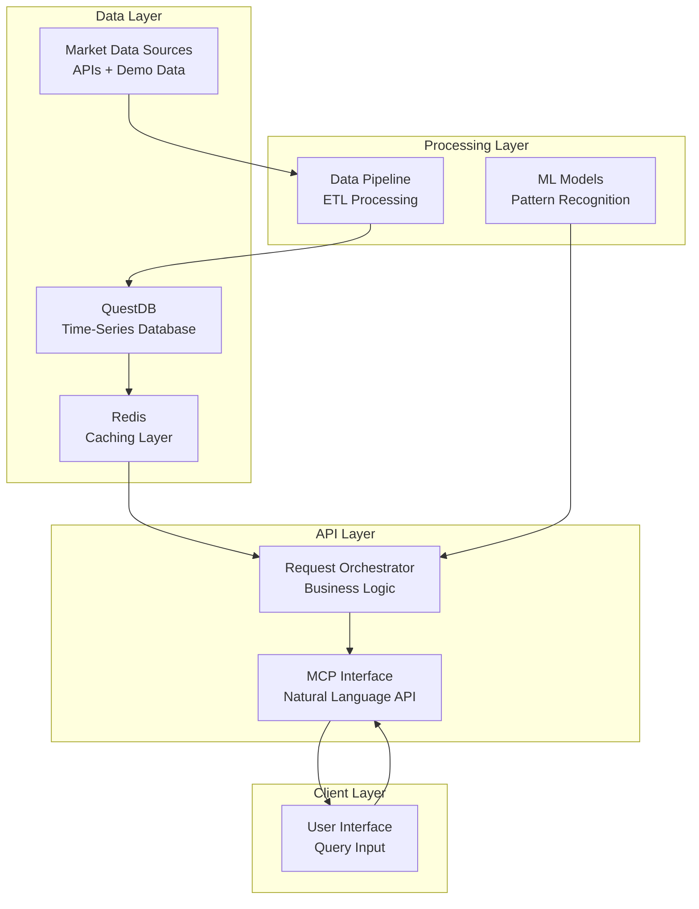

# Smart Stock Screener System Architecture

## Overview

The Smart Stock Screener is a financial analysis system that provides real-time stock screening capabilities through natural language queries. The system integrates multiple data sources and AI models to deliver actionable market insights via a simple API interface.

**Core Objective**: Enable users to query stock market data using natural language and receive structured analysis results with confidence scores and reasoning.

## System Architecture

The system consists of four main components that work together to process market data and respond to user queries:



## Core Components

### 1. Data Pipeline Service

**Purpose**: Ingests, processes, and stores market data from multiple sources.

**Technology Stack**:
- Python data processing
- Apache Kafka for streaming (optional)
- Data validation and cleansing

**Data Sources**:
- Market APIs (Alpha Vantage, Polygon.io)
- QuestDB demo dataset (1.6B+ crypto records)
- News sentiment feeds
- SEC filings

**Key Functions**:
```python
class DataPipeline:
    def ingest_market_data(self, symbols: List[str]) -> None:
        """Fetch and store OHLCV data for specified symbols"""
        
    def process_sentiment_data(self, articles: List[Article]) -> None:
        """Extract and score sentiment from news articles"""
        
    def update_technical_indicators(self, symbol: str) -> None:
        """Calculate and store technical analysis indicators"""
```

### 2. QuestDB Storage Layer

**Purpose**: High-performance time-series storage for all market data.

**Schema Design**:
```sql
-- Primary market data table
CREATE TABLE market_data (
    timestamp TIMESTAMP,
    symbol SYMBOL CAPACITY 10000 CACHE,
    price DOUBLE,
    volume LONG,
    high DOUBLE,
    low DOUBLE,
    close DOUBLE,
    market_cap DOUBLE
) timestamp(timestamp) PARTITION BY DAY WAL;

-- Technical indicators table
CREATE TABLE indicators (
    timestamp TIMESTAMP,
    symbol SYMBOL CAPACITY 10000 CACHE,
    rsi DOUBLE,
    macd DOUBLE,
    bollinger_upper DOUBLE,
    bollinger_lower DOUBLE,
    moving_avg_20 DOUBLE,
    moving_avg_50 DOUBLE
) timestamp(timestamp) PARTITION BY DAY WAL;

-- Sentiment analysis table
CREATE TABLE sentiment (
    timestamp TIMESTAMP,
    symbol SYMBOL CAPACITY 10000 CACHE,
    news_sentiment DOUBLE,
    social_sentiment DOUBLE,
    confidence_score DOUBLE,
    article_count INT
) timestamp(timestamp) PARTITION BY DAY WAL;
```

**Performance Requirements**:
- Sub-millisecond query response time
- Support for 1M+ records per day
- 99.9% availability

### 3. AI Processing Layer

**Purpose**: Machine learning models for pattern recognition and market analysis.

**Model Components**:
```python
class MarketAnalyzer:
    def __init__(self):
        self.pattern_recognizer = XGBoostModel()
        self.trend_analyzer = LSTMModel()
        self.sentiment_processor = BERTModel()
        
    async def analyze_stock(self, symbol: str) -> AnalysisResult:
        """Comprehensive stock analysis combining technical and fundamental data"""
        technical_signals = await self.pattern_recognizer.predict(symbol)
        trend_forecast = await self.trend_analyzer.predict(symbol)
        sentiment_score = await self.sentiment_processor.analyze(symbol)
        
        return AnalysisResult(
            symbol=symbol,
            technical_score=technical_signals.score,
            trend_direction=trend_forecast.direction,
            sentiment_score=sentiment_score,
            confidence=self.calculate_confidence(technical_signals, trend_forecast, sentiment_score)
        )
```

**Model Specifications**:
- **Pattern Recognition**: XGBoost classifier for technical patterns
- **Trend Analysis**: LSTM for price movement prediction
- **Sentiment Analysis**: BERT-based model for news/social sentiment

### 4. MCP API Interface

**Purpose**: Natural language interface for stock screening queries.

**API Endpoints**:
```python
@mcp_tool("stock_screener")
async def screen_stocks(query: str) -> ScreeningResult:
    """
    Process natural language stock screening queries.
    
    Examples:
    - "Find momentum stocks with RSI under 30"
    - "Show me tech stocks with strong earnings growth"
    - "What are the best value plays in healthcare?"
    """
    parsed_criteria = await parse_query(query)
    results = await execute_screen(parsed_criteria)
    return format_response(results)

@mcp_tool("stock_analysis")
async def analyze_stock(symbol: str) -> DetailedAnalysis:
    """
    Provide comprehensive analysis for a specific stock.
    """
    return await comprehensive_analysis(symbol)
```

## Data Models

### Core Data Structures

```typescript
interface StockData {
    symbol: string;
    timestamp: Date;
    price: number;
    volume: number;
    marketCap: number;
    technicalIndicators: {
        rsi: number;
        macd: number;
        movingAverage20: number;
        movingAverage50: number;
    };
    sentiment: {
        newsScore: number;
        socialScore: number;
        confidence: number;
    };
}

interface ScreeningCriteria {
    marketCapRange?: [number, number];
    priceRange?: [number, number];
    volumeThreshold?: number;
    technicalFilters?: {
        rsi?: { min?: number, max?: number };
        macd?: 'bullish' | 'bearish';
    };
    sectors?: string[];
    sentimentThreshold?: number;
}

interface ScreeningResult {
    matches: StockData[];
    totalResults: number;
    query: string;
    executionTime: number;
    confidence: number;
}
```

## Performance Requirements

### Response Time Targets
- Stock screening queries: < 500ms (95th percentile)
- Individual stock analysis: < 200ms (95th percentile)
- Data pipeline processing: < 30 seconds for full market update

### Scalability Targets
- Support 1000+ concurrent screening requests
- Process 10,000+ symbols in real-time
- Handle 1M+ data points per trading day

### Availability Requirements
- 99.9% uptime during market hours
- Graceful degradation during data source outages
- Automatic failover for critical components

## Error Handling

```python
class ErrorHandler:
    async def handle_data_source_failure(self, source: str, error: Exception):
        """Implement circuit breaker pattern for data sources"""
        if self.circuit_breaker.is_open(source):
            return await self.get_cached_data(source)
        
        try:
            await self.retry_with_backoff(source)
            self.circuit_breaker.record_success(source)
        except Exception as e:
            self.circuit_breaker.record_failure(source)
            return await self.fallback_data_source(source)
    
    async def handle_model_failure(self, model: str, input_data: dict):
        """Graceful degradation when ML models fail"""
        try:
            return await self.primary_model.predict(input_data)
        except Exception:
            logging.warning(f"Primary model {model} failed, using fallback")
            return await self.fallback_model.predict(input_data)
```

## Testing Strategy

### Unit Tests
- Data pipeline components
- Model prediction accuracy
- API endpoint functionality
- Error handling scenarios

### Integration Tests
- End-to-end query processing
- Database operations
- External API integration
- Cache invalidation logic

### Performance Tests
- Load testing for concurrent requests
- Memory usage under high load
- Database query optimization
- API response time validation

### Test Coverage Requirements
- Minimum 80% code coverage
- All critical paths covered
- Error scenarios tested
- Performance benchmarks validated

## Implementation Phases

### Phase 1: Core Infrastructure (4 weeks)
1. Set up QuestDB instance with basic schema
2. Implement data pipeline for market data ingestion
3. Create basic MCP API endpoint
4. Set up Redis caching layer

### Phase 2: AI Integration (6 weeks)
1. Implement technical analysis models
2. Add sentiment analysis capabilities
3. Create natural language query parser
4. Optimize model performance

### Phase 3: Production Deployment (4 weeks)
1. Implement comprehensive error handling
2. Set up monitoring and alerting
3. Performance optimization
4. Security hardening and testing

## Monitoring and Observability

### Metrics to Track
- Query response times
- Model prediction accuracy
- Data freshness
- Cache hit rates
- Error rates by component

### Alerting Rules
- Response time > 1 second for 5 consecutive minutes
- Error rate > 5% for any component
- Data staleness > 15 minutes during market hours
- Model confidence score < 70% for multiple queries

This technical architecture provides a clear roadmap for building a production-ready stock screening system with measurable performance targets and concrete implementation details.