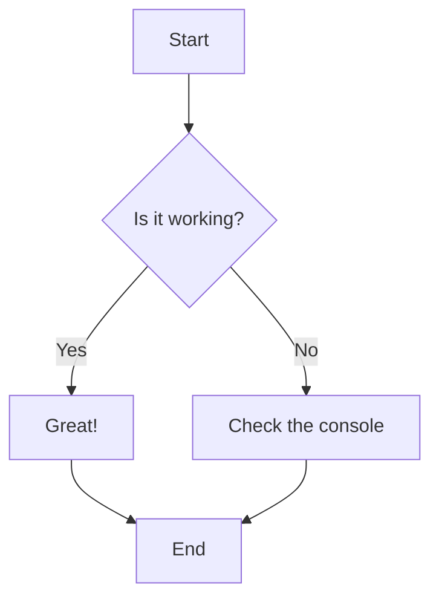
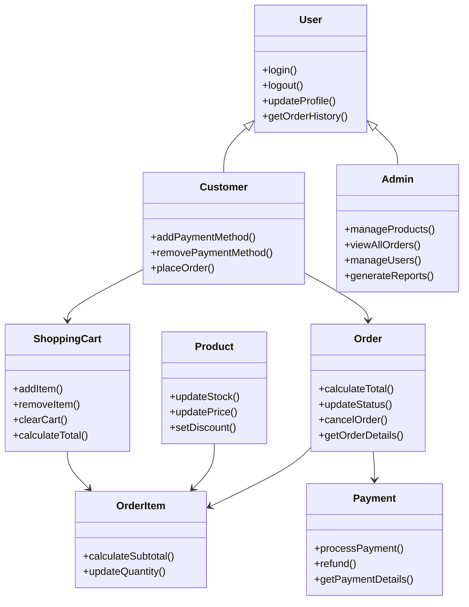
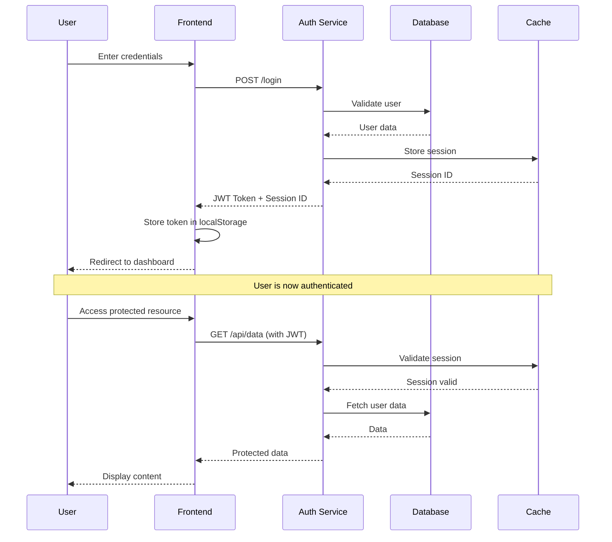

# Welcome to the `mkdocs-mermaid-zoom` Demo!

This page demonstrates the functionality of the `mkdocs-mermaid-zoom` plugin.

Click on the diagram below to see the lightbox in action. Once the lightbox is open, you can:

- **Zoom** with your mouse wheel.
- **Pan** by clicking and dragging the diagram.

---

## Simple Flowchart

---

## E-Commerce System Class Diagram

---

## User Authentication Sequence

