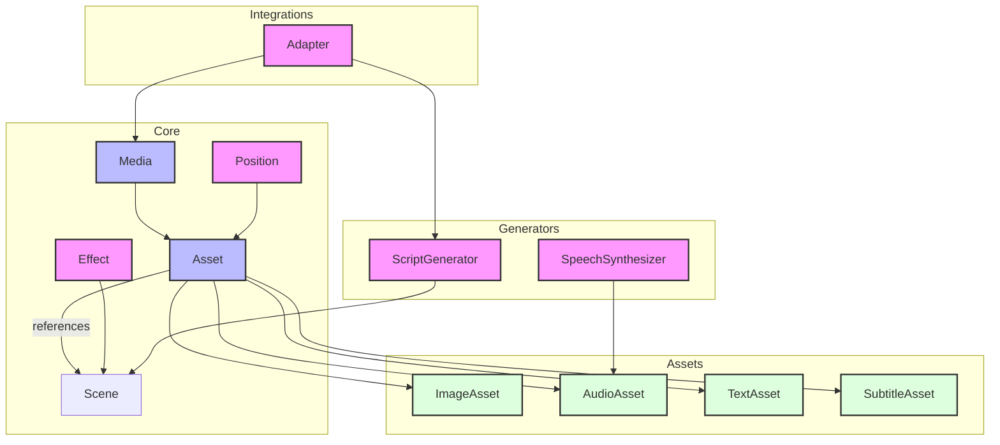

# Architecture

__Mosaico__ follows a modular architecture organized around several key concepts:

## Assets
The foundation of the library is the asset system. Assets represent media elements that can be composed into scenes. The base `BaseAsset` class provides core functionality, with specialized implementations for different media types.

## Positioning
The positioning system provides multiple ways to place elements in a frame through the `Position` protocol, with implementations for absolute, relative and region-based positioning.

## Effects
Effects are implemented through the `Effect` protocol, allowing for extensible animation and visual effects. Built-in effects include pan and zoom capabilities.

## Scenes
Scenes group related assets together and manage their timing and organization. The `Scene` class handles asset references and timing coordination.

## Script Generation
Script generation is handled through the `ScriptGenerator` protocol, with implementations for specific use cases like news video generation.

## Speech Synthesis
Speech synthesis is abstracted through the `SpeechSynthesizer` protocol, with implementations for different TTS providers.

## Simplified Diagram

