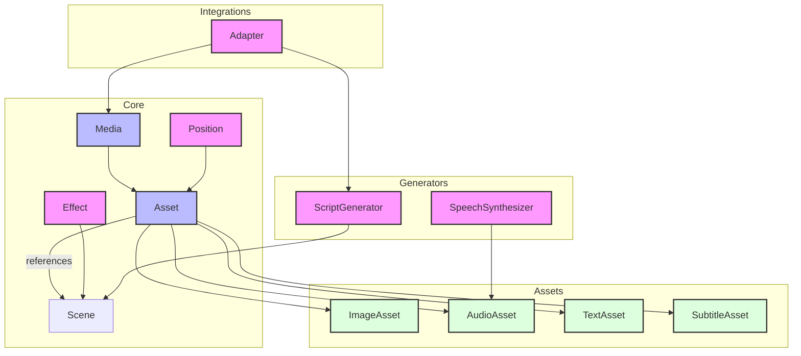

# Arquitetura

__Mosaico__ segue uma arquitetura modular organizada em torno de vários conceitos-chave:

## Assets
O fundamento da biblioteca é o sistema de assets. Assets representam elementos de mídia que podem ser compostos em cenas. A classe base `BaseAsset` fornece funcionalidade central, com implementações especializadas para diferentes tipos de mídia.

## Posicionamento
O sistema de posicionamento oferece múltiplas formas de posicionar elementos em um quadro através do protocolo `Position`, com implementações para posicionamento absoluto, relativo e baseado em regiões.

## Efeitos
Os efeitos são implementados através do protocolo `Effect`, permitindo animações e efeitos visuais extensíveis. Os efeitos integrados incluem recursos de panorâmica e zoom.

## Cenas
Cenas agrupam assets relacionados e gerenciam seu timing e organização. A classe `Scene` lida com referências de assets e coordenação de timing.

## Geração de Script
A geração de script é tratada através do protocolo `ScriptGenerator`, com implementações para casos de uso específicos como geração de vídeos de notícias.

## Síntese de Fala
A síntese de fala é abstraída através do protocolo `SpeechSynthesizer`, com implementações para diferentes provedores de TTS.

## Diagrama Simplificado

