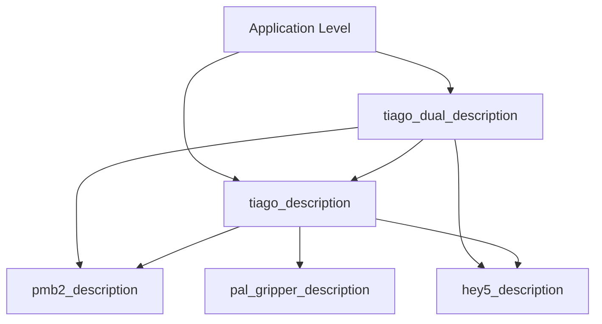

# Tiago机器人描述项目结构分析报告

## 📋 项目概述

本项目是一个基于ROS（Robot Operating System）的机器人描述项目，专门用于定义PAL Robotics公司的Tiago移动操作机器人的物理和运动学模型。项目采用模块化设计，支持多种机器人配置和应用场景。

## 🏗️ 项目架构设计

### 1. 模块化ROS包结构

项目采用典型的ROS包（Package）组织方式，每个包负责机器人的特定组件：

```
tiago/
├── tiago_description/           # 单臂Tiago机器人描述
├── tiago_dual_description/      # 双臂Tiago机器人描述  
├── pmb2_description/           # PMB2移动底盘描述
├── hey5_description/           # Hey5手部系统描述
├── pal_gripper_description/    # PAL夹爪系统描述
├── meshes/                     # 共享3D模型文件
└── [配置文件和最终URDF文件]
```

### 2. 文件类型和作用

#### 🔧 **URDF文件** (Unified Robot Description Format)
- **作用**: 最终的机器人描述文件，定义完整的机器人模型
- **特点**: 包含所有关节、连杆、传感器、物理属性等信息
- **示例**:
  - `tiago_single.urdf` (54KB) - 单臂配置
  - `tiago_dual.urdf` (70KB) - 双臂配置
  - `tiago_dual_hand.urdf` (149KB) - 双臂带详细手部
  - `tiago_dual_omnidirectional_stanford.urdf` (70KB) - 全向移动版本

#### 🔍 **Xacro文件** (XML Macros)
- **作用**: URDF的模板语言，支持参数化和模块化
- **优势**: 代码复用、条件编译、参数化配置
- **示例**: `tiago.urdf.xacro` 包含可配置参数：
  ```xml
  <xacro:arg name="arm" default="true"/>
  <xacro:arg name="end_effector" default="pal-hey5"/>
  <xacro:arg name="laser_model" default="sick-571"/>
  ```

#### 📊 **YAML配置文件**
- **作用**: 机器人运动学和动力学参数配置
- **用途**: 关节限制、默认姿态、碰撞检测设置
- **示例**: 
  - `tiago_dual_omnidirectional_stanford.yaml` - 定义15个关节的配置
  - `tiago_left_arm_descriptor.yaml` - 左臂运动学参数

#### 🎯 **Launch文件**
- **作用**: ROS启动脚本，定义如何运行机器人描述
- **功能**: 参数传递、节点启动、URDF生成
- **示例**: `show.launch` 用于可视化机器人模型

#### 🎨 **Mesh文件**
- **作用**: 3D模型文件，用于视觉渲染和碰撞检测
- **格式**: `.stl`, `.obj`, `.dae`
- **组织**: 按组件分类（arm/, base/, sensors/, etc.）

#### 🔬 **USD文件** (Universal Scene Description)
- **作用**: 现代3D场景描述格式，用于高级仿真
- **优势**: 支持复杂光照、材质、动画
- **示例**: `tiago_dual_omnidirectional_stanford_33.usd` (14MB)

### 3. 包依赖关系



#### 包依赖分析：
- **tiago_description**: 依赖底盘(pmb2)、手部(hey5)、夹爪(pal_gripper)
- **tiago_dual_description**: 继承单臂版本，增加双臂特性
- **pmb2_description**: 独立的移动底盘包
- **hey5_description**: 独立的手部系统包

## 🎛️ 配置系统设计

### 1. 参数化配置

项目支持多种配置选项：

| 参数 | 选项 | 说明 |
|------|------|------|
| `arm` | true/false | 是否包含机械臂 |
| `end_effector` | pal-hey5/pal-gripper/schunk-wsg | 末端执行器类型 |
| `laser_model` | sick-571/sick-551/hokuyo | 激光雷达型号 |
| `camera_model` | orbbec-astra/asus-xtion | 相机型号 |
| `wrist_model` | wrist-2010/wrist-2017 | 手腕型号 |

### 2. 生成流程

```
Xacro模板 + 参数 → rosrun xacro → URDF文件 → ROS应用
```

## 🚀 不同配置的应用场景

### 1. **tiago_single.urdf**
- **配置**: 单臂 + 基础传感器
- **应用**: 基础操作任务、教学演示
- **特点**: 简化配置，快速部署

### 2. **tiago_dual.urdf**
- **配置**: 双臂 + 标准传感器
- **应用**: 双手协作任务
- **特点**: 对称双臂设计

### 3. **tiago_dual_hand.urdf**
- **配置**: 双臂 + 完整手部系统
- **应用**: 精细操作、抓取任务
- **特点**: 最完整的配置（4111行代码）

### 4. **tiago_dual_omnidirectional_stanford.urdf**
- **配置**: 双臂 + 全向移动 + 定制外观
- **应用**: 学术研究、复杂环境导航
- **特点**: Stanford大学定制版本

## 🔧 技术实现特点

### 1. **模块化设计**
- 每个组件独立封装为ROS包
- 支持组件级别的版本控制
- 便于维护和扩展

### 2. **参数化配置**
- 使用Xacro实现模板化
- 支持运行时参数配置
- 一套代码生成多种配置

### 3. **分层架构**
```
应用层 (Launch文件)
    ↓
配置层 (YAML文件)
    ↓
模板层 (Xacro文件)
    ↓
描述层 (URDF文件)
    ↓
资源层 (Mesh文件)
```

### 4. **多格式支持**
- **URDF**: 标准ROS格式
- **USD**: 现代仿真格式
- **YAML**: 配置参数格式

## 📊 项目规模统计

| 文件类型 | 数量 | 总大小 | 说明 |
|----------|------|--------|------|
| URDF文件 | 5个 | ~400KB | 最终机器人描述 |
| Xacro文件 | 20+个 | ~100KB | 模板文件 |
| YAML文件 | 7个 | ~20KB | 配置文件 |
| Mesh文件 | 100+个 | ~50MB | 3D模型 |
| USD文件 | 2个 | ~23MB | 仿真场景 |

## 🎯 设计优势

### 1. **可维护性**
- 模块化设计便于独立维护
- 清晰的依赖关系
- 版本控制友好

### 2. **可扩展性**
- 支持新组件的添加
- 参数化配置系统
- 插件化架构

### 3. **可复用性**
- 组件级别的复用
- 模板化代码生成
- 标准化接口

### 4. **多场景适应**
- 支持不同应用需求
- 灵活的配置选项
- 多种仿真环境

## 📝 总结

这个项目展示了现代机器人描述系统的最佳实践：

1. **分层设计**: 从底层mesh到顶层应用的清晰分层
2. **模块化**: 每个组件独立封装，便于维护和扩展
3. **参数化**: 一套代码支持多种配置，提高代码复用
4. **标准化**: 遵循ROS标准，便于集成和交互
5. **面向应用**: 提供多种预配置，满足不同应用场景

这种组织方式不仅提高了开发效率，也为机器人系统的标准化和产业化奠定了基础。 