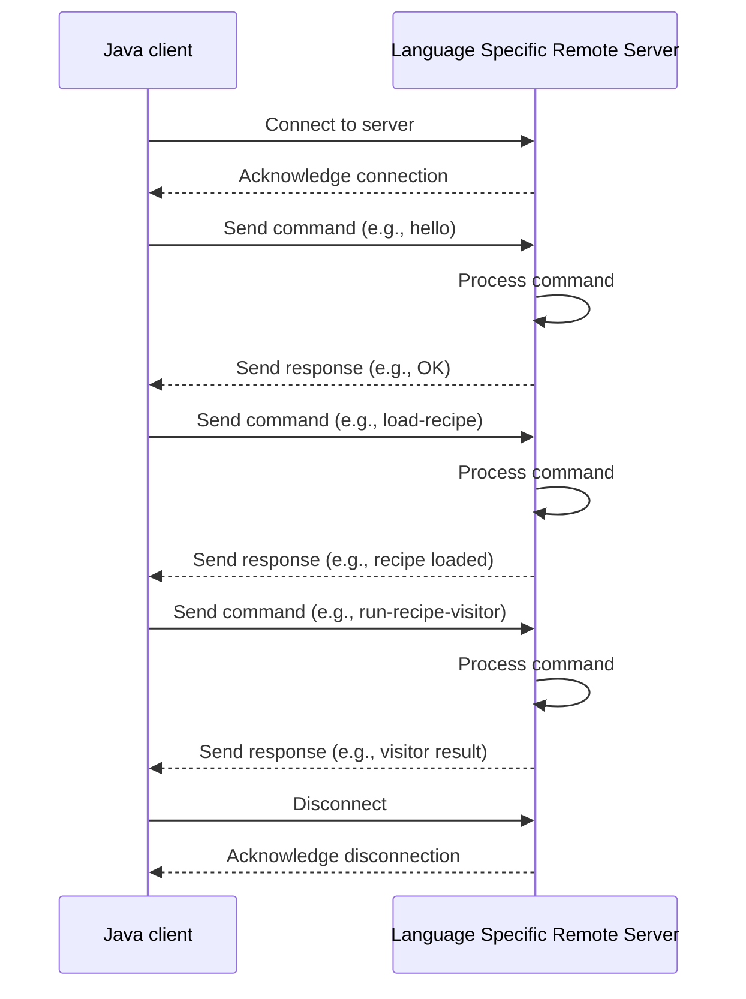

# Python remoting server

## Overview

This project provide remote services for working with OpenRewrite and is published as `openrewrite-remote` in [PyPi](https://pypi.org/project/openrewrite-remote/). This package serves as an openrewrite remoting server for the python language.
Example:



## Installation

### Install the published package on PyPi

Install and use the remoting server from another project:

```bash
pip install openrewrite-remote
```

### Install the package from source

### Fast way using `uv`

Install [uv](https://github.com/astral-sh/uv)

and then run:

```bash
uv sync --all-extras
source .venv/bin/activate
```

### Long way using `pyenv` and `pip`

#### Use the correct python version

Install `pyenv`:

```bash
brew install pyenv
```

Use `pyenv` to install the required python version:

```bash
pyenv install
```

If this is your first time using pyenv then do:

```bash
pyenv init
```

and follow instructions to add the necessary lines to your shell profile.

#### Create a virtual environment

Virtual environments are used to isolate the dependencies of a project from the
system's python installation.

Remove any old virtual environment

```bash
rm -rf .venv
```

Create a new virtual environment

```bash
python3 -m venv .venv
source .venv/bin/activate
```

#### Install dependencies using PIP

Install project dependencies:

```bash
pip install .
```

Install the development dependencies:

```bash
pip install ".[dev]"
```

#### (Optional) Link local openrewrite package

If you plan to modify the openrewrite package locally and want those changes to
reflect immediately without reinstalling, you can install the dependency in
editable mode:

```bash
pip install -e ../path/to/local/openrewrite
```

when using uv prefix the command with `uv`:

```bash
uv pip install -e ../path/to/local/openrewrite
```

#### Build the project

Build the project (wheel and tarball):

```bash
python build
```

### Starting the server:

Installing the module should also make the executable `start_python_remoting`
available to start the server.

```bash
start_python_remoting
```
